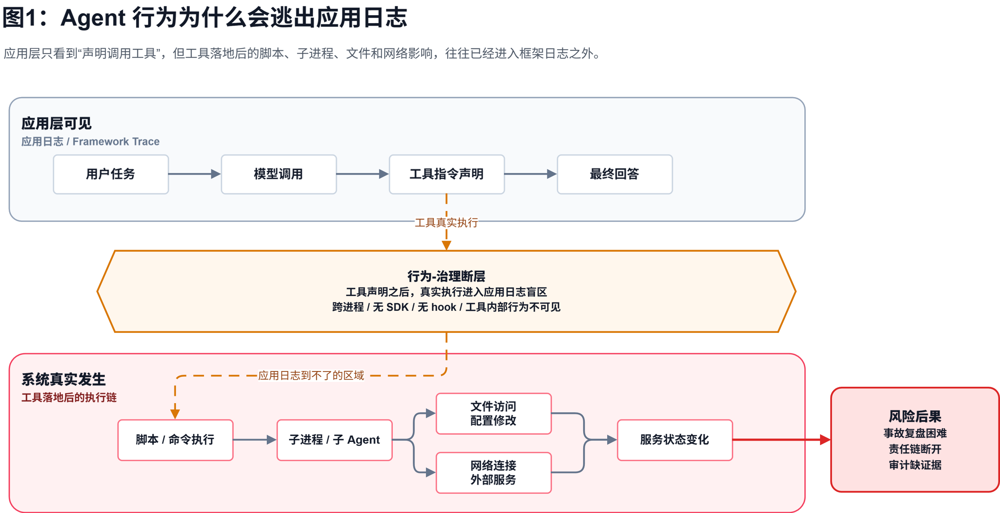
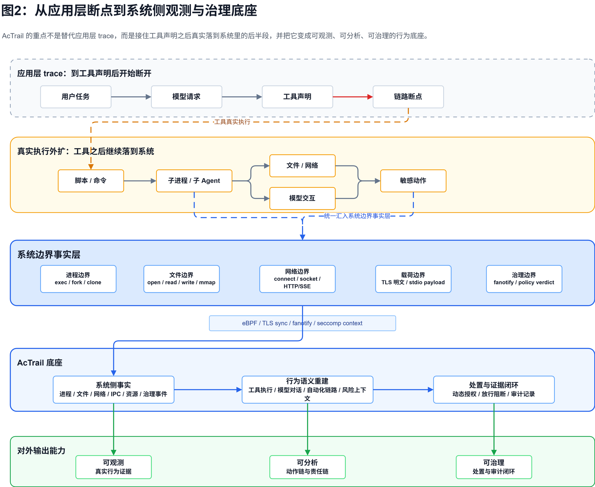
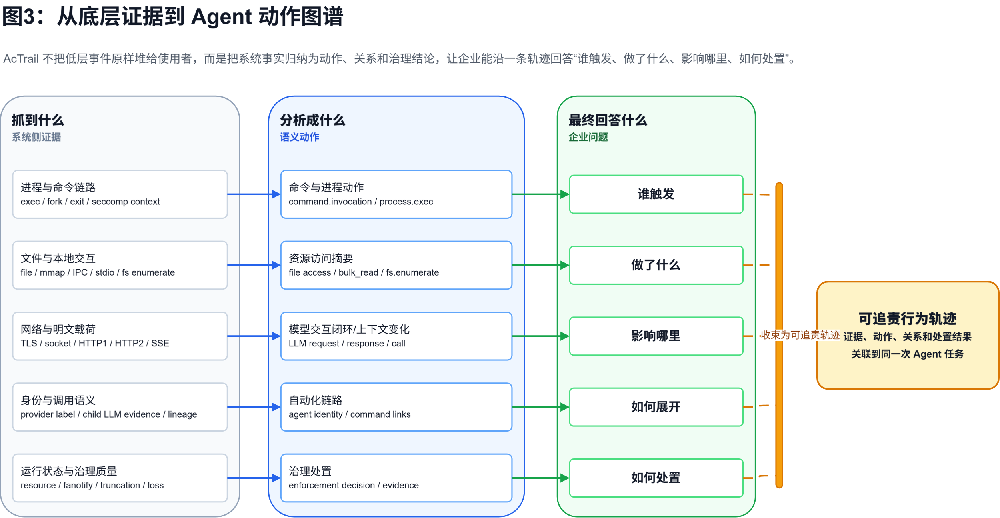
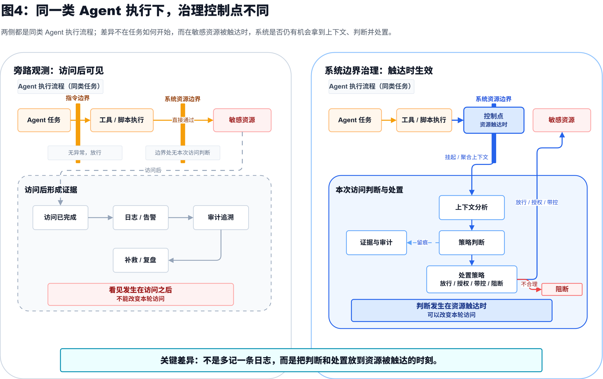
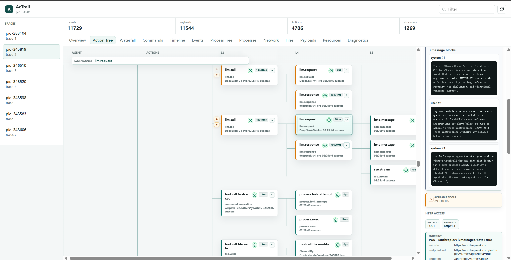
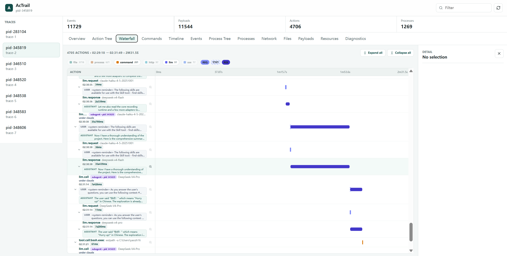

## 摘要

随着 AI Agent 从回答工具走向生产执行主体，企业不能只依赖应用层日志或框架自报来判断其行为，而需要看清模型决策、工具调用、系统资源访问和治理处置之间的完整链路。AcTrail 通过系统侧观测与跨层行为关联能力，将进程、文件、网络、模型交互和敏感访问处置统一到可追溯的行为轨迹中，为Agent应用提供真实行为观测、行为数据可审计分析、运行过程可治理控制的能力底座。

**仓库链接：**

[https://atomgit.com/openeuler/AcTrail](https://atomgit.com/openeuler/AcTrail)

## 01 背景：当 AI Agent 遇上“行为-治理断层”

### Agent 正从回答工具变成生产执行主体

AI Agent 正从概念迈向大规模落地。以 Claude Code、OpenCode、LangGraph 等为代表的 Agent 应用或运行时框架，已经不再局限于单轮问答或代码补全，而是逐步演进为具备多轮推理、工具调用、文件读写、脚本执行、外部系统访问和跨 Agent 协作能力的复杂系统。

以一个典型的 Agent Loop 工作流为例：

* 用户输入：提出一个复杂任务，例如修复代码、分析日志、生成报告、查询业务数据或处理审批事项。

* 内部多步推理：Agent 多次调用大模型，持续维护任务目标、约束条件、中间结论和下一步计划。

* 工具调用与反馈整合：Agent 调用 shell、浏览器、数据库、代码编辑器、企业 SaaS 或知识库，将外部反馈重新写入上下文。

* 环境修改与任务推进：Agent 可能写文件、改配置、运行脚本、启动服务，甚至拉起另一个 Agent 继续执行子任务。

Agent 任务有一个共同特征：同一个用户目标，会被拆解为多轮推理、多次工具调用和多次系统侧操作。它不仅产生文本结果，还会对真实环境产生影响。

这让 Agent 从“辅助回答工具”变成了“生产执行主体”。

### 生产化让 Agent 行为进入治理视野

一旦 Agent 进入生产环境，企业关心的问题也随之变化。过去，一个系统是否稳定，主要看服务是否在线、接口是否超时、错误码是否异常；现在，一个 Agent 是否可信，还要看它在完成任务的过程中到底做了什么、为什么这么做、造成了哪些影响，以及事后能不能说清楚。

这背后已经不只是工程问题，也是治理问题。

监管、安全实践和企业内控正在共同指向一个趋势：当 AI 系统开始具备更强自主性和执行能力时，企业不能只评估模型输出质量，还必须管理它的运行过程、权限边界和行为后果。

> 欧盟联合研究中心（Joint Research Centre，简称 **JRC**）关于 EU AI Act 配套标准的说明中，将风险管理、日志与可追溯、技术文档、透明度、人类监督、准确性、稳健性和网络安全列为高风险 AI 系统的重要合规要求。
> 知名开源专家社区开放全球应用安全项目的生成式AI安全项目（OWASP GenAI Security Project）明确覆盖大模型、Agentic AI 系统和 AI 驱动应用，提出管控和追溯要求：要求工具能力、权限和自主性都要收敛；高影响动作需要人类介入控制，授权要落在下游系统；要求Agent任务执行可靠性，关注Agent应用中的DoS、DoW、服务降级、资源耗尽问题。
> 中国信通院发布的《AI Agent安全实践指引》指出：强调应对AI Agent运行全过程（关键操作、调用链路、异常事件、交互记录）进行留痕，以支持事后审计、风险排查、责任追溯与持续监察；同时针对敏感数据泄露、异常外联、高风险操作建立基础告警规则，提升持续发现能力。

在企业日常生产业务中，这些要求会变成一组非常具体的问题：

* 这次操作到底是人做的，还是 Agent 做的？

* Agent 调用了哪些工具，访问了哪些系统，修改了哪些数据？

* Agent 是否被恶意指令、投毒内容或错误上下文诱导？

* Agent 是否在工具、脚本或插件背后触发了新的自动化执行链路？

* 当最终结果看起来正常时，底层环境是否已经发生了不可忽视的变化？

### 现有日志难以支撑 Agent 行为分析与风险处置

传统日志、APM 和应用侧 trace 会遇到一个根本矛盾：它们更容易看到“应用声称发生了什么”，却很难支撑企业进一步分析“这些行为意味着什么、风险在哪里、是否需要处置”。

> 例如，Agent 以用户身份提交了一次代码修改，代码仓只能看到某个账号完成了提交，却不一定知道背后是人、主 Agent，还是某个被工具间接拉起的子 Agent；Agent 调用了一个工具，上层日志可能只记录工具入口和返回，却看不到工具内部实际访问了哪些文件、启动了哪些脚本、连到了哪些服务；一次任务的最终回答看似合理，但其中某一步可能已经用错误参数修改了配置，并把错误状态继续带入后续流程。

Agent 可观测治理的难点，不是“有没有日志”，而是“能不能基于可信事实看清行为、分析风险，并支撑必要的处置动作”。

这类问题一旦进入生产环境，影响比传统应用错误更复杂：

* 错误更隐蔽：最终答案可能合理，但中间步骤已经偏离目标。

* 复盘更困难：没有完整上下文和行为轨迹，事故现场很难重建。

* 影响更分散：副作用可能落在文件、数据库、配置、服务状态和外部系统中。

* 责任更模糊：当人、Agent、工具和脚本交织在一起时，责任链容易断开。

### 破局思路：从系统侧事实走向行为分析与治理介入

问题的本质是 Agent 上层语义与系统底层事实存在断层。Agent 框架不知工具内部真实行为，传统系统不知底层操作归属哪次 Agent 任务。

围绕这一需求，OpenAtom openEuler（简称 “openEuler” 或 “开源欧拉”）社区在openEuler Agent Infra中构建了面向 Agent 应用的系统侧观测治理底座——AcTrail。

仓库链接：[https://atomgit.com/openeuler/AcTrail](https://atomgit.com/openeuler/AcTrail)

**AcTrail 的核心思路：** 不只依赖 Agent 自我报告，而是从系统侧记录 Agent 真实运行行为，再把一次任务中的模型交互、工具调用、文件变更、网络访问、子任务执行和治理事件重建为可信的行为轨迹：

* 真实记录：从系统边界看见 Agent 实际做了什么，而非只看应用上报了什么。

* 行为分析：把分散的系统事件串成可理解的任务轨迹，识别异常路径、风险动作和潜在影响范围。

* 治理介入：让事实证据进入安全、合规和控制流程，为告警、审计、阻断、恢复等治理动作提供依据。

这让企业不再只依赖“Agent 自己说了什么”，而是可以基于系统侧事实看清行为、分析风险，并在必要时介入治理。

图1：Agent 行为为什么会逃出应用日志

## 02 AcTrail：为 Agent 应用打造系统侧观测与治理底座

对生产化 Agent 来说，一次任务通常是 LLM 多轮决策、工具调用、脚本或子进程执行、文件和网络访问、治理处置共同组成的行为链。应用层 SDK、模型网关或框架 trace 可以记录模型请求和工具调用。但是，这也面临一些问题：LLM 生成的决策如何通过工具调用、脚本执行和子进程链路，真实落到系统环境中，最终访问了哪些资源、改变了哪些状态，以及风险动作是否被及时识别和处置。

AcTrail 的核心价值，不是“能看到 Agent 的模型请求”，也不是把工具调用记录换一个地方展示，而是站在系统边界解决上述问题。它不要求每个 Agent 框架都改造接入，也不依赖工具、脚本、子进程主动上报，而是把进程、文件、网络、IPC、模型交互、工具执行、资源指标和治理处置统一到同一条行为轨迹里。这样，平台看到的不只是“ Agent 调了一次模型、声明调用了一个工具”，而是“这次自动化执行从模型决策到工具执行，再到系统影响的完整轨迹”。

要做到这一点，AcTrail 面对的技术难点不是单一采集点，而是一组生产化 Agent 必然遇到的边界问题。

### 难点一和解决思路：Agent 行为会逃出框架，系统边界必须兜住事实

Agent 框架 trace 擅长记录框架内部的计划、工具调用和模型请求，但真实执行往往会继续向外扩展：工具会启动脚本，脚本会启动子进程，子进程会访问文件、发起网络请求，甚至继续拉起另一个 Agent。如图1所示，**只要其中一环没有接 SDK、没有暴露 hook、在另一个进程中运行，Agent追踪链路就会断**。

AcTrail 的设计重点就放在这条外扩链路上：它从操作系统侧观察任务实际触发的进程、文件、网络、IPC、stdio、资源变化和治理事件。无论行为来自主 Agent、工具脚本、插件、子进程，还是链式调用触发的新自动化主体，只要最终落到系统边界，就可以进入同一套事实视野。

这也是 AcTrail 对应用层 trace 的补充：应用层解释“Agent 声称调用了什么”，AcTrail 补上“调用之后系统里真实发生了什么”。

图2：从应用层断点到系统侧观测与治理底座

## 难点二和解决思路：模型决策到工具执行，不能只靠单点 SDK 串联

只在应用层抓模型请求，默认前提是“ 关键行为都经过你能控制的 SDK、网关或框架 hook”。但真实 Agent 任务并不这么规整：LLM 决策可能发生在一个进程里，工具调度可能由框架完成，工具内部可能进入 shell、MCP、插件或脚本，脚本又可能启动子进程、访问文件和网络，甚至继续拉起新的自动化主体。

更复杂的是，工具执行结果还会回流到下一轮模型上下文，影响后续决策。也就是说，Agent 的真实行为不是一条孤立的模型请求，而是“模型决策、工具执行、系统副作用、反馈再决策”不断交织的闭环。只要其中任一环节运行在另一个进程、另一种语言运行时、另一个工具插件或另一个传输路径里，单点 SDK 就很难完整串联这条链路。

AcTrail 不把行为追踪建立在单一 SDK、模型网关或框架 hook 之上，而是从系统边界把模型交互、工具执行、进程关系和资源访问放到同一条证据链里。它关注的重点不是堆叠采集手段，而是让跨边界证据能够被统一关联、统一解释、统一审计，最终回答“模型为什么做出这个决策、工具如何执行、系统最终发生了什么”。

## 难点三和解决思路：底层事实要还原成可追责的动作链

系统事件天然粒度很低。一个进程启动、一次文件打开、一段网络通信，本身还不能回答“这属于哪次 Agent 任务、哪一步动作、哪条责任链”。

如果只是把时间线、进程树和原始日志原样呈现出来，看到的仍然是一堆技术细节。AcTrail 更重要的工作，是把这些底层事实还原成业务和治理都能理解的行为结论。

|系统侧事实|AcTrail 归纳后的行为结论|最终能回答的问题|
|---|---|---|
|进程启动、退出、fork/clone、命令参数和父子关系|一次工具、脚本或子进程真正开始执行|是谁把这个动作拉起来的|
|文件读写、mmap、目录枚举、TTY、pipe/FIFO、Unix socket|工具执行带来的本地系统影响|访问了什么、改了什么、影响到哪里|
|网络连接、TLS/Socket/stdio 明文片段、HTTP/1.x、HTTP/2、SSE、LLM访问负载|一次模型或应用协议交互闭环|模型输出和外部通信如何影响后续操作|
|provider 标签、模型交互证据、命令链路和子进程证据|一条自动化主体和调用关系|工具背后是否还有新的 Agent 或自动化执行|
|CPU/内存资源、策略判断、文件权限处置、截断和丢失信号|一次运行状态或治理处置|风险动作有没有被控制，证据是否完整可信|

这样，可见的不只是“发了一个 prompt”或“执行了一条命令”，而是能沿着同一条行为轨迹回答：谁触发了动作、动作如何展开、影响落在哪里、系统最终如何处置。

图3：从底层证据到 Agent 动作图谱

### 难点四和解决思路：治理不能只停在看见，必须在系统边界生效

#### 旁路观测：看见时可能已经晚了

对 Agent 应用来说，风险往往不是出现在“ 准备调用工具”的那一刻，而是出现在工具真正触达系统资源的那一刻。一个看起来正常的脚本、编译命令或插件调用，内部可能继续访问凭证、修改配置、拉起子进程，甚至触发新的模型交互。

如果系统只是在旁路事后记录，敏感文件可能已经被读取，配置可能已经被改写，风险已经落地。**只做旁路观测的问题，不是看不见，而是看见时动作可能已经完成。**

#### 命令入口：只能判断“准备运行什么”

只靠命令入口做静态放行同样不够。**命令入口只能回答**“**准备运行什么**”**，不能回答**“**运行过程中会触达什么**”**。**

同样是运行脚本、编译程序或插件调用，后续可能只是读取项目文件，也可能访问凭证、改写配置、拉起子进程或继续调用模型。仅凭入口命令判断风险，容易被工具内部行为绕开。

#### 动态授权：敏感不等于禁止

“访问敏感资源”不等于一律禁止。真正适合 Agent 的治理，不是把敏感资源全部封死，而是让每一次敏感访问都回到具体任务、具体链路、具体风险里判断。

同样是读取配置，在故障修复任务中可能合理，在普通代码生成任务中可能异常；同样是工具触发访问，来自主 Agent 明确动作和来自未知子进程的隐式动作，风险也不同。

因此，运行中治理需要的不是简单 allow/deny，而是上下文感知的本次访问判断：当真实敏感行为触达系统资源时，系统带着任务目标、父子进程、工具链路、历史动作和当前资源对象进行判断，再决定直接放行、单次授权放行、带控制策略放行，还是阻断并留痕。

**动态授权的关键，是在 Agent 真正触达关键资源时，让企业仍然拥有判断权和处置权。**

#### 系统边界：让判断发生在资源被触达时

**AcTrail 的价值，是把判断点放到系统资源真正被触达的边界上。**

当前已经落地的文件访问治理链路，可以在文件权限边界执行允许或阻断，并把处置结果记录为治理处置证据。

也就是说，当 Agent 或其工具链真正访问敏感文件时，AcTrail 可以在资源边界拿到上下文，并让这次访问进入运行中的治理流程。

图4：同一类 Agent 执行下，治理控制点不同

#### 统一入口：治理边界不跟着框架变化

对于敏感脚本执行、高风险命令等更复杂场景，AcTrail 后续也可以沿着同一思路，把分析和控制前移到真实执行边界。

对安全和平台团队来说，治理边界不必跟着 Agent 框架变化；无论动作由主 Agent、脚本、插件、子进程还是隐藏自动化主体触发，最终触达系统资源时都可以进入同一处事实和控制入口。

## 03 使用案例：真实跑一次 Agent 任务，看 AcTrail 如何还原执行链

说明：本案例在 openEuler 24.03 SP3 版本上进行验证

前面讲的是 AcTrail 为什么要从系统侧重建 Agent 行为。下面换一个更直接的视角：真实启动一次 Agent 任务，让 AcTrail 从入口开始采集，再看它如何把模型交互、工具执行、系统影响和治理处置串成一条可复盘的行为轨迹。

### 第一步：安装并启动采集底座

试用 AcTrail 不需要从源码编译开始。可以从 [AcTrail 最新 release](https://gitcode.com/openeuler/AcTrail/releases/latest) 下载对应环境的 RPM 包，安装后使用系统命令直接启动：

`sudo dnf install -y ./actrail-*.rpm`  
`sudo actraild init`  
`sudo actraild start`  
`sudo actrailctl doctor`

这一步的意义不是“启动一个日志服务”，而是让 AcTrail 的系统侧采集、分析和存储链路先就位。后续 Agent 任务中的进程、工具、文件、网络、模型交互和治理事件，都会被归入同一条 trace。在Actrail的采集中，**不依赖于Agent框架本身提供的插件/钩子能力**。

### 第二步：采集一次真实 Agent 任务

接下来用 actrailctl launch 启动目标 Agent 或自动化命令：

`sudo -E actrailctl launch --name agent-demo -- <agent-command> <args>`

launch 的价值不只是“把命令跑起来”，而是从任务入口开始建立行为轨迹。主 Agent 触发的工具、脚本、子进程、网络访问和文件操作，都会被纳入同一条责任链。对于已经运行的进程，也可以用 track\-add 指令接入；但如果希望从入口开始捕获完整链路，尤其是工具和子进程展开后的行为，launch 更适合作为演示路径。

从目标 Agent 被 launch 接管开始，AcTrail 就为这次任务建立了 trace：后续发生的工具执行、子进程展开、模型交互、文件与网络访问，都会持续关联到同一条行为轨迹中。

### 第三步：查看行为轨迹

任务执行完成后，再启动行为轨迹视图进行复盘：

`sudo actrailweb --config /etc/actrail/actraild.conf --addr 127.0.0.1 --port 18080`

打开这条 trace，首先看到的是一张行为轨迹总览：一次 Agent 任务不再只是一条模型请求或几段分散日志，而是被展开成从任务入口、工具执行、子进程、模型交互，到系统资源访问和治理处置的连续链路。动作树支持进一步下钻局部证据，展示模型交互、资源访问和治理处置如何落在同一条 trace 中。

图5：动作树视图：从上层语义动作到底层事实

而瀑布图则从时间角度展示一个 Agent 任务中的整体时序关系和开销

图6：瀑布图

此外，AcTrail也支持直接查看原始的底层事件、进程树关系、网络访问行为、载荷以及资源访问情况等。

一次任务采集完成后，这些行为轨迹、动作关系、模型交互证据、系统资源影响和治理处置结果，既可以用于研发排障，也可以进入企业已有的观测、审计或安全平台。

## 04 总结与展望：从“框架自报”走向“系统边界治理”

### 过去：Agent 风险被夹在应用日志和系统日志之间

传统应用层 trace 能解释 Agent 在框架里“计划调用什么、返回了什么”，系统日志能看到进程、文件和网络变化，但两者之间仍然存在断层：真实系统行为很难自然回到同一次 Agent 任务和责任链里。

### 现在：系统边界成为事实入口和治理入口

AcTrail 的核心判断，是把 Agent 与真实环境交互的位置变成证据来源和控制点。它不要求每个框架、每个工具都主动上报，而是在系统边界把模型交互、工具执行、资源访问和治理处置重新组织成可复盘的行为轨迹。

结果是，Agent 不只是“能执行”，而是开始具备进入生产环境所需要的运行边界：行为可见、证据可追、风险可判、处置可审。

### 未来：Agent 应用需要一层跨框架的治理底座

随着 Agent 框架、工具生态和多 Agent 协作模式继续演进，企业很难长期为每一种框架、每一套工具链分别建设安全适配、审计链路和治理插件。越是复杂的 Agent 应用，越需要一层独立于框架、贴近系统边界的统一治理底座。

AcTrail 的方向，是把操作系统从“运行 Agent 的环境”进一步变成“治理 Agent 行为的基础设施入口”。围绕 Agent 生命周期、工具调用、跨 Agent 交互、模型请求、模型响应和治理处置结果，AcTrail 也可以继续探索标准化的 Agent 治理接口，让安全服务、策略引擎、审计平台和 AgentOps 平台接入统一的系统侧事实和治理语义。

## 参考资料

\[1\] 欧盟联合研究中心（JRC）：[Harmonised Standards for the European AI Act](https://publications.jrc.ec.europa.eu/repository/handle/JRC139430)

\[2\] OWASP GenAI Security Project：[LLM06:2025 Excessive Agency](https://genai.owasp.org/llmrisk/llm062025-excessive-agency/)

\[3\] 中国信通院：[《AI Agent安全实践指引》](https://aihub.caict.ac.cn/docs/HyNVawbxrV5T)
