>当“会不会写代码”不再是瓶颈，“能不能自动完成工程闭环”才真正决定一个团队的工程产能。本文将系统介绍 OpenAtom openEuler（简称"openEuler"或“开源欧拉”）Embedded 在 AI 编程时代，围绕 Agent + Skill 体系开展的研发与维护实践，覆盖 IB_Robot研发、MICA研发、ROS 软件包升级三大典型场景。

## AI 编程时代，瓶颈在转移

过去评价一个研发团队，可能看“代码写得好不好”；而在 AI 编程时代，代码生成本身已经不再是稀缺能力。真正稀缺的，是把“开发、构建、验证、迭代、协作、提交”这一整条工程链路自动闭环起来的能力。

openEuler Embedded 在这一点上面临的挑战尤为突出。它同时横跨 PC、开发板、云构建平台与git协作平台，本身就是一个高度复杂的工程对象：环境复杂：一次完整的开发动作，往往要在 PC、开发板、云端构建平台、协作平台之间反复串联，人工切换路径长、出错点多。隐性经验强：大量维护工作依赖资深工程师的个人经验，难以规模复制，也难以快速交接。规模化困难：面对成百上千软件包的维护和升级，人力只能线性扩张，而工作量是指数级的。

在传统模式下，一个问题要走完“人工排查 → 手敲命令 → 多轮验证 → 手写描述 → 推送 PR”的完整路径；而在 Agent 模式下，这条路径需要被重塑为“问题识别 → 路由 skill → 自动执行 → 自动验证 → 人工确认关键决策 → 自动闭环 PR 推送”。AI 时代真正有价值的，不只是生成代码，而是把使用、开发、验证、协作串成可复用的工程执行链。

>AI 时代真正有价值的，不只是生成代码，而是把使用、开发、验证、协作串成可复用的工程执行链。

## openEuler Embedded面对的三个痛点

在 openEuler Embedded 的日常研发与维护中，有三类问题最具代表性，也最能体现 Agent 化的必要性。

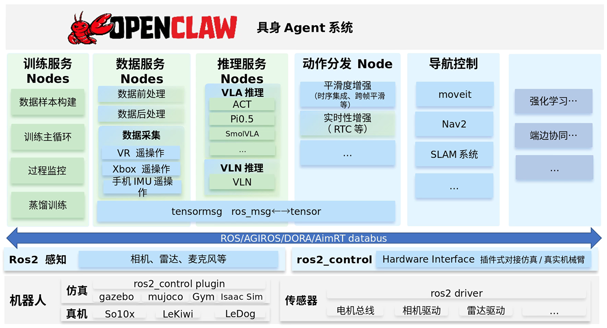

### 痛点一：架构演进快，人工守护成本高

以近期快速演进的具身智能框架 IB_Robot 为例，它有严格的架构设计契约，同时其训练服务、数据服务、推理服务、动作分发、databus 等等模块正在持续演进。团队多人并行开发时，极易出现这样一种场景：开发者快速实现完一整块新功能；但没有按照节点化、解耦化的架构设计来拆分，职责边界混乱；架构负责人在人工检视PR时才发现不符合 SSOT / 契约 / 职责边界的要求；于是几千行代码返工——重拆节点、重改接口、重补测试，成本高昂。

这里的根本矛盾是：人工检视不可扩展。架构负责人逐个检视 PR 和代码，往往已经在大块功能写完之后才发现架构性问题。IB_Robot 现阶段最需要的，不仅是能写代码的 Agent，更是能持续检查架构约束、在早期拦住错误方向、出现问题时能够自闭环的 Agent。

### 痛点二：特性跨仓跨领域，问题根因难判断

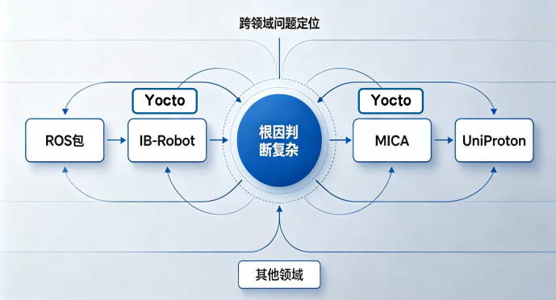

openEuler Embedded 的一个典型调试场景是当新南向平台/新RTOS对接进混合部署框架 MICA，开发者发现通信失败的问题。这样一个“通信失败”的黑盒现象，背后可能的根因却分布在不同领域：

- 是 Linux 侧共享内存配置冲突？

- 是 RTOS 侧 IPI 中断没配置好？

- 是第三方中间件的通信协议不兼容？

- 是 Yocto 构建的镜像少开了某个 CONFIG？还是 ATF 的 PSCI 没把 CPU 拉起？

一个问题可能同时涉及Yocto、MICA、UniProton、kernel、厂商驱动等多个领域，人工定位极其耗时。即使有 AI 辅助，如果缺少统一的入口和问题导流，跨模块理解依然不清晰，常见问题的分析链路会很长。

### 痛点三：软件包数量庞大、依赖深、连锁反应强

openEuler 生态涉及海量软件包，以 ROS 包为例，逐包人工升级几乎不可持续：包数量大、依赖关系复杂、升级影响外溢（一个包的版本变更可能反向影响其他包的构建和测试稳定性），新版本还可能引入 openEuler 社区暂未提供的新软件包。

一个真实的连锁场景：

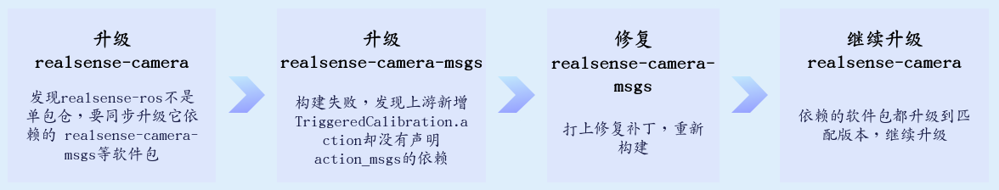

ROS 等软件包升级最大的难点，不是“传个新 tar 包再改下 spec”，而是处理海量包之间的依赖连锁、openEuler 定制化适配、跨阶段问题归因。

整体思路：把零散经验变成可调用的工程能力面对这些痛点，openEuler Embedded 的核心思路是用 Agent + Skill 体系，把零散的工程经验沉淀为“可调用、可验证、可传承”的能力模块，串起一条完整的研发维护闭环。

整体体系覆盖以下环节：

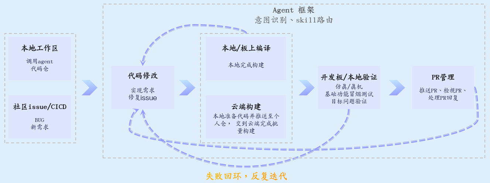

Skill 的本质，是把零散经验变成“可调用、可验证、可传承”的工程能力模块。

这条闭环的关键在于：每一个环节都不是孤立的脚本，而是可以被 Agent 按需调用、组合、并在失败时自闭环重试的能力单元。下面以三个典型实践展开。

## 实践一：IB_Robot 的 Agent Skills 体系

### 目标：让“问一句话”就能触发正确的工程动作链

IB_Robot 的 skills 体系面向两类视角：

- 开发者视角：用户说“看看 issue #32”，Agent 自动抓取 issue 描述、查看代码上下文、修代码、跑构建、跑验证、推 PR。

- 维护者视角：用户说“检视下 PR #68”，Agent 自动抓取 diff，做代码 review 与架构 review，询问用户是否合入；若用户要求“不合入，优化提交”，Agent 回复评论；用户再说“解决下 PR 最新的评论”，Agent 抓取评论与上下文，按需闭环。

目标是让开发者只在关键分歧点做判断，其余工程动作由 Agent 串起来完成。

### 进展：已具备的 skills 骨架

IB_Robot 已经具备从“理解系统”到“提交协作结果”的基础骨架：

- ibrobot-architecture：理解训练服务、推理服务、动作分发等架构设计，避免 Agent 无上下文地修改代码。

- ibrobot-env / ibrobot-build：统一构建命令模式，避免 Agent 根据不匹配的经验自由发挥、让用户走弯路。

- ibrobot-launch：标准化仿真、真机及 moveit 与推理启动方式等。

- ibrobot-git-flow：自动遵循 openEuler 提交规范、DCO 与 PR 路径。

- atomgit-issue：创建、读取、更新、关闭 issue，并自动抓取上下文供 Agent 分析。

- atomgit-pr：创建 PR、同步标题/描述、生成结构化摘要。

- atomgit-pr-review / atomgit-pr-architecture-review：同时覆盖逻辑检视与架构合规审查。

- atomgit-review-resolution：拉取未解决的评论，生成修复方案并回帖闭环。

这套骨架覆盖了从架构理解、环境构建、运行验证到提交规范、issue/PR 管理、代码评审、评论闭环的全链路。它的价值不在于单点能力有多强，而在于把这些原本散落在资深工程师脑子里的经验，固化成了可被 Agent 调用、可被新人复用的标准动作。至此，开发者不再需要手工串起全部流程。

## 实践二：MICA 的 Agent Skills 体系

从“任务入口”到“workflow 分流”MICA 是 openEuler Embedded 的混合部署框架，特性天然跨 Linux、RTOS、openAMP、底座等多个领域。针对这种跨域特性，设计的核心是把“任务入口”统一化，再由 workflow 做意图分流。

MICA 的 skills 体系以一个总入口 mica-overview 起步，识别用户意图后进入对应 workflow，每个 workflow 给出可执行的步骤、命令、状态确认与失败下一跳：

- 开发 workflow：先定设计边界 / 模块 / 接口 / 验证路径，提交新 PR；

- 定位问题 workflow：拉取 issue，定位失败阶段，做日志、证据、自动化调试验证；

- 测试 workflow：环境准备 / smoke / 专项测试 / 失败回流，提交新 issue；

- 学习 workflow：建立概念模型，覆盖架构 / 生命周期 / 通信 / 底座；

- 检视 workflow：拉取 PR / 检视补丁，识别风险、答复 PR。

在技术领域上进一步细分：master、client、openAMP、弹性底座，以及平台协作接口。

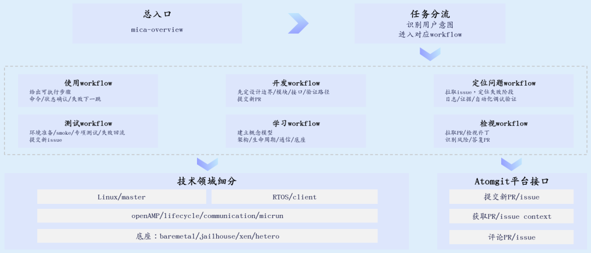

### 为什么这套设计有效？

MICA 场景的难点不在某一处，而在于“问题可能出现在任何一个领域”。传统做法是工程师凭经验猜根因，逐个领域排查；而 workflow 分流的价值在于：

1. 统一入口：不管问题出在 Linux 还是 RTOS，用户都从一个入口进入，由 workflow 负责导流到正确的领域分支；

2. 失败可流转：每个 workflow 都定义了“失败下一跳”，定位问题 workflow 失败可以回流到测试 workflow 重新验证，而不是停在原地等人工介入；

3. 经验可传承：生命周期、通信、pedestal 这些 MICA 特有的风险点被固化进检视规则，不再依赖个别专家的记忆。

### 实践案例：一次 PR 检视的完整闭环

以 MICA 仓的一次 PR 检视为例，Agent 的实际行为路径如下：

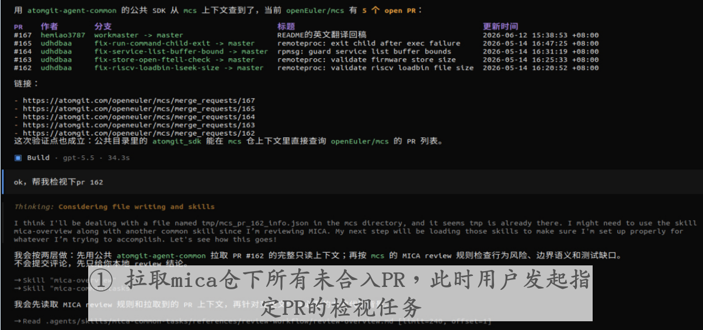

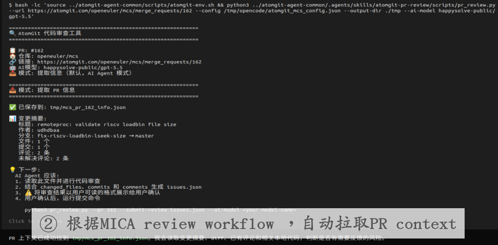

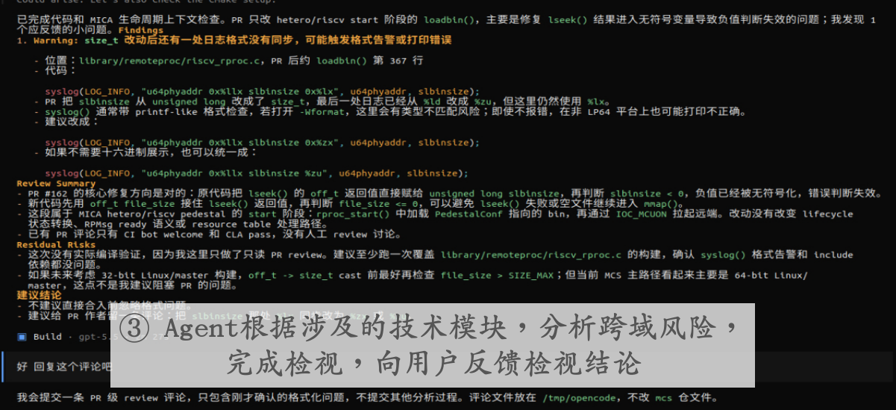

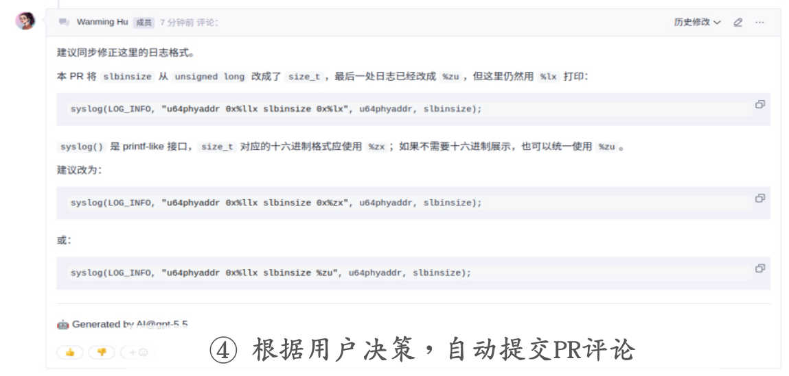

整个过程里，工程师只在一个节点上做了决策——是否合入、是否要求优化。其余的 PR 拉取、上下文组装、风险识别、评论撰写都由 Agent 完成。对于跨域特性而言，这种“统一入口 + workflow 分流 + 领域细分”的结构，把原本需要一个专家从头跟到尾的工作，拆成了可被 Agent 承接的标准流程。

## 实践三：openEuler 社区 ROS 包自动化升级

把升级做成“可持续迭代的自治工程流水线”软件包升级是 openEuler Embedded 维护工作中体量很大的一类，尤其最近的具身技术研发更依赖ROS2 humble包的升级。理想的升级流程是一句话即可触发完整的工程链：“帮我升级下 XXX ROS 包” → “没问题，提完 PR 跟你汇报”。

于是团队设计了总控 Agent openeuler-ros-upgrader 来统一管理 workspace、阶段状态、报告与失败重试路径，下挂数个 skills 串联起完整能力：

- 环节 1｜ros-oe-upstream-init：根据 ROS 官网获取最新 ROS 包列表、仓库、分支信息，构建本地缓存池，统一拉源码、分析 package.xml、生成 spec。

- 环节 2｜ros-oe-pkg-prep：解析递归依赖、拓扑排序，生成可供构建流程并行构建的 layers 层级顺序，确定最终需要生成的包列表。

- 环节 3｜ros-oe-repo-fork：从包名自动映射到 src-openeuler 仓，并 fork 出个人迭代 repo。

- 环节 4｜ros-oe-pkg-update：更新 tar 包、spec、patch，智能化分析老补丁的去留、检视 spec 修改是否合理。

- 环节 5｜ros-oe-eur-init：把需要升级的软件包批量注册到 EUR / eulermaker 项目。

- 环节 6｜ros-oe-eur-build：按拓扑层级触发云端构建，轮询监测构建状态，自动下载日志并智能化分析失败原因，按需修复后续跑。

- 环节 7｜ros-oe-board-test：配置开发板环境 repo 源，重新安装新版本包，执行 ROS 冒烟测试、指定软件包功能测试，支持智能化修复迭代。

- 环节 8｜ros-oe-pr-submit：根据前序环节的问题记录，整理 diff，自动生成详细 PR 描述，推送社区 PR。

>核心原则：遇到 patch、build、test 失败，不跳过、不忽略，而是智能化调动 code agent 进行分析、修复、重试。

这条原则是整套流水线能“自治”的关键。ROS 升级里真正的难点恰恰不在常规环节，而在于那些上游变更、补丁冲突、依赖缺失等需要逐个分析的异常场景。如果还像传统脚本工程，遇到失败就跳过或留给人工，那当升级规模上升，人工兜底的瓶颈立刻会重现。我们的做法是让 Agent 在每一个失败点上都先尝试分析根因、生成修复方案、重试闭环，只有在确实需要策略决策时才上交给工程师。

### 当前进展与后续计划

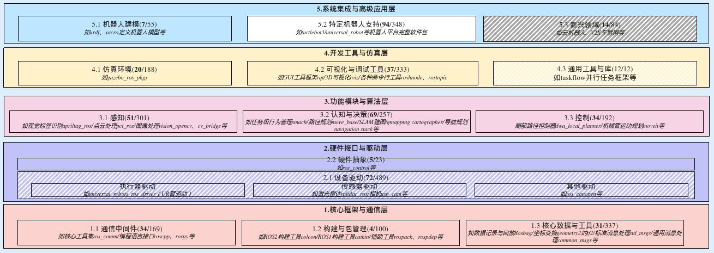

当前进展（openEuler Embedded 3.30 版本）：基于 openEuler 24.03 LTS (aarch64) 新增 / 升级了 139 个 ROS Humble 软件包，功能范围主要涵盖：

- 机器人自主导航（Navigation2 + RealSense 相机 + RTAB-Map SLAM）；

- 通用 USB 摄像头驱动（usb_cam）；

- Web / WebSocket 通信桥接（rosbridge_suite）；

- ROS2 命令行工具（ros2cli）的旧版本缺陷修复；

-  ……

后续计划（openEuler Embedded 未来版本）：根据 ROS 社区官方软件包列表，目标覆盖全量 ROS2 humble 软件包。策略上，分析全量 ROS2 humble 包的依赖关系做拓扑分层构建，及时识别升级阻塞包、需人工介入的软件包和环节，对 Agent 升级 ROS 包的能力做全面验证，沉淀更多经验到 openeuler-ros-upgrader skills。

## 未来展望：从单仓技能到全域自治

### openEuler Embedded AI研发的演进路径和策略

- 仓级扩展：把架构分析、常见问题 skill 能力应用到更多仓（如Yocto），形成跨仓问题联动。

- 易用性：不仅服务开发者和维护者，也服务普通用户，让功能使用、排障、升级都变成易用性极高的标准化流程。

- 测试全覆盖：AI 自动化生成测试用例，CICD 支持自动化测试框架，保障单元测试和集成测试 100% 覆盖率。

- 全自动软件包升级：全自动识别 openEuler Embedded软件包升级场景和诉求，Agent 先分析并提出执行方案，人只确认关键策略，执行部分自动闭环。

设想未来一天的工作：

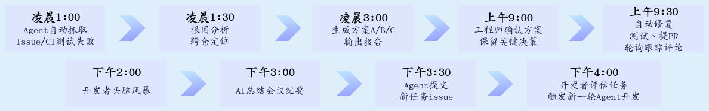

让人从“流程执行者”转变为“关键节点决策者”，让 Agent 成为 openEuler Embedded 的自治执行层。

### 从工具自动化到生态自驱建设

把这条演进路径拉到更长的尺度看，Skill 体系的价值在于把重复性协作流程沉淀为自动化能力——工具自动化 → 能力 skill 化 → 使用者可复用 → 生态自驱建设。自动化成熟后，生态参与门槛降低，维护者从包揽执行转向规则制定与质量把关，使用者也能从生态消费者变为建设者，openEuler 生态可能从“维护者主导”走向“使用者自驱建设”的新阶段。

面向 AI 编程时代，openEuler Embedded 的实践给出的不仅是“用 AI 写更多代码”，而是把研发、构建、验证、协作、提交整条工程链路沉淀成可调用、可验证、可传承的 Skill 体系。这套思路已在 IB_Robot 架构守护、MICA 跨域协作、ROS 包自动化升级三个场景落地验证。下一步，将让这套能力从单仓走向全域，从开发者工具走向面向使用者的能力载体。

