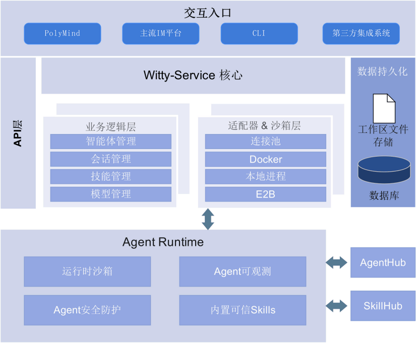
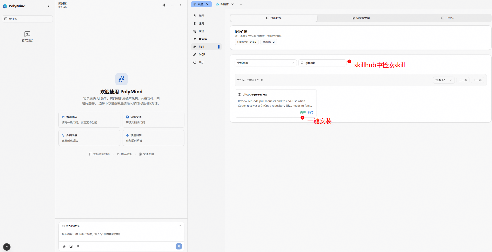
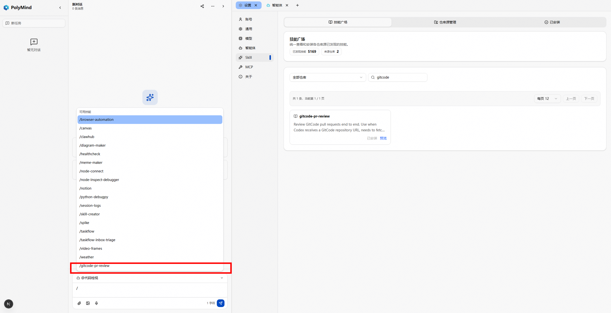
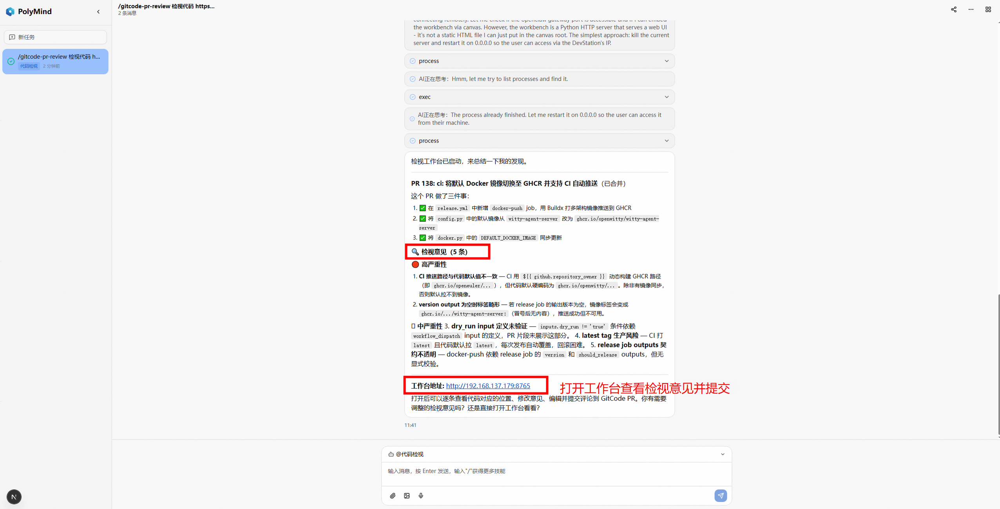

## 背景

在 AI Agent 技术快速发展的背景下，如何高效地管理、编排和运行多个智能体，并为其提供丰富的工具与技能生态，成为当前 AI 基础设施领域的关键挑战。

面向这一需求，OpenAtom openEuler（简称“openEuler”或“开源欧拉”）的创新版本DevStation，提供了一个**原生集成 agentd 服务的自托管 AI Agent 交互平台**——PolyMind，由 openEuler 社区孵化，致力于将 AI 对话、Agent 工作流编排与多模型管理融为一体，提供开箱即用的完整解决方案。该平台在 Agent 运行时生命周期管理、技能生态建设、模型统一管理、安全漏洞自动化修复等方面取得了显著进展。

PolyMind 代码仓地址：<https://gitcode.com/openeuler/polymind>

## 传统 AI Agent 平台的困境与挑战

在构建自托管 AI Agent 平台的过程中，我们遇到了一系列阻碍用户体验和系统扩展性的核心问题，具体体现在以下四方面：

**1. Agent 管理能力薄弱，缺乏标准化生命周期管控**

传统 AI Agent 平台往往仅提供基础的对话能力，缺乏对 Agent 完整生命周期的精细化管理。用户创建 Agent 后，无法便捷地对其进行暂停、恢复、沙箱隔离等操作，导致资源利用效率低下，多 Agent 协作场景难以落地。

**2. 技能生态封闭，知识难以沉淀与复用**

Agent 的专业能力高度依赖技能的注入，但大多数平台的技能系统封闭且缺乏标准化。用户无法从远程仓库导入社区贡献的技能，也无法将自研技能打包上传。领域知识以"经验孤岛"的形式存在，无法实现跨团队、跨场景的规模化复用。

**3. 模型供应商配置碎片化，切换成本高**

不同 AI 模型的接口格式、参数配置、计费方式各异，用户在面对多个模型供应商时往往需要分别管理和配置，缺乏统一的抽象层，切换和对比模型成本高昂。同时，接口兼容性字段命名混乱，增加了前端集成的维护负担。

**4. 工程交付质量参差不齐，缺乏自动化保障**

开源项目的快速迭代容易导致代码质量下滑、提交信息不规范、版本发布混乱等问题。缺少自动化的质量门禁、标准的提交规范和可持续的版本发布流程，使得项目维护成本居高不下，社区贡献者参与门槛较高。

## DevStation智能助手：AI Agent 交互平台的新范式

针对上述挑战，已完成完成一系列关键能力建设，初步构建了一个**可编排、可扩展、可观测**的 AI Agent 平台体系。依托 witty-service 提供的原生 agentd 运行时、SkillHub 技能广场的生态建设、多模型供应商的统一抽象与自动化的工程交付体系，PolyMind 正逐步实现从"对话工具"到"智能体平台"的跨越。

PolyMind 采用前后端分离的架构设计，前端专注交互体验，后端 witty-service（agentd 运行时）负责 Agent 的完整生命周期管理和 API 服务。核心能力分为以下四大模块：

### 1. Agent 运行时生命周期管理：全流程可控的智能体引擎

witty-service 作为 agentd 运行时，承担了 Agent 从创建到销毁的全流程管控。重点实现了 Agent 的暂停与恢复能力——运行时可以动态挂起和恢复 Agent 的执行上下文，在资源紧张或多 Agent 协作场景下提供精细化的调度手段。

- **多种运行模式**：支持多种 Agent 运行模式，用户可根据任务场景灵活切换，满足从轻量对话到复杂任务编排的不同需求

- **沙箱安全保障**：提供多种沙箱隔离方式，支持本地进程、docker、E2B(后续支持)，任务完成后自动回收资源，保障多租户执行安全

- **社区模板导入**：新增远程仓库支持，用户可从社区Agenthub一键获取智能体模板并快速部署运行

### 2. SkillHub 技能广场：专家经验的标准化沉淀与复用

技能层是 PolyMind 的专家能力载体，目前 SkillHub（技能广场）全面上线，将开发运维的最佳实践封装为可发现、可安装、可编排的标准技能单元：

- **技能发现**：全新上线的技能广场页面，支持搜索、筛选、分页浏览和详情预览，用户可像安装应用一样一键为 Agent 注入专业能力

- **仓库源管理**：支持多种技能来源，技能自动发现并同步到广场，保持技能库的持续更新

- **安装即绑定**：技能与Agent运行时绑定注入，安装后即时生效，重启后自动恢复

- **开箱即用**：预置前端开发、状态管理等多个常用技能包，到手即可使用

### 3. 多模型统一管理：灵活适配的模型配置层

工具层解决了多模型供应商的碎片化问题，为用户提供统一的模型管理与切换体验：

- **统一配置面板**：在同一个页面内完成十余家主流模型供应商的配置，无需在多个后台之间来回切换

- **接口兼容性重构**：统一字段命名规范，覆盖主流接口协议标准，前端无需为不同供应商编写差异化代码

### 4. 工程交付体系：可持续交付的质量保障

重点建设了自动化的质量保障与发布体系，覆盖前后端的协同交付：

- **代码质量门禁**：引入自动化代码检查工具，统一代码风格，前端与后端分别遵循各自语言规范

- **提交规范标准化**：统一提交信息格式，确保提交历史清晰可读

- **版本自动化管理**：配置自动化版本号管理和发布流程，根据提交内容自动判断版本升级策略

- **持续集成流水线**：构建完整的 CI 流水线，支持一键触发发布与预演模式

- **一键部署**：提供自动化安装脚本，自动完成环境检测、依赖安装和服务启停管理

## 最佳实践

### SkillHub 实战：技能安装驱动的即用即得体验

SkillHub 的价值不仅在于技能的发现与管理，更在于"安装即用"的完整闭环。以代码审查场景为例：

- **技能获取**：用户在 SkillHub 技能广场中搜索代码审查相关技能，一键安装到目标 Agent，技能与 Agent 运行时自动绑定

- **技能调用**：安装完成后，Agent 立即获得代码审查能力，可自动拉取代码变更内容，进行冲突检测和合规检查，生成结构化的审查报告，包含变更摘要、潜在问题和改进建议

  

### CVE 漏洞分析到修复的一站式工作台

PatchFlow Agent 是 openEuler 社区面向内核 CVE 修复场景构建的智能体工具（详见 [《openEuler 社区 AI 漏洞修复平台：通过 PatchFlow Agent 完成内核 CVE 漏洞修复》](https://www.openeuler.openatom.cn/zh/blog/20260603-PatchFlow%20Agent/20260603-PatchFlow%20Agent)），截止2026-07-07，已支撑 **350个 PR 成功合入 openEuler 内核仓**。PolyMind 作为 PatchFlow Agent 的界面化入口，将这一能力集成到平台中，让用户在浏览器中就能完成从漏洞分析到修复提 PR 的完整流程。

底层通过 MCP 协议统一接入问题解析、环境准备、提交获取、分支分析、补丁应用和 PR 创建等工具能力，由 Agent 根据任务状态自动完成工具选择、流程编排与后续决策：

- **自动化漏洞分析**：在 PolyMind CVE 页面中选择待修复的内核 CVE，点击"开始分析"，Agent 自动完成全链路分析，识别受影响分支并应用补丁

- **修复状态一目了然**：分析完成后自动检测可提 PR 的修复分支，以清晰面板展示各分支的就绪状态与失败原因

- **一键提交修复 PR**：对确认可修复的分支，一键触发 Agent 自动为每个修复分支生成 PR，支持批量提交与逐条记录失败原因

- **构建产物辅助审核**：支持查看修复分支的构建产物，可单模式或对比模式查看，辅助人工审核把关

- **全流程可追溯**：从分析到 PR 提交的每一步都有快照记录，确保修复过程可追溯、可复核

### 一键部署体验优化

项目持续优化部署体验，降低用户使用门槛：

- **全自动安装**：提供一键安装脚本，自动完成环境检测、依赖安装和 witty-service 后端的部署

- **灵活配置**：支持通过配置自定义主机地址、端口等参数，统一管理前后端服务的启停

- **配置集中管理**：所有运行配置统一管理，服务端和客户端读取一致，消除配置不一致的问题

欢迎访问项目仓库查看完整的使用指南和部署文档：[立即前往 openEuler DevStation 智能助手 →](https://atomgit.com/openeuler/polymind)

## **当前核心功能：**

- witty-service 后端 Agent 运行时生命周期管理能力上线，多种运行模式与沙箱方案全面支持

- SkillHub 技能广场上线，支持技能发现、仓库源管理、一键安装，内置多个常用技能包

- 模型统一配置面板重构完成，支持十余家主流供应商，全局即时生效

- PatchFlow Agent 驱动智能代码审查与 CVE 修复

- 自动化工程交付体系建成，覆盖代码质量、提交规范、版本发布全流程

## **未来规划：**

- 完善 SkillHub 技能生态，鼓励社区贡献更多领域的标准化技能

- 深度集成 witty-service 的更多运行时能力（如分布式多 Agent 编排）

- 支持E2B沙箱模式，支持opencode agent运行时

- 集成agenthub，围绕社区打造更多agent
- ......

## 加入我们

PolyMind 由 openEuler 社区开源孵化，欢迎每一位对 AI Agent 平台感兴趣的开发者参与共建！无论你是贡献代码、提交 Issue、分享使用心得，还是在社区中帮助他人，你的每一份参与都是项目前进的动力。

- **代码仓库（前端）**：[https://gitcode.com/openeuler/polymind](https://gitcode.com/openeuler/polymind)

- **代码仓库（后端 witty-service）**：[https://gitcode.com/openeuler/witty-service](https://gitcode.com/openeuler/witty-service)

- **PatchFlow Agent 开源仓库**：[https://gitcode.com/openeuler/nvwa-cve-fixer](https://gitcode.com/openeuler/nvwa-cve-fixer)

- **开发维护**：[sig-DevStation 小组](https://www.openeuler.openatom.cn/zh/sig/sig-DevStation)

- **技术交流**：欢迎在社区 Issue 区提交反馈和建议

- **参考阅读**：[openEuler 社区 AI 漏洞修复平台：通过 PatchFlow Agent 完成内核 CVE 漏洞修复](https://www.openeuler.openatom.cn/zh/blog/20260603-PatchFlow%20Agent/20260603-PatchFlow%20Agent)

**添加openEuler小助手，进入DevStation交流群：**

期待与你共同探索 AI Agent 的更多可能，共建高效、开放、智能的自托管 Agent 生态！

