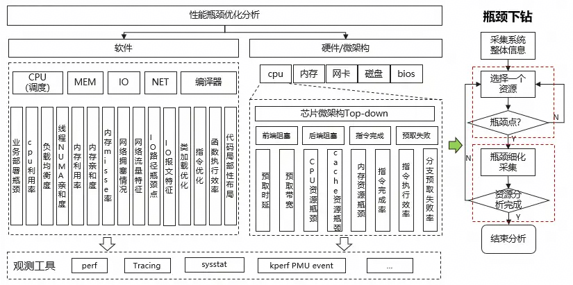
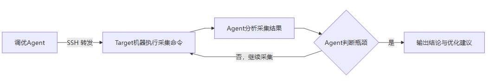
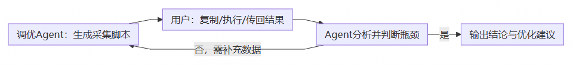

## 背景：当性能调优遇上"组合爆炸"与"指标孤岛"

在现代数据中心和云原生场景下，操作系统层性能调优是保障业务服务质量的关键环节。然而，随着硬件架构日趋复杂（多路NUMA、异构计算、高速存储网络），特别是超节点异构融合需求背景下，节点组件层数倍增，OS层性能瓶颈的根因定位难度正呈指数级增长。

**复杂场景下，性能瓶颈根因定位面临三大挑战**

* **组合爆炸，规则难以穷举**：一处性能抖动可能同时涉及CPU调度、内存分配、IO路径、网络协议栈等多层交互。假设每层有N种异常状态，多层级联的组合数将达到Nⁿ，传统基于规则库的专家系统难以预先覆盖所有可能，遗漏成为常态。

* **指标孤岛，关联逻辑难以串联**：单个性能指标（如 `iowait` 升高）只是"症状"，其根因可能来自完全不同的子系统（如NUMA内存分配不均导致IO路径缓存失效）。不同指标之间的因果链条依赖丰富的领域经验，人工撰写串联脚本不仅成本高昂，且泛化性差——换个硬件平台或业务场景，脚本就可能失效。

* **人工分析，效率与质量双重瓶颈**：一次完整的OS层瓶颈分析需要采集数十类指标、执行多层下钻（全局→进程→热点函数→系统调用→微架构），人工完成需要数天时间，且对分析人员的跨子系统知识要求极高。分析结果的质量高度依赖个人经验，难以标准化和复现。

**传统方式的困境在于**：性能指标采集工具（mpstat、iostat、vmstat、perf、strace等）虽然丰富，但它们只是"数据的搬运工"，真正的瓶颈识别与根因下钻，仍然严重依赖人工专家的"大脑"。这种"工具+人脑"的模式，在硬件架构日益复杂、业务场景快速迭代的今天，已经越来越力不从心。

## Agent时代的OS层智能调优引擎

问题的本质在于：传统性能工具只能回答"指标是什么"，无法回答"瓶颈在哪里"和"为什么会这样"。性能瓶颈分析的本质是**证据驱动**的因果推理过程——需要从系统状态中提取关键证据、构建瓶颈链条、逐层下钻验证，最终定位根因。

为了解决这一矛盾，openEuler Agent Infra 团队**构建了一个基于大语言模型（LLM）的OS层智能性能调优引擎。它模拟资深性能工程师的分析思维，实现从全局概览到微观指令的"自上而下"瓶颈定位，并基于证据链自主下钻，将调优分析效率从天级压缩至小时级。**

**核心思路**

**1. 自上而下的分层瓶颈分析：「全景→局部→微观」层层穿透**

该智能调优引擎遵循性能分析的经典方法论——Top\-Down分析法，将瓶颈定位过程划分为五个阶段：

* **Phase 1 — 系统环境静态信息采集**：采集硬件规格（CPU型号、NUMA拓扑、内存/磁盘/网卡信息）、软件版本（内核、驱动、工具链）及内核启动参数。建立目标系统的"数字孪生"，为后续瓶颈推理提供环境基准。

* **Phase 2 — 主负载识别与全局瓶颈分析**：从CPU、内存、IO、网络四个维度进行全局资源评估，识别系统级瓶颈信号（如iowait异常、内存压力、磁盘利用率等）；进一步定位高资源消耗进程，锁定分析目标。

* **Phase 3 — 热点函数与系统调用分析**：基于perf进行热点函数采样，定位CPU时间消耗在哪些内核/用户函数上；基于strace进行系统调用分析，识别高频/高延迟的系统调用模式（如io\_getevents阻塞、futex锁竞争等），将瓶颈从"进程级"下钻到"函数/调用级"。

* **Phase 4 — 微架构瓶颈分析**：基于PMU（Performance Monitoring Unit）计数器，分析CPU微架构层面的效率指标——前端停顿（Frontend Stall）、后端停顿（Backend Stall）、Cache命中率、TLB命中率、分支预测准确率等，揭示"指令执行效率"层面的瓶颈。

* **Phase 5 — 基于证据的瓶颈映射与优化建议**：汇总前四个阶段采集的证据，构建瓶颈证据链条，评估每类瓶颈的严重程度（Critical / High / Medium / Low），输出按优先级排序的OS级优化建议。

**2. 基于「证据链」的瓶颈推理：从"症状"到"根因"的因果串联**

该智能调优引擎的瓶颈推理并非简单的阈值告警，而是模拟资深工程师的诊断思路——建立**多维度证据链**，构建瓶颈之间的因果关系。

以NUMA内存不均衡瓶颈为例，该智能调优引擎不会孤立地报告"Node 0内存利用率高"，而是构建一条完整的证据链条：

```java
NUMA内存分布不均（Node 0 99.6% used）
    ├→ Remote/Local 内存访问比 = 6.6:1（远超过正常值 2:1）
    ├→ getcpu 系统调用 14,000次/s（NUMA节点感知）
    ├→ sched_getcpu 占 20% 的 perf 采样热点
    ├→ Frontend Stall = 44%（指令预取因 NUMA 远端访问失效）
    ├→ dTLB miss = 32.5M/s（内存页分散在多个节点导致 TLB 抖动）
    └→ io_getevents 平均延迟 219ms（内存分配不均影响 IO 缓存效率）
```

基于这套证据链，该智能调优引擎能够将表面互不相关的现象串联起来，识别出"NUMA内存分配不均"这一根本瓶颈，并给出 `numactl --interleave=all` 的精准优化建议——这正是人工专家需要花费大量时间才能完成的"拼图"过程。

**3. 多类OS层瓶颈覆盖：五大子系统**

除顶层的 Top\-Down 全面分析外，该智能调优引擎还提供5个专项子瓶颈技能，支持根据 Top\-Down 分析的初步结论，进行更精细的下钻分析：

|技能模块|覆盖瓶颈类型|核心分析能力|
|---|---|---|
|**sched\-bottleneck**|CPU调度瓶颈|调度延迟、抢占模式、唤醒延迟、运行队列竞争|
|**lock\-bottleneck**|锁竞争瓶颈|锁争用、futex等待模式、自旋锁竞争、阻塞行为|
|**mem\-bottleneck**|内存瓶颈|内存利用率、Swap活动、缺页异常、NUMA访问模式、内存带宽|
|**io\-bottleneck**|I/O瓶颈|磁盘利用率、I/O等待、队列深度、内存压力对IO的影响|
|**net\-bottleneck**|网络瓶颈|带宽利用率、延迟、丢包、连接状态、协议栈效率|

## 智能调优引擎架构与工作模式

该智能调优引擎采用 **Agent + Skills** 的架构，可基于openEuler智能中枢运行。Agent 作为"调优大脑"，负责接收用户任务、规划分析路径、调度各个 Skill 执行采集与分析；Skill 是封装好的专项能力模块，包含标准化的采集脚本、分析逻辑与知识库。

**架构概览**



图1 智能调优引擎架构示意图

**两种工作模式，灵活适配不同网络环境**

该智能调优引擎 充分考虑实际运维场景的复杂性，提供两种数据采集模式：

**全自动化模式**：Agent 部署机器可通过 SSH 直接连接目标机器。用户只需输入场景描述（如"MySQL sysbench 压测，优化指标为 TPS"），Agent 将自动通过 SSH 在目标环境运行采集命令、实时分析、输出报告。全程无需人工干预。



图2 全自动模型流程图

**半自动化模式**：目标环境无法被SSH直连（如隔离网段、安全策略限制）。用户手动在目标环境运行 `opentunex-collect-metrics-all.sh` 采集脚本，将采集数据传回 Agent 环境。Agent 读取采集数据后进行离线分析；若需要进一步下钻，Agent 会生成新的采集指令，用户再次执行后回传——形成"采集→分析→下钻→再采集"的闭环。



图3 半自动模型流程图

**采集与分析解耦，适配复杂运维场景**

该智能调优引擎 的采集层与分析层支持解耦。采集阶段生成性能数据日志，分析阶段由 LLM 驱动推理。这种设计的优势在于：

* **跨平台分析**：采集在目标环境（可以是ARM/X86、离线/在线），分析在Agent环境，两者只需通过数据文件交互。

* **可复现审计**：每次分析的数据包可独立存档，便于事后审计、复现或二次分析。

* **交互式优化**：用户可根据当前反馈，补充数据完成下一步优化操作，循环迭代减少用户交互次数。

## **实战案例：MySQL sysbench 场景 NUMA 瓶颈定位**

**场景描述**

* **目标主机**：Kunpeng 920（2路 × 64核 × 2线程，256逻辑CPU，4 NUMA节点，512GB内存，NVMe SSD）

* **业务负载**：压测节点2使用 MySQL sysbench OLTP 压测（read\-only模式）

* **优化指标**：TPS

* **分析模式**：全自动化（SSH连接目标主机）

**分析过程**

该智能调优引擎 Agent 启动后，按照 Top\-Down 五阶段流程自动执行：

**Phase 1 — 系统环境采集**：识别出鲲鹏 920 4节点NUMA架构、512GB内存、NVMe存储、Mellanox 100GbE网卡。

**Phase 2 — 全局瓶颈识别**：发现全局CPU、内存、IO、网络指标均在正常范围，无系统级瓶颈信号。但进程级分析锁定 `mysqld` 为唯一高资源消耗进程（200% CPU，203GB RSS，占总量38.58%，网络 eno1 69.78% 利用率）。

**Phase 3 — 热点函数与系统调用分析**：perf 热点采样发现 `sched_getcpu` 占比高达20%（通过 ptrace 路径放大）；strace 分析发现 `getcpu` 调用频率高达 14,000次/s，且每次均为远端NUMA获取。同时发现 `io_getevents` 平均延迟 219ms（正常&lt;10ms），`futex` 锁竞争占11%的syscall时间。

**Phase 4 — 微架构分析**：PMU计数器显示 Frontend Stall 44%（超过30%阈值），dTLB miss 高达 32.5M/s，证实大量NUMA远端内存访问导致指令预取失效和TLB抖动。

**Phase 5 — 瓶颈映射与建议**：

```java
Primary Bottleneck: NUMA Memory Imbalance (Critical)
  ├→ Node 0 99.6% used, Node 1 93.7% used, Node 2/3 <10% used near idle
  ├→ Remote/Local access ratio = 6.6:1 (正常 < 2:1)
  └→ Root Cause: mysqld 未绑定 NUMA 策略，内存集中在Node 0/1节点，而AIO线程运行在Node 2/3

Secondary Bottlenecks: MEM/TLB miss & I/O latency (High)
  ├→ Frontend Pipeline Stall (High): 44% frontend idle cycles
  ├→ dTLB Miss Storm (High): 32.5M/s
  ├→ io_getevents Blocking (High): 219ms avg latency
  └→ InnoDB Futex Contention (Medium): 11% syscall time
```

**优化建议（按优先级排序）**：

1. **最高优先级**：`numactl --interleave=all` 重启 mysqld，内存均匀分布到4个节点，避免集中跨numa

2. **第二优先级**：分配 MySQL HugePages（`vm.nr_hugepages=102400`），大幅降低 TLB miss

3. **第三优先级**：调整 NVMe I/O scheduler 为 `mq-deadline` ，降低 I/O 队列延迟，减少 AIO 完成等待时间

**分析效率**

该案例从系统采集到完整报告输出，全自动化分析耗时 &lt; 1小时。对比人工分析模式（需逐层采集数据、交叉比对指标、撰写分析报告），效率提升 **50%+**，且报告格式模板化、证据链完整可追溯。

**最终效果**

sysbench TPS 性能从基线 3.35w r/s 提升到 3.74w r/s（提升 11%+）。

## **总结与展望：从"人脑调优"到"智能调优"**

**过去：性能调优是"手艺活"**

* 开发者/运维人员面对数十个性能指标，依赖个人经验"猜"瓶颈

* 采集工具各自为政，指标之间缺乏关联，因果推理全靠人脑串接

* 一次深入分析耗时数天，结果质量高度依赖个人能力

**现在：****性能调优依靠"智能调优引擎"**

* 基于 Top\-Down 方法论，自顶向下逐层穿透，覆盖从全局到微架构的5层分析

* 基于「证据链」进行瓶颈推理，模拟资深工程师的诊断逻辑，识别根因而非症状

* 覆盖调度/锁/MEM/IO/NET 5类OS瓶颈

* 采集与分析解耦，灵活适配在线/离线场景

* 全自动化模式下，典型分析时长 &lt; 1小时，效率提升 50%+

**对比数据一览**：

|维度|传统人工分析|智能调优引擎分析|
|---|---|---|
|**分析时长**|2~5天（依赖人员经验）|&lt; 1小时|
|**瓶颈覆盖**|依赖个人知识面|5类OS瓶颈|
|**证据链完整性**|因人而异|标准化多维度证据链，较全面|
|**报告可复现性**|低|高（标准化数据包 + 结构化报告）|

**展望**

openEuler Agent Infra 智能调优引擎当前已支持 OS层调度/锁/MEM/IO/NET 五大瓶颈的智能化分析，后续将继续扩展以下能力：

* 增强openEuler自研性能优化策略，根据瓶颈特征智能匹配

* 更丰富的应用层瓶颈覆盖（PostgreSQL、Kafka、Nginx、MongoDB等）

* 基于历史分析数据的知识积累与模式复用

* 与 openEuler 原有调优框架（如 A\-Tune）的深度整合

操作系统性能调优正在从"专家经验驱动"走向"数据+AI驱动"。核心洞察是：**性能瓶颈定位不只是数据采集问题，更是因果推理问题。** 只有让分析工具具备"理解系统状态、串联证据、逐层下钻"的能力，才能真正实现高效、精准、可复现的智能调优。

**仓库链接：**

[https://gitcode.com/openeuler/witty\-opentunex](https://gitcode.com/openeuler/witty-opentunex)

**瓶颈分析技能目录：**

[https://gitcode.com/openeuler/witty\-opentunex/tree/master/skills/bottleneck](https://gitcode.com/openeuler/witty-opentunex/tree/master/skills/bottleneck)
