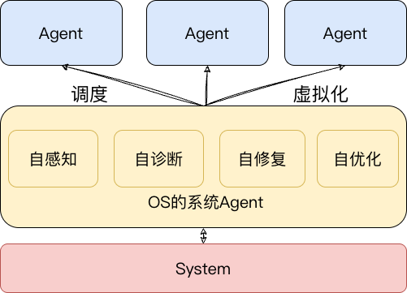
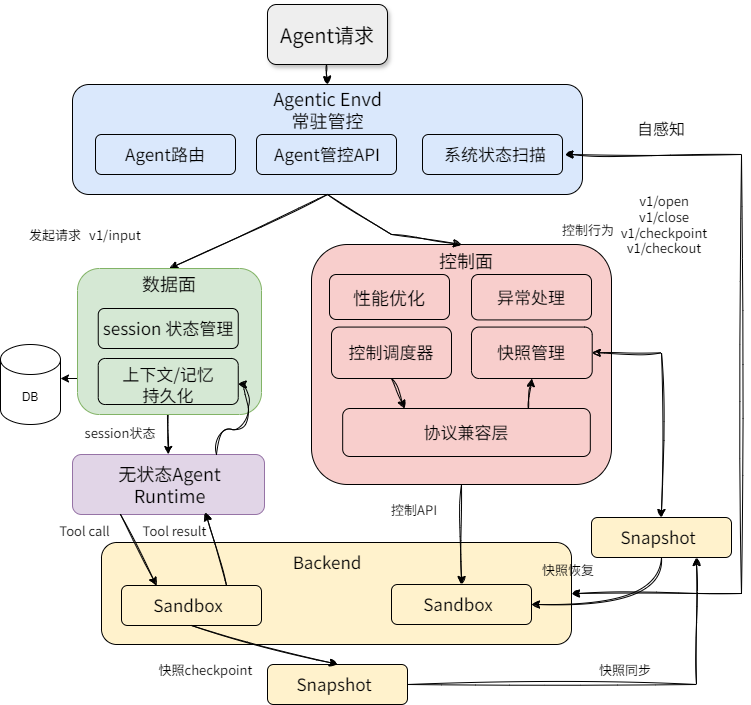
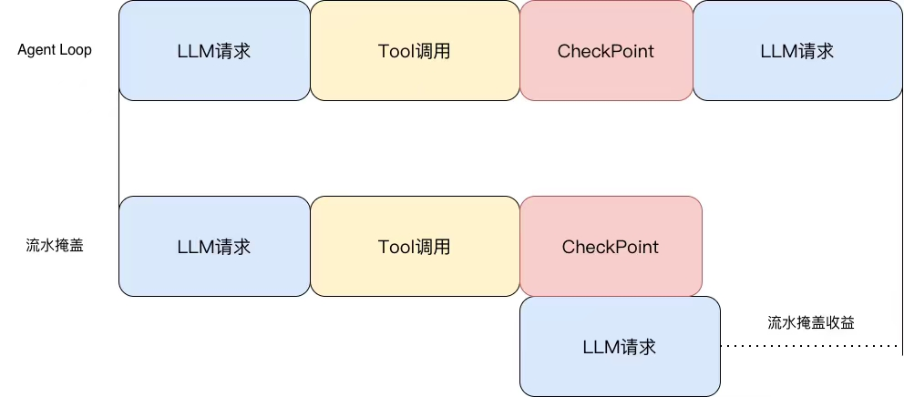
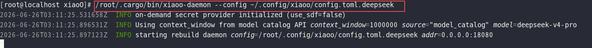
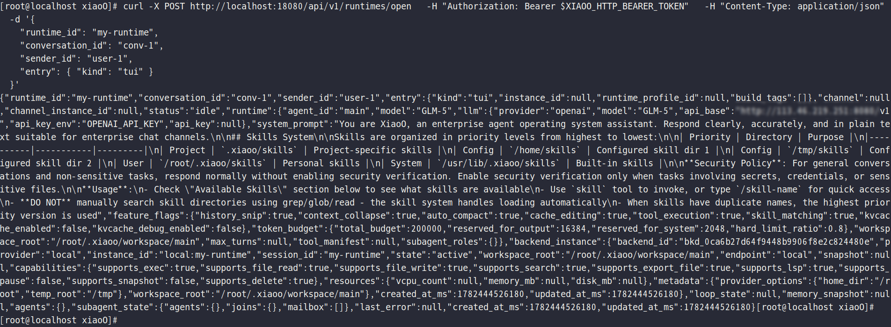
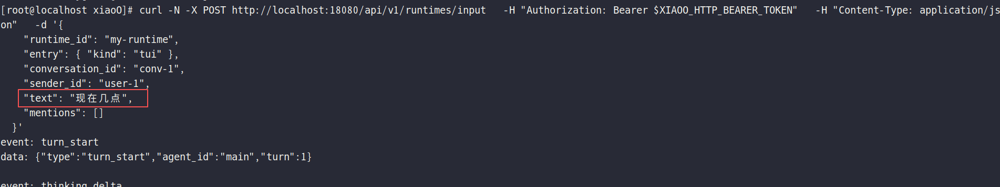
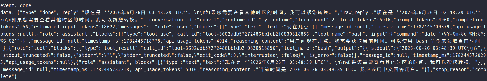
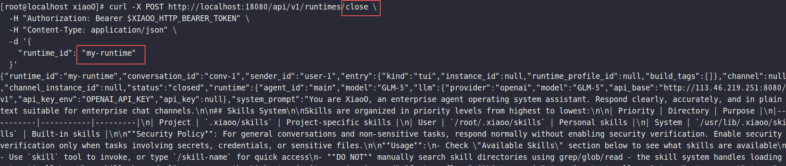
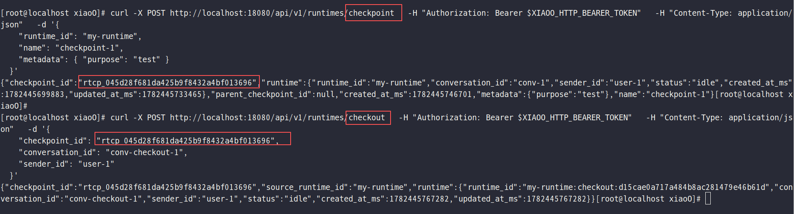

## 摘要

随着AI 能力提升，AI Agent 正从单轮对话工具，进化为能执行命令、修改文件、管理进程的系统核心角色。这种能力的飞跃，让 Agent 展现出高效执行力的同时，也带来了严峻的管控挑战。当 Agent 数量级膨胀，且能持续改变系统状态时，若缺乏统一的调度、隔离和恢复机制，其灵活性将直接转化为系统风险。

因此，OpenAtom openEuler（简称“openEuler”或“开源欧拉”） Agent Infra 团队提出“系统 Agent”这一新定位——其职责不仅是让单台/一组服务器具备自感知、自诊断、自优化、自修复的能力；同时向上服务于各类 Agent 应用，负责 Agent 的调度和切换。向下负责统一虚拟化、内存、网络等系统资源。其旨在激活 Agent 和系统的结合能力，从而实现AI对真实的系统资源、系统问题的自治和优化，并进一步管理、优化在服务器OS上的其他海量 Agent 应用。

由于篇幅所限，本篇聚焦**系统 Agent 作为智能管理入口对服务器OS上其他海量 Agent 的管理和自治能力**，后续将推出对于系统自感知、自诊断、自修复和自优化相关的文章。

## 背景：Agent 正从应用能力走向系统能力

随着模型能力和 harness 建设的持续提升，AI Agent 正从概念走向大规模落地应用。当前的 AI Agent 已经逐渐突破聊天机器人式单轮对话的角色边界。其得益于 ReAct Loop、多轮交互、工具调用、记忆管理和任务编排等系统能力，Agent 在 coding、个人助理、智能客服、运维排障等复杂场景中展现出很强的灵活性和执行效率。

OpenClaw 在年初受到社区广泛关注，相关实践案例让更多开发者开始关注 Agent 的实际应用。随后火热的 Claude Code、Codex、Hermes、DeepSeek\-TUI 等工具，也分别形成了各自的产品形态和使用群体。甚至更进一步的，类似 copilot shell，Agent 不再只是传统命令解释器，而开始成为系统登录后的智能入口：对人类用户，它是可以理解自然语言的智能终端；对 Agent，它是调用系统能力的标准接口。

上层 Agent 应用生态快速发展的同时，也把一个更底层的问题推到了台前：当 Agent 不再只是回答问题，而是开始持续调用 shell、修改文件、启动进程、安装依赖、访问网络时，这些具有超强能力的Agent，应该如何管控？

## 系统 Agent 落地对 Infra 的核心诉求

AI 模型天然存在一定随机性，这在带来灵活性的同时，也引入了可靠性风险。多个 Agent 并发运行时会对环境产生扰动和冲突，文件系统、依赖状态和进程状态的变化可能形成连锁影响，导致 Agent 对环境产生错误判断，并消耗额外时间和 token 去理解、修正这些偏差。

长时间运行还会使 Agent 的错误概率逐步累积。一旦关键错误已经落到执行环境中，如果缺少回滚和恢复机制，就会极大阻碍用户在复杂任务和生产场景中采用 Agent 的信心。同时，AI Agent 往往消耗较多系统资源，例如 OpenClaw 单实例内存占用可超过 2GB，并可能随运行时间增长而继续上升；在多 Agent 并发运行时，这会给系统资源带来明显压力。

因此，大规模 Agent 落地对 Agent Infra 系统 Agent 至少提出以下几类诉求：

* 执行环境隔离：不同 Agent、不同任务、不同租户之间互不污染，避免文件系统、依赖和进程状态相互影响。

* 状态可管理：Agent 操作过程应留存关键状态，支持 checkpoint、resume、rollback 和 fork。

* 资源可调度：系统需要识别 LLM 请求阶段与 Tool 执行阶段的负载差异，提升资源复用和高密部署能力。

* 行为可治理：权限、配额、审计、观测、异常恢复和生命周期管理应由统一控制面承接，而不是散落在每个 Agent 实例内部。

## 系统 Agent 管控层的定位：智能 Agent 背后的执行与管控层

因此，本文所说的系统 Agent，并不是简单把大模型接入 shell，也不是再做一个单点式 Coding Agent。它更接近操作系统与 Agent Runtime 之间的执行与管控层：向上承接 Copilot Shell、Coding Agent、多 Agent 应用等不同形态的智能入口，向下管理文件系统、进程、依赖、网络、资源与执行环境。

**一句话概括：普通 Agent 解决“让 AI 会做事”，系统 Agent 解决“让 AI 在真实系统里可控地做事”。** openEuler Agent Infra 系统 Agent 的定位，正是面向多 Agent 时代的系统级控制平面。

图1 系统 Agent 的定位

## 解决方案：基于隔离技术、统一对外管控的系统 Agent 管控层

问题的本质在于：传统 Agent 运行方式中，代表“大脑”的 LLM Session 和代表“手”的 Tool 执行环境往往处在同一宿主机内，思考、决策和执行共享同一套上下文与系统状态。这种强耦合让 Agent 的上层智能直接暴露在宿主机文件系统、依赖环境和进程状态的变化之下，也让 LLM 请求负载与 Tool 执行负载之间的差异难以被系统有效调度。

为了解决这一矛盾，openEuler 团队构建了基于隔离技术、统一对外管控的系统级管控层。它不是替代某一个具体 Agent 的上层应用，而是为不同 Agent Runtime 提供一个统一的执行底座和控制平面，让 Agent 的系统操作从“直接落到宿主机”转变为“在受控环境中执行、被观测、可恢复、可调度”。

图2、系统 Agent 管控层设计

## Agent Infra 系统 Agent 的管控层能力

Agent Infra 系统 Agent 基于隔离技术能力，对 Agent 的 LLM Session、Tool 执行环境、运行状态和系统资源进行解耦与管理，从而构建完整的 Agent 系统管理控制能力。其核心价值可以概括为以下四点:

### 1. 手脑分离：控制面与执行面的解耦

传统 Agent 运行方式中，LLM Session、工具执行环境、宿主机文件系统往往耦合在一起。思考、决策、执行共享同一套上下文与运行环境，一旦工具链对环境产生扰动，就可能反向污染 Agent 的认知上下文，进而引发连锁错误。

而在 Agent Infra 系统 Agent 中，“脑”与“手”被明确拆开：LLM Session 负责规划、推理与决策，执行环境负责落地工具调用、文件修改和系统操作。前者更多承担控制与编排职责，后者则作为被管理、可约束、可观测的执行单元存在。这样做的直接收益是，两者的运行环境可以分离开，从而使得对话的历史可以被单独抽离出来进行管理，能把执行环境从 Agent Runtime 的持续运行压力中剥离出来，减少彼此扰动

### 2. 虚拟化执行环境：让 Agent 运行过程可回滚、可恢复、可分叉

如果 Agent 直接运行在宿主机上，一旦错误操作已经落到文件系统、进程状态甚至外部依赖上，很多场景下都缺少低成本回退手段，这使得长链路自治执行天然带有较高风险。

虚拟化执行环境提供了更稳妥的解法。每个 Agent 的工具操作都落在隔离的运行实例内，执行前后可以进行快照留存；在需要时，可以以快照的方式进行 checkpoint、resume，甚至直接 roll back 回滚到某个关键节点。对于探索性任务，还可以基于同一个状态分叉出多个执行分支，让不同策略并行试错，而不必担心互相覆盖结果。这样一来，Agent 的运行就从“一次性过程”变成了“可管理过程”，为此，Agent的运行安全也得到了保障。

### 3. 面向交替型负载的调度：提高资源利用率，支撑 Agent 高密部署

Agent 的运行负载存在非常明显的阶段性差异：在 LLM 请求和等待返回阶段，CPU 与本地执行资源占用通常较低；而在 Tool 执行阶段，例如代码编译、脚本运行、文件扫描、环境操作时，CPU、内存和 I/O 压力会快速上升。由于 ReAct Loop 的设计，Agent 天然就是一种“交替型负载”。

在线性执行模式下，这种负载特征会造成资源浪费和峰值压力。Agent Infra 系统 Agent将控制面统一收口后，可以更细粒度地感知各个 Agent 当前所处阶段，并据此进行流水化调度和资源复用：推理阶段让出执行资源，执行阶段按需拉起隔离实例，同时控制并发 Tool 执行的 Sandbox 数量。这样既降低了系统峰值压力，也提升了整体资源利用率。

图3 流水掩盖设计

### 4. 收窄、统一管控入口：让多 Agent 系统走向可运营

当 Agent 数量上来以后，多租户、多任务、多运行环境会因为 AI 的随机性而不断发散。谁在运行、运行到了哪一步、用了哪些工具、改动了什么环境、失败发生在哪里、能不能恢复，这些问题如果没有统一控制面支撑，很快就会演变成新的复杂度来源。

统一对外管控的意义就在于，把原本分散在各个 Agent 实例中的状态、动作和资源使用情况收拢到一个可观测、可控制的系统中。这样不仅方便做权限控制、资源配额、生命周期管理，也方便后续接入监控、审计、计费、异常恢复和策略编排能力。对于真正希望把 Agent 推向生产环境的团队来说，这部分能力是工业化落地的重中之重。

### 仓库链接

[https://gitcode.com/openeuler/xiaoO](https://gitcode.com/openeuler/xiaoO)

## 使用案例：使用 Agent Infra 系统agent管控层的实战

目前已经支持的控制面API

|端点|描述|
|---|---|
|POST /api/v1/runtimes/open|使用 RuntimeOpenRequest 打开或恢复一个运行时|
|POST /api/v1/runtimes/input|提交一个用户输入并流式传输 SSE 事件|
|POST /api/v1/runtimes/interaction|将用户交互响应发送回守护进程|
|POST /api/v1/runtimes/cancel|求取消当前轮次|
|POST /api/v1/runtimes/close|关闭运行时，移除其记录，并触发生命周期钩子|
|POST /api/v1/runtimes/checkpoint|使用 RuntimeCheckpointRequest 将空闲运行时捕获为检查点|
|POST /api/v1/runtimes/checkpoint/delete\-snapshot|删除检查点引用的提供程序快照/模板|
|POST /api/v1/runtimes/checkout|使用 RuntimeCheckoutRequest 从检查点创建新的运行时|

为了让大家直观感受 Agent Infra 系统agent管控层的实际效果，本章节将重点展示基于 Agent Infra 系统 Agent 管控层对 Agent 进行管理的流程。当前系统 Agent 管控层系统特性已合入主线分支，后续将逐步增加对其他 Agent 框架的支持。环境安装部署流程如下：

如果是 arm/x86 的 openEuler 可以不需要从源码编译开始。可以从 xiaoO（[https://gitcode.com/openeuler/xiaoO/releases/v0.1.0](https://gitcode.com/openeuler/xiaoO/releases/v0.1.0)） 最新 release下载对应环境的 RPM 包：

sudo dnf install \-y ./xiaoO\-\*.rpm

如果是其他的linux系统/macos系统，需要从 xiaoO 源码仓下载源代码，并进行源码编译安装。

git clone [https://gitcode.com/openeuler/xiaoO.git](https://gitcode.com/openeuler/xiaoO.git)

cargo install \-\-path apps/endside

cargo install \-\-path apps/serverside

安装完成后，可以使用系统命令直接启动：

xiaoo\-daemon \-\-config /path

这一步会打开管控层守护进程，后续所有的数据面行为、控制面操作都会游管控层统一管理、守护。下面展示一些简单的命令和能力。

打开一个agent runtime。接口 /api/v1/runtime/open

向指定agent runtime进行交互。接口 /api/v1/runtime/input

关闭指定agent runtime。接口 /api/v1/runtime/close

给指定agent runtime进行快照保存/快照恢复。接口 /api/v1/runtime/checkpoint /api/v1/runtime/checkpoint

如果环境存在执行错误或者崩溃，那管控层就会迅速定位到上一个 checkpoint 点，从而快速恢复执行环境，连接上 session 会话，让用户完全无感后台的失败，并且记录下这个失败的原因，从而避免后续的失败重复发生。

## 总结：当 Shell 成为 Agent 入口，操作系统需要 Agent 管控层

如果说 Copilot Shell 这类系统入口让 Agent 能以自然语言进入操作系统，那么 Agent Infra 系统agent管控层要解决的是：当大量的不同租户、不同诉求的 Agent 同时进入系统之后，谁来负责隔离、调度、回滚、审计和生命周期管理，谁来维护整个系统的可靠性、稳定性和高效执行。对于单个 Agent 而言，其重点在于如何解决问题，如何服务好其对应的用户，如果再将大量的安全边界、审查、虚拟化、租户管理都强加在其责任范畴，那么将会使得其架构臃肿、责任泛滥、难以维护。

因此 openEuler Agent Infra 系统 Agent 管控层强调的不是单点智能入口，而是面向系统 Agent 的统一控制平面。它把 Agent 的执行环境、系统状态和资源边界纳入操作系统级管理，让 Agent 从“能执行”进一步走向“可管、可控、可恢复、可运营”。进一步地，它创新性地将 Agent 的负载两极化进行利用，针对硬件特性进行良好的资源规划、分配，从而提升 Agent 的资源供给率，更好地支撑多租户、多 Agent 诉求。这是让 Agent 从demo，走向企业生产环境的必经之路。

