在 OpenAtom openEuler（简称“openEuler”或“开源欧拉”）开源的 openYuanrong 最近发布的 0.8.0 和 0.9.0 两个大版本中，openYuanrong 大幅增强了面向 Agent 企业级应用的分布式能力，连同此前已具备的分布式内核基础能力，致力于打造 Agent 时代的企业级分布式底座。

## 1.Agent 时代为何需要新的分布式底座？

我们知道，在云原生时代，K8S 围绕典型的在线微服务应用提供了容器分布式编排的核心基础能力，并逐渐推广至包括离线场景在内的各类分布式应用，成为了事实上的云原生分布式底座。

然而随着 Agent 时代的到来，应用形态出现了根本性的变化。不同于传统微服务是人编程开发的，具备极高的确定性，Agent 应用是大模型驱动的，天生是不确定的。不确定的 Agent 应用有着和传统微服务截然不同的运行特征，对 K8S 等传统分布式基础设施提出了巨大挑战。

### 1.1 Agent 不同于微服务的独特运行特征和挑战 1：高动态

我们知道 K8S 和应用的接口是容器，依赖用户提供应用的容器镜像，并为每个容器配置指定规格大小，再由 K8S 完成在集群内的分布式部署。

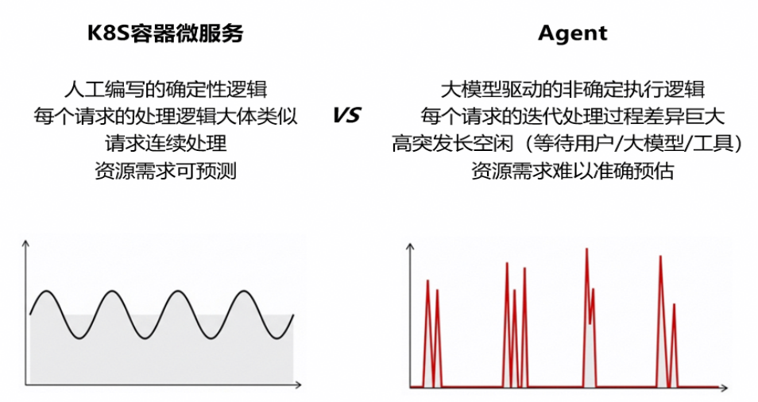

然而如上图所示，不像微服务等传统应用是确定性的，对资源的需求也是大致平稳可预测的， Agent 的运行逻辑由于受大模型驱动，是高度动态不确定的，无法做到像微服务一样可以准确预判。

一方面，Agent 在请求到来或处理过程中可能随时需要动态拉起任务执行，在最新的 Agent Swarm 场景下甚至会动态拉起大量并发子 Agent，对资源需求有很强的突发性。另一方面，在 Agent 执行过程中又有大量的长时间空闲等待，比如等待用户新一轮输入、大模型的新一轮输出或者工具调用结果等等。这种高突发长空闲的动态运行特征使得 Agent 不适合采用 K8S 微服务标准的容器资源配置方案。一旦为 Agent 配置固定大小的容器，要不就是因为资源不足导致某些请求执行失败，要不就是因为配置了过大的容器规格导致巨大的资源浪费。

这意味着 K8S 这套以容器为接口的应用部署方式在 Agent 时代已经过时了，继续沿用这种固定资源容器部署的方式只会为 Agent 应用的开发运维人员带来麻烦和困扰，为企业增加巨大的资源成本开销。

### 1.2 Agent 不同于微服务的独特运行特征和挑战 2：不安全

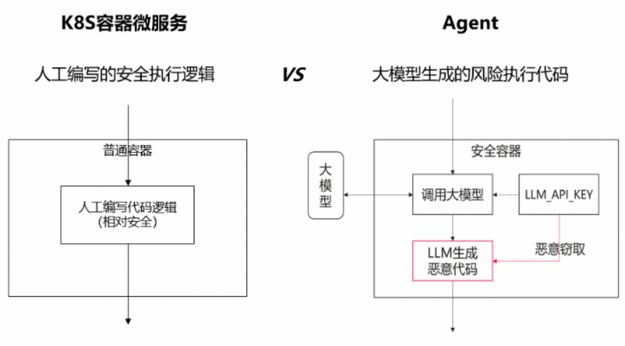

Agent 另一个与传统微服务的显著不同是更加不安全。Agent 执行的不再是完全人工编写的安全执行逻辑，而是有大量的大模型驱动的有风险的工具调用，甚至是直接运行大模型动态生成的风险代码。这些风险任务有可能带来容器逃逸问题，无法用 K8S 常用的普通容器来作安全隔离。

即便让 K8S 去对接支持更安全的容器，也并不能完全解决问题。因为即便安全容器隔离了风险代码对Host的攻击，但也不能完全排除恶意代码窃取容器内的隐私信息（如大模型访问凭证等）造成隐私泄露等安全问题。

真正安全的方案应该是将这部分大模型驱动的风险任务逻辑动态隔离到一个完全独立的安全沙箱内，这个沙箱甚至都可以不用和原有的应用容器在一个节点上，从而实现彻底的隔离运行。这就要求任务级的动态分布式调度执行能力，但这也是 K8S 等传统微服务基础设施从功能设计上就不具备的。

### 1.3 Agent 不同于微服务的独特运行特征和挑战3：长会话

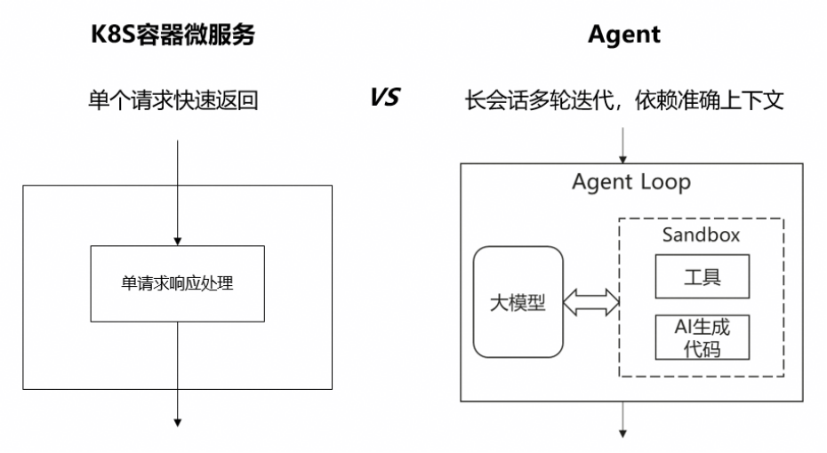

传统微服务处理的请求往往是单次处理快速返回，并且很多还是无状态的应用，可以随机地将请求路由分发给任意微服务实例。Agent 请求的处理过程则截然不同，需要通过 Agent Loop 与大模型及用户多轮迭代交互，中间还会动态调用各种工具和 AI 生成代码，才能最终完成一次请求处理给出最终结果。在此过程中，用户的多轮会话输入必须要路由给正确的 Agent 实例才能保证请求上下文一致和后续正确处理，要求有状态的请求分发路由。

更麻烦的是，在企业环境中运行这种长程 Agent 应用，一定会遇到故障。如果故障发生前，Agent 已完成了一些外部工具调用，那么在故障后 Agent 如何能正确恢复到故障前的状态继续正确执行，而不至于产生不正确的执行结果？传统微服务请求比较简单，在故障恢复后一般只需要将请求重试即可解决大部分问题。但在 Agent 场景，由于 Agent 的非确定性，简单请求重试可能会走入与故障前完全不同的执行轨迹，从而导致前后执行语义不一致，最后产生错误的执行结果。比如，下图一个订票助手在故障前已经预定了对应行程的飞机票，结果在故障后可能走入另一执行分支，又再预定了对应行程的高铁票，从而造成业务受损。

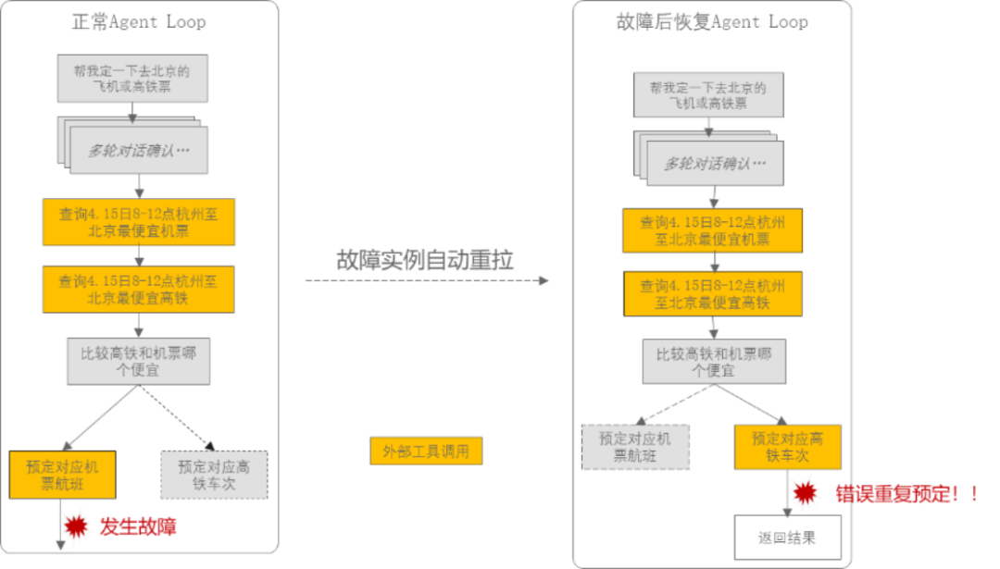

为应对 Agent 在企业级场景的可靠应用，需要支持有状态长时运行、上下文感知的 Session 亲和请求路由以及语义一致的故障恢复等能力。这些能力也是现有 K8S 微服务技术体系不具备的。

## 2.openYuanrong 如何支持企业级 Agent 应用

K8S 等传统微服务方案不适用于 Agent 时代的根本原因在于不满足 Agent 高度不确定的运行需求。Agent 已无法通过人工静态规划一模一样固定大小的多个容器来实现部署运行，而需要更加强大灵活的分布式底座，既能支持 Agent 长时有状态运行，又可以接收来自外部的用户输入实现上下文一致的会话处理，并支持故障场景下恢复正确的状态继续执行；既可以根据自身的实际忙闲情况按需使用资源，又可以运行中动态地去调用不同的工具和执行 AI 生成的代码甚至拉起大量并发子 Agent，但同时又能将 AI 生成代码等风险任务调度到一个完全独立的沙箱中实现精准彻底的安全隔离。

openYuanrong 的核心设计理念正是构建一套能够高效灵活支持各类分布式应用的分布式内核，其设计思想和技术能力非常适合作为 Agent 场景的分布式底座。

### 2.1 openYuanrong 分布式内核设计理念和核心抽象

为了能灵活支持各种各样可能的负载，openYuanrong 在设计上借鉴了单机 OS 的抽象，通过几个通用的核心概念抽象支持各类分布式应用场景。

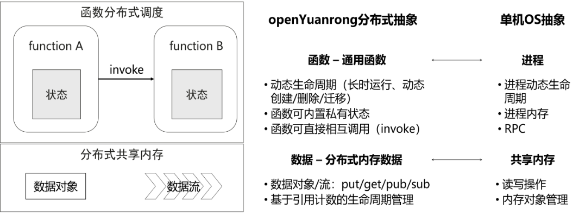

其中，最核心的概念抽象是函数。它就像单机 OS 中的进程（及其对应的 main 函数），是应用在集群中分布式调度运行、分配资源的基本单位。函数支持像进程一样持有内部私有状态，也可以支持在分布式运行中动态调度拉起新的函数实例。比进程更方便的是，它还原生支持函数实例间相互分布式调用，而无需关注底层如何实现。 除了函数和状态外，openYuanrong 也提供了数据对象、数据流等分布式内存数据抽象，以方便不同函数间的分布式数据共享和协同。

### 2.2 openYuanrong 函数系统支持 Agent 大规模动态弹性调度

围绕函数抽象，openYuanrong 设计实现了函数系统，支持大规模动态分布式调度。

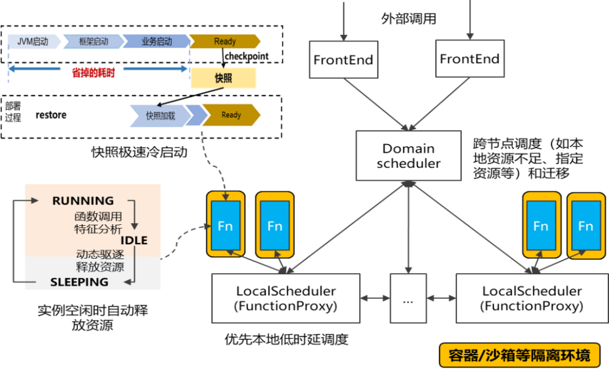

如上图所示，函数系统采用 Domain-Local 分布式分级调度，可以支持包含 Agent 在内的各类函数实例的大规模分布式动态调度，并支持函数实例自动弹性休眠/唤醒等机制实现高效资源利用。应用只需提供图中蓝色部分对应的函数代码和相关配置，发布至 openYuanrong，即可由函数系统实现 Serverless 化的托管运行和对外服务。
函数实例自动部署并完成初始化后即可长时有状态运行，并支持响应外部请求。对 Agent 场景来说，每个 Agent 实例就是一个函数实例，可以支持上下文亲和的会话路由和请求处理。基于 openYuanrong，Agent 无需再配置容器资源，由函数系统按实际需要选取集群中合适的节点/Pod 完成实例部署以充分共享利用集群内空闲资源，同时支持运行中动态调整实例位置和资源分配，甚至无请求时可以自动休眠释放资源，从而简化应用部署并大幅提升资源利用率。

函数可以在运行中动态拉起新的函数实例，通过对应的函数调用完成相关任务的分布式执行处理。对应 Agent 场景，可以用来动态拉起新的子 Agent 或执行工具/AI 生成代码调用。同时多个函数实例可以做到分布式并行计算，可用于实现大规模的分布式 Agent Swarm。

任意函数实例可以支持配置容器或沙箱等隔离环境，实现彼此间安全隔离。同时函数系统也支持多租户隔离运行。这些能力可以支持企业 Agent 场景下多租户安全隔离以及应用内的风险任务精准隔离。

### 2.3 openYuanrong 数据系统支持 Agent 实时状态备份和可靠长稳运行

围绕数据抽象，openYuanrong 设计实现了数据系统，支持高性能近计算分布式缓存。

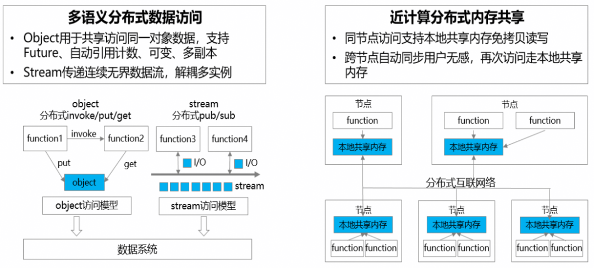

任意的函数实例间可以使用数据系统的类 put/get 接口操作数据对象，通过类 pub/sub 接口操作数据流，同时数据对象可用作函数调用的参数和返回值。数据对象另外也支持 KV 语义访问。数据系统可与函数系统在集群内共部署，从而可通过同节点本地共享内存和跨节点分布式多副本缓存支持各个应用的函数实例实现高效的近计算分布式内存数据访问。

数据系统的数据对象能力可用于存放函数实例休眠后的状态快照，从而支持 Agent 场景下高性能的 Agent 休眠/唤醒或快速启动。数据流则可用于 Agent 的请求处理流式返回等场景。

除此之外，数据系统还非常适合记录 Agent 执行过程中的实时事件/状态变化，尤其是在 Agent loop 迭代处理过程中的关键事件和中间状态变更记录，以便在故障场景下实现语义一致的状态恢复。由于数据系统是内存级访问，对 Agent 正常处理的性能影响很小，但可通过共享内存和多副本能力提供 Agent 可靠的状态备份以支持故障恢复。同时数据系统也支持自动垃圾数据清理回收机制，使得 Agent 可以无需额外关注这些临时数据的生命周期管理。

## 3.Agent 应用如何基于 openYuanrong 高效长稳运行

### 3.1 基于 openYuanrong 构建 Agent Runtime

基于openYuanrong分布式内核能力很容易构建面向 Agent 应用场景的 Agent Runtime，方便 Agent 应用快速接入实现企业级的大规模生产运行。如下是我们联合 openJiuwen 构建的分布式 Agent Runtime 示意。

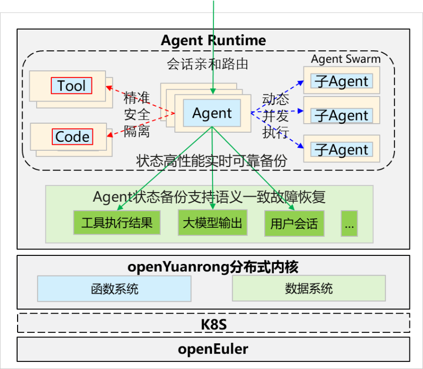

基于 openYuanrong 分布式内核的通用基础能力，Agent Runtime 可支持Agent应用的 Serverless 自动弹性、多租户、面向 Tool/AI 生成代码的动态分布式并行和精准安全隔离能力以及面向 Agent Swarm 的大规模分布式调度执行能力。同时针对 Agent 场景的长会话特征， Agent Runtime 可利用分布式内核的大规模分布式 Session 管理和弹性调度能力，支持单 Agent 应用百万 Session 并发，并利用数据系统提供的内存级分布式对象能力，实现高性能的分布式状态管理和语义一致的 Agent 故障恢复能力，从而解决 Agent 高动态、不安全、长会话的运行特征带来的技术挑战。

下面仍然与传统 K8S 微服务对比说明基于 openYuanrong 分布式内核叠加 Agent Runtime 如何能克服 Agent 高动态、不安全、长会话挑战，实现 Agent 在企业场景下的高效长稳运行。

### 3.2 openYuanrong 支持 Agent 高动态弹性高效运行

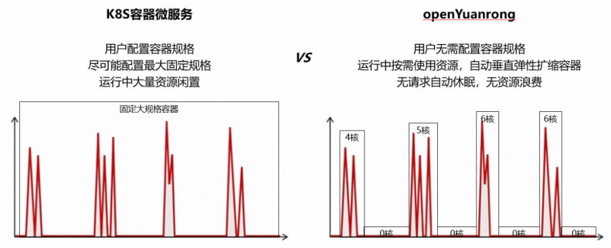

不像容器微服务依赖用户指定容器规格并从 K8S 分配和预留大量的容器资源导致长时间空闲浪费，使用 openYuanrong，用户只需提交 Agent 代码，无需感知容器规格。openYuanrong 可根据 Agent 实际运行的资源需求动态调整所属沙箱/容器的规格，在无请求的时候还可以自动休眠实例，待再次有请求后自动唤醒，从而实现 Agent 弹性高效运行。

### 3.3 openYuanrong 支持 Agent 实现精准安全隔离

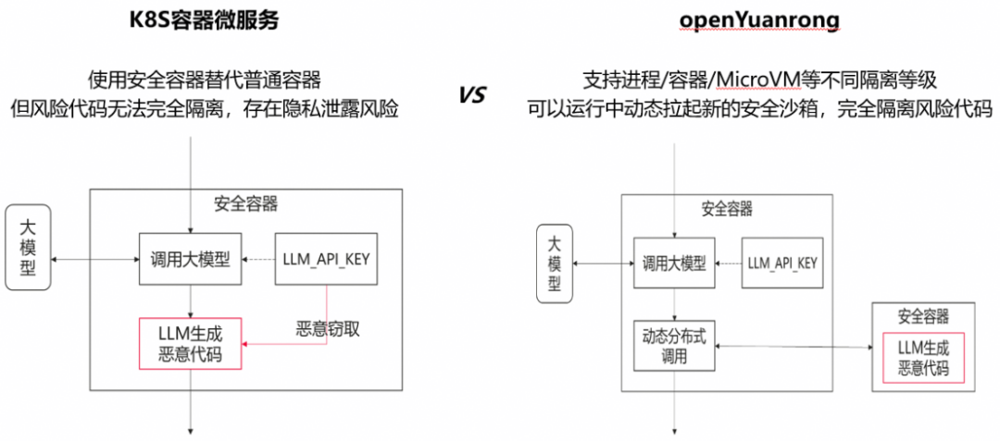

openYuanrong 支持 Agent 应用在运行中通过分布式的函数调用方式按需将 AI 生成代码等风险任务动态调度至一个独立的安全沙箱环境完成执行并自动获取返回结果，无需与 Agent 其它逻辑耦合在一个大容器中，可以实现精准彻底的安全隔离，避免大模型凭证被恶意风险代码窃取等安全风险。

### 3.4 openYuanrong 支持 Agent 长会话语义一致容错长稳运行

借助 openYuanrong 分布式内核对有状态函数的支持，Agent 应用天然可实现有状态长时运行和上下文亲和的请求路由。此外，openYuanrong 函数系统还支持面向大规模 Session 的分布式请求调度和 Session 粒度的资源弹性，可做到单 Agent 应用百万级 Session 并发。

针对 Agent 故障情形，Agent Runtime可基于 openYuanrong 数据系统实时保存Agent执行过程中的关键事件，数据系统的内存级访问性能保证了 Agent 运行性能几乎可以不受影响。出现故障时，openYuanrong可以自动重拉 Agent 实例，此时 Agent 可根据保存在数据系统中的历史事件实现精准的断点续跑，确保故障前后上下文语义一致，不产生错误的执行结果，从而实现企业级长稳运行。

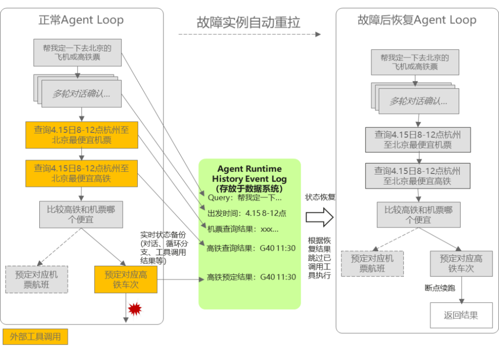

仍以前面的订票 Agent 为例，利用基于 openYuanrong 数据系统保存的 History Event Log，Agent 框架和应用在故障恢复后可恢复到故障前的正确执行状态，从故障点继续往下执行完成故障前后语义一致的正确处理，避免从头重复处理带来的重复大模型调用 Token 消耗以及由于 Agent 不确定性走入另一执行分支导致的语义错误和业务受损。

## 4.openYuanrong 适合作为 Agentic AI 统一底座从命令行到对话式交互

Agent 的高动态、不安全、长会话等特征在冲击微服务等在线应用形态的同时，也推动了推理、强化学习等其它场景产生新的技术变化，比如 Agent 推理在面向 Agent 的长下文 KV Cache 管理、强化学习面向多 Agent训练的动态资源调度和大规模沙箱调度等方面都存在新的演进机会。

openYuanrong 除了支持 CPU 算力调度外，也同样支持 GPU/NPU 等异构算力，通过对接协同 veRL/vllm 等开源三方框架，可以做到如下图所示，作为 Agent 应用、推理和强化学习的统一分布式底座，实现多样算力的充分共享和最高效的统一调度。

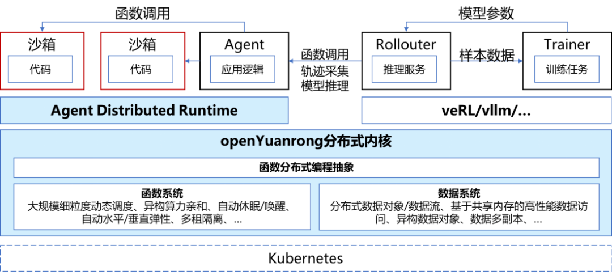

## 5.总结与展望

Agent 的高动态、不安全、长会话等非确定性运行特征对底层分布式系统提出了巨大挑战，以 K8S 微服务技术体系为代表的传统云原生分布式底座在 Agent 时代已难以胜任。openYuanrong 通过分布式内核技术有效应对Agent的不确定性，联合 openJiuwen 构建 Agent Runtime 实现 Agent 应用在企业生产环境的高效长稳运行。 同时 openYuanrong 还支持异构算力的统一调度，可以为 Agent 时代的各类 Agentic AI 负载构建统一的企业级分布式底座。

### 相关链接

[1] 官网地址：<https://docs.openyuanrong.org/>

[2] 源码地址：<https://atomgit.com/openeuler/yuanrong>

[3] 技术论文：<https://dl.acm.org/doi/10.1145/3651890.3672216>

[4] 问题反馈：<https://atomgit.com/openeuler/yuanrong/issues>