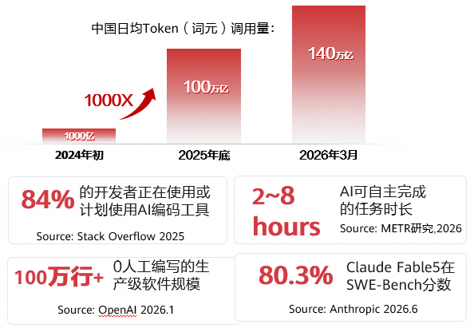
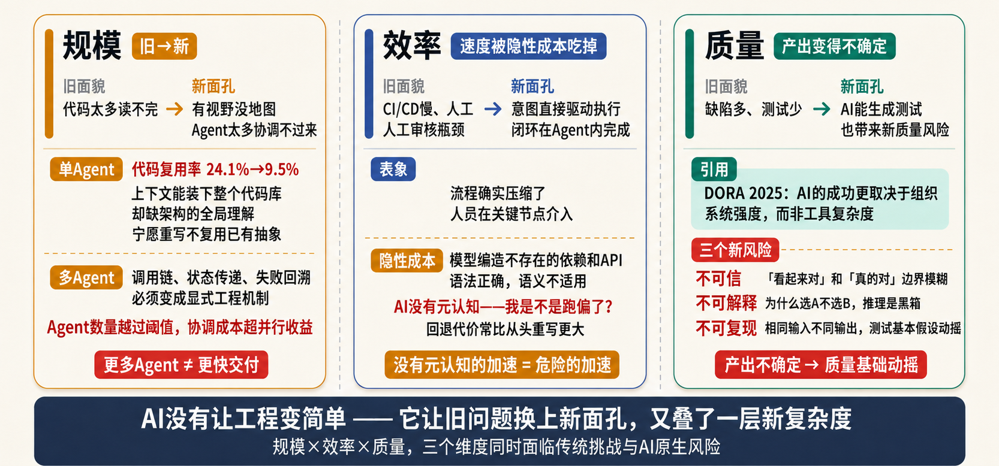
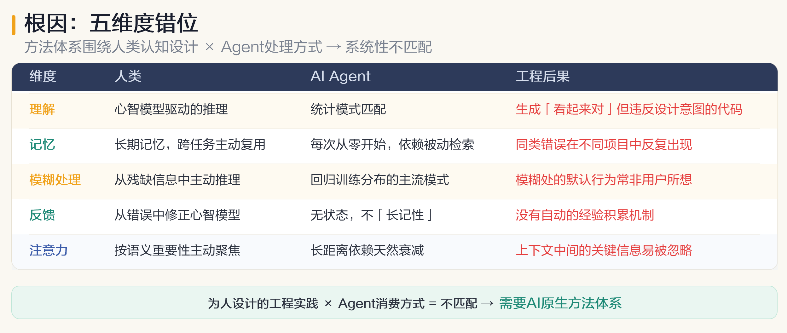
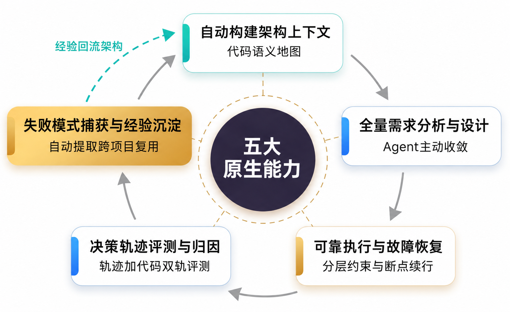

## 前言

2026 年，AI 已从"编码助手"进化为工程执行主体。但有个反直觉的事实越来越难忽视：**AI 帮我们拔高了能力上限，却在规模、效率、质量三个维度上同时制造了新的挑战。** 为此，OpenAtom openEuler（简称 “openEuler” 或 “开源欧拉”） intelligence SIG 提出 AI 原生软件工程（AI\-Native Software Engineering）范式，并构建了开源项目 **AET（Agentic Engineering Team）**，旨在推动企业级AI编码方案落地，实现可靠、可控、可演进的软件交付，欢迎使用与共建。

仓库链接：[https://atomgit.com/openeuler/agentic\-engineering\-team](https://atomgit.com/openeuler/agentic-engineering-team)

## 背景

### 一个反直觉的数字

2025年，METR 做了一项随机对照实验。找来一批资深开源开发者，让他们在有无AI辅助的条件下完成同样的任务。

结果让所有人愣住：开发者**自认为用 AI 后提效了 24%，实测却下降了约 20%。**

问题出在哪？不是 AI 不够快。它太快了。快到你还没意识到问题，已经跟着错误方向跑出去很远。幻觉编造出不存在的API，代码语法无懈可击但语义完全跑偏。等你察觉，返工成本已经高企。这不仅仅是工具问题，而是**工程范式在发生变化。**

### 拐点已至：AI 已是工程执行主体

先看几组数据：

中国日均Token调用量，2024年初约1000 亿，2025年底约100万亿，2026年3月达到约140万亿。两年多增长约1400倍。

调查显示，84%的开发者正在使用或计划使用AI编码工具，头部模型在SWE\-Bench上的分数已突破80%，AI可自主完成任务时长延长至2~8小时。

可见，编码Agent已跨越“生产级”门槛，从辅助工具演变为工程执行主体。

图1：编码Agent正从辅助工具演变为工程执行主体

AI 编程工具正加速演进为Agentic AI的核心应用场景，Claude Code、Codex、Copilot、Cursor等工具正成为开发者的首选。AI编码产品的形态沿着"人在回路中的位置"这条轴一路后撤，走出了清晰的三个阶段：从**AI IDE阶段**（Copilot式深度集成，开发者仍处于实现回路之中），演进至**自主编程Agent阶段**（开发者负责设计架构、任务拆解与监督实现），最终迈向**意图编程阶段**（开发者只需关注任务目标，无需关注实现细节）。

**AI已迈过"能否写代码"的门槛。** 真正的问题变成了：当它从助手变成主体，**能不能像一个工程团队那样，做到可靠、可控、可演进地交付软件？**

模型在评测集上的高分并不等同于完整的工程能力。有研究者把SWE\-Bench上标记为"已解决"的补丁重新跑了完整测试集。29.6%的修复实际改变了程序行为，其中28.6%被明确判定为错误。看起来对的代码，离真的对，还有距离。

## 挑战

AI 让软件工程变简单了吗？它的确帮我们拔高了能力上线，但在传统挑战之上，又叠了一层新的复杂度。

图2：软件工程的三重挑战

### 规模挑战：**从“代码太多、人读不过来”，变成“Agent 太多、协调不过来”**

传统的规模瓶颈——代码量超出人的阅读带宽——已被AI基本解决：它能并行处理大量文件、自动导航大型代码库、跨模块理解上下文。但**“看得到”不等于“理解全局”**。

单Agent层面，问题是有视野没地图。上下文窗口大到能装下整个代码库，但AI缺的是架构的全局理解。GitClear对2.11亿行代码的研究显示，AI编码工具普及后，**代码复用率从2020年的24.1%降至2024年的9.5%，而复制粘贴的重复代码块增长4倍**，首次超过重构代码。Agent宁愿另写相似代码，也不复用已有抽象——它能“读到”全局，却未“理解”全局。

多Agent层面更棘手。谁调用谁、状态怎么传、失败如何回溯，这些在人类团队里靠默契和代码审查解决的事，在Agent之间必须变成显式设计的工程机制。一个Agent中间跑偏，误差沿链路级联传播，到最终产出才暴露。Agent数量越过某个阈值后，协调成本反超并行收益。**更多Agent，不意味着更快交付**。

### 效率挑战：速度被方向跑偏的隐性成本悄悄吃掉

传统的效率瓶颈，是流程长、中间环节多。AI 把它压缩了——意图可以直接驱动执行，一个任务闭环在 Agent 内部完成，人只在关键节点介入。但速度优势会被隐性成本悄悄抵消。METR 2025 年一项针对资深开源开发者的随机对照实验得出了一个反直觉的结果：开发者自认为用 AI 后提效 24%，实测却**下降了约 20%**，问题来自两方面：**模型幻觉**——AI 会编造出不存在的依赖、API，代码语法正确但语义不适用，发现时已浪费大量时间；**方向跑偏**——AI 缺乏“我是不是跑偏了”的元认知，能沿错误方向跑很长，回退的代价常常大于重来。

### 质量挑战：**从“缺陷多、测试不足”，变成“产出的不确定性”**

传统质量瓶颈在于缺陷多、测试覆盖不足，AI 虽能生成测试用例、自动审查问题、发现边界条件，但其产出也带来了新的质量问题。新的质量问题表现为三个特征：**不可信**——代码“看起来对”与“真的对”难以区分，仍需人工判断；**不可解释**——代码为什么选方案A而不是B，决策推理过程是黑箱；**不可复现**——生成结果具有概率性，相同输入可能产生不同输出，动摇了传统测试方法与工具的基本假设。

三重挑战指向同一个根因 —— **软件工程的整套方法体系**：需求表达、设计沟通、代码审查、质量保证、经验传承，都是**围绕人类的认知特性**设计的，但人和Agent在五个维度上存在结构性差异：上下文理解方式不同，推理路径不同，失败模式不同，经验积累机制不同，协作方式不同，当执行主体从人换成 Agent，这套方法就出现了系统性错位。

图3：人和 Agent 的五维度差异

把为人设计的工程实践直接“喂”给 Agent，但它与 Agent 的处理方式并不匹配。由此，我们需要构建 AI 原生的软件工程方法体系，用新的工程方法去应对 AI 带来的新问题。

## 解决方案：基于 AI 原生软件工程的企业编码解决方案 AET

为了应对上述问题，**openEuler **构建了一套企业级编码解决方案，通过开源项目 **AET（Agentic Engineering Team）** 开放。

### 五种能力，拼出一套“为Agent而生”的工程方法

**AET **围绕 AI Agent 的认知特性，重新设计的软件工程方法体系与实践，它由五大原生能力构成：

图4：AI 原生软件工程五大原生能力

**1、自动构建架构上下文——为 Agent 构建可导航的代码语义地图**：架构约束大多隐式存在，Agent 容易陷入局部盲区、越界改动、破坏依赖。解法是把代码资产做成一张可导航的语义地图——模块职责、依赖拓扑、边界契约，再按任务生成“修改围栏”，实时告诉 Agent 改这里会坏哪里、哪条边界不能碰。

**2、全量需求分析与设计——为Agent提供设计方法论，防止需求分析与设计过程跑偏**：AI 直接出的设计常对架构、DFx 考虑不全，返工率偏高。解法是把设计方法论做成可复用 Skill，让“需求→设计”不跑偏的过程。

**3、可靠执行与故障恢复——出错中断后可从断点恢复**：概率化输出让同一任务多跑几遍结果就不一致，长链路执行还脆弱，局部错误会沿“生成 — 编译 — 测试”级联放大。解法是把“可靠”做进执行期本身——出错时容错、断点续行、语义回滚，让长链稳定、不必从头返工。

**4、决策轨迹评测与自动归因——从“看代码对不对”到“看Agent的决策过程是否合理”**：传统的质量评价评的是“产物”，默认背后是个可追问的人类作者；但Agent推理是黑盒、还会系统性重复犯错，只看代码就会“知行不一”、同类错误反复犯。解法是把“决策过程”本身变成评测对象，轨迹+代码双轨评测，再通过全链路归因挖出根因和盲区。

**5、失败模式自动捕获与经验沉淀——自动从失败中提取结构化约束并跨项目复用**：经验靠文档和口头相传、Agent 没法直接执行，同样的错反复重演，约束过时也无人清理。解法是把工程经验提炼成下次生成时就拦得住的约束：失败根因自动提成可执行约束，带版本与置信度、过时降权，按架构相似度跨项目继承。

**五大能力之间协同配合，形成闭环**：架构上下文给需求和设计提供语义地图，设计驱动可靠执行，执行轨迹被评测系统审视，失败被沉淀为约束，约束反哺回架构理解。让Agent在下次"踩坑之前"，就已经绕开了已知的坑。

### AET 核心功能

AET 当前已包含 **8个专家智能体**组成的多智能体团队，分管设计、测试、实现、Bug修复、文档生成、版本发布等领域。另有 **40+ 个专业化Skill**，覆盖需求分析、功能设计、代码开发与验证、PR提交、漏洞分析、技术文档编写等全生命周期环节。

**核心功能特性包括：**

* **Spec驱动开发\(SDD\)**，负责把用户模糊的意图转成明确、可验收的Spec，同时从代码库里自动感知架构约束，再驱动设计方案和代码生成：这一步解决的正是"需求 — 设计"容易跑偏的老问题。

* **模块依赖保护围栏**，在设计阶段就把文件自动划成允许修改、禁止修改、条件修改三类，AI开发时自动遵守这圈围栏，并且在设计、实现、PR提交前三个节点分别校验，防止越界改动波及不该动的模块。

* **可配置工作流**，支持全局模板、项目模板、项目模板三级配置，团队不用改核心代码，就能按自己的流程定制Agent执行顺序和人工确认点。

* **故障断点可恢复**，靠任务快照记录每个阶段的完整状态，中断以后从最近的断点接着跑，不用从头来过，资源浪费也就降下来了。

* **自动化版本发布**，检测上次发布之后的代码变更，分析commit类型，自动生成Release Notes与版本包。

## 结语

回头再看那个反直觉的数字。AI让我们自认为提效了 24%，实测下降了 20%。差距不在工具，在工程方法体系。

AI原生软件工程要解决的核心问题，不是让AI写得更快。**是让AI写得更对、更稳、更好迭代。** 它承认一个基本事实：执行主体变了，方法论必须跟着变。

AET是这个方向上的第一次系统性尝试，它搭起了一套可演进的框架：架构上下文可以越来越精准，失败约束可以越积越厚，决策评测可以越来越聪明。**可靠、可控、可演进，这三个目标不靠一次性优化达成，靠一个能自我进化的工程体系持续逼近。**

欢迎大家关注、使用和共建。

**代码仓**：[https://atomgit.com/openeuler/agentic\-engineering\-team](https://atomgit.com/openeuler/agentic-engineering-team)

**SIG组**：[sig\-intelligence ](https://www.openeuler.org/zh/sig/sig-intelligence)

*参考资料*

1. You Wang, M. Pradel, Z. Liu.[Are 'Solved Issues' in SWE\-bench Really Solved Correctly?](https://arxiv.org/html/2503.15223v2)2025.

    [https://arxiv.org/html/2503.15223v2](https://arxiv.org/html/2503.15223v2)

2. R. Aleithan et al.[SWE\-Bench+: Enhanced Coding Benchmark for LLMs](https://arxiv.org/html/2410.06992v2). 2025.

    [https://arxiv.org/html/2410.06992v2](https://arxiv.org/html/2410.06992v2)

3. GitClear.[AI Copilot Code Quality: 2025 Data Suggests 4x Growth in Duplicated Code](https://www.gitclear.com/ai_assistant_code_quality_2025_research). 2025.

    [https://www.gitclear.com/ai\_assistant\_code\_quality\_2025\_research](https://www.gitclear.com/ai_assistant_code_quality_2025_research)

4. METR.[Measuring the Impact of Early\-2025 AI on Experienced Open\-Source Developer Productivity](https://arxiv.org/abs/2507.09089). 2025.

    [https://arxiv.org/abs/2507.09089](https://arxiv.org/abs/2507.09089)

5. DORA.[2025 State of AI\-assisted Software Development Report](https://dora.dev/research/2025/dora-report/). 2025.

    [https://dora.dev/research/2025/dora\-report/](https://dora.dev/research/2025/dora-report/)

6. Stack Overflow.[2025 Developer Survey](https://survey.stackoverflow.co/2025/ai). 2025.

    [https://survey.stackoverflow.co/2025/ai](https://survey.stackoverflow.co/2025/ai)

7. METR.[Measuring AI Ability to Complete Long Tasks](https://metr.org/blog/2025-03-19-measuring-ai-ability-to-complete-long-tasks/). 2026.

    [https://metr.org/blog/2025\-03\-19\-measuring\-ai\-ability\-to\-complete\-long\-tasks/](https://metr.org/blog/2025-03-19-measuring-ai-ability-to-complete-long-tasks/)

