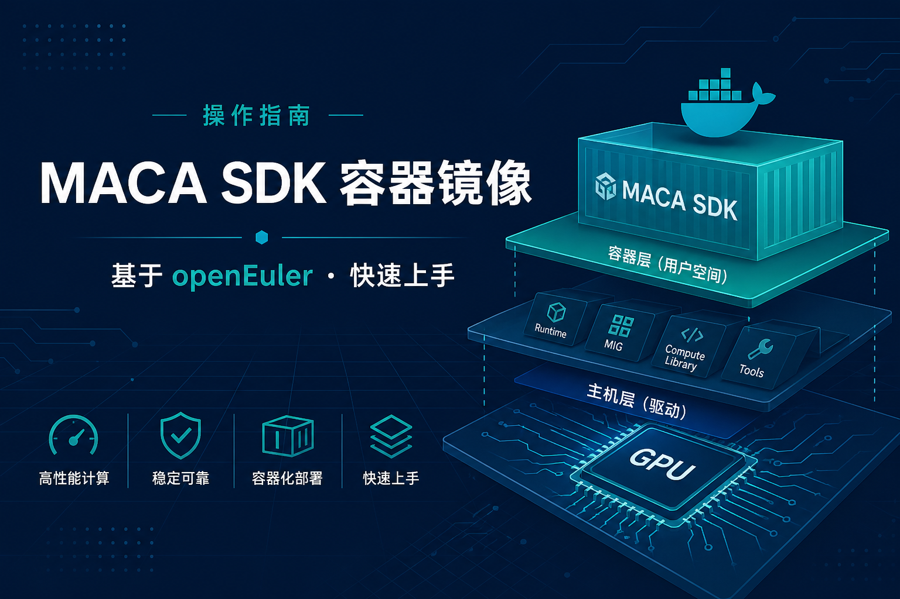
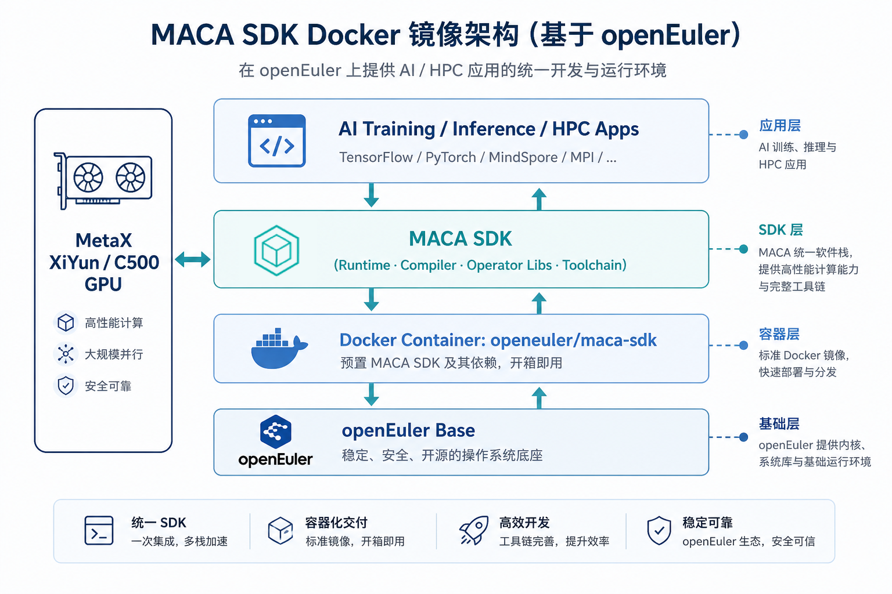
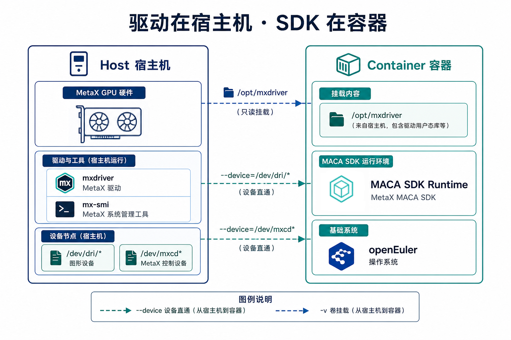
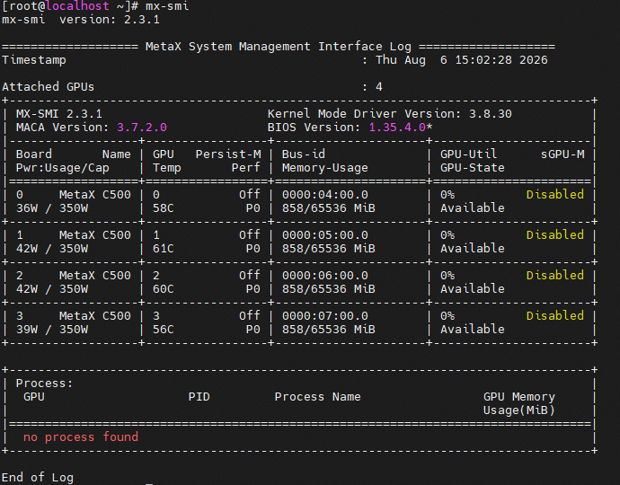
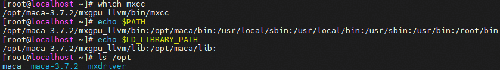

MACA（MetaX Accelerated Computing Architecture，亦称 MXMACA）是沐曦（MetaX）面向曦云 C500 系列通用计算 GPU 打造的异构计算软件栈，提供运行时、编译器、算子库与完整工具链，帮助开发者在沐曦 GPU 上快速构建 AI 训练、推理与 HPC 应用。



OpenAtom openEuler（简称：“openEuler”或“开源欧拉”）Intelligence SIG 现已提供基于 openEuler 构建的官方 MACA SDK Docker 镜像。本指南将帮助你使用 `openeuler/maca-sdk` 镜像，在已安装沐曦驱动的主机上快速拉起 MACA SDK 运行环境。



本指南以容器镜像为主，并补充宿主机直接安装运行（实机）的对照说明。当前可用镜像标签如下：

+ `3.7-oe2403sp3`：MACA SDK 3.7.0.38，基于 openEuler 24.03-LTS-SP3，支持 amd64、arm64

镜像地址：

```bash
hub.oepkgs.net/openeuler/maca-sdk:{Tag}
```

将 `{Tag}` 替换为具体版本即可，例如 `hub.oepkgs.net/openeuler/maca-sdk:3.7-oe2403sp3`。



## 步骤一：确保沐曦驱动正常安装

在拉起容器前，请先确保宿主机已安装沐曦 GPU 驱动（`mxdriver`）与管理工具 `mx-smi`，且 GPU 对主机可见。可使用以下命令进行查看：

```bash
mx-smi
```

说明：容器内 MACA 运行时需与宿主机驱动版本匹配。后续通过挂载 `/opt/mxdriver`，让容器直接使用宿主机驱动。



若未安装驱动，可在 `/etc/yum.repos.d/` 目录下配置驱动需要的repo源，执行 `dnf install maca-driver-x86_64` 即可安装（演示是x86架构，如果是aarch64架构则指令为 `dnf install maca-driver-aarch64`）。
```bash
# maca-driver.repo
[copr:eur.openeuler.openatom.cn:ObjectNotFound:maca-driver]
name=Copr repo for maca-driver owned by ObjectNotFound
baseurl=https://eur.openeuler.openatom.cn/results/ObjectNotFound/maca-driver/openeuler-24.03_LTS_SP3-$basearch/
type=rpm-md
skip_if_unavailable=True
gpgcheck=1
gpgkey=https://eur.openeuler.openatom.cn/results/ObjectNotFound/maca-driver/pubkey.gpg
repo_gpgcheck=0
enabled=1
enabled_metadata=1
```

## 步骤二：拉取 MACA SDK 镜像

若尚未安装 Docker，可先执行：

```bash
# 安装 docker
dnf install -y moby
systemctl enable --now docker
```

然后拉取镜像：

```bash
docker pull hub.oepkgs.net/openeuler/maca-sdk:3.7-oe2403sp3
```

若处于无法联网的环境（如部分政企内网），可先在可联网机器上拉取并导出镜像，再拷贝到目标主机导入：

```bash
# 可联网机器：导出镜像
docker pull openeuler/maca-sdk:3.7-oe2403sp3
docker save -o maca-sdk-3.7-oe2403sp3.tar openeuler/maca-sdk:3.7-oe2403sp3

# 目标主机：导入镜像
docker load -i maca-sdk-3.7-oe2403sp3.tar
```

导入完成后，用 `docker images` 确认镜像已存在，后续启动命令与在线拉取场景相同。

## 步骤三：拉起 MACA SDK 容器运行环境

使用如下命令启动容器：

```bash
docker run -it --rm \
  --device /dev/dri \
  --device /dev/mxcd \
  --device /dev/fuse \
  --cap-add SYS_ADMIN \
  --group-add video \
  --network=host \
  -v /sys/kernel/debug:/sys/kernel/debug \
  -v /opt/mxdriver:/opt/mxdriver \
  -v /usr/bin/mx-smi:/usr/bin/mx-smi \
  --name mxsdk \
  hub.oepkgs.net/openeuler/maca-sdk:3.7-oe2403sp3
```

主要启动参数说明：

+ `--device /dev/dri`：映射 DRM 渲染节点，供容器访问 GPU 图形/计算上下文
+ `--device /dev/mxcd`：映射沐曦计算设备节点，MACA 向 GPU 提交计算任务的入口
+ `--device /dev/fuse`：映射 FUSE 设备
+ `--cap-add SYS_ADMIN`：允许容器内挂载 FUSE 文件系统（仅建议用于可信容器）
+ `--group-add video`：将容器用户加入 video 组，以便访问 `/dev/dri/*`
+ `--network=host`：共享宿主机网络；部分分布式训练 / RPC 场景需要，不需要时可去掉
+ `-v /sys/kernel/debug:/sys/kernel/debug`：挂载 debugfs，便于采集驱动/运行时诊断信息
+ `-v /opt/mxdriver:/opt/mxdriver`：挂载宿主机沐曦驱动目录
+ `-v /usr/bin/mx-smi:/usr/bin/mx-smi`：挂载宿主机 `mx-smi`，便于在容器内查询 GPU 状态


如业务需要 InfiniBand / RDMA，可先在宿主机确认设备节点：

```bash
ls -1 /dev/infiniband
```

再按需追加（只添加主机上实际存在的节点）。典型示例如下：

```bash
--device /dev/infiniband/rdma_cm \
--device /dev/infiniband/uverbs0
```

多 RDMA 设备时，按需映射对应的 `uverbsN`。管理工具可能还需要 `umadN`、`issmN` 等节点；主机上不存在的节点请勿添加。

## 步骤四：验证 GPU 是否可见

进入容器后，执行：

```bash
mx-smi
```

若能正常看到 GPU 信息，说明环境已就绪。

常用运维命令：
```bash
# 查看容器日志：
docker logs -f mxsdk

# 进入已运行容器：
docker exec -it mxsdk /bin/bash
```

## 步骤五：实机方式（宿主机直接运行）

前面步骤讲的是容器路径。实机也可以：在宿主机直接安装沐曦驱动与 MACA SDK，不经过 Docker。两种方式都能跑，按场景选即可。

● 两种方式怎么选

| 方式 | 适用场景 | 要点 |
| --- | --- | --- |
| 容器（前文） | 环境隔离、快速拉起、多版本并存 | 宿主机装驱动，容器里用 SDK；驱动通过挂载进容器 |
| 实机（本章） | 日常开发、性能摸底、不方便上容器的环境 | 宿主机同时安装驱动 + SDK，进程直接访问 GPU |


说明：无论容器还是实机，**宿主机都必须先装好 **`mxdriver`。GPU 是否可见，直接复用**步骤一**的 `mx-smi` 检查即可。容器方案是把 SDK 装进镜像；实机方案是把 SDK 直接装到宿主机。

● 实机环境说明

+ 硬件：metax C500
+ 宿主机系统：openEuler 2403sp3
+ 驱动：3.8.30
+ SDK：3.7.2.0
+ 架构：amd64

● 实机安装与检查

1. 驱动与 `mx-smi`：同步骤一，确认宿主机 GPU 已可见。
2. 在 `/etc/yum.repos.d/` 目录下配置sdk需要的repo源，执行 `dnf install maca-sdk-x86_64` 即可安装（aarch64架构的指令为 `dnf install maca-sdk-aarch64`）。
```bash
# maca-sdk.repo
[copr:eur.openeuler.openatom.cn:ObjectNotFound:maca-sdk]
name=Copr repo for maca-sdk owned by ObjectNotFound
baseurl=https://eur.openeuler.openatom.cn/results/ObjectNotFound/maca-sdk/openeuler-24.03_LTS_SP3-$basearch/
type=rpm-md
skip_if_unavailable=True
gpgcheck=1
gpgkey=https://eur.openeuler.openatom.cn/results/ObjectNotFound/maca-sdk/pubkey.gpg
repo_gpgcheck=0
enabled=1
enabled_metadata=1
```
3. 配置环境变量（如 `PATH`、`LD_LIBRARY_PATH`、MACA 相关变量）。
```
export MACA_HOME=/opt/maca-3.7.2
export PATH=$MACA_HOME/mxgpu_llvm/bin:$PATH
export LD_LIBRARY_PATH=$MACA_HOME/mxgpu_llvm/lib:$LD_LIBRARY_PATH
```
4. 在宿主机验证 **SDK 是否装好**：

```bash
# SDK 工具是否已在环境中（命令名以你安装的 SDK 为准）
which mxcc
echo $PATH
echo $LD_LIBRARY_PATH

# 确认 SDK 安装目录（按实际路径调整）
ls /opt
```



环境就绪后，直接在宿主机编译、运行业务即可，无需 `docker run`：

若同一台机器既要实机开发、又要容器验证，注意：

+ 实机已装的 SDK 与容器镜像内 SDK **版本尽量一致**，避免混用导致行为不一致
+ 驱动仍以宿主机 `mxdriver` 为准；容器路径继续挂载 `/opt/mxdriver`
+ 不要在容器与宿主机同时抢占同一套调试/独占资源时互相干扰

● 实机常见问题

+ `mx-smi` 异常：回到步骤一排查驱动与设备节点
+ 编译/运行找不到库：检查 SDK 环境变量是否 source 成功
+ 驱动与 SDK 不匹配：按沐曦发布说明选择匹配版本组合
+ 想快速换 SDK 版本：更适合用容器镜像切换；实机长驻环境更适合固定版本深度开发

验证通过后，即可在宿主机上直接进行 AI 训练、推理或 HPC 应用的编译与调试；需要隔离或快速复现环境时，再回到前文的容器方式即可。

● 社区与商业支持说明

`openeuler/maca-sdk` 镜像由 openEuler Intelligence SIG 团队开源维护，欢迎通过社区 Issue / PR 反馈使用问题与改进建议。如果有商用落地的技术问题，可以联系沐曦官方获取支持。

Intelligence SIG 邮箱：

Intelligence@openeuler.org

沐曦官网：
<https://www.metax-tech.com/>
