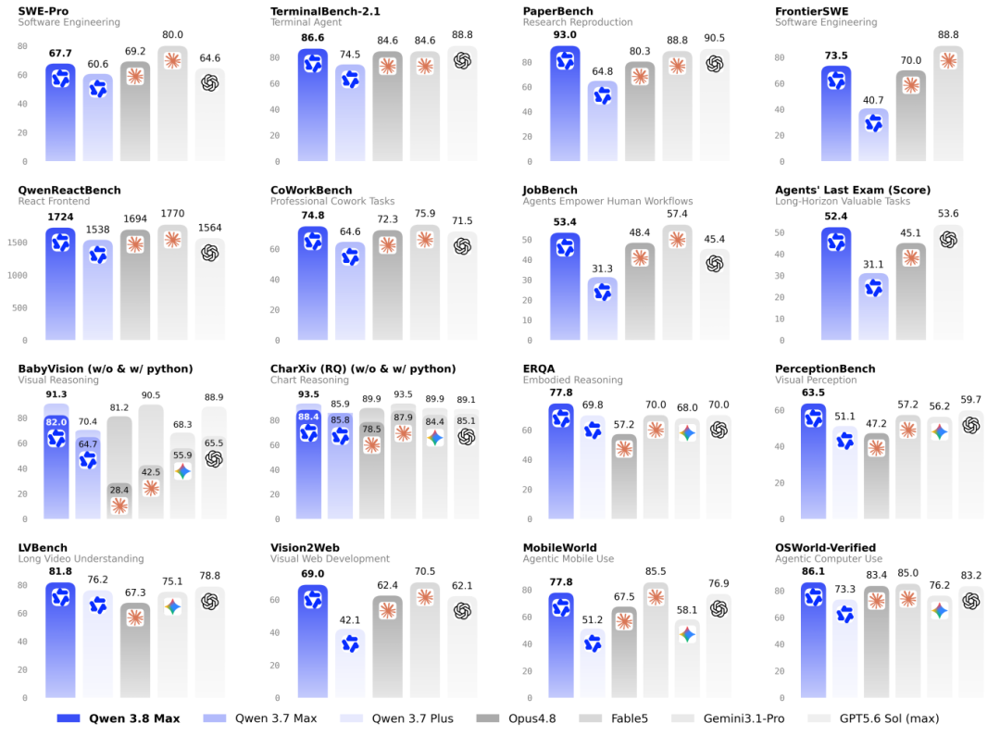

2026年8月13日，阿里云通义千问首次开源Qwen-Max级别的模型Qwen3.8。Qwen3.8 是通义千问最新旗舰级基础模型，采用 MoE 混合专家架构，总参数量达 2.4 万亿，支持 100 万 Token 超长上下文。模型在自主编程、跨领域专业任务及多模态理解上实现突破，可端到端交付复杂项目，横跨法律、金融、设计等数百个专业场景，并具备长文档、长视频的深度理解能力。同时，它支持长周期任务自主规划与闭环迭代进化，提供函数调用、上下文缓存、结构化输出等完整企业级工具链，为开发者与行业应用提供强大基座支撑。



vLLM 是 PyTorch Foundation 下的开源 LLM 推理引擎，为用户和开发者提供快速、易用的 LLM 推理能力，vLLM-Ascend提供了vLLM对昇腾的支持。本指南将帮助你使用 OpenAtom openEuler（简称：“openEuler”或“开源欧拉”）和 vLLM Ascend 在昇腾上运行 Qwen3.8。

本指南将采用 vLLM Ascend 的容器镜像启动方式，在4台昇腾 Atlas 800 A3 (128G × 8) 节点上运行 Qwen3.8。

## 步骤一：确保昇腾驱动正常安装

在拉起容器前，请先确保昇腾驱动已经正常安装，可使用 npu-smi info 命令进行查看。

## 步骤二：下载模型权重

Eco-Tech/Qwen3.8-2.4T-A95B-w8a8（量化权重）:<https://www.modelscope.cn/models/Eco-Tech/Qwen3.8-2.4T-A95B-w8a8>

## 步骤三：拉起 vLLM Ascend 容器运行环境

每台A3上均使用如下命令拉起 vLLM Ascend 容器运行环境：
```
export IMAGE=quay.io/ascend/vllm-ascend:qwen3.8-a3-openeuler
export NAME=vllm-ascend

docker run --rm \
  --name $NAME \
  --net=host \
  --shm-size=1g \
  --device /dev/davinci0 \
  --device /dev/davinci1 \
  --device /dev/davinci2 \
  --device /dev/davinci3 \
  --device /dev/davinci4 \
  --device /dev/davinci5 \
  --device /dev/davinci6 \
  --device /dev/davinci7 \
  --device /dev/davinci8 \
  --device /dev/davinci9 \
  --device /dev/davinci10 \
  --device /dev/davinci11 \
  --device /dev/davinci12 \
  --device /dev/davinci13 \
  --device /dev/davinci14 \
  --device /dev/davinci15 \
  --device /dev/davinci_manager \
  --device /dev/devmm_svm \
  --device /dev/hisi_hdc \
  -v /usr/local/dcmi:/usr/local/dcmi \
  -v /usr/local/Ascend/driver/tools/hccn_tool:/usr/local/Ascend/driver/tools/hccn_tool \
  -v /usr/local/bin/npu-smi:/usr/local/bin/npu-smi \
  -v /usr/local/Ascend/driver/lib64/:/usr/local/Ascend/driver/lib64/ \
  -v /usr/local/Ascend/driver/version.info:/usr/local/Ascend/driver/version.info \
  -v /etc/ascend_install.info:/etc/ascend_install.info \
  -v /root/.cache:/root/.cache \
  -it $IMAGE bash

```

## 步骤四：四机混部

在启动服务之前，替换`LOCAL_IP`, `NIC_NAME`, `PORT`, `RPC_PORT`:

1.`NIC_NAME` 必须是 `LOCAL_IP` 的网口

2.默认 Node 0 为主节点， Node 1~3 的 `NODE0_IP`必须设置为 Node 0的 `LOCAL_IP`

3.启动推理服务时, 为每个Worker分配一个唯一的 `DP_START_RANK`

### ● Node 0启动推理服务：
```
# Values that must be adapted to the target environment.
export MODEL_PATH=<QWEN3_8_MODEL_PATH>
export TOKENIZER_PATH=<QWEN3_8_TOKENIZER_PATH>
export LOCAL_IP=<NODE0_LOCAL_IP>
export NIC_NAME=<NODE0_NIC_NAME>
export PORT=<SERVICE_PORT>
export RPC_PORT=<DP_RPC_PORT>
export DP_SIZE=4
export TP_SIZE=16

export HCCL_IF_IP=$LOCAL_IP
export GLOO_SOCKET_IFNAME=$NIC_NAME
export TP_SOCKET_IFNAME=$NIC_NAME
export HCCL_SOCKET_IFNAME=$NIC_NAME
export VLLM_ENGINE_READY_TIMEOUT_S=7200
export VLLM_EXECUTE_MODEL_TIMEOUT_SECONDS=3000
export PYTORCH_NPU_ALLOC_CONF=expandable_segments:True
export HCCL_BUFFSIZE=1024
export HCCL_BUFFSIZE_EP=2048
export HCCL_INTRA_PCIE_ENABLE=1
export HCCL_INTRA_ROCE_ENABLE=0
export OMP_PROC_BIND=false
export OPENBLAS_NUM_THREADS=1
export HCCL_OP_EXPANSION_MODE="AIV"
export VLLM_ASCEND_ENABLE_FUSED_MC2=1
export ASCEND_RT_VISIBLE_DEVICES=0,1,2,3,4,5,6,7,8,9,10,11,12,13,14,15

vllm serve $MODEL_PATH \
    --host 0.0.0.0 \
    --port $PORT \
    --served-model-name qwen3.8 \
    --tokenizer $TOKENIZER_PATH \
    --trust-remote-code \
    --quantization ascend \
    --safetensors-load-strategy lazy \
    --tensor-parallel-size $TP_SIZE \
    --data-parallel-size $DP_SIZE \
    --data-parallel-size-local 1 \
    --data-parallel-address $LOCAL_IP \
    --data-parallel-rpc-port $RPC_PORT \
    --enable-prefix-caching \
    --enable-expert-parallel \
    --max-model-len 131072 \
    --max-num-seqs 8 \
    --max-num-batched-tokens 16384 \
    --gpu-memory-utilization 0.85 \
    --speculative-config '{"method":"qwen3_5_mtp","num_speculative_tokens":1}' \
    --compilation-config '{"cudagraph_mode":"FULL_DECODE_ONLY"}' \
    --additional-config '{"enable_cpu_binding":true,"enable_flashcomm1":false,"enable_fused_mc2":1}'

```
### ● Node 1,2,3 启动推理服务

在每个工作节点上运行运行以下命令，注意将 `LOCAL_IP` 和 `NIC_NAME`设置为每个节点对应的值,`DP_START_RANK` 与节点编号对应，分别设置为1、2、3

```
# Values that must be adapted to the target environment.
export MODEL_PATH=<QWEN3_8_MODEL_PATH>
export TOKENIZER_PATH=<QWEN3_8_TOKENIZER_PATH>
export LOCAL_IP=<WORKER_LOCAL_IP>
export NODE0_IP=<NODE0_LOCAL_IP>
export NIC_NAME=<WORKER_NIC_NAME>
export PORT=<SERVICE_PORT>
export RPC_PORT=<DP_RPC_PORT>
export DP_SIZE=4
export DP_START_RANK=<1_OR_2_OR_3>
export TP_SIZE=16

export HCCL_IF_IP=$LOCAL_IP
export GLOO_SOCKET_IFNAME=$NIC_NAME
export TP_SOCKET_IFNAME=$NIC_NAME
export HCCL_SOCKET_IFNAME=$NIC_NAME
export PYTORCH_NPU_ALLOC_CONF=expandable_segments:True
export VLLM_ENGINE_READY_TIMEOUT_S=7200
export VLLM_EXECUTE_MODEL_TIMEOUT_SECONDS=3000
export HCCL_BUFFSIZE=1024
export HCCL_BUFFSIZE_EP=2048
export HCCL_INTRA_PCIE_ENABLE=1
export HCCL_INTRA_ROCE_ENABLE=0
export OMP_PROC_BIND=false
export OPENBLAS_NUM_THREADS=1
export HCCL_OP_EXPANSION_MODE="AIV"
export VLLM_ASCEND_ENABLE_FUSED_MC2=1
export ASCEND_RT_VISIBLE_DEVICES=0,1,2,3,4,5,6,7,8,9,10,11,12,13,14,15

vllm serve $MODEL_PATH \
    --headless \
    --host 0.0.0.0 \
    --port $PORT \
    --served-model-name qwen3.8 \
    --tokenizer $TOKENIZER_PATH \
    --trust-remote-code \
    --quantization ascend \
    --safetensors-load-strategy lazy \
    --tensor-parallel-size $TP_SIZE \
    --data-parallel-size $DP_SIZE \
    --data-parallel-size-local 1 \
    --data-parallel-start-rank $DP_START_RANK \
    --data-parallel-address $NODE0_IP \
    --data-parallel-rpc-port $RPC_PORT \
    --enable-prefix-caching \
    --enable-expert-parallel \
    --max-model-len 131072 \
    --max-num-seqs 8 \
    --max-num-batched-tokens 16384 \
    --gpu-memory-utilization 0.85 \
    --speculative-config '{"method":"qwen3_5_mtp","num_speculative_tokens":1}' \
    --compilation-config '{"cudagraph_mode":"FULL_DECODE_ONLY"}' \
    --additional-config '{"enable_cpu_binding":true,"enable_flashcomm1":false,"enable_fused_mc2":1}'

```

## 步骤五：服务验证

在 Node0 上通过以下命令验证服务是否正常：

```
curl http://<server_ip>:8000/v1/chat/completions \
  -H "Content-Type: application/json" \
  -d '{
    "model": "qwen3.8",
    "messages": [
      {"role": "user", "content": "Write a Python function to merge two sorted linked lists."}
    ],
    "temperature": 1.0,
    "top_p": 0.95,
    "stream": true,
    "chat_template_kwargs": {
      "enable_thinking": true,
      "preserve_thinking": true
    }
  }'

```

