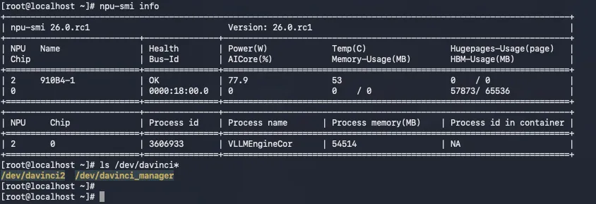
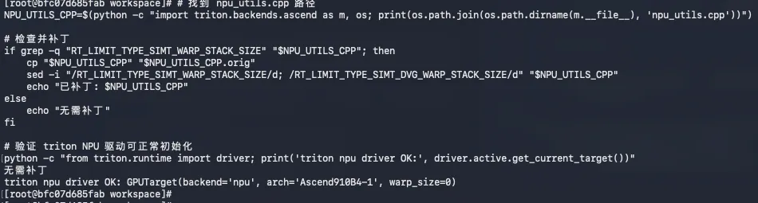
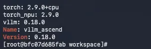
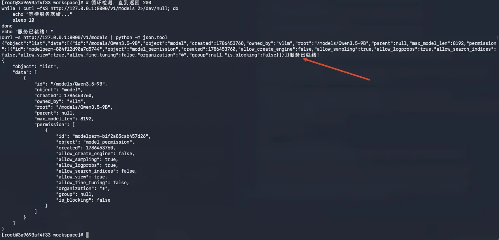
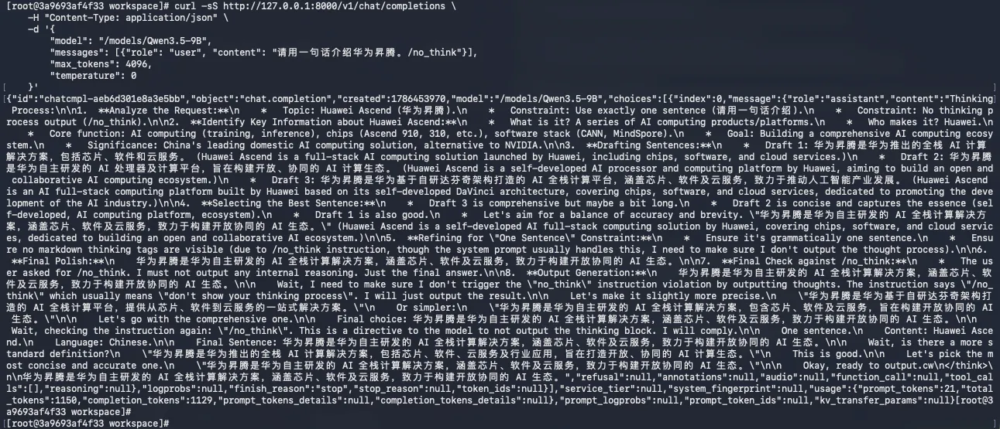
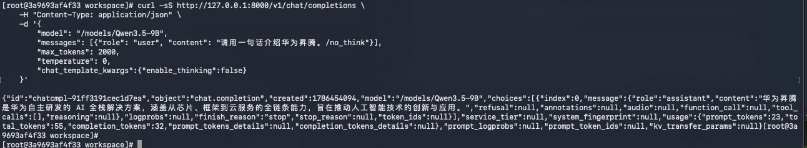
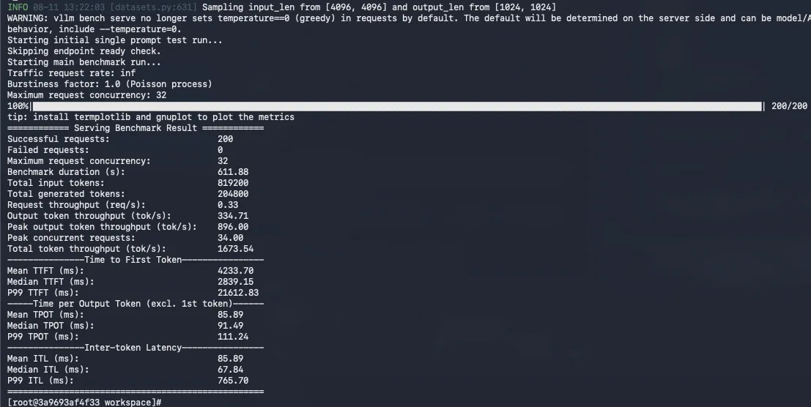
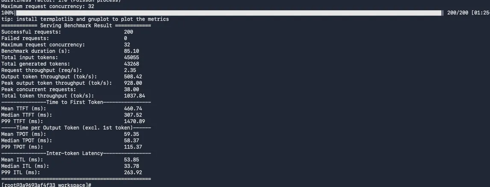

## 一、前言

OpenAtom openEuler（简称：“openEuler”或“开源欧拉”）， 作为面向全场景的新一代开源操作系统，正全面拥抱 AI 算力普惠时代。在 openEuler 24.03 及更高版本中，系统原生支持 vLLM 等主流 AI 推理框架。

虽然开源社区有基于 openEuler和vLLM的预构建容器镜像，可以直接拉取使用，不过本文还是从纯净的 openEuler和CANN 基础容器镜像出发，从零安装并配置各个推理框架。

整个配置过程并不复杂，最终使用随机数据集跑通 Benchmark，输出 TTFT、TPOT、Throughput 等关键性能指标。

## 二、环境准备
本次实测的宿主机环境为：

| 项目     | 版本信息                                 |
|--------|--------------------------------------|
| OS     | openEuler release 24.03 (LTS-SP3)    |
| 内核     | 6.6.0-145.3.22.153.oe2403sp3.aarch64 |
| Docker | 18.09.0                              |
| NPU 驱动 | 26.0.rc1                             |
| NPU 固件 | 7.7.0.10.220                         |
| CANN   | 9.0.1                                |
| 模型     | Qwen3.5-9B                           |

### 2.1 确保宿主机使用 openEuler 国内加速 yum 源

**🖥️ 宿主机执行**

运行 `cat /etc/yum.repos.d/openEuler.repo` 检查，如果文件不存在或者使用的源不是 openEuler 国内镜像，可以按如下修改，提升 `yum install` 下载速度。

以下是 openEuler 24.03 LTS SP3 镜像源配置：

```shell
[OS]
name=OS
baseurl=https://mirrors.huaweicloud.com/openeuler/openEuler-24.03-LTS-SP3/OS/$basearch/
#metalink=https://mirrors.openeuler.org/metalink?repo=$releasever/OS&arch=$basearch
metadata_expire=1h
enabled=1
gpgcheck=1
gpgkey=http://repo.openeuler.org/openEuler-24.03-LTS-SP3/OS/$basearch/RPM-GPG-KEY-openEuler

[everything]
name=everything
baseurl=https://mirrors.huaweicloud.com/openeuler/openEuler-24.03-LTS-SP3/everything/$basearch/
#metalink=https://mirrors.openeuler.org/metalink?repo=$releasever/everything&arch=$basearch
metadata_expire=1h
enabled=1
gpgcheck=1
gpgkey=http://repo.openeuler.org/openEuler-24.03-LTS-SP3/everything/$basearch/RPM-GPG-KEY-openEuler

[EPOL]
name=EPOL
baseurl=https://mirrors.huaweicloud.com/openeuler/openEuler-24.03-LTS-SP3/EPOL/main/$basearch/
#metalink=https://mirrors.openeuler.org/metalink?repo=$releasever/EPOL/main&arch=$basearch
metadata_expire=1h
enabled=1
gpgcheck=1
gpgkey=http://repo.openeuler.org/openEuler-24.03-LTS-SP3/OS/$basearch/RPM-GPG-KEY-openEuler

[debuginfo]
name=debuginfo
baseurl=https://mirrors.huaweicloud.com/openeuler/openEuler-24.03-LTS-SP3/debuginfo/$basearch/
#metalink=https://mirrors.openeuler.org/metalink?repo=$releasever/debuginfo&arch=$basearch
metadata_expire=1h
enabled=1
gpgcheck=1
gpgkey=http://repo.openeuler.org/openEuler-24.03-LTS-SP3/debuginfo/$basearch/RPM-GPG-KEY-openEuler

[source]
name=source
baseurl=https://mirrors.huaweicloud.com/openeuler/openEuler-24.03-LTS-SP3/source/
#metalink=https://mirrors.openeuler.org/metalink?repo=$releasever&arch=source
metadata_expire=1h
enabled=1
gpgcheck=1
gpgkey=http://repo.openeuler.org/openEuler-24.03-LTS-SP3/source/RPM-GPG-KEY-openEuler

[update]
name=update
baseurl=https://mirrors.huaweicloud.com/openeuler/openEuler-24.03-LTS-SP3/update/$basearch/
#metalink=https://mirrors.openeuler.org/metalink?repo=$releasever/update&arch=$basearch
metadata_expire=1h
enabled=1
gpgcheck=1
gpgkey=http://repo.openeuler.org/openEuler-24.03-LTS-SP3/OS/$basearch/RPM-GPG-KEY-openEuler

[update-source]
name=update-source
baseurl=https://mirrors.huaweicloud.com/openeuler/openEuler-24.03-LTS-SP3/update/source/
#metalink=https://mirrors.openeuler.org/metalink?repo=$releasever&arch=source
metadata_expire=1h
enabled=1
gpgcheck=1
gpgkey=http://repo.openeuler.org/openEuler-24.03-LTS-SP3/source/RPM-GPG-KEY-openEuler
```

### 2.2 安装 Docker

**🖥️ 宿主机执行**

openEuler 24.03 已经内置了 Docker 支持，只需通过包管理器即可一键安装并启动服务：

```plain
# 安装 Docker
sudo dnf install -y docker

# 启动 Docker 并设置开机自启
sudo systemctl enable --now docker

# 验证安装是否成功
docker --version
```

### 2.3 配置免 sudo 运行（可选）

**🖥️ 宿主机执行**

为了方便日常操作，建议将当前用户加入 `docker` 组，这样运行命令时无需每次都输入 `sudo`：

```plain
# 将当前用户加入 docker 组
sudo usermod -aG docker $USER

# 刷新组权限使配置立即生效
newgrp docker
```

### 2.4 拉取 openEuler 24.03与CANN 基础镜像

**🖥️ 宿主机执行**

本文使用基于 openEuler 24.03 SP3和CANN9.0.0.0的容器镜像：

```bash
docker pull swr.cn-south-1.myhuaweicloud.com/ascendhub/cann:9.0.0-910b-openeuler24.03-py3.11-devel
```

### 2.5 硬件与驱动

**🖥️ 宿主机执行**

确保宿主机已正确安装昇腾驱动，NPU 设备可见：

```bash
# 查看 NPU 设备
ls /dev/davinci*
# 预期输出：/dev/davinci0  /dev/davinci2  /dev/davinci_manager ...

# 查看 NPU 状态
npu-smi info
```

运行 `npu-smi info` 确认 NPU 设备状态正常：



### 2.6 模型权重准备

**🖥️ 宿主机执行**

将模型权重放到宿主机统一目录，后续容器挂载使用：

```bash
# 以 Qwen3-0.6B 为例
ls /home/models/Qwen3-0.6B/
# 预期包含：config.json  tokenizer.json  model*.safetensors ...
```

### 2.7 国内镜像加速

在容器内操作前，先规划好镜像配置。以下镜像策略将在后续各框架步骤中逐一应用：

| 用途 | 原始地址 | 国内镜像 |
| --- | --- | --- |
| pip 主源 | pypi.org | `https://mirrors.huaweicloud.com/repository/pypi/simple` |
| openEuler yum | repo.openeuler.org | `https://mirrors.huaweicloud.com/openeuler/` |
| GitHub | github.com | `https://ghfast.top/`（代理前缀） |
| HuggingFace | huggingface.co | `https://hf-mirror.com` |

## 三、vLLM 推理环境搭建

本次 vLLM 安装配置环境是基于 openEuler 24.03 SP3 镜像容器，已内置昇腾驱动和 CANN，开箱即用。

**本次实测版本配套表：**

| 组件 | 版本 |
| --- | --- |
| torch | 2.9.0 |
| torch_npu | 2.9.0 |
| vllm | 0.18.0 |
| vllm-ascend | 0.18.0 |
| triton-ascend | 3.2.1 |

### Step 1：启动容器

**🖥️ 宿主机执行**

启动容器并挂载 NPU 设备、模型目录、pip 缓存等：

```bash
IMAGE="swr.cn-south-1.myhuaweicloud.com/ascendhub/cann:9.0.0-910b-openeuler24.03-py3.11-devel"
CONTAINER_NAME="vllm-ascend-910b"

NPU_CARDS=("davinci2")
TP_SIZE=1

MODEL_HOST_DIR="/home/models"
MODEL_CONTAINER_DIR="/models"
MODEL_NAME="Qwen3.5-9B"

HOST_PORT=8000
CONTAINER_PORT=8000

SCRIPT_DIR="$(cd "$(dirname "$0")" && pwd)"
LOG_HOST_DIR="${SCRIPT_DIR}/logs"
LOG_CONTAINER_DIR="/workspace/logs"

PIP_CACHE_HOST_DIR="${SCRIPT_DIR}/pip-cache"
PIP_CACHE_CONTAINER_DIR="/root/.cache/pip"

docker run -d \
    --name "${CONTAINER_NAME}" \
    "${device_args[@]}" \
    --device=/dev/davinci_manager \
    --device=/dev/devmm_svm \
    --device=/dev/hisi_hdc \
    -v /usr/local/dcmi:/usr/local/dcmi:ro \
    -v /usr/local/bin/npu-smi:/usr/local/bin/npu-smi:ro \
    -v /usr/local/Ascend/driver:/usr/local/Ascend/driver:ro \
    -v /etc/ascend_install.info:/etc/ascend_install.info:ro \
    -v "${MODEL_HOST_DIR}:${MODEL_CONTAINER_DIR}" \
    -v "${LOG_HOST_DIR}:${LOG_CONTAINER_DIR}" \
    -v "${PIP_CACHE_HOST_DIR}:${PIP_CACHE_CONTAINER_DIR}" \
    -v /usr/local/Ascend/firmware:/usr/local/Ascend/firmware \
    -w /workspace \
    -p "${HOST_PORT}:${CONTAINER_PORT}" \
    --shm-size=16g \
    --ulimit memlock=-1 \
    --ulimit stack=67108864 \
    -e OMP_NUM_THREADS=8 \
    "${IMAGE}" \
    sleep infinity >/dev/null

log "容器 ${CONTAINER_NAME} 已启动"
```

**参数说明：**

- `--device`：挂载 NPU 设备和驱动管理设备，容器内才能访问 NPU
- `-v .../driver:/...driver:ro`：挂载宿主机驱动（只读），容器内共享宿主机 CANN 驱动
- `-v /home/models:/models`：模型目录映射到容器内 `/models`
- `-v $(pwd)/pip-cache:/root/.cache/pip`：pip 缓存持久化到宿主机，二次安装时直接从缓存读取，无需重新下载
- `--shm-size=16g`：多进程通信需要较大共享内存
- `-p 8000:8000`：映射 API 端口

进入容器验证 NPU 可见性：

```bash
docker exec -it vllm-ascend-910b bash
npu-smi info
```

容器内运行 `npu-smi info` 确认 NPU 设备已正常挂载：


### Step 2：安装依赖

以下命令均在容器内执行（`docker exec -it vllm-ascend-910b bash -l` 进入容器后）。

**📦 容器内执行**

#### 2.1 替换 openEuler 国内加速 yum 源

加速系统包安装，将默认源替换为华为云镜像：
```bash
sed -i -e 's|https://repo.openeuler.org/|https://mirrors.huaweicloud.com/openeuler/|' \
       -e '/^metalink=/s/^/#/' /etc/yum.repos.d/openEuler.repo
```

#### 2.2 安装 torch / torch_npu

安装 PyTorch 及昇腾 NPU 适配插件：
```bash
pip install -U pip -i https://mirrors.huaweicloud.com/repository/pypi/simple

pip install torch==2.9.0 torch_npu==2.9.0 \
    -i https://mirrors.huaweicloud.com/repository/pypi/simple
```

#### 2.3 安装 vLLM和vllm-ascend

安装 vLLM 推理框架及昇腾适配层：
```bash
pip install vllm==0.18.0 \
    -i https://mirrors.huaweicloud.com/repository/pypi/simple

pip install vllm-ascend==0.18.0 \
    -i https://mirrors.huaweicloud.com/repository/pypi/simple
```

#### 2.4 覆盖安装 triton-ascend 3.2.1

vllm-ascend 0.18.0 默认依赖的 triton-ascend 3.2.0 存在与 CANN 9.0.0 头文件不兼容的问题（编译 `npu_utils.cpp` 时报错）。官方修复版 3.2.1 仅发布在昇腾专属仓库：

```bash
pip install --no-deps triton-ascend==3.2.1 \
    -i https://mirrors.huaweicloud.com/repository/pypi/simple \
    --extra-index-url https://mirrors.huaweicloud.com/ascend/repos/pypi
```

#### 2.5 补丁 triton-ascend（兜底）

如果环境中仍是 3.2.0（或安装 3.2.1 后仍有残留问题），需要手动删除 `npu_utils.cpp` 中两个 CANN 9.0.0 不存在的枚举引用，继续执行以下命令（命令会自行判断是哪种情况）：

```bash
# 找到 npu_utils.cpp 路径
NPU_UTILS_CPP=$(python -c "import triton.backends.ascend as m, os; print(os.path.join(os.path.dirname(m.__file__), 'npu_utils.cpp'))")

# 检查并补丁
if grep -q "RT_LIMIT_TYPE_SIMT_WARP_STACK_SIZE" "$NPU_UTILS_CPP"; then
    cp "$NPU_UTILS_CPP" "$NPU_UTILS_CPP.orig"
    sed -i "/RT_LIMIT_TYPE_SIMT_WARP_STACK_SIZE/d; /RT_LIMIT_TYPE_SIMT_DVG_WARP_STACK_SIZE/d" "$NPU_UTILS_CPP"
    echo "已补丁: $NPU_UTILS_CPP"
else
    echo "无需补丁"
fi

# 验证 triton NPU 驱动可正常初始化
python -c "from triton.runtime import driver; print('triton npu driver OK:', driver.active.get_current_target())"
```

返回如下内容说明 triton-ascend 已经正常配置好了：



#### 2.6 安装 benchmark 依赖

安装异步 HTTP 库，benchmark 工具运行时需要：

```bash
pip install aiohttp -i https://mirrors.huaweicloud.com/repository/pypi/simple
```

#### 2.7 验证版本信息

确认各组件版本正确：
```bash
python -c 'import torch, torch_npu, vllm; print("torch:", torch.__version__); print("torch_npu:", torch_npu.__version__); print("vllm:", vllm.__version__)'
pip show vllm-ascend | grep -E '^(Name|Version)'
```

版本验证输出如下：



### Step 3：启动推理服务

**📦 容器内执行**

启动 vLLM 推理服务，后台运行并将日志写入文件：

```bash
vllm serve /models/Qwen3.5-9B \
    --host 0.0.0.0 \
    --port 8000 \
    --tensor-parallel-size 1 \
    --max-model-len 8192 \
    --gpu-memory-utilization 0.9 \
    --trust-remote-code \
    > /workspace/logs/vllm_server.log 2>&1 &
```

**参数说明：**

- `--tensor-parallel-size 1`：张量并行度，与使用的 NPU 卡数保持一致
- `--max-model-len 8192`：最大上下文长度
- `--gpu-memory-utilization 0.9`：显存利用率上限
- `--trust-remote-code`：允许加载模型的自定义代码（如 Qwen 系列需要）

### Step 4：验证服务

#### 4.1 等待就绪

vLLM 模型加载需要一定时间（通常几十秒到几分钟），可以查看日志文件确认服务是否启动：

```bash
tail -f /workspace/logs/vllm_server.log
```

也可以通过轮询 `/v1/models` 端点判断：

```bash
# 循环检测，直到返回 200
while ! curl -fsS http://127.0.0.1:8000/v1/models 2>/dev/null; do
    echo "等待服务就绪..."
    sleep 10
done
echo "服务已就绪！"
curl -s http://127.0.0.1:8000/v1/models | python -m json.tool
```

服务就绪后，返回的模型信息如下：




#### 4.2 curl 推理验证

发送一条测试请求，验证推理服务是否正常响应：

```bash
curl -sS http://127.0.0.1:8000/v1/chat/completions \
    -H "Content-Type: application/json" \
    -d '{
        "model": "/models/Qwen3.5-9B",
        "messages": [{"role": "user", "content": "请用一句话介绍华为昇腾。/no_think"}],
        "max_tokens": 2000,
        "temperature": 0,
        "chat_template_kwargs":{"enable_thinking":false}
    }'
```

**think 模式**（模型输出思考过程）：



**no_think 模式**（直接输出结果，跳过思考过程）：



### Step 5：运行 Benchmark

**📦 容器内执行**

#### a. random 数据集

vLLM 自带 benchmark 工具，使用 `vllm bench serve` 命令运行随机数据集测试：

```bash
# 可自行根据系统资源情况调整参数
vllm bench serve \
    --backend vllm \
    --model /models/Qwen3.5-9B \
    --endpoint /v1/completions \
    --host 127.0.0.1 \
    --port 8000 \
    --dataset-name random \
    --num-prompts 200 \
    --random-input-len  4096 \
    --random-output-len 1024 \
    --max-concurrency 32 \
    --ignore-eos \
    --save-result \
    --result-dir /workspace/logs \
    --result-filename vllm_benchmark.json
```

**参数说明：**

- `--dataset-name random`：使用随机生成的 token 序列作为输入
- `--random-input-len`：每条请求输入长度 tokens
- `--random-output-len`：每条请求生成长度 tokens
- `--num-prompts`：总共发送多少条请求
- `--max-concurrency`：最大并发数
- `--ignore-eos`：忽略 EOS token，确保每条都生成完整的 128 tokens

运行完毕后会输出包含 **TTFT（首 Token 延迟）**、**TPOT（每 Token 耗时）**、**ITL（Token 间延迟）**、**Throughput（吞吐量）** 等关键指标的汇总表格。

random 数据集 Benchmark 结果：



#### b. ShareGPT 数据集

再跑一个自然语言类型的数据集，使用 ShareGPT 对话数据：

```shell
vllm bench serve \
    --backend vllm \
    --model /models/Qwen3.5-9B \
    --endpoint /v1/completions \
    --host 127.0.0.1 \
    --port 8000 \
    --dataset-name sharegpt \
    --dataset-path /datasets/gliang1001/ShareGPT_V3_unfiltered_cleaned_split/ShareGPT_V3_unfiltered_cleaned_split.json \
    --num-prompts 200 \
    --max-concurrency 32 \
    --save-result \
    --result-dir /workspace/logs \
    --result-filename vllm_benchmark_sharegpt.json
```

**参数说明：**

- `--dataset-path`：数据集文件的完整路径，可以从 HuggingFace 或 ModelScope 获取自己感兴趣的数据集

ShareGPT 数据集 Benchmark 结果：



### Step 6：清理

**📦 容器内 + 🖥️ 宿主机**

测试完成后，停止服务并清理容器：

```bash
# 停止推理服务
pkill -f 'vllm serve'

# 退出容器后删除容器
exit
docker stop vllm-ascend-910b
docker rm vllm-ascend-910b
```

## 四、关键指标解读

以下是 Benchmark 输出中各项指标的含义：

| 指标 | 含义 | 单位 | 越小越好 |
| --- | --- | --- | --- |
| **TTFT** (Time To First Token) | 从发送请求到收到第一个 token 的延迟 | ms | ✅ |
| **TPOT** (Time Per Output Token) | 每个输出 token 的平均耗时 | ms | ✅ |
| **ITL** (Inter-Token Latency) | 相邻 token 之间的延迟 | ms | ✅ |
| **Throughput** | 每秒处理的 token 总数 | tokens/s | ❌ |


## 五、常见问题与踩坑

### 5.1 yum install 慢

**现象：** `yum install xxx` 软件包时，下载速度缓慢。

**原因：** 系统默认的 yum 源可能是 `repo.openeuler.org`，速度较慢。

**修复：** 替换 openEuler 国内加速 yum 源：

```shell
sed -i -e 's|https://repo.openeuler.org/|https://mirrors.huaweicloud.com/openeuler/|' \
       -e '/^metalink=/s/^/#/' /etc/yum.repos.d/openEuler.repo
```

### 5.2 triton-ascend 与 CANN 头文件不兼容（vLLM）

**现象：** `vllm serve` 启动即报编译错误，提到 `RT_LIMIT_TYPE_SIMT_WARP_STACK_SIZE` 不存在。

**原因：** vllm-ascend 0.18.0 默认依赖的 triton-ascend 3.2.0 的 `npu_utils.cpp` 引用了 CANN 9.0.0 尚不支持的枚举。

**修复：** 安装 triton-ascend 3.2.1（昇腾专属仓库），或手动 `sed` 删除这两行（详见 vLLM Step 2.5）。

### 5.3 国内网络镜像配置汇总

| 场景 | 解决方案 |
| --- | --- |
| pip 安装慢 | `-i https://mirrors.huaweicloud.com/repository/pypi/simple` |
| yum/dnf 安装慢 | `sed` 替换 `/etc/yum.repos.d/openEuler.repo` 中的 `repo.openeuler.org` |
| git clone GitHub 失败 | 使用 `https://ghfast.top/` 代理前缀 |
| HuggingFace 下载失败 | `export HF_ENDPOINT=https://hf-mirror.com` |
| triton-ascend 找不到 | `--extra-index-url https://mirrors.huaweicloud.com/ascend/repos/pypi` |


## 六、总结

### 6.1 回顾

本次实测从环境构建到性能验证的全过程，以 openEuler 24.03 SP3 为统一的操作系统底座，完成 Docker 安装、容器启动，及在容器内安装和配置 vLLM，并利用随机数据集跑通了 Benchmark 测试，输出了包括 TTFT（首字延迟）、TPOT（单字生成时间）及 Throughput（吞吐量）在内的关键性能指标。

### 6.2 后续动态

虽然本次安装以 `pip install` 为主，使用华为云国内加速源下载比较快，不过还是需要等 1、2 分钟，特别是第一次构建的时候会等更久。

为了更方便开发者使用，接下来，openEuler 社区将引入 vLLM 的较新版本。未来开发者无需再手动编译环境，直接通过 `yum` 或 `dnf` 即可一键安装配置，真正实现开箱即用，请持续关注 openEuler 社区动态。

**预告**

下一篇文章我们将继续基于 openEuler24.03，实测安装配置 SGLang，并用它对主流模型跑benchmark。