## 背景介绍

xlite 是面向昇腾（Ascend）NPU 的高性能推理算子库与推理加速引擎，通过 vllm\-ascend 接入 vLLM 生态，为大模型在昇腾硬件上的部署提供底层算子优化与图融合能力。简单来说，vLLM 负责调度与服务，vllm\-ascend 负责昇腾适配，而 xlite 则专注于把每一个算子、每一条计算链路在 NPU 上跑到极致。

为提升 xlite 性能优化效率，，面对复杂的代码结构与优化路径，借助了OpenAtom openEuler（简称：“openEuler”或“开源欧拉”）社区开源的 [xlite\-perf\-optimizer\-bundle](https://atomgit.com/openeuler/witty-agents/tree/master/xlite-perf-optimizer-bundle) 智能体。通过部署 [xlite\-perf\-optimizer\-bundle](https://atomgit.com/openeuler/witty-agents/tree/master/xlite-perf-optimizer-bundle) ，在 openEuler 环境中实现了算子分析、开发与验证流程的自动化执行，大幅降低了上手门槛并加速了优化进程。

本文证明了Witty不仅能做智能故障诊断，在大模型性能调优方面也很有潜力。

## xlite\-perf\-optimizer\-bundle 是什么，能做什么

xlite\-perf\-optimizer\-bundle 是 witty\-agents 集合中专门面向 xlite 性能优化的 Agent，它不是一个简单的聊天机器人，而是内置了多个专业 Skill 的性能优化专家：能自动读源码、分析 profiling 数据、估算时间复杂度、编写 AscendC 算子、编译测试、生成性能报告，甚至在优化无效时自动回退代码。换句话说，它把资深工程师做性能优化的整套方法论沉淀成了Agent 工作流。

以下是它的核心能力：

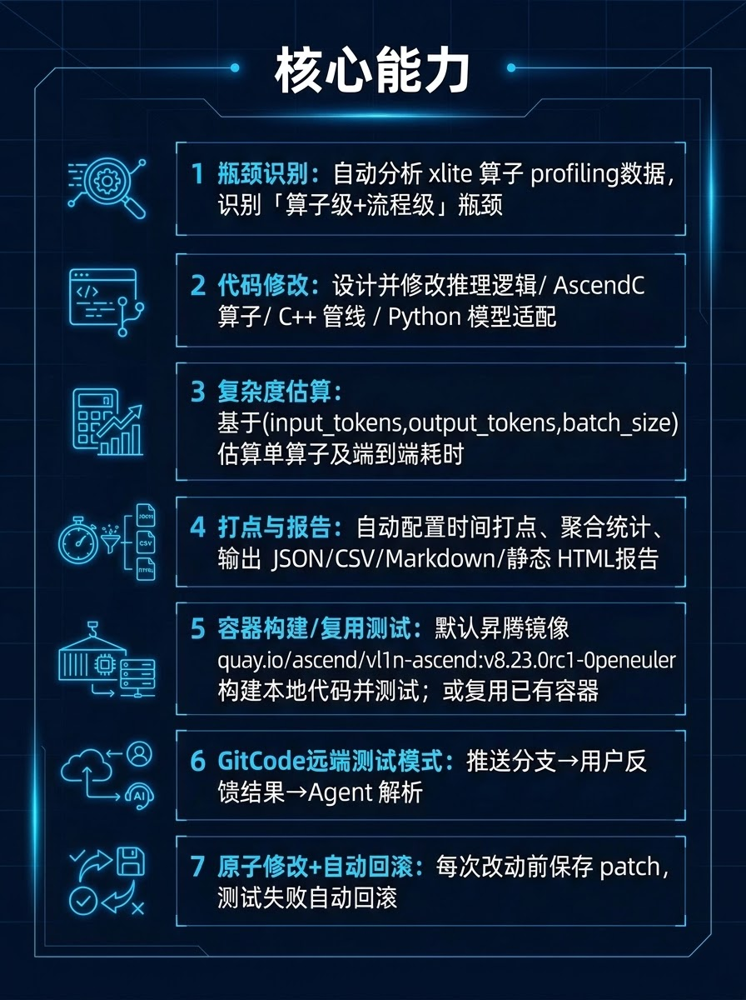

## xlite\-perf\-optimizer\-bundle与 witty 的关系

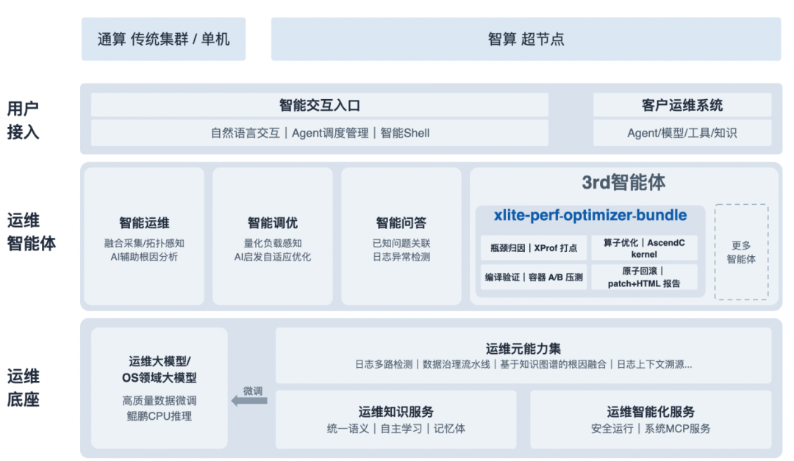

xlite\-perf\-optimizer\-bundle是witty运维智能体中，3rd智能体的一员。witty内置智能运维/智能调优/智能问答三类通用智能体，3rd智能体面向第三方客制化能力开放接入。 

本次优化主要用到了 xlite\-perf\-optimizer\-bundle 中以下部分 MCP 服务和 Skill：

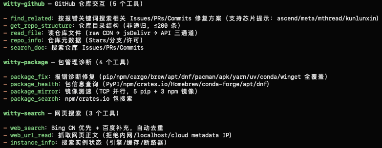

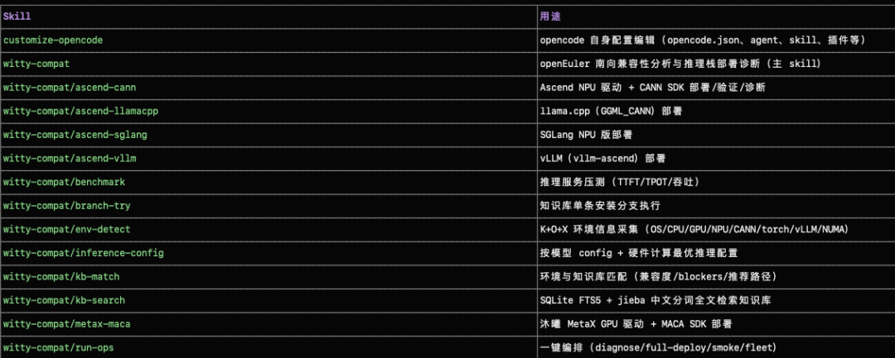

这里把 xlite\-perf\-optimizer\-bundle 部署到 openEuler 系统上，运行时采用开源的 opencode 作为 Agent 执行框架，借助以上列出的agent的能力，让它辅助优化 xlite。

本次选择Qwen3\.5\-27B 作为优化目标，是因为它相比前代模型在架构上有较大变化（如 MoE 路由、新的注意力机制等），而 xlite 需要充分适配这些新特性，才能让模型在昇腾上发挥出应有的性能优势。

## 环境清单

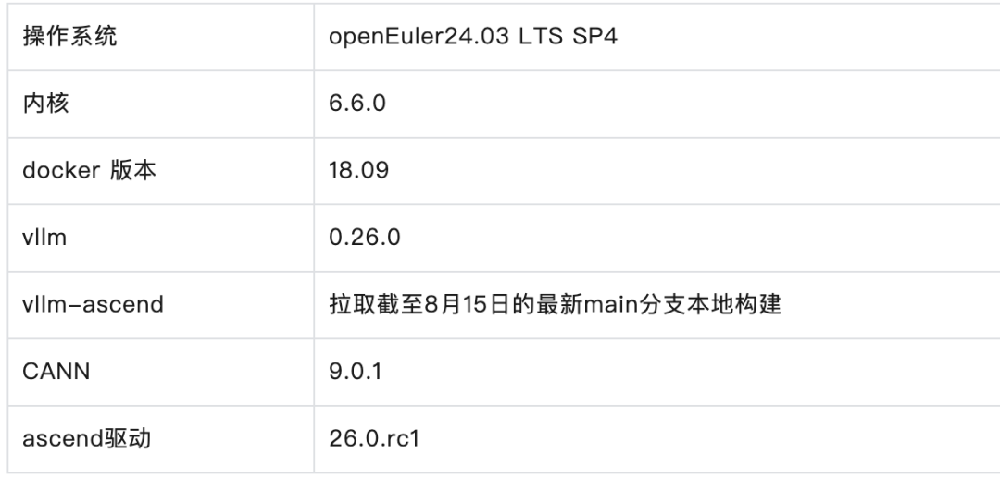

在本次实战中，openEuler 扮演的角色远不止是一个基础的操作系统。它实际上为“AI 自动优化 AI”提供了坚实的基础设施底座。

传统的操作系统主要关注资源调度与硬件兼容，而 openEuler 正在向 AI\-Native OS 演进。它不仅提供了稳定高效的运行环境，更通过开源社区构建了完善的 Agent 基础设施

## 实操过程

### 环境搭建

本次环境选用 openEuler 24\.03\-LTS\-SP4 镜像，它对昇腾软硬件栈有良好的原生支持，其中已预装 CANN 和 Python 3\.12 环境，然后在容器内让 Agent自己根据项目地址[https://atomgit\.com/openeuler/witty\-agents](https://atomgit.com/openeuler/witty-agents) 安装好[witty](https://atomgit.com/openeuler/witty-agents)和xlite\-perf\-optimizer\-bundle即可。

### 开始迭代

#### 制定计划

通常，优化方向需要由熟悉项目的工程师根据经验来制定。如果缺乏这方面的积累——这恰恰是 xlite\-perf\-optimizer\-bundle 发挥价值的地方：这里就直接让 Agent 自己识别瓶颈并制定优化计划。它输出了一份Todo清单，按预期收益排序，开发人员只需确认优先级即可开工。

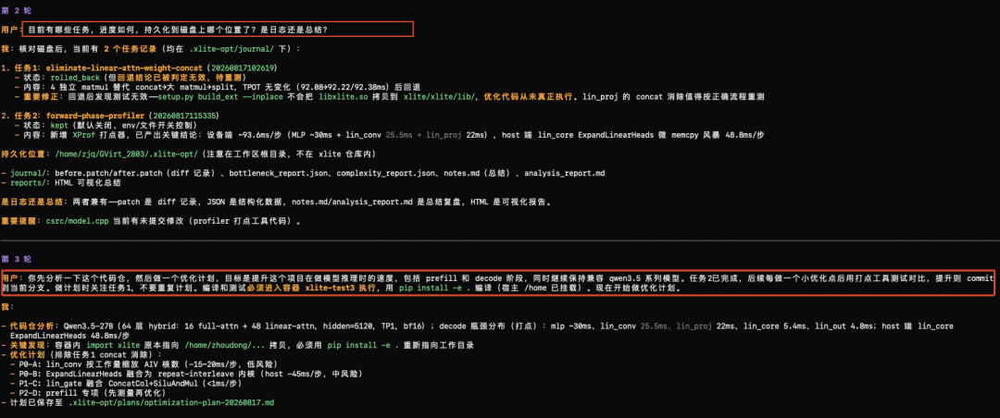

#### 按计划开发

xlite\-perf\-optimizer\-bundle 严格遵循"原子修改"原则：每次只聚焦一个优化点，开发完成后立即编译测试并输出性能报告。如果验证有性能提升就保留代码，自动进入下一个优化点；如果性能退化或测试失败，则自动回退并记录原因，继续尝试其他方向。整个"开发—测试—决策"循环由 Agent 自主闭环完成。

当然，上述工作流并非一次性配置到位，而是在多轮对话中逐步打磨出来的——发现哪里不符合预期就指出来，xlite\-perf\-optimizer\-bundle 能记住这些偏好和习惯，例如：

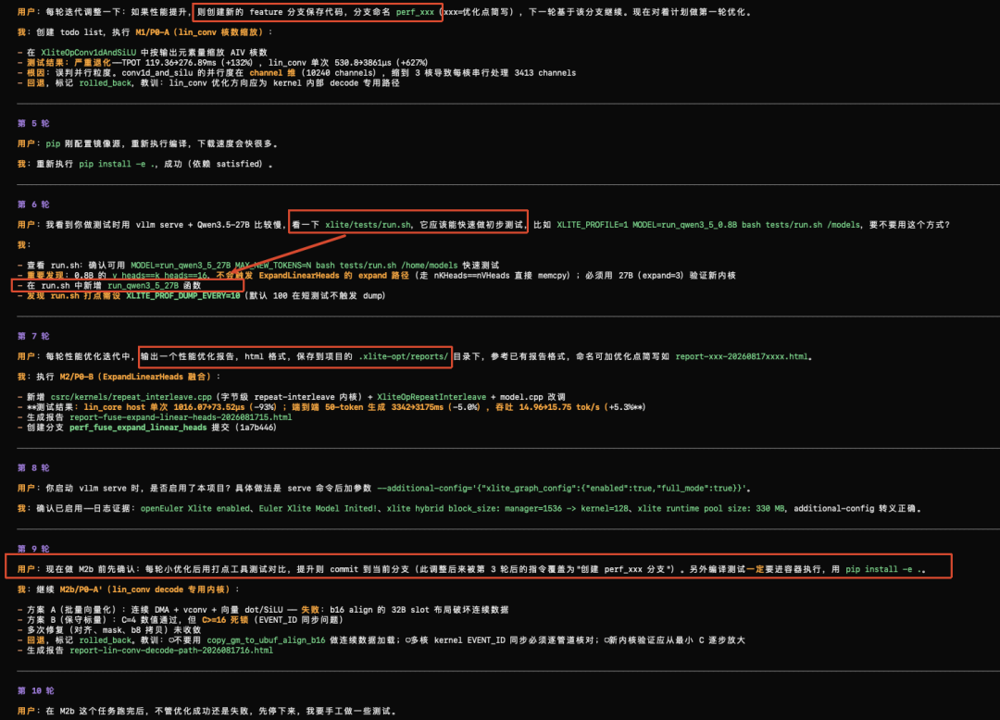

由于在 agent\.md 中明确了编译和测试方式，xlite\-perf\-optimizer\-bundle 基本能把代码改对。即使遇到编译失败或运行时异常，它也能自己读取报错信息、定位问题并修复，无需人工介入——这是它相比传统"AI 写代码"工具最大的不同：不只是生成代码，而是能自主完成"写代码—跑测试—修 bug"的完整迭代。

#### 代码验收

每轮优化结束后，xlite\-perf\-optimizer\-bundle 会自动生成一份 HTML 性能测试报告。开发人员需要做的就是查看这份报告，判断其中的结论是否可信。由于在配置中明确要求了输出报告，每一轮优化都会有类似这样的可视化结果：

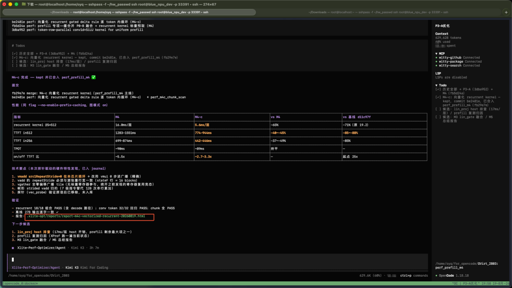

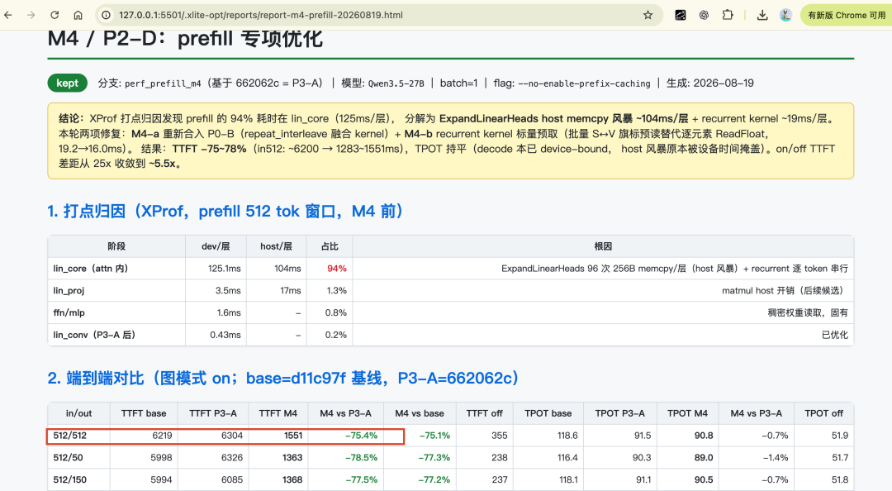

需要说明的是，这并非严格意义上的性能基准测试，而是在统一环境和测试规格下，用来直观体现 xlite\-perf\-optimizer\-bundle 优化前后性能变化趋势的手段。

从报告中可以快速了解本轮优化在哪些环节有提升、提升了多少。虽然个别细节可能不够精确，但大方向是可靠的——再辅以手工测试验证，等到所有优化点对应的分支都合并到一起后，做一次完整的性能回归，顺便解决各分支可能遗留的冲突和问题。整体下来，这种"Agent 批量探索 \+ 人工精准验收"的模式，比传统逐行手搓要高效得多。

## 优化成果:TTFT提速 80\+%

整个优化过程就是不断重复以下循环：xlite\-perf\-optimizer\-bundle 按计划攻克一个优化点 → 自主完成开发、编译、测试并输出报告 → 人工查看报告（必要时手工验证） → 确认合入或回退 → 自动进入下一个优化点。

最终本次主要的优化点完成后，所有分支合并到一起，整体性能提升对比基线如下**，512/512 TTFT 速度提升84\.8%**：

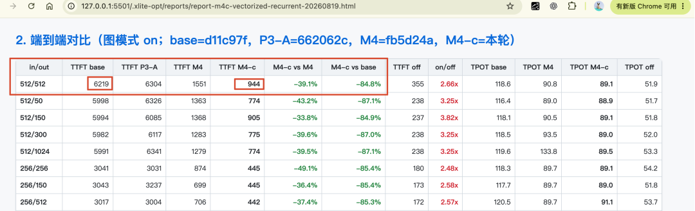

可以看出 TTFT虽然还有挺大的优化空间，但对比基线代码，已经有非常明显的降低了，在 512/512的in/out长度下，相比基线，速度提升了**84\.8%**。

当然，xlite\-perf\-optimizer\-bundle 也不是万能的。有时它会在某个优化点上难以收敛，在零收益和负优化之间反复横跳。比如下面这个案例：

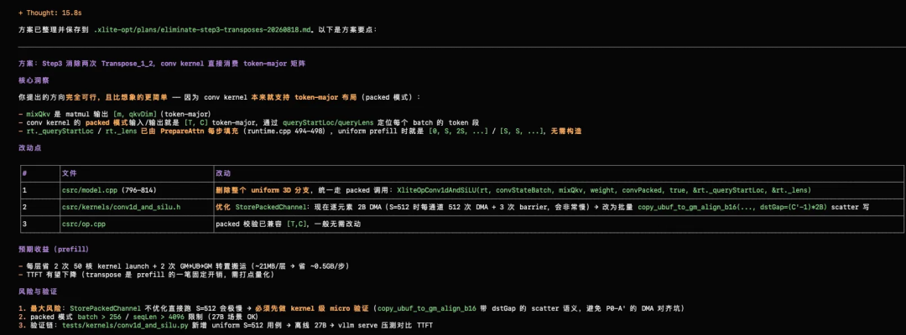

从逻辑上分析，取消两次 Tensor 转置操作，多层累积下来应该有明显提升。但 xlite\-perf\-optimizer\-bundle 在实际尝试中，只是在以下两个版本之间来回切换，始终找不到更优的实现：

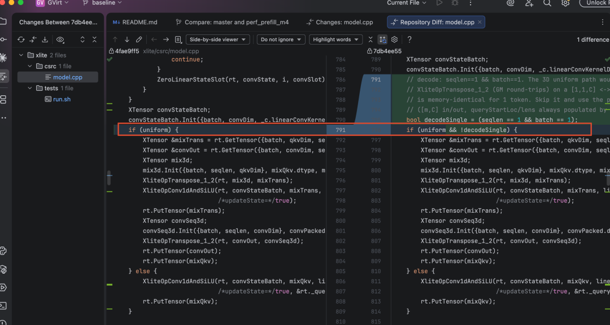

端到端测试（vllm bench serve，random，input/output: 512/512，Qwen3\.5\-27B，910B x 1 卡）显示，性能变化微乎其微。

这里怀疑是底层模型的推理能力不足以支撑更复杂的优化策略，于是更换了能力更强的 Kimi K3 作为 xlite\-perf\-optimizer\-bundle 的推理后端：

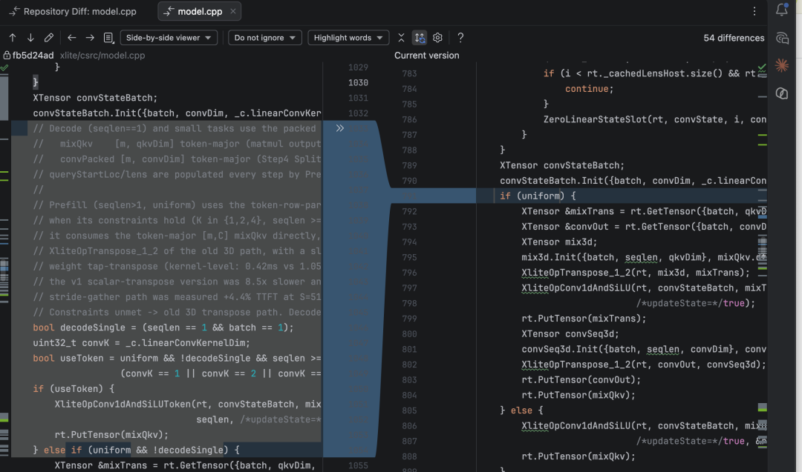

换用 Kimi K3 后，xlite\-perf\-optimizer\-bundle 不仅将优化逻辑拆解得更细，还一并实现了 `XliteOpConv1dAndSiLUToken` 函数依赖的底层算子，最终突破了之前的瓶颈。

## 总结

回顾这次优化经历，xlite\-perf\-optimizer\-bundle 带给人的最大感受是：它不只是一个"帮写代码"的工具，而是一个完整的"性能优化工程师替身"。从瓶颈分析、方案设计、编码实现到编译测试、报告生成、自动回退，它把性能优化中最耗时、最重复的环节全部自动化了。

对新手而言，它降低了入门门槛——不必先花几周吃透代码库，就能让 Agent 带着你定位问题、验证想法；对资深工程师，它把精力从繁琐迭代中解放出来，专注架构决策。它也有局限：复杂优化点的收敛依赖底层模型能力，深层瓶颈仍需人工洞察。但 xlite\-perf\-optimizer\-bundle 所代表的方向——把领域专家的经验沉淀为可复用的 Agent 工作流——值得每一个开发者关注。

