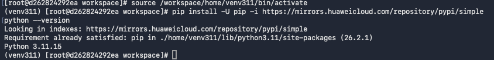
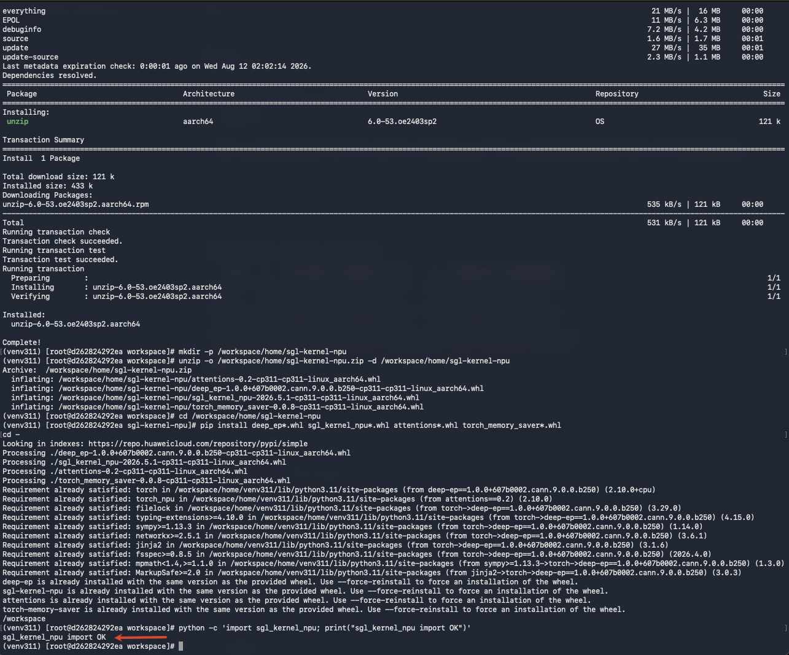
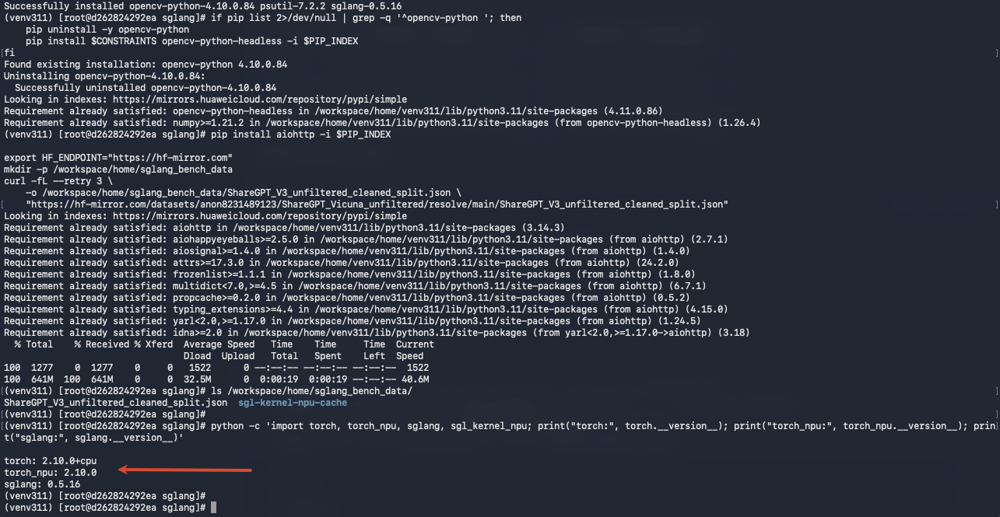
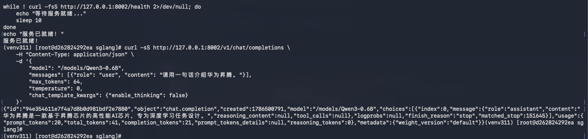
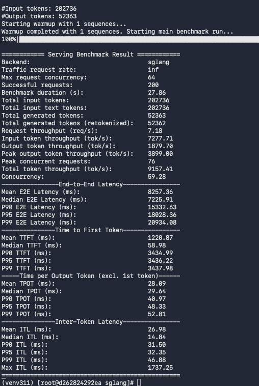
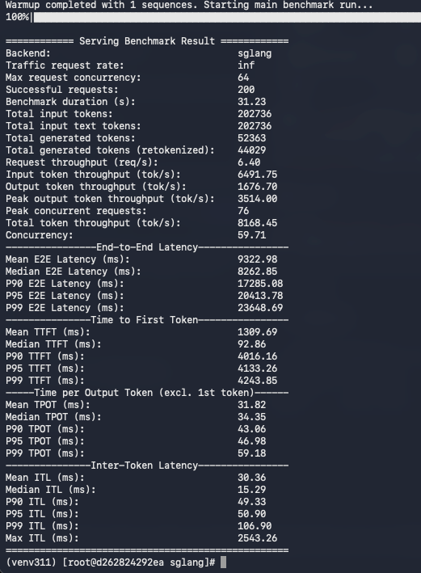

## 一、前言

随着 OpenAtom openEuler（简称：“openEuler”或“开源欧拉”） 24.03 及更高版本原生支持 SGLang 等主流 AI 推理框架，系统的 AI 算力生态正逐步完善。

上一篇[《一文实测！openEuler 24.03 搭建 vLLM，Benchmark 数据直观出炉》](https://mp.weixin.qq.com/s/TNhQTrHzunAol6b6AWQeEQ)文章中详细介绍了如何在 openEuler 24.03 上搭建 vllm环境，以及运行 benchmark。本篇文章将继续介绍在 openEuler 上搭建 SGLang 环境，并使用随机数据集执行 benchmark。

---

## 二、环境准备

本次实测的宿主机环境为：

| 项目 | 版本信息                              |
| --- |-----------------------------------|
| OS | openEuler release 24.03 (LTS-SP4) |
| 内核 | 6.6.0                             |
| Docker | 18.09.0                           |
| NPU 驱动 | 26.0.rc1                          |
| NPU 固件 | 7.7.0.10.220                      |
| CANN | 9.0.1                             |


### 2.1 确保宿主机使用 openEuler 国内加速 yum 源

**🖥️ 宿主机执行**

运行 `cat /etc/yum.repos.d/openEuler.repo` 检查，如果文件不存在或者使用的源不是 openEuler 国内镜像，可以按如下修改，提升 `yum install` 下载速度。

以下是 openEuler 24.03 LTS SP4 镜像源配置：

```shell
#generic-repos is licensed under the Mulan PSL v2.
#You can use this software according to the terms and conditions of the Mulan PSL v2.
#You may obtain a copy of Mulan PSL v2 at:
#    http://license.coscl.org.cn/MulanPSL2
#THIS SOFTWARE IS PROVIDED ON AN "AS IS" BASIS, WITHOUT WARRANTIES OF ANY KIND, EITHER EXPRESS OR
#IMPLIED, INCLUDING BUT NOT LIMITED TO NON-INFRINGEMENT, MERCHANTABILITY OR FIT FOR A PARTICULAR
#PURPOSE.
#See the Mulan PSL v2 for more details.

[OS]
name=OS
baseurl=https://mirrors.huaweicloud.com/openeuler/openEuler-24.03-LTS-SP4/OS/$basearch/
#metalink=https://mirrors.openeuler.org/metalink?repo=$releasever/OS&arch=$basearch
metadata_expire=1h
enabled=1
gpgcheck=1
gpgkey=http://repo.openeuler.org/openEuler-24.03-LTS-SP4/OS/$basearch/RPM-GPG-KEY-openEuler

[everything]
name=everything
baseurl=https://mirrors.huaweicloud.com/openeuler/openEuler-24.03-LTS-SP4/everything/$basearch/
#metalink=https://mirrors.openeuler.org/metalink?repo=$releasever/everything&arch=$basearch
metadata_expire=1h
enabled=1
gpgcheck=1
gpgkey=http://repo.openeuler.org/openEuler-24.03-LTS-SP4/everything/$basearch/RPM-GPG-KEY-openEuler

[EPOL]
name=EPOL
baseurl=https://mirrors.huaweicloud.com/openeuler/openEuler-24.03-LTS-SP4/EPOL/main/$basearch/
#metalink=https://mirrors.openeuler.org/metalink?repo=$releasever/EPOL/main&arch=$basearch
metadata_expire=1h
enabled=1
gpgcheck=1
gpgkey=http://repo.openeuler.org/openEuler-24.03-LTS-SP4/OS/$basearch/RPM-GPG-KEY-openEuler

[debuginfo]
name=debuginfo
baseurl=https://mirrors.huaweicloud.com/openeuler/openEuler-24.03-LTS-SP4/debuginfo/$basearch/
#metalink=https://mirrors.openeuler.org/metalink?repo=$releasever/debuginfo&arch=$basearch
metadata_expire=1h
enabled=1
gpgcheck=1
gpgkey=http://repo.openeuler.org/openEuler-24.03-LTS-SP4/debuginfo/$basearch/RPM-GPG-KEY-openEuler

[source]
name=source
baseurl=https://mirrors.huaweicloud.com/openeuler/openEuler-24.03-LTS-SP4/source/
#metalink=https://mirrors.openeuler.org/metalink?repo=$releasever&arch=source
metadata_expire=1h
enabled=1
gpgcheck=1
gpgkey=http://repo.openeuler.org/openEuler-24.03-LTS-SP4/source/RPM-GPG-KEY-openEuler

[update]
name=update
baseurl=https://mirrors.huaweicloud.com/openeuler/openEuler-24.03-LTS-SP4/update/$basearch/
#metalink=https://mirrors.openeuler.org/metalink?repo=$releasever/update&arch=$basearch
metadata_expire=1h
enabled=1
gpgcheck=1
gpgkey=http://repo.openeuler.org/openEuler-24.03-LTS-SP4/OS/$basearch/RPM-GPG-KEY-openEuler

[update-source]
name=update-source
baseurl=https://mirrors.huaweicloud.com/openeuler/openEuler-24.03-LTS-SP4/update/source/
#metalink=https://mirrors.openeuler.org/metalink?repo=$releasever&arch=source
metadata_expire=1h
enabled=1
gpgcheck=1
gpgkey=http://repo.openeuler.org/openEuler-24.03-LTS-SP4/source/RPM-GPG-KEY-openEuler
```

### 2.2 安装 Docker

**🖥️ 宿主机执行**

openEuler 24.03 已经内置了 Docker 支持，只需通过包管理器即可一键安装并启动服务：

```plain
# 安装 Docker
sudo dnf install -y docker

# 启动 Docker 并设置开机自启
sudo systemctl enable --now docker

# 验证安装是否成功
docker --version
```

### 2.3 配置免 sudo 运行（可选）

**🖥️ 宿主机执行**

为了方便日常操作，建议将当前用户加入 `docker` 组，这样运行命令时无需每次都输入 `sudo`：

```plain
# 将当前用户加入 docker 组
sudo usermod -aG docker $USER

# 刷新组权限使配置立即生效
newgrp docker
```

### 2.4 拉取 openEuler 24.03 + CANN 基础镜像

**🖥️ 宿主机执行**

本文使用基于 openEuler 24.03 SP4 + Python 3.11 的华为官方 CANN 9.0.0 容器镜像：

```bash
docker pull swr.cn-south-1.myhuaweicloud.com/ascendhub/cann:9.0.0-910b-openeuler24.03-py3.11-devel
```

### 2.5 硬件与驱动

**🖥️ 宿主机执行**

确保宿主机已正确安装昇腾驱动，NPU 设备可见：

```bash
# 查看 NPU 设备
ls /dev/davinci*
# 预期输出：/dev/davinci0  /dev/davinci2  /dev/davinci_manager ...

# 查看 NPU 状态
npu-smi info
```

运行 `npu-smi info` 确认 NPU 设备状态正常：


### 2.6 模型权重准备

**🖥️ 宿主机执行**

将模型权重放到宿主机统一目录，后续容器挂载使用：

```bash
# 以 Qwen3-0.6B 为例
ls /home/models/Qwen3-0.6B/
# 预期包含：config.json  tokenizer.json  model*.safetensors ...
```

### 2.7 国内镜像加速

在容器内操作前，先规划好镜像配置。以下镜像策略将在后续各框架步骤中逐一应用：

| 用途 | 原始地址 | 国内镜像 |
| --- | --- | --- |
| pip 主源 | pypi.org | `https://mirrors.huaweicloud.com/repository/pypi/simple` |
| openEuler yum | repo.openeuler.org | `https://mirrors.huaweicloud.com/openeuler/` |
| GitHub | github.com | `https://ghfast.top/`（代理前缀） |
| HuggingFace | huggingface.co | `https://hf-mirror.com` |

---

## 三、SGLang 推理环境搭建

本次 SGLang 安装配置的环境是 openEuler 24.03 SP4，使用 Docker 启动该容器，容器内已经配置好昇腾驱动和 CANN，系统版本为 openEuler 24.03 SP4 aarch64。

SGLang 的 NPU 支持由官方源码内置，需要通过**源码安装**。与 vLLM 相比，额外需要：

- sgl-kernel-npu（不在 PyPI，需从 GitHub Releases 下载预编译 zip）
- constraints 文件锁版本（防止依赖链拉取 CUDA 包）
- **仅支持 Python 3.11**

**版本配套表：**

| 组件 | 版本 |
| --- | --- |
| Python | 3.11 |
| PyTorch | 2.10.0 (CPU) |
| torch_npu | 2.10.0 |
| triton-ascend | 3.2.1.dev20260530 (nightly) |
| sgl-kernel-npu | 2026.05.01.post3 |
| SGLang | v0.5.16 |


### Step 1：启动并进入容器

**🖥️ 宿主机执行**

启动容器并挂载 NPU 设备、模型目录、pip 缓存等：

```bash
docker run -d \
    --name sglang-ascend-910b \
    --privileged \
    --ipc=host \
    --device=/dev/davinci2 \
    --device=/dev/davinci_manager \
    --device=/dev/devmm_svm \
    --device=/dev/hisi_hdc \
    -v /usr/local/sbin:/usr/local/sbin:ro \
    -v /usr/local/dcmi:/usr/local/dcmi:ro \
    -v /usr/local/bin/npu-smi:/usr/local/bin/npu-smi:ro \
    -v /usr/local/Ascend/driver:/usr/local/Ascend/driver:ro \
    -v /etc/ascend_install.info:/etc/ascend_install.info:ro \
    -v /home/models:/models \
    -v $(pwd)/sglang-workspace:/workspace/home \
    -v $(pwd)/pip-cache:/root/.cache/pip \
    -w /workspace \
    -p 8002:8002 \
    --shm-size=16g \
    --ulimit memlock=-1 \
    --ulimit stack=67108864 \
    -e OMP_NUM_THREADS=8 \
    swr.cn-south-1.myhuaweicloud.com/ascendhub/cann:9.0.0-910b-openeuler24.03-py3.11-devel \
    sleep infinity
```

> 与 vLLM 的区别：额外挂载了 `sglang-workspace` 目录用于持久化源码和缓存，加速二次部署。

进入容器：

```shell
docker exec -it sglang-ascend-910b bash -l
```

### Step 2：准备 Python 虚拟环境

**📦 容器内执行**

SGLang NPU 仅支持 Python 3.11，CANN 镜像自带 `python3.11`，创建虚拟环境即可：

```bash
# 容器内执行
python3.11 -m venv --upgrade /workspace/home/venv311
source /workspace/home/venv311/bin/activate
pip install -U pip -i https://mirrors.huaweicloud.com/repository/pypi/simple
python --version
# 预期输出：Python 3.11.x
```

虚拟环境创建成功后，确认 Python 版本为 3.11.x：



### Step 3：安装依赖

**📦 容器内执行**

以下命令均在激活虚拟环境后执行。

#### 3.1 替换 openEuler 国内加速 yum 源

加速系统包安装，将默认源替换为华为云镜像：
```bash
sed -i -e 's|https://repo.openeuler.org/|https://mirrors.huaweicloud.com/openeuler/|' \
       -e '/^metalink=/s/^/#/' /etc/yum.repos.d/openEuler.repo
```

#### 3.2 创建 constraints 文件

这一步至关重要——锁住 torch 为 CPU 版本，防止 pip 解析 sglang 依赖链时拉取整套 NVIDIA CUDA 包：

```bash
printf 'torch==2.10.0+cpu\ntorch_npu==2.10.0\nnumpy==1.26.4\n' > /tmp/sglang_constraints.txt
CONSTRAINTS='-c /tmp/sglang_constraints.txt'
```

#### 3.3 安装基础依赖

安装 setuptools、PyTorch CPU 版本及昇腾 NPU 适配层：
```bash
PIP_INDEX="https://mirrors.huaweicloud.com/repository/pypi/simple"

pip install 'setuptools<80' -i $PIP_INDEX

# torch CPU 版 wheel（从 PyTorch 官方 CPU 索引安装）
pip install torch==2.10.0 --index-url https://download.pytorch.org/whl/cpu

# torch_npu（昇腾适配层）
pip install torch_npu==2.10.0 -i $PIP_INDEX
```

#### 3.4 安装 triton-ascend（nightly 源）

从华为云昇腾 nightly 仓库安装 triton-ascend 开发版：
```bash
pip install triton-ascend==3.2.1.dev20260530 \
    --extra-index-url https://mirrors.huaweicloud.com/ascend/repos/pypi/nightly \
    --trusted-host mirrors.huaweicloud.com \
    -i $PIP_INDEX
```

#### 3.5 安装 sgl-kernel-npu

sgl-kernel-npu 不在任何 PyPI 源上，需要从 GitHub Releases 下载预编译 zip 包（含 deep_ep / sgl_kernel_npu / attentions / torch_memory_saver 四个 wheel）：

```bash
# 下载 zip（通过 GitHub 镜像代理加速）
mkdir -p /workspace/home
curl -fL --retry 3 \
    -o /workspace/home/sgl-kernel-npu.zip \
    "https://ghfast.top/https://github.com/sgl-project/sgl-kernel-npu/releases/download/2026.05.01.post3/sgl-kernel-npu-2026.05.01.post3-torch2.10.0-py311-cann9.0.0-a3-aarch64.zip"

# 安装 unzip（容器内默认无此工具）
command -v unzip >/dev/null 2>&1 || { dnf install -y unzip 2>/dev/null || yum install -y unzip; }

# 解压并安装
mkdir -p /workspace/home/sgl-kernel-npu
unzip -o /workspace/home/sgl-kernel-npu.zip -d /workspace/home/sgl-kernel-npu
cd /workspace/home/sgl-kernel-npu
pip install deep_ep*.whl sgl_kernel_npu*.whl attentions*.whl torch_memory_saver*.whl
cd -

# 验证
python -c 'import sgl_kernel_npu; print("sgl_kernel_npu import OK")'
```

安装完成后，验证 `sgl_kernel_npu` 可正常导入：



#### 3.6 源码安装 SGLang NPU 版
```bash
# 克隆源码（通过镜像代理加速，浅克隆节省空间）
git clone --branch v0.5.16 --depth 1 \
    https://ghfast.top/https://github.com/sgl-project/sglang.git \
    /workspace/home/sglang
cd /workspace/home/sglang

# NPU 版安装：用 pyproject_npu.toml 覆盖 pyproject.toml
# 注意用 cp 而非 mv——保留 npu.toml 模板，二次部署时 git fetch 后仍可复用
cp -f python/pyproject_npu.toml python/pyproject.toml

# 安装（constraints 防止拉 CUDA 包）
pip install $CONSTRAINTS -e 'python[all_npu]' -i $PIP_INDEX
```

#### 3.7 替换 opencv-python 为 headless 版

容器内无图形库（缺少 `libGL.so.1`），如果安装了 opencv-python 需要替换，否则 scheduler 子进程 `import cv2` 时会崩溃：

```bash
if pip list 2>/dev/null | grep -q '^opencv-python '; then
    pip uninstall -y opencv-python
    pip install $CONSTRAINTS opencv-python-headless -i $PIP_INDEX
fi
```

#### 3.8 预下载 benchmark 数据集

SGLang 的 random 数据集模式仍会从 HuggingFace 下载 ShareGPT 文件（~642MB），在无外网的容器环境中会失败。需要提前下载到本地：

```bash
pip install aiohttp -i $PIP_INDEX

export HF_ENDPOINT="https://hf-mirror.com"
mkdir -p /workspace/home/sglang_bench_data
curl -fL --retry 3 \
    -o /workspace/home/sglang_bench_data/ShareGPT_V3_unfiltered_cleaned_split.json \
    "https://hf-mirror.com/datasets/anon8231489123/ShareGPT_Vicuna_unfiltered/resolve/main/ShareGPT_V3_unfiltered_cleaned_split.json"
```

#### 3.9 验证版本信息

确认各组件版本正确：

```bash
python -c 'import torch, torch_npu, sglang, sgl_kernel_npu; print("torch:", torch.__version__); print("torch_npu:", torch_npu.__version__); print("sglang:", sglang.__version__)'
```

版本验证输出如下：



### Step 4：启动推理服务

**📦 容器内执行**

启动 SGLang 推理服务，后台运行并将日志写入文件：

```bash
source /usr/local/Ascend/ascend-toolkit/set_env.sh
export ASCEND_RT_VISIBLE_DEVICES=0

sglang serve /models/Qwen3-0.6B \
    --host 0.0.0.0 \
    --port 8002 \
    --attention-backend ascend \
    --device npu \
    --tp-size 1 \x
    --mem-fraction-static 0.9 \
    --trust-remote-code \
    > /workspace/logs/sglang_server.log 2>&1 &
```

**参数说明：**

- `--attention-backend ascend`：使用昇腾原生 Attention 实现
- `--device npu`：指定 NPU 设备
- `--mem-fraction-static 0.9`：静态显存占比

### Step 5：验证服务

等到 `/workspace/logs/sglang_server.log` 输出 "The server is fired up and ready to roll!" 说明服务启动成功了。

#### 5.1 等待就绪

```bash
export HF_ENDPOINT="https://hf-mirror.com"

while ! curl -fsS http://127.0.0.1:8002/health 2>/dev/null; do
    echo "等待服务就绪..."
    sleep 10
done
echo "服务已就绪！"
```

#### 5.2 curl 推理验证

发送一条测试请求，验证推理服务是否正常响应：

```bash
curl -sS http://127.0.0.1:8002/v1/chat/completions \
    -H "Content-Type: application/json" \
    -d '{
        "model": "/models/Qwen3-0.6B",
        "messages": [{"role": "user", "content": "请用一句话介绍华为昇腾。"}],
        "max_tokens": 64,
        "temperature": 0,
        "chat_template_kwargs": {"enable_thinking": false}
    }'
```

推理验证返回结果如下：



### Step 6：运行 Benchmark

**📦 容器内执行**

```bash
export HF_ENDPOINT="https://hf-mirror.com"
export HF_DATASETS_OFFLINE=0

# 如果硬件算力足够，适当增加输入输出的长度和并发
python -m sglang.benchmark.serving \
    --backend sglang \
    --model /models/Qwen3.5-9B \
    --dataset-name random \
    --dataset-path /workspace/home/sglang_bench_data/ShareGPT_V3_unfiltered_cleaned_split.json \
    --random-input-len  2048 \
    --random-output-len 512 \
    --num-prompts 200 \
    --max-concurrency 64 \
    --port 8002 \
    --output-file /workspace/logs/sglang_benchmark.json
```

> **注意：** `--dataset-name` 这个参数跟 vLLM 的有些不同：`--dataset-name random` 表示用 random 分布采样输入长度，它实际上指的是使用 ShareGPT 数据集作为输入，随机取输入长度，随机的是“长度”，不是“token”，所以 `--dataset-path` 必须指向本地已下载的 ShareGPT 文件，否则仍自动尝试联网下载 ShareGPT 数据集。

Benchmark 测试结果：



如果想做类似 vLLM 的随机“token” Benchmark，用以下命令跑 `random-ids` 模式：

```shell
python -m sglang.benchmark.serving \
    --backend sglang \
    --model /models/Qwen3.5-9B \
    --dataset-name random-ids \
    --random-input-len  2048 \
    --random-output-len 512 \
    --num-prompts 200 \
    --max-concurrency 64 \
    --port 8002 \
    --output-file /workspace/logs/sglang_benchmark_random-ids.json
```

`random-ids` 模式 Benchmark 测试结果：



### Step 7：清理

**📦 容器内 + 🖥️ 宿主机**

测试完成后，停止服务并清理容器：

```bash
# 优雅退出（SGLang 官方推荐 SIGINT）
kill -SIGINT $(pgrep -f 'sglang')

# 退出容器后删除
exit
docker stop sglang-ascend-910b
docker rm sglang-ascend-910b
```

---

## 四、关键指标解读

以下是 Benchmark 输出中各项指标的含义：

| 指标 | 含义 | 单位 | 越小越好 |
| --- | --- | --- | --- |
| **TTFT** (Time To First Token) | 从发送请求到收到第一个 token 的延迟 | ms | ✅ |
| **TPOT** (Time Per Output Token) | 每个输出 token 的平均耗时 | ms | ✅ |
| **ITL** (Inter-Token Latency) | 相邻 token 之间的延迟 | ms | ✅ |
| **Throughput** | 每秒处理的 token 总数 | tokens/s | ❌ |


---

## 五、常见问题与踩坑

### 5.1 yum install 慢

**现象：** `yum install xxx` 软件包时，下载速度缓慢。

**原因：** 系统默认的 yum 源可能是 `repo.openeuler.org`，速度较慢。

**修复：** 替换 openEuler 国内加速 yum 源：

```shell
sed -i -e 's|https://repo.openeuler.org/|https://mirrors.huaweicloud.com/openeuler/|' \
       -e '/^metalink=/s/^/#/' /etc/yum.repos.d/openEuler.repo
```

### 5.2 sgl-kernel-npu 不在 PyPI（SGLang）

**现象：** `pip install sgl-kernel-npu` 报找不到包。

**原因：** sgl-kernel-npu 未发布到任何 PyPI 源，只能从 GitHub Releases 下载预编译 zip。

**修复：** 手动下载 zip 并解压安装四个 wheel（详见 SGLang Step 3.5）。

### 5.3 pip 拉取 CUDA 包（SGLang）

**现象：** 安装 SGLang 时 pip 尝试下载 torch CUDA 版本。

**原因：** sglang 的依赖链（如 outlines）会间接依赖 torch，pip 默认解析到 CUDA 版。

**修复：** 使用 constraints 文件锁住 `torch==2.10.0+cpu`（详见 SGLang Step 3.2）。

### 5.4 国内网络镜像配置汇总

| 场景 | 解决方案 |
| --- | --- |
| pip 安装慢 | `-i https://mirrors.huaweicloud.com/repository/pypi/simple` |
| yum/dnf 安装慢 | `sed` 替换 `/etc/yum.repos.d/openEuler.repo` 中的 `repo.openeuler.org` |
| git clone GitHub 失败 | 使用 `https://ghfast.top/` 代理前缀 |
| HuggingFace 下载失败 | `export HF_ENDPOINT=https://hf-mirror.com` |
| triton-ascend 找不到 | `--extra-index-url https://mirrors.huaweicloud.com/ascend/repos/pypi` |


---

## 六、总结

本次实测从环境构建到性能验证，以 openEuler 24.03 LTS SP4 为统一的操作系统底座，逐步完成了 Docker 部署以及 SGLang 的安装与配置，并利用随机数据集跑通了 Benchmark 测试，输出了包括 TTFT、TPOT 及 Throughput在内的关键性能指标，验证了整套环境的可用性与稳定性。

本次本地编译，总时长约 1 分钟（不同系统、硬件资源、编译工具对速度影响很大），为方便开发者使用，openEuler社区后续将引入SGLang。后续在openEuler上直接使用系统的包管理器即可一键安装配置，开箱即用，请持续关注 openEuler 社区动态。

