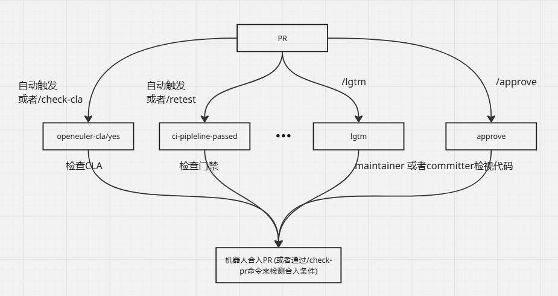
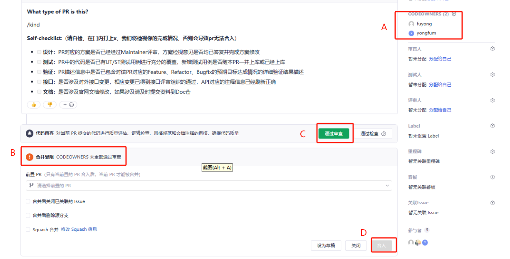

##  机器人 + CODEOWNERS  双重审核机制说明

### 1.  机器人是如何控制PR的合入？
openEuler社区的PR当前依靠SIG 组 `maintainer` 和 `committer` 通过加分 ( `maintainer` 或者 `committer` 输入命令 `/lgtm`、`/approve`，触发机器人对该PR进行打`lgtm`、`approve`标签 ) 的方式 来检视代码，当 PR 的标签满足了合入条件之后，机器人会自动触发合入（也可以通过 `/check-pr` 来查看缺少哪些合入条件，如果满足了合入条件，该命令会触发PR合入）

 <br>

### 2. CODEOWNERS 如何管控PR是否能够合入？
 CODEOWNERS机制能够做到 **文件/目录级别**的审查管控。 实际上AtomGit平台已经有详细的说明文档，[Code Owners](https://docs.atomgit.com/docs/help/home/org_project/project_manage/file_operations/code-owners) 和 [Code Owners 审查设置](https://docs.atomgit.com/docs/help/home/org_project/project_manage/file_operations/co-review-settings) ，在这里我们就以一个例子简单说一下规则和注意事项

```
* @yao-xiaobai   
/A/ @yao-xiaobai @Coopermassaki 
/B/  @yao-xiaobai @yongfum 
/C/  @Coopermassaki @yongfum
/CODEOWNERS @georgecao
```
-  通配符 `*` ： 对于 PR 没有命中 CODEOWNERS 的修改文件或目录进行兜底（也可以不配置该行）
-  如果没有配置 通配符 `*`，对于没命中的PR， 就不会有PR审查的限制
-  如果PR 同时修改了多个目录，且这些目录被CODEOWNERS 文件命中，这需要多行的审查人员审查
-  CODEOWNERS文件只对**当前分支**有效。因此，如果每个分支都需要管控，都需要有 CODEOWNERS 文件
-  文件中配置的 atomgit id 需要是本仓库成员
-  每个目录或文件，需要 CODEOWNERS 文件相应行所有审查人员通过才可以（如果设置成协同模式，一行只需要一人通过）
-  对于PR 如果审查人员没通过，是合入不了的

**图： PR命中了CODEOWNERS 文件**    
 <br>

A：会将命中的审视人员的atomgit 展示在此处    
B：如果审视人员没有全部通过会告知不能合并的原因    
C：CODEOWNERS 审视者可以通过点击 `通过审查`  按钮表示通过    
D：因审视者未审视通过，合入按钮置灰    

### 3. 机器人 + CODEOWNERS  双重审核
如果我们既要SIG 组的 `maintainer` 和 `committer` 通过加分的方式来检视代码，又想对关键目录和文件的代码质量做管控，机器人 + CODEOWNERS  双重审核机制比较适合我们。
这套机制里，机器人的合入条件和 CODEOWNERS 合入条件是**逻辑与**的关系。也就是说，PR不仅要满足机器人合入的条件（lgtm、approve、openeuler-cla/yes、ci-pipeline-passed 等等），还需要满足全部 CODEOWNERS 审查通过。

如果机器人合入条件满足了，但是CODEOWNERS 合入条件没满足，机器人尝试合入的话，会报如下错误（该错误会回显至PR评论区）：
```
### PR Merge Failed 
 - reason: {"message":"Not enough required approvers"}
```
这时候，需要 CODEOWNERS  去审核通过，如果审核通过了，再输入 `/check-pr` 即可合入PR


至此，机器人 + CODEOWNERS  双重审核机制的介绍就结束啦，赶紧用起来吧! ☺