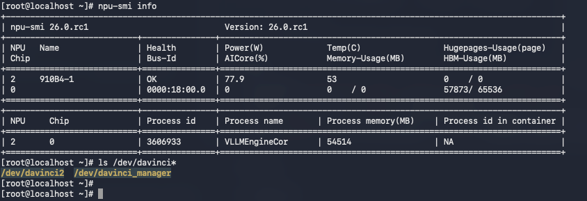
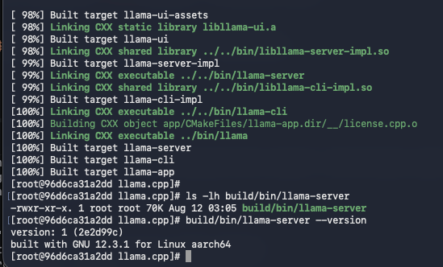
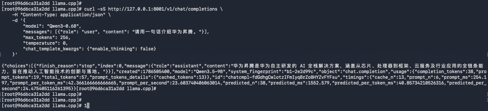
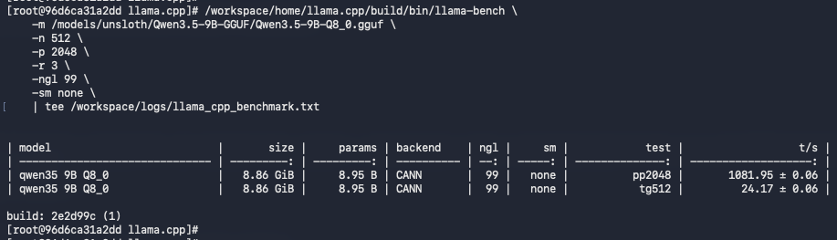
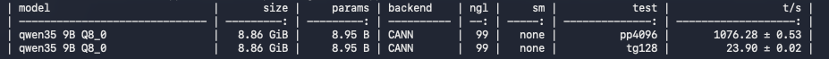
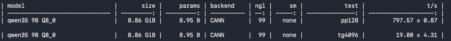

## 一、前言

目前，OpenAtom openEuler（简称“openEuler”或“开源欧拉”）24.03 已原生支持 llama.cpp。继上一篇[《手把手实测！openEuler 24.03 部署 SGLang，Benchmark 数据出炉》](https://mp.weixin.qq.com/s/PdyN1MyyLQoBg6am5kBU_A)之后，本文将继续围绕 AI 推理框架展开实测，带你在 openEuler 24.03 环境下从零搭建 llama.cpp。

本文从最干净的 openEuler 和 CANN 基础镜像开始，详细介绍 llama.cpp 的环境准备、源码编译及推理服务启动，并通过一轮 Random Benchmark 实测其推理性能。究竟在 openEuler 上部署 llama.cpp 的过程是否顺畅，实际性能表现如何？下面就一起动手试试。

---

## 二、环境准备

本次实测的宿主机环境为：

| 项目 | 版本信息 |
| --- | --- |
| OS | openEuler release 24.03 (LTS-SP4) |
| 内核 | 6.6.0 |
| Docker | 18.09.0 |
| NPU 驱动 | 26.0.rc1 |
| NPU 固件 | 7.7.0.10.220 |
| CANN | 9.0.1 |


### 2.1 确保宿主机使用 openEuler 国内加速 yum 源

**🖥️ 宿主机执行**

运行 `cat /etc/yum.repos.d/openEuler.repo` 检查，如果文件不存在或者使用的源不是 openEuler 国内镜像，可以按如下修改，提升 `yum install` 下载速度。

以下是 openEuler 24.03 LTS SP4 镜像源配置：

```shell
#generic-repos is licensed under the Mulan PSL v2.
#You can use this software according to the terms and conditions of the Mulan PSL v2.
#You may obtain a copy of Mulan PSL v2 at:
#    http://license.coscl.org.cn/MulanPSL2
#THIS SOFTWARE IS PROVIDED ON AN "AS IS" BASIS, WITHOUT WARRANTIES OF ANY KIND, EITHER EXPRESS OR
#IMPLIED, INCLUDING BUT NOT LIMITED TO NON-INFRINGEMENT, MERCHANTABILITY OR FIT FOR A PARTICULAR
#PURPOSE.
#See the Mulan PSL v2 for more details.

[OS]
name=OS
baseurl=https://mirrors.huaweicloud.com/openeuler/openEuler-24.03-LTS-SP4/OS/$basearch/
#metalink=https://mirrors.openeuler.org/metalink?repo=$releasever/OS&arch=$basearch
metadata_expire=1h
enabled=1
gpgcheck=1
gpgkey=http://repo.openeuler.org/openEuler-24.03-LTS-SP4/OS/$basearch/RPM-GPG-KEY-openEuler

[everything]
name=everything
baseurl=https://mirrors.huaweicloud.com/openeuler/openEuler-24.03-LTS-SP4/everything/$basearch/
#metalink=https://mirrors.openeuler.org/metalink?repo=$releasever/everything&arch=$basearch
metadata_expire=1h
enabled=1
gpgcheck=1
gpgkey=http://repo.openeuler.org/openEuler-24.03-LTS-SP4/everything/$basearch/RPM-GPG-KEY-openEuler

[EPOL]
name=EPOL
baseurl=https://mirrors.huaweicloud.com/openeuler/openEuler-24.03-LTS-SP4/EPOL/main/$basearch/
#metalink=https://mirrors.openeuler.org/metalink?repo=$releasever/EPOL/main&arch=$basearch
metadata_expire=1h
enabled=1
gpgcheck=1
gpgkey=http://repo.openeuler.org/openEuler-24.03-LTS-SP4/OS/$basearch/RPM-GPG-KEY-openEuler

[debuginfo]
name=debuginfo
baseurl=https://mirrors.huaweicloud.com/openeuler/openEuler-24.03-LTS-SP4/debuginfo/$basearch/
#metalink=https://mirrors.openeuler.org/metalink?repo=$releasever/debuginfo&arch=$basearch
metadata_expire=1h
enabled=1
gpgcheck=1
gpgkey=http://repo.openeuler.org/openEuler-24.03-LTS-SP4/debuginfo/$basearch/RPM-GPG-KEY-openEuler

[source]
name=source
baseurl=https://mirrors.huaweicloud.com/openeuler/openEuler-24.03-LTS-SP4/source/
#metalink=https://mirrors.openeuler.org/metalink?repo=$releasever&arch=source
metadata_expire=1h
enabled=1
gpgcheck=1
gpgkey=http://repo.openeuler.org/openEuler-24.03-LTS-SP4/source/RPM-GPG-KEY-openEuler

[update]
name=update
baseurl=https://mirrors.huaweicloud.com/openeuler/openEuler-24.03-LTS-SP4/update/$basearch/
#metalink=https://mirrors.openeuler.org/metalink?repo=$releasever/update&arch=$basearch
metadata_expire=1h
enabled=1
gpgcheck=1
gpgkey=http://repo.openeuler.org/openEuler-24.03-LTS-SP4/OS/$basearch/RPM-GPG-KEY-openEuler

[update-source]
name=update-source
baseurl=https://mirrors.huaweicloud.com/openeuler/openEuler-24.03-LTS-SP4/update/source/
#metalink=https://mirrors.openeuler.org/metalink?repo=$releasever&arch=source
metadata_expire=1h
enabled=1
gpgcheck=1
gpgkey=http://repo.openeuler.org/openEuler-24.03-LTS-SP4/source/RPM-GPG-KEY-openEuler
```

### 2.2 安装 Docker

**🖥️ 宿主机执行**

openEuler 24.03 软件仓里有Docker，直接安装：

```plain
# 安装 Docker
sudo dnf install -y docker

# 启动 Docker 并设置开机自启
sudo systemctl enable --now docker

# 验证安装是否成功
docker --version
```

### 2.3 配置免 sudo 运行（可选）

**🖥️ 宿主机执行**

为了方便日常操作，建议将当前用户加入 `docker` 组，这样运行命令时无需每次都输入 `sudo`：

```plain
# 将当前用户加入 docker 组
sudo usermod -aG docker $USER

# 刷新组权限使配置立即生效
newgrp docker
```

### 2.4 拉取 openEuler 24.03 + CANN 基础镜像

**🖥️ 宿主机执行**

本文使用基于 openEuler 24.03 SP4 + Python 3.11 的华为官方 CANN 9.0.0 容器镜像：

```bash
docker pull swr.cn-south-1.myhuaweicloud.com/ascendhub/cann:9.0.0-910b-openeuler24.03-py3.11-devel
```

### 2.5 硬件与驱动

**🖥️ 宿主机执行**

确保宿主机已正确安装昇腾驱动，NPU 设备可见：

```bash
# 查看 NPU 设备
ls /dev/davinci*
# 预期输出：/dev/davinci0  /dev/davinci2  /dev/davinci_manager ...

# 查看 NPU 状态
npu-smi info
```

运行 `npu-smi info` 确认 NPU 设备状态正常：



### 2.6 模型权重准备

**🖥️ 宿主机执行**

将模型权重放到宿主机统一目录，后续容器挂载使用：

```bash
# 以 Qwen3-0.6B 为例
ls /home/models/Qwen3-0.6B/
# 预期包含：config.json  tokenizer.json  model*.safetensors ...
```

### 2.7 国内镜像加速

在容器内操作前，先规划好镜像配置。以下镜像策略将在后续各框架步骤中逐一应用：

| 用途 | 原始地址 | 国内镜像 |
| --- | --- | --- |
| pip 主源 | pypi.org | `https://mirrors.huaweicloud.com/repository/pypi/simple` |
| openEuler yum | repo.openeuler.org | `https://mirrors.huaweicloud.com/openeuler/` |
| GitHub | github.com | `https://ghfast.top/`（代理前缀） |
| HuggingFace | huggingface.co | `https://hf-mirror.com` |

---


## 三、llama.cpp 推理环境搭建

本次 llama.cpp 编译环境位于容器内部，容器镜像基于 openEuler 24.03 LTS SP4 构建，已经配置好昇腾驱动和 CANN，无需做任何配置。

llama.cpp 是纯 C++ 实现，通过 **GGML_CANN** 后端驱动昇腾 NPU，它需要**编译源码**，且模型必须是 **GGUF 格式**。

**版本配套：**

| 组件 | 版本 |
| --- | --- |
| llama.cpp | master 分支（最新） |
| CANN（容器内） | 9.0.0 |
| GGUF 量化 | f16（也支持 q8_0 / q4_0） |


### Step 1：启动容器

**🖥️ 宿主机执行**

启动容器并挂载 NPU 设备、模型目录等：

```bash
docker run -d \
    --name llama-cpp-ascend-910b \
    --device=/dev/davinci2 \
    --device=/dev/davinci_manager \
    --device=/dev/devmm_svm \
    --device=/dev/hisi_hdc \
    -v /usr/local/dcmi:/usr/local/dcmi:ro \
    -v /usr/local/bin/npu-smi:/usr/local/bin/npu-smi:ro \
    -v /usr/local/Ascend/driver:/usr/local/Ascend/driver:ro \
    -v /etc/ascend_install.info:/etc/ascend_install.info:ro \
    -v /home/models:/models \
    -v $(pwd)/llamacpp-workspace:/workspace/home \
    -v $(pwd)/pip-cache:/root/.cache/pip \
    -w /workspace \
    -p 8001:8001 \
    --shm-size=16g \
    --ulimit memlock=-1 \
    --ulimit stack=67108864 \
    -e OMP_NUM_THREADS=8 \
    swr.cn-south-1.myhuaweicloud.com/ascendhub/cann:9.0.0-910b-openeuler24.03-py3.11-devel \
    sleep infinity
```

> 额外挂载 `llamacpp-workspace` 用于持久化源码和编译产物，二次部署可跳过编译。
>
> `-v /home/models:/models` 挂载宿主机的模型权重路径，后续启动推理服务用得到，用户可自行配置这个路径。

#### 进入容器

**📦 容器内执行**

```shell
docker exec -it llama-cpp-ascend-910b bash -l
```

### Step 2：编译 llama.cpp

**📦 容器内执行**

先 source CANN 环境变量：

```bash
# 容器内执行——先 source CANN 环境变量
source /usr/local/Ascend/ascend-toolkit/set_env.sh
```

#### 2.1 安装编译工具链

替换 yum 源并安装编译依赖：

```bash
# 替换 openEuler 国内加速 yum 源
sed -i -e 's|https://repo.openeuler.org/|https://mirrors.huaweicloud.com/openeuler/|' \
       -e '/^metalink=/s/^/#/' /etc/yum.repos.d/openEuler.repo

# 安装编译依赖
command -v cmake  >/dev/null 2>&1 || dnf install -y cmake
command -v git    >/dev/null 2>&1 || dnf install -y git
command -v gcc    >/dev/null 2>&1 || dnf install -y gcc gcc-c++ make
command -v ccache >/dev/null 2>&1 || dnf install -y ccache
```

> `ccache` 可以缓存编译中间文件，增量编译时大幅加速。

#### 2.2 克隆源码

通过 GitHub 镜像代理加速拉取源码：

```bash
git clone --depth 1 \
    https://ghfast.top/https://github.com/ggml-org/llama.cpp.git \
    /workspace/home/llama.cpp
cd /workspace/home/llama.cpp
```

#### 2.3 编译（CANN 后端）

使用 CMake 配置并编译 llama.cpp，启用 CANN 后端：

```bash
cmake -B build -DGGML_CANN=on -DCMAKE_BUILD_TYPE=release \
      -DCMAKE_C_COMPILER_LAUNCHER=ccache -DCMAKE_CXX_COMPILER_LAUNCHER=ccache
cmake --build build --config release -j $(nproc)
```

编译时间取决于机器性能，通常在几分钟到十几分钟。

#### 2.4 验证编译产物

确认编译产物已正确生成：

```bash
ls -lh build/bin/llama-server
build/bin/llama-server --version
```

编译完成后，确认 `llama-server` 已正确生成并查看版本信息：



### Step 3：准备 GGUF 模型

llama.cpp 只支持 GGUF 格式。如果你的模型目录中已有 `.gguf` 文件，可以直接使用；否则需要从 HuggingFace safetensors 格式转换。

国内用户推荐从 ModelScope 直接下载 GGUF 格式的权重，速度较快，本文使用的是 ModelScope 上的 `unsloth/Qwen3.5-9B-GGUF`，不需要转换。

**情况 A：已有 GGUF 文件**

```bash
ls /models/Qwen3-0.6B/*.gguf
# 直接使用已有的 gguf 文件
```

**情况 B：需要转换**

```bash
pip install numpy sentencepiece transformers \
    -i https://mirrors.huaweicloud.com/repository/pypi/simple

python3 /workspace/home/llama.cpp/convert_hf_to_gguf.py /models/Qwen3-0.6B \
    --outfile /models/Qwen3-0.6B/Qwen3-0.6B-f16.gguf \
    --outtype f16
```

> **注意**：CANN9.0.0 后端目前支持 **f16 / q8_0 / q4_0** 量化类型，其他量化格式需要自行测试，不一定能用。
>

### Step 4：启动推理服务

**📦 容器内执行**

启动 llama.cpp 推理服务，后台运行并将日志写入文件：

```bash
source /usr/local/Ascend/ascend-toolkit/set_env.sh

/workspace/home/llama.cpp/build/bin/llama-server \
    --model /models/unsloth/Qwen3.5-9B-GGUF/Qwen3.5-9B-Q8_0.gguf \
    --host 0.0.0.0 \
    --port 8001 \
    --n-gpu-layers 99 \
    --split-mode none \
    --ctx-size 8192 \
    --alias Qwen3.5-9B \
    > /workspace/logs/llama_server.log 2>&1 &
```

**参数说明：**

- `--n-gpu-layers 99`：将全部层放到 NPU 上（99 表示“全部”）
- `--split-mode layer`：多卡时按层切分；单卡场景可改为 `none`
- `--ctx-size 8192`：上下文窗口大小

### Step 5：验证服务

#### 5.1 等待就绪

```bash
while ! curl -fsS http://127.0.0.1:8001/health 2>/dev/null; do
    echo "等待服务就绪..."
    sleep 5
done
echo "服务已就绪！"
curl -s http://127.0.0.1:8001/v1/models | python -m json.tool
```

#### 5.2 curl 推理验证

发送一条测试请求，验证推理服务是否正常响应：

```bash
curl -sS http://127.0.0.1:8001/v1/chat/completions \
    -H "Content-Type: application/json" \
    -d '{
        "model": "Qwen3-0.6B",
        "messages": [{"role": "user", "content": "请用一句话介绍华为昇腾。"}],
        "max_tokens": 256,
        "temperature": 0,
        "chat_template_kwargs": {"enable_thinking": false}
    }'
```

推理验证返回结果如下：



### Step 6：运行 Benchmark

**📦 容器内执行**

llama.cpp 使用内置的 `llama-bench` 工具，输出 pp（prefill 吞吐）和 tg（decode 速度），用于性能测试：

```bash
source /usr/local/Ascend/ascend-toolkit/set_env.sh

/workspace/home/llama.cpp/build/bin/llama-bench \
    -m /models/unsloth/Qwen3.5-9B-GGUF/Qwen3.5-9B-Q8_0.gguf \
    -n 512 \
    -p 2048 \
    -r 3 \
    -ngl 99 \
    -sm none \
    | tee /workspace/logs/llama_cpp_benchmark.txt
```

**参数说明：**

- `-p`：prefill（prompt processing）测试长度
- `-n`：decode（text generation）测试长度
- `-r 3`：每项测试重复 3 次取平均
- `-ngl 99`：全部层放 NPU
- `-sm layer`：多卡按层切分，单卡可直接填 `none`
- `-m`：模型权重文件路径，GGUF 格式，可以使用 ModelScope 或者 HF 等工具下载，这里不再赘述。

输出中的 **pp** 对应 prefill 吞吐（tokens/s），**tg** 对应 decode 速度（tokens/s），分别与 vLLM / SGLang 的 TTFT 和 TPOT 含义对应。

Benchmark 测试结果：



可以修改 `-n` `-p` 参数，测试不同场景下的性能：

**a. 长上下文输入**



**b. 长文本生成**



### Step 7：清理

**📦 容器内 + 🖥️ 宿主机**

测试完成后，停止服务并清理容器：

```bash
pkill -f llama-server
exit
docker stop llama-cpp-ascend-910b
docker rm llama-cpp-ascend-910b
```

---

## 四、关键指标

以下是 Benchmark 输出中各项指标的含义：

| 指标名 | 含义 |
| --- | --- |
| 1/pp (prefill) | 首 token 延迟 / 预填充吞吐 |
| 1/tg (decode) | 每 token 耗时 / 解码速度 |


---

## 五、常见问题

### 5.1 yum install 慢

**现象：** `yum install xxx` 软件包时，下载速度缓慢。

**原因：** 系统默认的 yum 源可能是 `repo.openeuler.org`，速度较慢。

**修复：** 替换 openEuler 国内加速 yum 源：

```shell
sed -i -e 's|https://repo.openeuler.org/|https://mirrors.huaweicloud.com/openeuler/|' \
       -e '/^metalink=/s/^/#/' /etc/yum.repos.d/openEuler.repo
```

### 5.2 CANN 后端 GGUF 量化限制

**现象：** 使用 `q5_k_m` 等量化格式运行时报错。

**原因：** CANN 后端的 GGML 实现仅支持 **f16 / q8_0 / q4_0** 三种量化格式。

**修复：** 转换时使用 `--outtype f16`、`q8_0` 或 `q4_0`。

### 5.3 国内网络镜像配置汇总

| 场景 | 解决方案 |
| --- | --- |
| pip 安装慢 | `-i https://mirrors.huaweicloud.com/repository/pypi/simple` |
| yum/dnf 安装慢 | `sed` 替换 `/etc/yum.repos.d/openEuler.repo` 中的 `repo.openeuler.org` |
| git clone GitHub 失败 | 使用 `https://ghfast.top/` 代理前缀 |
| HuggingFace 下载失败 | `export HF_ENDPOINT=https://hf-mirror.com` |


---

## 六、总结

本文介绍了从环境构建到性能验证的全过程。以 openEuler 24.03 SP4 为统一的操作系统底座，逐步完成了 Docker 环境的部署以及 llama.cpp 的编译和使用，并利用 random 数据集跑通了 Benchmark 测试，输出了pp、tg 关键性能指标，验证了整套环境的可用性与稳定性。

虽然从华为云国内加速源下载pip依赖比较快，不过还是需要等 1、2 分钟，如果是首次构建会等更久，而且 llama.cpp 还需要本地编译，耗时比较长。

为了更方便开发者使用，接下来，openEuler 社区将引入 llama.cpp, vllm, sglang主流推理框架, 直接通过 `yum` 或 `dnf` 即可一键安装配置，实现开箱即用，请持续关注 openEuler 社区动态。
