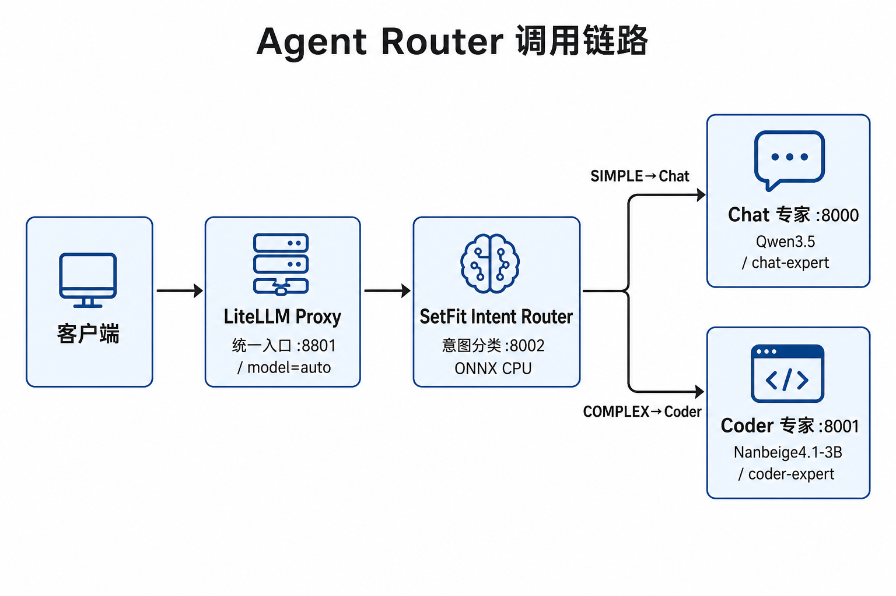
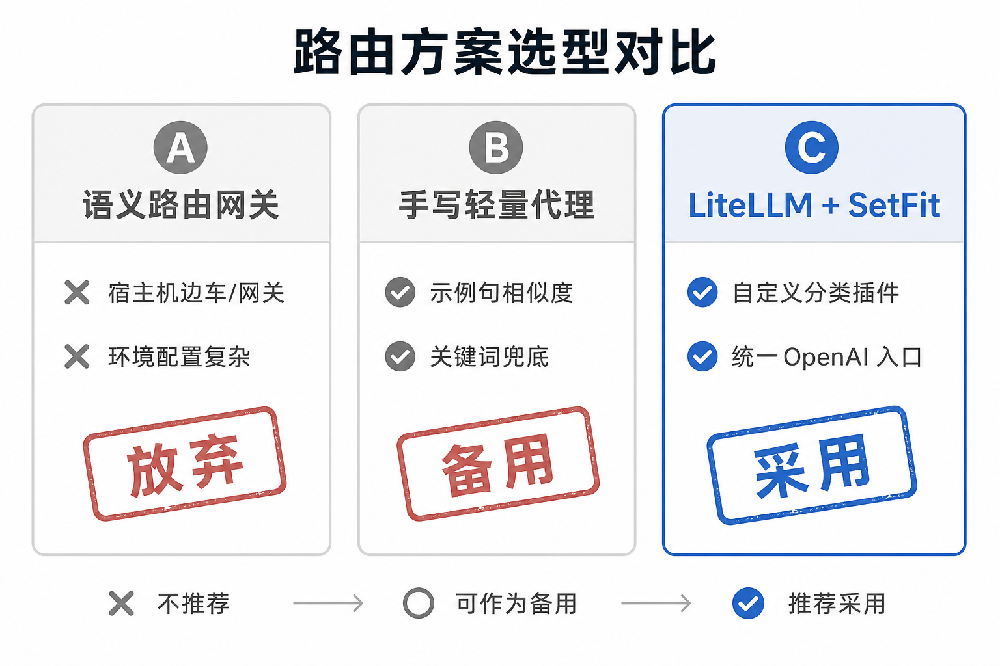
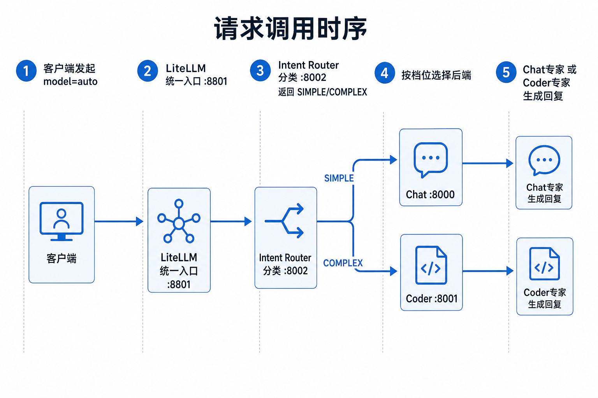
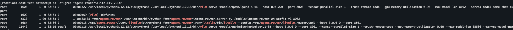
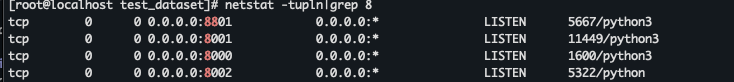
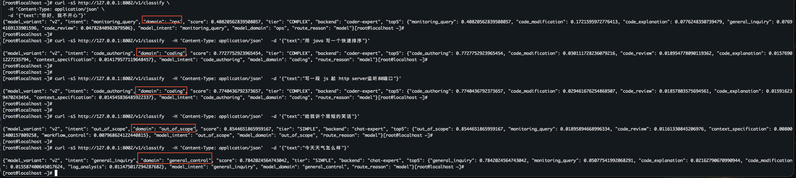
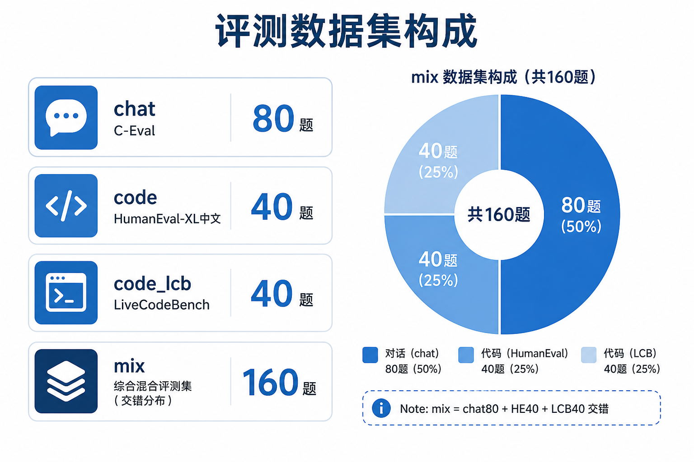
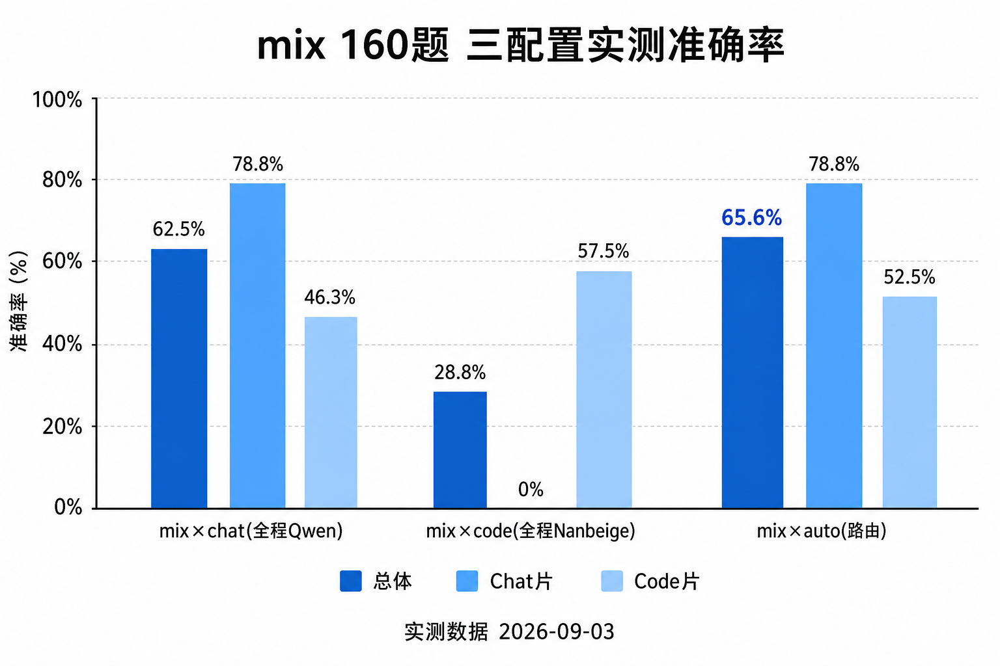
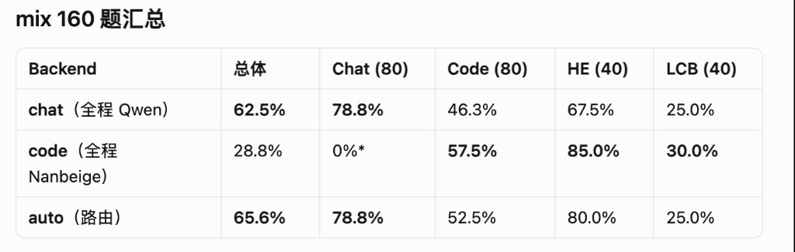

## 引言

在双卡推理场景中，同时承载「对话」与「编程」两个模型时，如何让业务侧以一个统一入口访问不同模型，往往并不简单。通常有两种做法：要么维护两套模型地址，增加接入和运维成本；要么将所有请求交给同一个模型处理，但这样又容易出现能力偏科——通识任务表现不错，代码能力却有所欠缺，反之亦然。

针对这一问题，基于 OpenAtom openEuler（简称 “openEuler” 或“开源欧拉”）24.03，实践搭建了一个 **Agent Router**：对外提供统一的 OpenAI 兼容接口，再根据请求意图，将流量自动路由至 Chat 专家模型或 Coder 专家模型，openEuler 24.03 在这里主要作为稳定的运行底座。本文将重点围绕路由策略、部署过程以及评测方法展开，进一步验证自动路由能否真正带来可量化的效果提升。

读完本文，将大致能确认三件事：为什么没上重量级语义网关；LiteLLM + SetFit 最终怎么串以及chat / code / mix 三类题怎么对比「全程单模型」和「自动路由」。

## 一、目标与模型选型

整条链路四块：**Chat 专家、Coder 专家、Intent Router（意图分类）、LiteLLM 统一入口**。前三者各是独立进程（或权重）；LiteLLM 只做 OpenAI 兼容协议和档位分发，不加载大模型。

### 1.1 目标拓扑

| 端口      | 角色            | 模型 / 组件         | 对外标识             |
| ------- | ------------- | --------------- | ---------------- |
| `:8000` | Chat 专家       | Qwen3.5-4B      | `chat-expert`    |
| `:8001` | Coder 专家      | Nanbeige4.1-3B  | `coder-expert`   |
| `:8002` | Intent Router | SetFit ONNX 分类器 | 无。意图分类接口         |
| `:8801` | 统一入口          | LiteLLM Proxy   | `auto`（亦可直通两专家名） |

请求只打统一入口。开自动路由时，Intent Router 先分类，再按档位转到 Chat 或 Coder。排障、做基线可以直接连专家；分类效果也可以单独打 Intent Router。

调用链如下：请求进 LiteLLM，经 Intent Router 出档位，再落到 Chat 或 Coder。

*图1：双专家 + Intent Router + LiteLLM。SIMPLE 进 Chat，COMPLEX 进 Coder。*

### 1.2 Chat / Coder 选型

**Chat** 用 **Qwen3.5-4B**：通识问答、中文选择题、短对话，分类失败时也默认落到它。

**Coder** 从 Ornith-1.5-9B 换成了 **Nanbeige4.1-3B**。主要看代码生成和竞赛向正确率：LiveCodeBench 等公开指标上 Nanbeige 更有参考价值；参数更小，双卡混部时显存也更好分。对外仍叫 `coder-expert`，换权重不必改上层路由配置。

### 1.3 Intent Router 选型

Intent Router 不做生成式推理，用 Hugging Face 上的中文意图权重 `snival/intent-router-zh-setfit-v2`，经 **ONNX Runtime（CPU）** 提供分类。

模型把用户话映射到约 21 类意图（coding / ops / general_control / out_of_scope 等），再折成路由要的领域和档位。比起再开一个生成式小模型做分类，体积和延迟更适合「每请求先分一次」，也不占 NPU。

重点看过短指令编程（例如「用 java 写快速排序」）：分类器要稳定进 coding，再映射到 Coder。SetFit 不是生成模型，所以单独起分类进程，和两个专家并列。

专家和 Intent Router 定下来之后，剩下的是网关怎么把分类结果接到 OpenAI 兼容入口。下一章对比几条路由路线，以及为什么最终用 LiteLLM 自定义分类插件。

## 二、路由方案选型

双专家不难找；难找的是成本低、能看清、能换的意图分发层。选型时看过三条路线，最后留下 LiteLLM + SetFit。

### 2.1 路线对比图

三条路线的取舍：网关过重就放下，手写代理当备用，正式路径用 LiteLLM + SetFit。

*图2：路由方案选型对比。*

| 路线               | 做法                            | 结论                      |
| ---------------- | ----------------------------- | ----------------------- |
| A. 语义路由网关        | 独立路由组件 + 宿主机边车 / 网关，按语义或规则分发  | 环境与网络配置复杂，相对目标过重，**放弃** |
| B. 手写轻量代理        | 基于示例句的相似度匹配，并辅以关键词            | 可跑通，语义偏弱，**仅作备用**       |
| C. LiteLLM 复杂度路由 | 启发式 / 再用 LLM 分类 / **自定义分类插件** | **采用 C + SetFit**       |

### 2.2 路线 A：为何未坚持语义网关 vllm-sr

一开始想把路由放在宿主机语义组件上，容器里只留两个专家。宿主机与容器之间的网络、边车、上游回环叠在一起，联调贵、排障面大。目标只是「本机两个专家端口按意图分流」时，整套网关栈性价比不够，这条就停了。

### 2.3 路线 B：提示词相似度分类

过渡方案做过：示例 utterance 做相似度，再加编程关键词兜底。依赖少、启动快，够验证「统一入口」协议能不能用。

语义偏弱，改写后的编程请求容易对不上；也难沉淀成可演进的意图体系（多类 intent / domain）。所以代理只作对照，正式路径不再靠它。

### 2.4 路线 C：LiteLLM + SetFit

LiteLLM Proxy 给 OpenAI 兼容入口，也能按复杂度档位映射后端。内置启发式对中文短指令不稳；再调一次 Chat 做 LLM 分类，延迟和成本又偏高。

最终做法：自定义分类插件——每次路由打本地 Intent Router，拿档位映射到 Chat 或 Coder；失败回落到 Chat，少误伤。对外 `model=auto` 走这条；也可以直通两个专家名做基线。

一次自动路由的时序：

*图3：统一入口只消费档位；更细的意图和置信度留在分类服务侧，方便排障，不必写进业务响应。*

## 三、部署

### 3.1 环境与原则

环境是 **openEuler 24.03** 上的 NPU 推理容器：双卡分别跑 Chat 与 Coder；Intent Router 和 LiteLLM 在 CPU 侧。

顺序：**先两个专家，再意图分类，最后统一入口**。路由和生成拆开——换 Coder 权重只重启 Coder，对外模型名和档位映射可以不动。

本环境也没有强推 Prefill/Decode 分离。跨卡 KV 对设备直连要求高，当前拓扑不好稳定落地；双专家混部已经够用。

### 3.2 落地结果

部署完成后应能同时确认：

- Chat / Coder 两个专家可用；
- Intent Router 能对单句返回意图和档位；
- 统一入口同时暴露 `chat-expert`、`coder-expert`、`auto`。

健康检查与模型列表：

*图4：专家、分类器与统一入口均已就绪。*

### 3.3 可观测性

分类服务会记下每次判定（耗时、意图、档位、后端选择等），方便核对短编程句有没有进 Coder。

也可以看响应里的实际模型名或相关响应头，确认落到哪边专家。`domain` 只要不是 coding，一般会按 chat 场景走。

## 四、测试集设计

目标不是刷公开榜绝对值，而是回答两件事：

1. 各专家在对应领域是否够用？——够用。
2. 自动路由相对「全程 Chat」或「全程 Coder」，正确率有没有涨？——有。

### 4.1 数据构成

| 数据集      | 领域         | 来源                              | 题数  |
| -------- | ---------- | ------------------------------- | --- |
| chat     | 中文知识 / 选择题 | C-Eval 验证集（排除偏代码学科）             | 80  |
| code     | 中文代码生成     | HumanEval-XL 中文 Python          | 40  |
| code_lcb | 竞赛编程（英文）   | LiveCodeBench v6                | 40  |
| mix      | 交错混合       | chat 80 + HumanEval 40 + LCB 40 | 160 |

各子集体量，以及 mix 的交错构成：

*图6：chat、代码补全、竞赛题分集，以及 mix 中的占比。*

设计上：

- chat 集压掉纯 CS 题，减少「编程模型刷选择题」干扰解读；
- code 集保留中文函数补全，方便和历史 Coder 对比；
- LCB 对齐 Nanbeige 的选型依据；
- mix 在同一评测里交替闲聊和代码，更接近真实统一入口。

### 4.2 对比矩阵

同一数据集分别跑三类后端：

| 后端           | 含义           |
| ------------ | ------------ |
| chat-expert  | 全程走 Chat 专家  |
| coder-expert | 全程走 Coder 专家 |
| auto         | 走统一入口 + 意图路由 |

题型不同，生成策略也不同：选择题偏保守、短输出；代码题保留 Coder 侧推理习惯——为了「看起来干净」关掉推理链，分数容易假低。自动路由路径要按样本类型切换策略。

指标上看分集准确率，以及 mix 上的分片准确率和 **宏平均（chat 片与 code 片）**，用来看路由是否两边都顾到。

预期大致是：chat 片 Chat ≥ auto ≥ Coder；code 片 Coder ≥ auto ≥ Chat。路由有效时，**mix + auto 的宏平均应高于全程单专家**。

## 五、正确性结果

数字来自容器内评测产物。标题里的「约 5%」按 **mix 总体准确率**：自动路由 65.6% 相对全程 Chat 62.5%，相对提升约 `(65.6 − 62.5) / 62.5 ≈ 5%`（绝对约 +3.1 个百分点）。

### 5.1 分集基线（专家直连）

| 数据集                  | 后端   | accuracy  | 备注                   |
| -------------------- | ---- | --------- | -------------------- |
| chat (80)            | chat | **78.8%** | Qwen 通识基线（63/80）     |
| HumanEval-XL 中文 (80) | code | **83.8%** | Nanbeige 代码补全（67/80） |
| LiveCodeBench (40)   | code | **30.0%** | Nanbeige 竞赛题（12/40）  |

### 5.2 mix 集：单专家通吃 vs 自动路由

mix 共 160 题（Chat 80 + Code 80；Code = HE 40 + LCB 40）：

| Backend           | 总体        | Chat (80) | Code (80) | HE (40)   | LCB (40)  |
| ----------------- | --------- | --------- | --------- | --------- | --------- |
| chat（全程 Qwen）     | **62.5%** | **78.8%** | 46.3%     | 67.5%     | 25.0%     |
| code（全程 Nanbeige） | 28.8%     | 0%        | **57.5%** | **85.0%** | **30.0%** |
| **auto（路由）**      | **65.6%** | **78.8%** | 52.5%     | 80.0%     | 25.0%     |

Nanbeige 全程跑通识选择题时，输出格式和 MCQ 判分对不上，Chat 片记成 0%，总体被拖垮；这不说明代码能力差。（另：mix 里 code 后端在 chat 片上也有输出过长、超出最大长度而被判 0 的情况。）

怎么读这张表：

- auto 总体最高（65.6%），相对全程 Qwen 约高 5%；相对全程 Nanbeige 拉开更大（后者被 Chat 片拖累）；
- Chat 片上 auto 与全程 Qwen 持平（78.8%），闲聊基本仍落在 Chat；
- Code 片上 auto（52.5%）夹在全程 Qwen（46.3%）和全程 Nanbeige（57.5%）之间；HE 子集 80.0%，接近 Coder 直连的 85.0%。

柱状对照与汇总表：

*图7：mix × chat / code / auto。auto 在总体与 Chat 片上最优或并列最优；代码相对全程 Chat 有抬升。*

### 5.3 路由抽检（定性）

Intent Router 在短指令上的典型表现：

| 输入                         | 意图倾向    | 路由结果  |
| -------------------------- | ------- | ----- |
| 用 java 写一个快速排序             | 代码编写    | Coder |
| 写一段 js 起 http server监听80端口 | 代码编写    | Coder |
| 给我讲个简短的笑话                  | 闲聊 / 域外 | Chat  |
| 今天天气怎么样                    | 通用询问    | Chat  |

本轮 mix 和上表方向一致：Chat 片没被路由弄伤；Code / HE 相对全程 Chat 有抬升。和 Coder 直连的差距，主要来自少量误分以及 LCB 本身更难。

### 5.4 结果解读口径

- **auto 接近理想分流**：闲聊进 Chat、代码进 Coder，两专家本身够用——路由层基本达标；
- **auto 的代码分略低于 Coder 直连**（52.5% vs 57.5%）：还有空间，可继续查意图误分和失败回落；
- **不要拿全程 Nanbeige 的总体分直接比**：Chat 片 0% 会严重扭曲总体，应分片看。

## 六、踩坑清单

### 6.1 分类器与生成服务勿混用

意图分类权重不能按生成式模型方式托管。要单独起分类服务，并按该模型约定做输入预处理；否则分类会整体漂移。

### 6.2 评测策略需按题型区分

代码专家强行关掉推理链，分数会系统性偏低；通识选择题宜短答、低温。自动路由评测必须按样本类型切策略，不能全局一套参数。

## 总结

在 openEuler 24.03 容器里，这套 Agent Router 可以收成下面几件事：

1. **双专家混部**：拉起 Chat（Qwen3.5-4B）与 Coder（Nanbeige4.1-3B），对外模型名固定；缺少直连条件时先不做 Prefill/Decode 分离。
2. **轻量意图层**：SetFit 分类 + LiteLLM 统一入口，用自定义分类对接档位，不上重量级语义网关。
3. **用 mix 集验收**：分领域准确率和总体准确率一起看。本轮实测里，自动路由相对全程 Chat，总体正确率约提升 **5%**（65.6% vs 62.5%）；相对全程 Coder 的总体分差更大（65.6% vs 28.8%），但后者被 Chat 片拖累，对比时仍应分片阅读。

