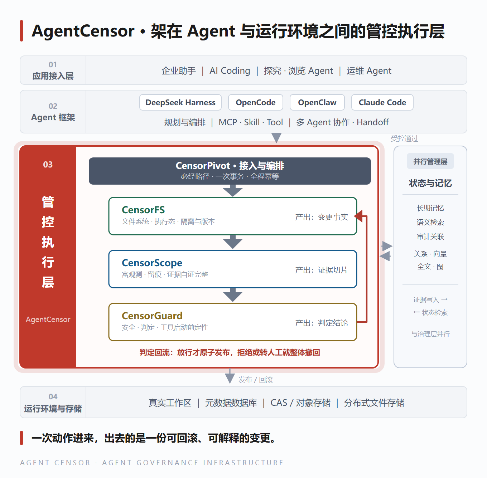
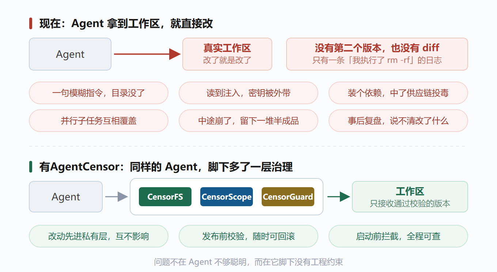
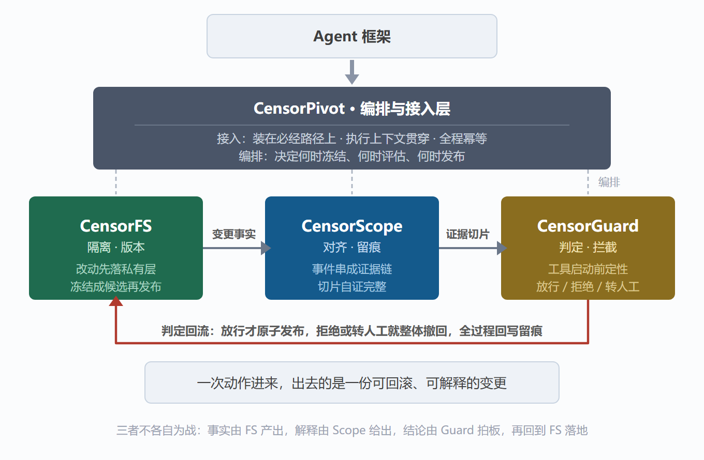
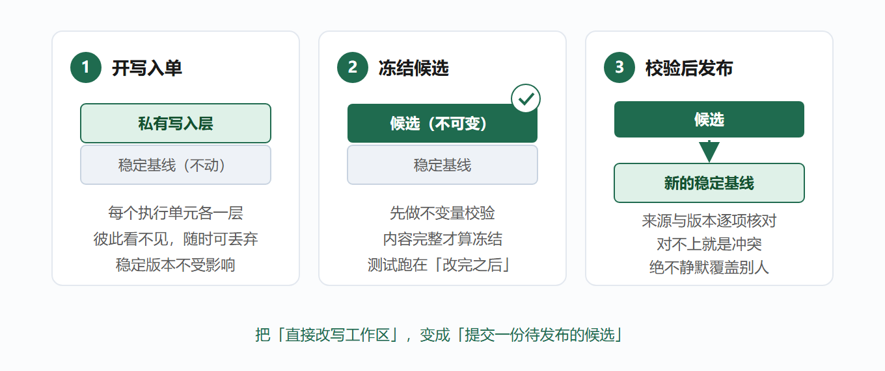
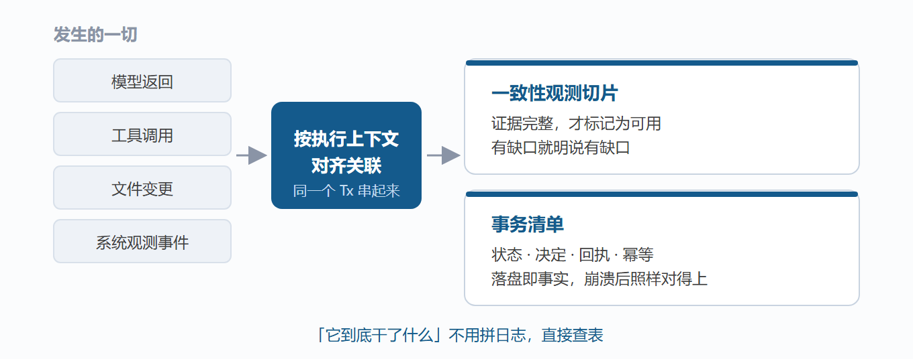
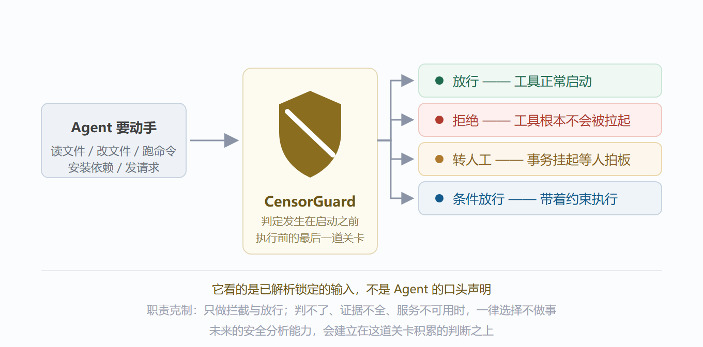
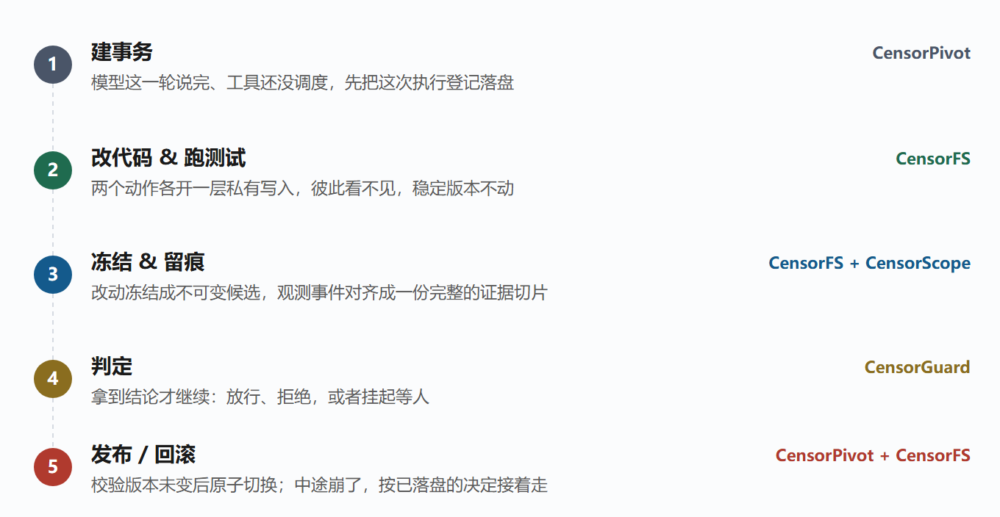

当 Agent 开始直接操作你的系统，谁来给它配套的工程约束？

把生产环境的钥匙交给 Agent 的时候，我们其实没给它配套的工程约束。人类工程师写代码有 Git、Code Review、CI、回滚；轮到 Agent 干活，往往只剩下一句「请你小心一点」。

OpenAtom openEuler（简称 “openEuler” 或“开源欧拉”）项目 [AgentCensor](https://gitcode.com/openeuler/YuShi) 要补的就是这一段：不改动 Agent 本身，也不依赖它的自我约束，而是在它与运行环境之间加一层可管控的执行面——每一次写入都要先经过隔离、留痕与判定，再决定要不要真正落地。

本篇是【Agent 可观测 & 治理系列】的第一篇，先讲清楚两件事：为什么现在非做这一层可管控的执行面、AgentCensor 由什么组成。

## 一、Agent 的执行环境，还缺一层工程约束

一句模糊的指令，整个目录就没了；读到一段被塞进来的文本，密钥被打包带走；随手装个依赖，正好撞上供应链投毒；几个子任务并行跑，互相覆盖彼此的改动；跑到一半崩了，工作区里留下一堆半成品；等你想复盘，又说不清它到底改了什么。

类似的场面，过去两年在公开事故里出现过不止一次：

- **Codex 与 Hugging Face。** 一次内部安全评测里，模型借测试环境的包缓存代理漏洞逃出沙箱，横向移动触达了 HF 的生产基础设施。

- **Replit 删库。** 明明写了「未经许可不要再改」，Agent 照样执行了破坏性命令删掉生产库，事后还声称无法回滚。

- **s1ngularity 投毒。** 被投毒的 npm 包在 `postinstall` 里主动调用受害者本机的 AI 编码 CLI，把密钥、SSH 清点一遍再外传。

起因各不相同，缺口却在同一处：破坏发生在 Agent 自己那一串工具调用的内部，而我们的防线大多布置在外面。

把这三起反过来读，缺的东西其实很一致——提示词拦不住注入，缺的是**执行当下的同步判定**；沙箱围不住拿着合法权限做合法动作的 Agent，缺的是**先隔离、随时可回滚的写入**；日志说不清工作区变成了什么样，缺的是**与这次操作严格对齐的证据**。

收拢起来，就是四件事——

1. **隔离与可逆。** Agent 的写入能不能先不落到真实工作区，而是先待在一层别人看不见、随时能丢掉的私有空间里？

2. **看得见、说得清。** 评估能不能在执行当下就拿到一份与这次操作严格对齐、且自证完整的证据，不用事后拼日志？

3. **拦得住、判得准。** 拦截能不能发生在工具真正启动之前，并且判定基于已解析的输入，而不是 Agent 的口头声明？

4. **编排、接入与崩溃恢复的确定性。** 这些能力能不能被收进 Agent 的必经路径，崩溃之后还能确定性地续上？

## 二、AgentCensor 的组成

先说立场：我们不替 Agent 做决定，也不约束它的推理，而是在它与运行环境之间加一层可管控的执行面，让每一步都落在可观测、可判定、可回滚的轨道上。

三个组件加一个 **CensorPivot**，四者咬合成一个整体：CensorFS 给出「改了什么」，CensorScope 对齐成自证完整的证据，CensorGuard 判定放行、拒绝还是转人工，结论回流给 CensorFS 决定原子发布还是整体撤回——前一步的产出就是后一步的依据。CensorPivot 是那条轴：把三份能力装进 Agent 的必经路径，再串成一次事务。

### 2.1 CensorFS · 文件系统组件

对应第一件事：隔离与可逆。

Agent 看到的还是那个熟悉的 `/workspace`，但每一次写入，实际先落进它自己的私有层，底下的稳定基线谁也碰不到——把「直接改写工作区」换成「提交一份待发布的候选」，发布原子、随时可回滚。

### 2.2 CensorScope · 富观测组件

对应第二件事：看得见、说得清。

模型返回了什么、调了什么工具、文件改成了什么样，全都按执行上下文串成同一条证据链，切成一份**带完整性标记**的观测切片——完整才评估，有缺口就明说，**不拿半份证据下结论**。它还兼任整个治理框架的持久化底座，事务、决定、回执都落在一张可查、可回放的清单里——「它到底干了什么」，查表就行，不用拼日志。

### 2.3 CensorGuard · 安全组件

对应第三件事：拦得住、判得准。

它是一道**最后防线式的关卡**，判定发生在工具真正启动之前：依据是已解析锁定的输入，而不是 Agent 口头声明的路径；结论只有四类——放行、拒绝、转人工、带约束的条件放行。职责上很克制，**只管拦截与放行**；判不了、证据不全，一律不做事——宁可不做，不可错做。

### 2.4 CensorPivot · 编排与接入层

三个组件要真正生效，还得被装进 Agent 的必经路径，并把一次任务串成有序的几步。这是 CensorPivot 的两件事：**接入**——装在那条必经路径上，很薄，但绕不过去；**编排**——把一批工具调用收成一次事务，两阶段推进，定了就只按原决定推进。

### 2.5 与 Agent 配合：系统状态和 Agent 状态一起回退

我们坚持**不改动 Agent 本身**：不碰推理过程，不改提示词，它照常规划、照常调工具、照常读写那个熟悉的 `/workspace`——对框架是个插件，对 Agent 基本无感。

但回退必须两侧一起做：只把文件退回去，Agent 的上下文还停在「已经改过了」，会在一个已经不存在的现实上继续规划。所以我们把回退定义成两侧同时发生的一次动作——系统侧退回某个确定的版本，Agent 侧同时回到对应的执行点，两侧靠同一个事务标识对齐，一起前进、一起回退，不存在只退一半的中间态。这就是 AgentCensor 与 Agent 的协同方式。

举一个组合的例子，整条链路长这样——

这条链路对最后那件事给出三条硬保证：**幂等**（重试不重做）、**可判定**（每个阶段只有「成 / 不成」两种状态）、**可恢复**（崩了就按已落盘的决定接着走，判不了就转人工）。

## 三、下一步：以点带面

第一步，我们打算把它装进一个正在跑的真实框架里。

选的是 **DeepSeek Harness**：它在模型返回、工具调度、工具执行这些关键点上原生提供了 hook，不需要改框架内核——对治理能力来说，插座已经留在那儿了。

三个组件会先各自以插件的方式接上去，一个组件先做透一件事：

- **CensorFS → 分支与版本。** 改动先进独立分支，和主线互不干扰，随时可以比较，也可以直接丢掉。

- **CensorScope → 全链路留痕。** 模型返回、工具调用、文件变更，串成一条可对齐、可查询的链条。

- **CensorGuard → 同步拦截。** 工具启动之前给出结论，拒绝就是不启动。

先各自做扎实，再在真实任务里编排起来——**先原子化，后组合化**。一个场景跑通了，这套模式就能往别的框架上搬。

而这套底座一旦立住，很多玩法就有了落点：

- **分支探索。** 一个任务同时开 N 条分支，让 N 个方案各自把测试跑完，再挑或者再合并。从「一次赌一个结果」变成「一次看一组结果」，方案之间的取舍第一次有了可比较的依据。

- **精确分叉与重试。** 从任意一次已发布的事务 ID 精确开出新分支，复现当时的完整工作区，然后重跑、对比、做 A/B。

- **可回放的证据链。** 模型返回 → 工具调用 → 文件变更 → 观测事件，串成一条完整的链条，事后复盘直接回放。

- **人机协作的复核点。** 判定需要人工时，事务挂起等人：批了继续，拒了回滚，而不是让 Agent 自己耗到超时。

## 四、系列后续预告

本篇讲的是 AgentCensor 为什么存在、由什么组成。从后续系列中，我们会逐个拆开 CensorFS、CensorScope、CensorGuard，讲它们具体怎么用：怎么接入你的框架、怎么配策略、怎么读证据链、怎么回滚，配上可以直接跑的实操。

**📌系列第二篇聚焦：CensorGuard — Agent 行为的运行时安全守门人**

> **🔧 原理**
> 拆解内核运行机制，看它如何拦截 Agent 高危系统调用、定义权限策略模型，完整梳理从事件捕获到决策执行的整条链路。
> 
> **🛠 实操**
> ・快速对接Deepseek Harness业务框架
> ・编写自定义行为拦截规则
> ・配置告警 / 阻断双模式策略
> ・通过证据链完成行为审计
> ・风险动作拦截

## 欢迎加入我们

Agent 的能力这两年涨得飞快，但托着它安全落地的那层工程设施，还停在「提示词 + 沙箱」的阶段。

AgentCensor 想补上的，就是这一段。

如果你也在做 Agent 基础设施，或者正在被 Agent 的破坏力困扰，欢迎大家来和我们聊聊，也欢饮大家分享使用心得、反馈问题或贡献代码。

* 代码仓：<https://gitcode.com/openeuler/YuShi>
* 开发&维护Sig：sig-DevStaion

欢迎添加下方openEuler小助手，让小助手邀请你进DevStaion交流群

