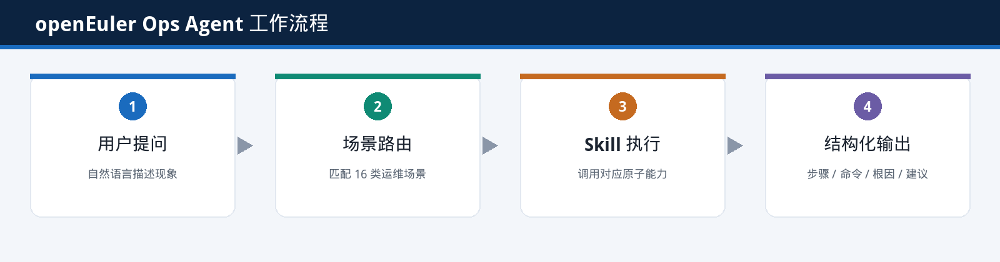
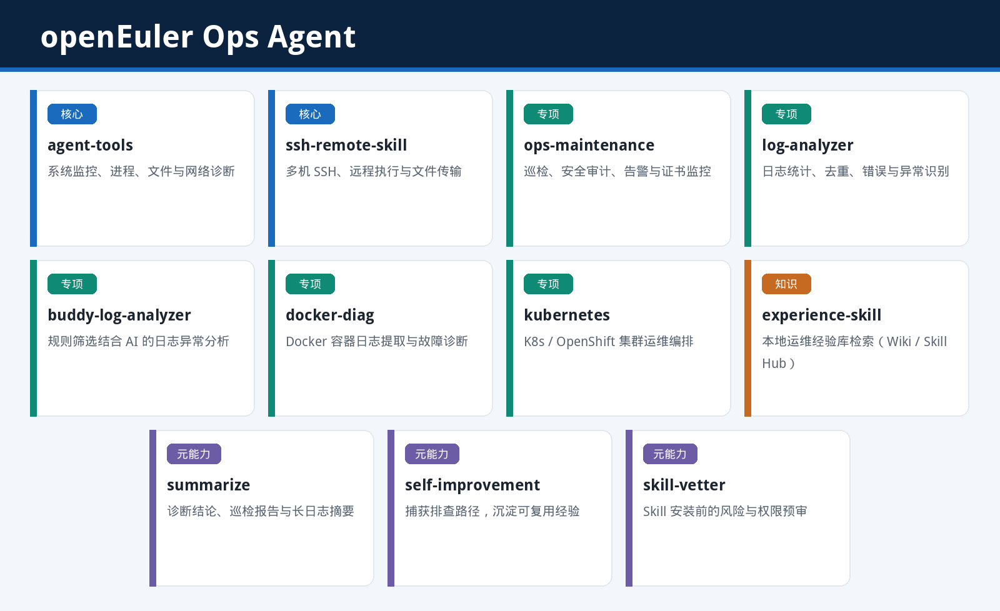
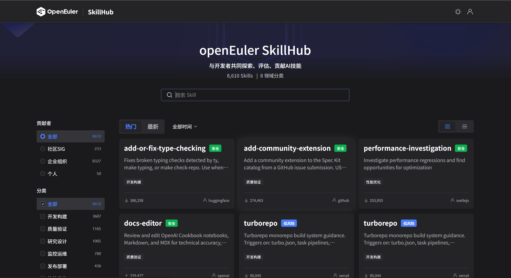
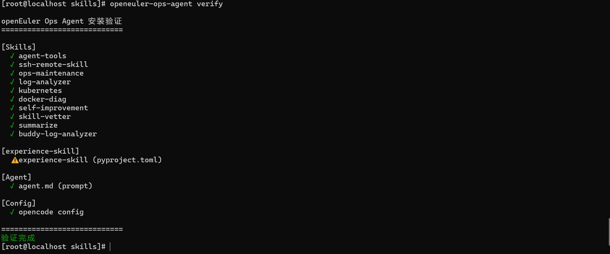
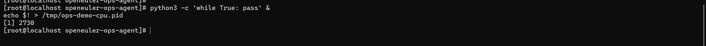
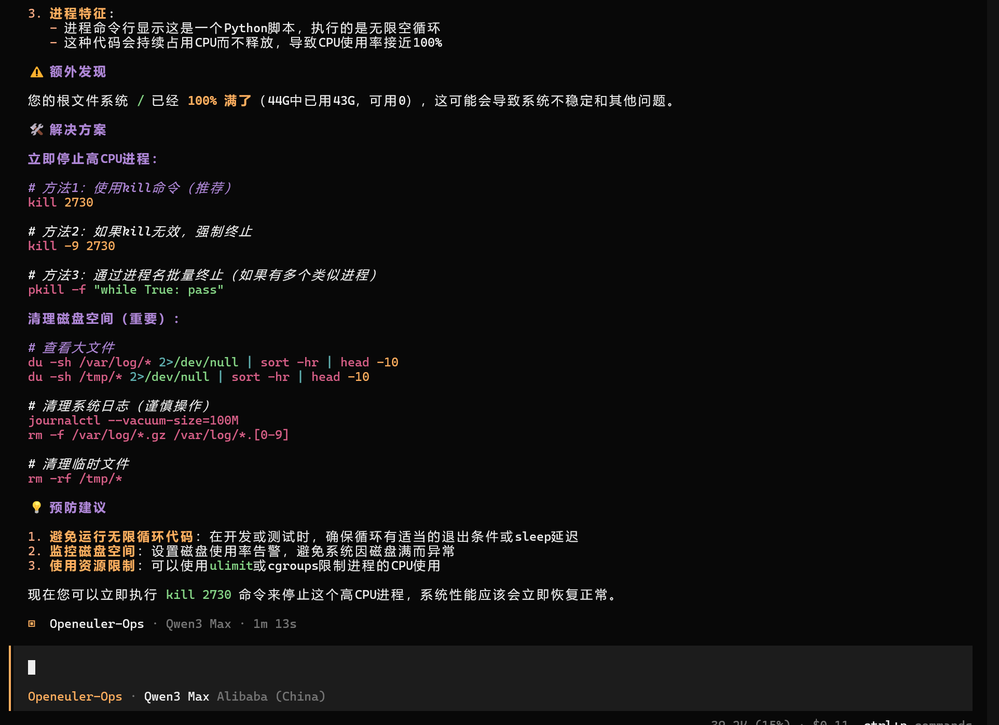

面对一次系统故障，通常需要经历一套相对固定的排查流程：查看系统负载和进程状态，分析`dmesg`、`journalctl` 等日志；如果怀疑存在内核或软件包问题，还需要进一步核对 CVE 和安全公告；当环境涉及多台机器时，则需要逐台登录确认。

这些操作本身并不复杂，但真正困难的是：如何保证排查过程完整、判断依据清晰，并将一次排查形成的经验沉淀下来，供后续类似问题复用。

实际运维工作中更容易出现的情况是：排查顺序因人而异，中间漏掉一环；同类问题上周刚处理过，结论却散落在文档、工单或即时通讯记录里，下一次仍要从头收集信息。对多机、巡检、补丁这类重复性工作，这个问题会更明显。

**OpenAtom openEuler（简称 “openEuler” 或“开源欧拉”） Ops Agent** 正是面向这类场景打造的可对话运维助手。用户只需要通过自然语言描述问题，Agent 就可以按照预先定义的排查路径推进任务，完成系统状态采集、日志分析，并输出可执行的命令和相应的判断依据。

本文将从能力介绍、Skill 体系、SkillHub 以及实际部署几个方面，带你快速了解 openEuler Ops Agent，并通过一个 CPU 高负载案例体验如何使用它完成故障排查。


## 01 openEuler Ops Agent是什么，能做什么

openEuler Ops Agent 是面向 openEuler 的运维助手。用自然语言描述问题即可触发对应流程，不需要先在菜单里选择场景。

它覆盖 16 类常见工作：故障排查、日常巡检、CVE 漏洞修复、安全加固、性能调优、存储管理、网络管理、内核维护、高可用与集群、容器与虚拟化、系统升级回滚、备份恢复、账号权限、服务进程、日志审计，以及知识沉淀。Agent 根据表述中的关键词做场景匹配；信息不够时会先做一两轮澄清，再进入流程。

以故障排查为例，路径是固定的五步。先收集 CPU、内存、磁盘、进程和负载，远程环境会带上 SSH；再对日志做统计、去重和异常分析；有明确异常则对照已有经验给出方案，否则扩大到网络、存储、内核和资源；最后输出故障时间线、根因、可执行命令和预防建议。新问题还可以把排查路径沉淀下来，供下次检索。其余场景同样按预定义步骤推进，只是调用的检查项和 Skill 不同。

工作方式可以概括为：提问进入场景，场景调用 Skill，Skill 产出命令和结论。



---

## 02 Skill 从哪里来

### 2.1 里面有哪些 Skill

场景只规定「先做什么、再做什么」，真正执行命令、看日志、连远程机的是一组 Skill。Agent 本身不内置这些能力的实现，安装时会把下面这些 Skill 拉齐。按用途可以分成四类。



| 类型 | Skill | 能力 |
|------|--------|------|
| 核心 | agent-tools | 本机监控、进程管理、文件处理、网络诊断和日志查看。多数场景都会用到。 |
| 核心 | ssh-remote-skill | 多机 SSH、远程执行命令、文件传输 |
| 专项 | ops-maintenance | 巡检、安全审计、告警、SSL 证书和 Docker 健康检查 |
| 专项 | log-analyzer | 本地日志统计、去重、错误模式和异常识别 |
| 专项 | buddy-log-analyzer | 先按规则筛选，再做日志异常分析 |
| 专项 | docker-diag | Docker 容器日志提取与故障诊断 |
| 专项 | kubernetes | Kubernetes / OpenShift 集群运维编排 |
| 知识 | experience-skill | 检索本地已沉淀的运维经验（Wiki / Skill Hub） |
| 元能力 | summarize | 诊断结论、巡检报告和长日志摘要 |
| 元能力 | self-improvement | 捕获排查路径，生成可复用的经验草稿 |
| 元能力 | skill-vetter | 安装其他 Skill 前做风险和权限预审 |

排查、巡检这类日常工作，一般是 `agent-tools` 打底，需要时再叠日志分析和远程执行。CVE、加固、调优还会用到社区侧的查询接口，那是 Agent 的另一条数据来源，与 Skill 并列，不在上表里。

### 2.2 SkillHub

上面这些 Skill 并不是写死在 Agent 仓库里的，而是发布在 [openEuler SkillHub](https://skillhub.openeuler.org/) 上。SkillHub 用来检索、评估和获取可复用的 Skill：一个 Skill 对应一类明确能力，带 `SKILL.md` 和必要的脚本，可以单独安装，也可以被不同 Agent 组合使用。

Ops Agent 做的是编排。它规定 16 个场景怎么走，安装时再按清单从 SkillHub 把所需 Skill 拉到本地。之后如果某个 Skill 有更新，也可以只升级这一块，而不必重做整个 Agent。



---

## 03 一键构建

代码在 [openeuler/witty-agents](https://atomgit.com/openeuler/witty-agents/) 仓库的 `openeuler-ops-agent` 目录。安装前需要：Node.js 18.18 及以上、Python 3.8 及以上、包管理器 uv，以及 `curl` 和 `tar`。SkillHub 命令行默认装到 `~/.local/bin`，需要把该目录加入 `PATH`：

```bash
echo 'export PATH="$HOME/.local/bin:$PATH"' >> ~/.bashrc
source ~/.bashrc
```

克隆仓库后进入目录，把 Skill 装到 `~/skills`：

```bash
git clone https://atomgit.com/openeuler/witty-agents.git
cd witty-agents/openeuler-ops-agent
npm install -g .
export SKILLS_DIR=~/skills
openeuler-ops-agent install
```

`install` 会检查或安装 skillhub CLI，再按清单从 SkillHub 把所需 Skill 下载到 `~/skills`。本机如果没有预置知识库，`experience-skill` 这一步会跳过，不影响其余 Skill。skillhub CLI 装不上时，Skill 下载也会跳过，修好后再跑一遍 `install` 即可。

装完后建议验证：

```bash
export SKILLS_DIR=~/skills
openeuler-ops-agent verify
```

绿色勾表示对应 Skill 已就绪；黄色三角表示未检测到。下图中 10 个运维 Skill 均为勾选，`experience-skill` 为黄色三角——没有预置知识库时这一项本来就不会就绪，不装也可以使用 Agent。



验证通过后，即可直接用自然语言提问。

---

## 04 使用案例

不需要先选场景，把当前现象用话说清楚即可。有风险的操作（删除、改内核参数、升级等）应等确认后再执行。

下面用一个完整案例说明：先在机器上造一个可逆的异常，再交给 Agent 排查。使用的框架自行选择。

**案例：CPU 持续偏高**

另开一个终端，用下面两条命令占满一核 CPU（只占一核，不会把整机打满），并记下进程号：

```bash
python3 -c 'while True: pass' &
echo $! > /tmp/ops-demo-cpu.pid
```

后台任务会打印出进程号，如下图。记下这个 PID，后面对照 Agent 的结论。



回到对话里，可以这样问：

> 这台机器刚才开始明显变慢，CPU 一直很高。帮我定位是哪个进程在占 CPU，说明判断依据，并给出停止它的命令。

Agent 会去看负载和进程。下图这次演示里，它定位到刚才的 `python3` 死循环（PID 与终端一致），并给出了 `kill` 命令；顺带扫到磁盘已满，也写进了处理建议。看完效果后，用对应 PID 结束这个演示进程即可。



---

## 05 总结

openEuler Ops Agent 把排查路径写进场景，把具体动作交给 SkillHub 上的 Skill，安装后用自然语言就能用。Skill 可以单独更新，场景也可以继续往上加。

仓库在 [openeuler/witty-agents](https://atomgit.com/openeuler/witty-agents/)，Skill 浏览和贡献走 [openEuler SkillHub](https://skillhub.openeuler.org/)。欢迎试用，也欢迎把可复用的运维 Skill 提交到 SkillHub。
