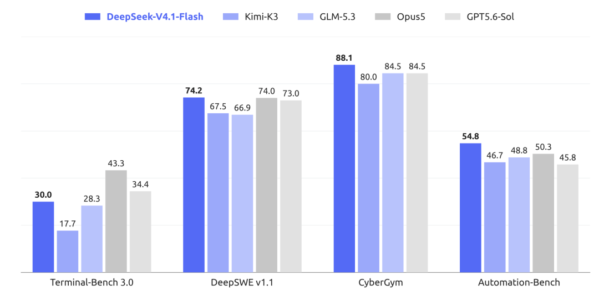
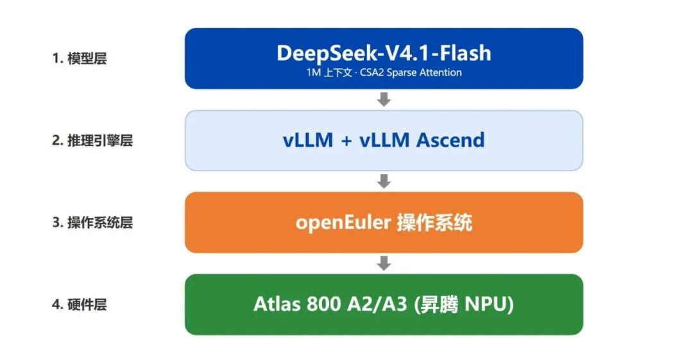

9月10日，DeepSeek V4.1 Flash 正式发布并开源。DeepSeek V4.1 Flash为 552B 参数的 MoE 模型 ，采用全新非对称 Causal-Encoder-Decoder 架构，仅激活 8B 输入、16B 输出参数，算力成本大幅降低。它首次实现 Flash 系列原生图文一体化理解，无需外挂视觉模块；KV 缓存极致压缩，硬件占用远低于前代，推理速度接近上代两倍。经大规模强化学习优化，综合基准能力全面超越 V4 Pro，覆盖编程、智能体、识图等场景。



DeepSeek-V4.1-Flash 与主流前沿模型在 Agentic Benchmark 上的性能对比

DeepSeek-V4.1-Flash 与主流前沿模型在 Agentic Benchmark 上的性能对比  
vLLM 是 PyTorch Foundation 下的开源 LLM 推理引擎，为用户和开发者提供快速、易用的 LLM 推理能力。vLLM-Ascend 提供了 vLLM 对昇腾的支持。本指南将帮助你使用 OpenAtom openEuler（简称：“openEuler”或“开源欧拉”）和 vLLM Ascend 在昇腾上运行DeepSeek V4.1 Flash。

本指南将采用 vLLM Ascend 的容器镜像启动方式，在2台昇腾 Atlas 800 A3 (64G × 16) 节点上运行DeepSeek V4.1 Flash。



## 步骤一：确保昇腾驱动正常安装

在拉起容器前，请先确保昇腾驱动已经正常安装，可使用 npu-smi info 命令进行查看。

## 步骤二：下载模型权重

[DeepSeek-V4.1-Flash-w8a8](https://www.modelscope.cn/models/Eco-Tech/DeepSeek-V4.1-Flash-w8a8)

## 步骤三：拉起vLLM Ascend容器运行环境

本次采用PD分离的部署方式，先在双机上拉取镜像，构建容器

```
export IMAGE=quay.io/ascend/vllm-ascend:deepseek-v4.1-flash-a3
export MODEL_ROOT="/data/weights"

docker pull "$IMAGE"

docker run --rm -it \
  --name deepseek-v41 \
  --net=host \
  --shm-size=512g \
  --privileged=true \
  --device /dev/davinci0 \
  --device /dev/davinci1 \
  --device /dev/davinci2 \
  --device /dev/davinci3 \
  --device /dev/davinci4 \
  --device /dev/davinci5 \
  --device /dev/davinci6 \
  --device /dev/davinci7 \
  --device /dev/davinci8 \
  --device /dev/davinci9 \
  --device /dev/davinci10 \
  --device /dev/davinci11 \
  --device /dev/davinci12 \
  --device /dev/davinci13 \
  --device /dev/davinci14 \
  --device /dev/davinci15 \
  --device /dev/davinci_manager \
  --device /dev/devmm_svm \
  --device /dev/hisi_hdc \
  -v /usr/local/dcmi:/usr/local/dcmi \
  -v /usr/local/Ascend/driver/tools/hccn_tool:/usr/local/Ascend/driver/tools/hccn_tool \
  -v /usr/local/bin/npu-smi:/usr/local/bin/npu-smi \
  -v /usr/local/Ascend/driver/lib64/:/usr/local/Ascend/driver/lib64/ \
  -v /usr/local/Ascend/driver/version.info:/usr/local/Ascend/driver/version.info \
  -v /etc/ascend_install.info:/etc/ascend_install.info \
  -v /etc/hccn.conf:/etc/hccn.conf \
  -v "$MODEL_ROOT:$MODEL_ROOT" \
  "$IMAGE" bash

```

## 步骤四：在容器环境内部署推理服务

在双机上同时运行指令，注意P节点的 NODE_RANK为0，D节点的NODE_RANK为1。

```
set -euo pipefail

NODE_RANK=0
NODE0_IP="<NODE0_IP>"
LOCAL_IP="<LOCAL_IP>"
NIC_NAME="<NETWORK_INTERFACE>"
MODEL_PATH="<YOUR_MODEL_PATH>"

export HCCL_IF_IP="$LOCAL_IP"
export GLOO_SOCKET_IFNAME="$NIC_NAME"
export TP_SOCKET_IFNAME="$NIC_NAME"
export HCCL_SOCKET_IFNAME="$NIC_NAME"
export VLLM_ENGINE_READY_TIMEOUT_S=1800
export ASCEND_RT_VISIBLE_DEVICES=0,1,2,3,4,5,6,7,8,9,10,11,12,13,14,15

if [[ -f /usr/lib/aarch64-linux-gnu/libjemalloc.so.2 ]]; then
  export LD_PRELOAD="/usr/lib/aarch64-linux-gnu/libjemalloc.so.2${LD_PRELOAD:+:$LD_PRELOAD}"
fi

DP_START_RANK=$((NODE_RANK * 2))
HEADLESS_ARGS=()
if [[ "$NODE_RANK" != "0" ]]; then
  HEADLESS_ARGS+=(--headless)
fi

vllm serve "$MODEL_PATH" \
  --host 0.0.0.0 \
  --port 8000 \
  "${HEADLESS_ARGS[@]}" \
  --data-parallel-address "$NODE0_IP" \
  --data-parallel-rpc-port 13399 \
  --data-parallel-size 4 \
  --data-parallel-size-local 2 \
  --data-parallel-start-rank "$DP_START_RANK" \
  --tensor-parallel-size 8 \
  --enable-expert-parallel \
  --served-model-name deepseek-v41 \
  --max-model-len 32768 \
  --max-num-batched-tokens 8192 \
  --max-num-seqs 32 \
  --gpu-memory-utilization 0.90 \
  --block-size 128 \
  --tokenizer-mode deepseek_v41 \
  --reasoning-parser deepseek_v41 \
  --tool-call-parser deepseek_v41 \
  --enable-auto-tool-choice \
  --trust-remote-code \
  --model-loader-extra-config '{"enable_multithread_load":true,"num_threads":128}' \
  --safetensors-load-strategy lazy \
  --quantization ascend \
  --additional-config '{"enable_engram":true,"engram_storage":"int8","enable_cpu_binding":true,"ascend_compilation_config":{"enable_npugraph_ex":false,"enable_static_kernel":false}}' \
  --speculative-config '{"method":"dspark","num_speculative_tokens":5,"enforce_eager":true}' \
  --compilation-config '{"cudagraph_mode":"FULL_DECODE_ONLY"}'

```

## 步骤五：验证

待服务启动后，在P节点上通过curl命令发送请求来验证是否部署成功。

```
文本：
curl -sS http://127.0.0.1:8000/v1/chat/completions \
  -H 'Content-Type: application/json' \
  -d '{
    "model": "deepseek-v41",
    "messages": [{"role": "user", "content": "Who are you?"}],
    "temperature": 0,
    "max_completion_tokens": 1024
  }' | jq '.choices[0].message.reasoning'
图片：
curl -sS http://127.0.0.1:8000/v1/chat/completions \
  -H 'Content-Type: application/json' \
  -d '{
    "model": "deepseek-v41",
    "messages": [{
      "role": "user",
      "content": [
        {"type": "image_url", "image_url": {"url": "https://picsum.photos/id/237/400/300"}},
        {"type": "text", "text": "Describe this image."}
      ]
    }],
    "temperature": 0,
    "max_completion_tokens": 512
  }' | jq '.choices[0].message.content'

```

