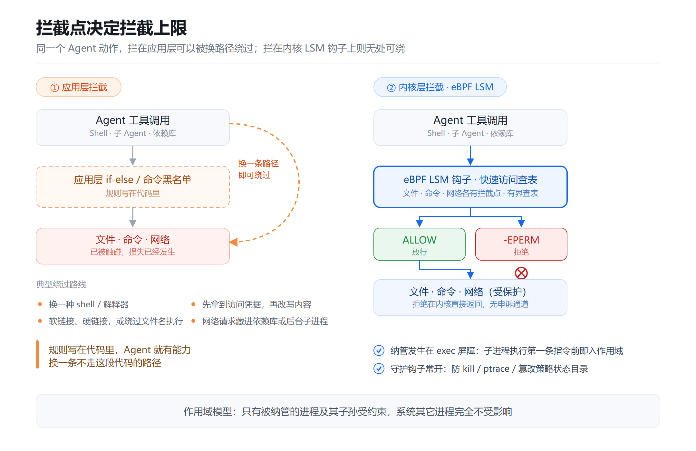
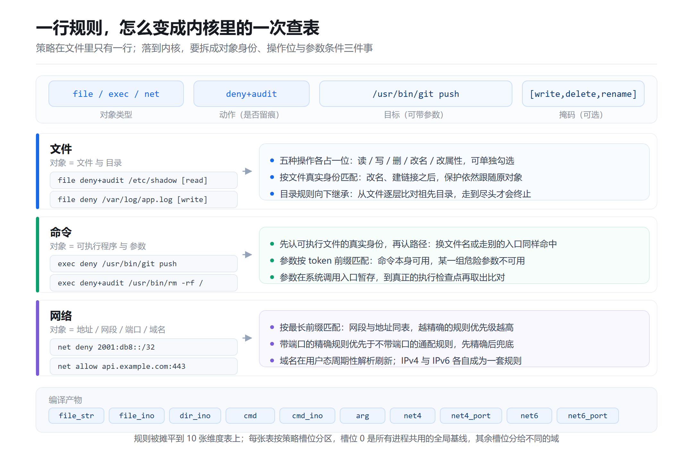
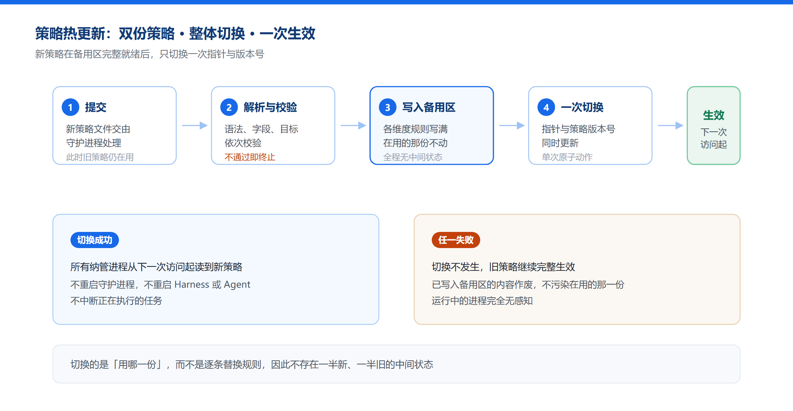
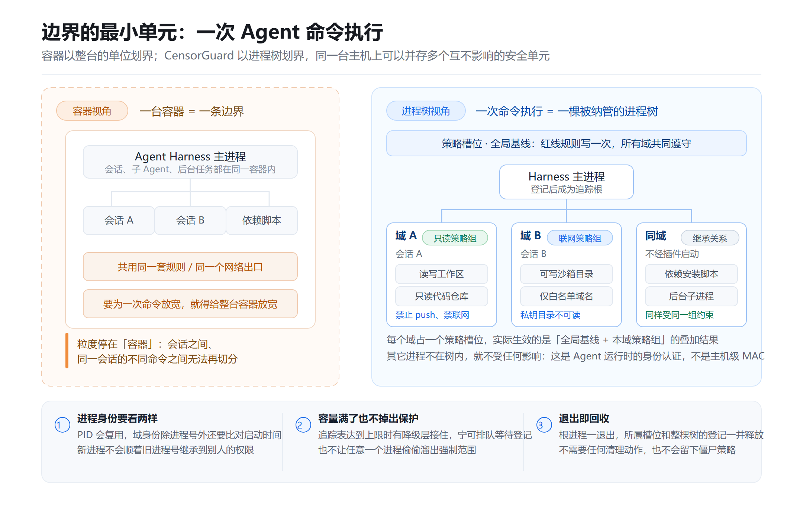
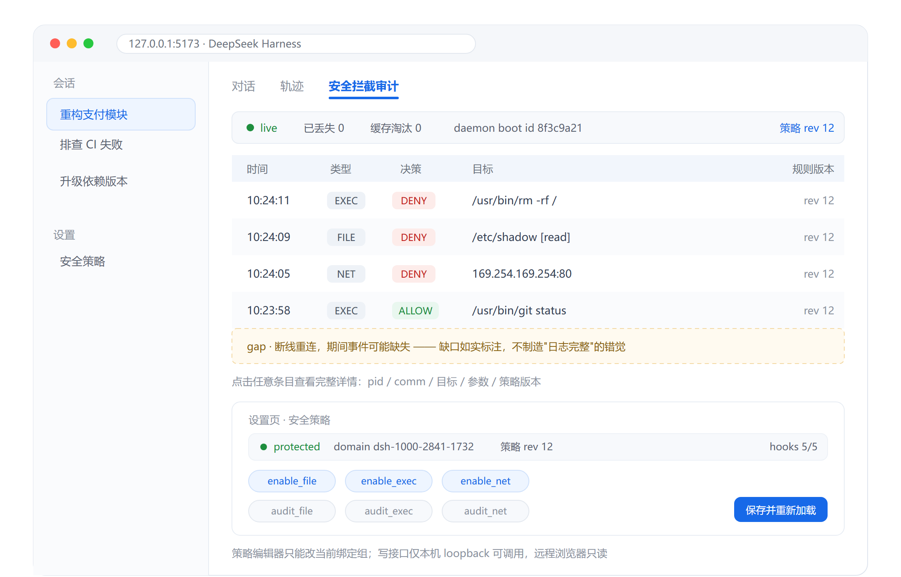
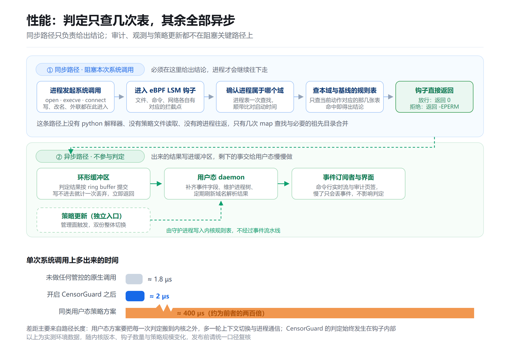

在本系列的第一篇文章[《Agent 可观测 & 治理系列 | AgentCensor：一套为 Agent 而生的治理底座》](https://mp.weixin.qq.com/s/JXn4IUrBgRz4Ku6dOqw1sw)中里，我们把 AgentCensor 拆成了三件事：CensorGuard 回答能不能做，CensorFS 回答改了什么，CensorScope 回答证据怎么说清。本篇展开讲第一个组件——[CensorGuard](https://gitcode.com/openeuler/AgentCensor)。

它的职责只有一件：在 Agent 的工具调用到达系统层时，帮你最后做一次判断。也就是说，即使你误操作按下回车准备执行删除命令，CensorGuard也能帮你兜底拒绝。

---

## 01 拦截层级有哪些，内核处拦截有什么好处

想阻止 Agent 执行 `rm -rf /`，可以拦在哪儿？先把可选的位置摆出来：

| 拦截位置                   | 被绕过的难度       | 绕过方法       |
| ---------------------- | ------------ | ---------- |
| 提示词 / 系统人设             | 极低           | 注入一段文本即可覆盖 |
| 应用层 if-else、命令黑名单      | 低            | 换一条调用路径就失效 |
| 容器 / 沙箱边界              | 中            | 边界粒度是整个容器  |
| 事后日志告警                 | 不适用          | 损失已经发生     |
| **系统调用进内核处（eBPF LSM）** | **进程自身无法绕过** | /          |

这五种防护位置层级不同、能力互补。实际部署里常常几层叠加，提示词与沙箱负责挡住绝大多数常规情况，当应用层的防护手段全部失效时，内核层的防护就可以为您做最后的兜底。

先看外层为什么会漏。应用层方案的根本缺陷是：**规则写在代码里，而 Agent 有能力换一条不走这段代码的路径**。

常见的换法有四种：

- 把 `bash` 换成另一种 shell 或解释器
- 用软链接、硬链接，甚至直接绕过文件名执行
- 先拿到访问凭据，再改写内容
- 把网络请求藏进依赖库或后台子进程

这四条的共同点是：它们都在规则看不到的地方完成动作。外层拦不住的，只能交给一个所有路径都必经的位置——这就是为什么最终要落到内核。

CensorGuard 的答案是**把判定放进动作真正发生的那一刻**：Agent 真的要打开那个文件、执行那个程序、建立那条连接时，CensorGuard在内核先将动作拦下，然后根据策略判断放行或拒绝。它不依赖 Agent 用了哪个 SDK、走哪条调用路径，也不需要 Agent 配合。技术上，策略由守护进程编译下发，判定由内核在系统调用入口完成，Agent 找不到一个能跳过这次判定的入口。

CensorGuard 还有一个优势：**守护自身也在保护范围内**。Agent 若想反制，比如停掉守护进程、往进程里注入代码、篡改策略数据，这些动作同样要过这一层判定，会被拒绝并留痕；策略的写入口只开放给特权控制通道。概括来说：**管控系统的启停与配置，不受被管进程左右**。



---

## 02 事前划界：粒度细到参数、基线全域兜底、更新秒级生效

事前划界，划的就是上面那张表：在 Agent 动手之前，把"哪些对象能碰、哪些动作能做、哪些地址能连"定义清楚。

多数 Agent 安全方案的策略是一张命令黑名单，只能回答这条命令让不让用。真实需求要具体得多：git 可以用，但不能 push；日志可以读，但不能改；网络可以通，但只能去白名单里的地址。

CensorGuard 的规则一行只描述一件事，但足以把需求落到这个精度。每行规则由对象类型、动作、目标和可选掩码组成，编译之后拆进内核里对应的维度表：



落到文件里，就是一份人人能读的清单：

```yaml
# 动作有四种：放行、拒绝、放行+留痕、拒绝+留痕
rules:
  - file deny+audit /etc/shadow [write,delete,rename]
  - exec deny+audit /usr/bin/rm -rf /
  - net deny 2001:db8::/32            # 裸 IPv6/CIDR 无端口
  - net allow+audit [::1]:443         # 带端口必须写 [地址]:端口
  - net deny api.example.com:8443     # 域名规则，DNS 自动展开
```

### 基线策略与自定义策略：划界的两层

CensorGuard 支持配置全局安全基线，覆盖凭证、管控系统自身、破坏性命令、代码外泄、高危外联五类高频风险，默认生效：

```yaml
# base.yaml —— 全局安全基线，安装即用
rules:
  # 1) 凭证与身份：一律拒绝
  - file deny+audit /etc/shadow
  - file deny+audit /etc/sudoers
  - file deny+audit /root/.ssh
  - file deny+audit /run/secrets

  # 2) 管控系统自身：配置与状态只读
  - file deny+audit /etc/censorguard [write,delete,rename]
  - file deny+audit /var/lib/censorguard [write,delete,rename]

  # 3) 破坏性命令：参数级前缀匹配
  - exec deny+audit /usr/bin/rm -rf /
  - exec deny+audit /usr/bin/mkfs
  - exec deny+audit /usr/bin/dd of=/dev/
  - exec deny+audit /usr/bin/chmod -R 777

  # 4) 代码资产：git log可用，git push 不行
  - exec deny+audit /usr/bin/git push

  # 5) 高危外联：云元数据服务，凭证外泄的经典跳板
  - net deny 169.254.169.254
	...
```

基线策略只是起点，CensorGuard 也支持配置与具体Agent 任务相关的自定义策略——某个生产库目录、某段内网网段、某个不该被 `curl` 触达的地址——追加到自定义策略下即可。

```yaml
# user-defined.yaml —— 自定义策略，叠加在内置基线之上
rules:
  - file deny+audit /srv/prod-db [read,write,delete]
  - exec deny+audit /usr/bin/curl
  - net deny 10.0.0.0/8
```

换句话说：**基线策略回答"什么绝对不能碰"，自定义策略回答"这个 Agent 还有哪些不能碰"**。

### 策略热更新：即改即生效，任务不中断

Agent 在运行过程中，随着任务不断进行，其风险边界会变，因此 CensorGuard 支持策略在Agent运行中热更新策略，无需中断Agent进程。策略下发通过预解析预写、全维度校验、原子指针切换三步，实现了高效准确的策略热更新。



---

## 03 事中拦截：边界画在哪，从容器细化到一次命令执行

策略定义清楚、也能随时重划之后，剩下的是运行时问题：**它管到多大范围**。这就是事中拦截的边界——执行者是第 01 节的内核钩子，作用域是这里要说的域。

容器有价值，但它的边界是这台容器。一个同时运行多个会话、多个子 Agent 的 Harness，不可能为每次命令执行都启动一台容器。

CensorGuard 追踪的是**进程树**：一次命令执行拉起来的那棵树就是一个域，绑定一组策略；同一台主机上可以并存多个互不影响的域。安全边界的最小单元，由此从容器细化到了**一次 Agent 命令执行**。



---

## 04 事后可审：每一次判定都留下可核查的依据

拦住不是终点，能被复盘才算闭环。CensorGuard 对每一次放行与拒绝都上报审计事件，事件里带上时间、域、进程、对象、动作、判定结果，以及这次判定所依据的策略版本与命中的规则。事后追问"当时为什么拒绝""这次放行依据的是哪一版策略"，答案是查得到的，不是推断出来的。

配合策略版本号一起看，效果更直接：策略每次热更新都会推进版本号，审计事件带着版本号落盘，任何一次判定都能回溯到当时的那一版策略，而不是"现在的策略"。

这条证据链在使用者面前是可视的。以deepseek harness为例，插件安装后 WebUI 多出两个入口：

- 设置页的**安全策略**：保护状态一目了然，当前策略版本与规则可在线查看、编辑和校验，运行时开关即点即切。
- 会话里的**安全拦截审计**页签：本域全部拦截与放行事件实时滚动，可按类型过滤，点开看完整详情。



---

## 05 实操：从零到拦住一次 `rm -rf`

**环境自检**

需要 BPF LSM、BTF 与 libbpf，主流发行版（openEuler 24.03、较新的 Ubuntu/Fedora）默认满足：

```bash
cat /sys/kernel/security/lsm | tr ',' '\n' | grep -x bpf   # 输出 bpf
ls /sys/kernel/btf/vmlinux                                  # 存在即可
./scripts/check-env.sh                                      # 工具链一次性自检
```

内核若未启用 BPF LSM，在启动参数里打开它再重启即可。

**构建与安装**

```bash
make all                    # 静态检查 + eBPF 数据面 + release 构建
sudo make install-files
sudo systemd-sysusers /usr/lib/sysusers.d/censorguard.conf
sudo systemd-tmpfiles --create /usr/lib/tmpfiles.d/censorguard.conf
sudo systemctl daemon-reload
sudo systemctl enable --now censorguardd.service
```

配套的本地适配服务由 systemd 部署自动拉起并守护，不需要单独安装。
检查一下是否正常运行：

```bash
sudo systemctl start censorguardd
sudo systemctl status censorguardd
```

**下发策略并观察拦截**

策略沿用内置基线 `base.yaml`。本场景只需在 `rules` 下追加两条实验规则，reload 时指向这份文件，新旧策略整体切换：

```yaml
sudo vim /etc/censorguard/base.yaml —— 内置基线原样保留，末尾追加两条实验规则
rules:
  # …内置基线部分略…
  - file deny+audit /root/.ssh [read]    # 追加：验证文件拦截
  - exec deny+audit /usr/bin/id          # 追加：验证命令拦截
```

可以先开一个订阅窗口看事件（可选）：

```bash
sudo censorguard-audit launch                                  # 实时事件流
```

先下发策略，在bash中启用这个策略：

```bash
sudo censorguardctl reload --file /etc/censorguard/base.yaml
sudo censorguardctl spawn --domain lab-agent -- bash    # 进入到受控shell中
cat /root/.ssh			# 在受控shell中验证文件拦截效果
/usr/bin/id			    # 在受控shell中验证命令拦截效果
```

**接入 DeepSeek Harness**

CensorGuard 已支持通过插件的形式接入到DSH。
启动好deamon程序并安装上插件后，DSH 主进程启动时会自动向守护进程登记自己，身份由内核侧的进程凭据确认、无法伪造。登记成功后，整个dsh进程树都在强制之下，包括那些不经任何插件通道启动的子进程。

```bash
# root 一次性准备
sudo censorguardctl policy apply --name censorguard-dsh-default --file config/policy.dsh-default.yaml
sudo usermod -aG censorguard <用户名>     # 加入后重新登录生效

# 普通用户安装插件
pnpm dsh plugin --profile web add /path/to/CensorGuard/plugins/dsh-censorguard
pnpm dsh web
```

安装完成后，WebUI 上出现两个新入口：设置页的安全策略，以及会话里的安全拦截审计页签。

---

## 06 性能：判定在快路径，其余在异步路径

引入强制管控，最常见的顾虑是性能开销。CensorGuard 把必须快的部分和可以慢的部分彻底分开：判定发生在内核钩子内部，只有几次查表；审计、观测与策略更新走异步路径，不阻塞任何一次系统调用。



实测数据可以说明差距：未做任何管控时，单次系统调用的基线开销约 1.8µs；开启 CensorGuard 后底噪仅升至约 2µs；同类用户态方案一旦开启，会来到 400µs 量级。差距主要来自路径长度：用户态方案的每次判定都要走出内核再回来。管理面同样轻量：万条策略量级下毫秒级下发，不重启、不中断在跑的任务。

---

## 把"能不能做"变成一次可复盘的判定

Agent 时代，安全的最小单元不再只是用户或容器，而是一次具体的 Agent 运行：它是谁、属于哪个会话、正在执行什么命令、要访问哪个对象、带哪些参数、连哪个端口，以及这次行为依据的是哪一种策略。

CensorGuard 的回答，是把这些维度收进内核里的一次查表：**事前用策略划清边界，事中由内核在进程树范围内拦截，事后把每一次判定连同策略版本留成可核查的证据**。

当 Agent 可以替你写代码、改仓库、跑脚本、连网络时，可靠的做法不是寄望于它不犯错，而是在它犯错之前，系统已经能够拒绝，并给出可核查的依据。

---

## 系列预告

本篇讲的是 CensorGuard 如何把"能不能做"这件事收进内核：拦截层级有哪些、为什么最终要下沉到系统调用；事前如何用内置基线与自定义策略划界、边界又如何随时重划；事中边界如何从容器细化到一次 Agent 命令执行并由内核强制；事后如何留下可核查的判定证据。

📌系列第三篇将聚焦 CensorFS：Agent 的写入如何先落进私有层，发布如何做到原子，系统侧如何完成回滚。

---

## 欢迎加入我们

目前，CensorGuard 已在 GitCode 开源，仓库中提供了完整的构建脚本、systemd 部署文件与集成验证脚本。如果你正在构建 AI Agent、代码执行平台或多租户 Harness，欢迎基于示例策略跑一遍：拒绝、热更新、审计闭环，几步就能验证。

- **代码仓**：[https://gitcode.com/openeuler/AgentCensor](https://gitcode.com/openeuler/AgentCensor)
- **开发 & 维护 SIG**：sig-DevStation

欢迎添加下方 openEuler 小助手，由小助手邀请你加入 DevStation 交流群。


