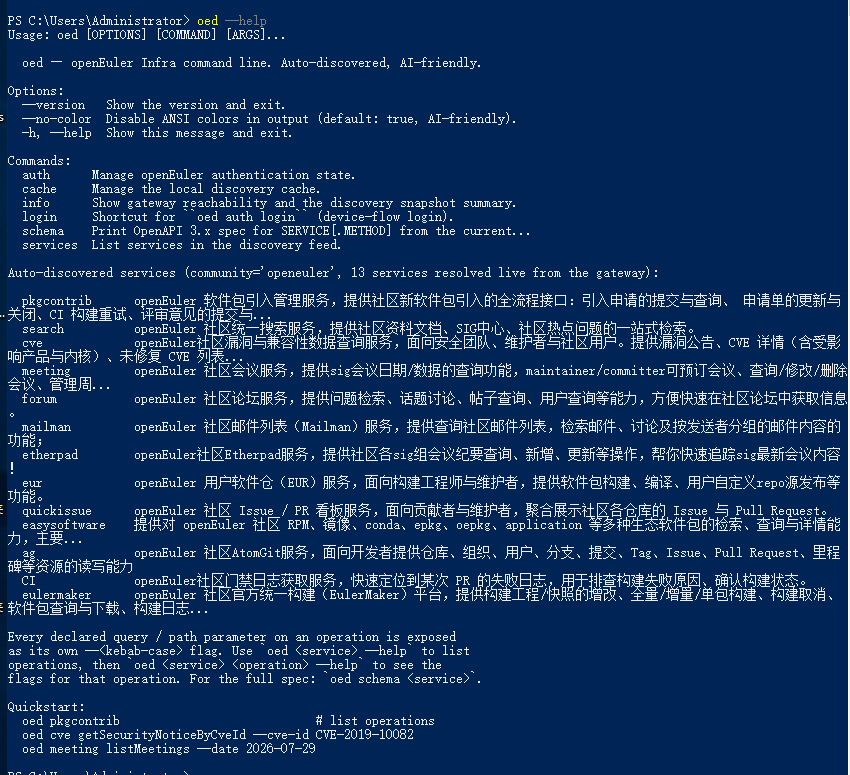
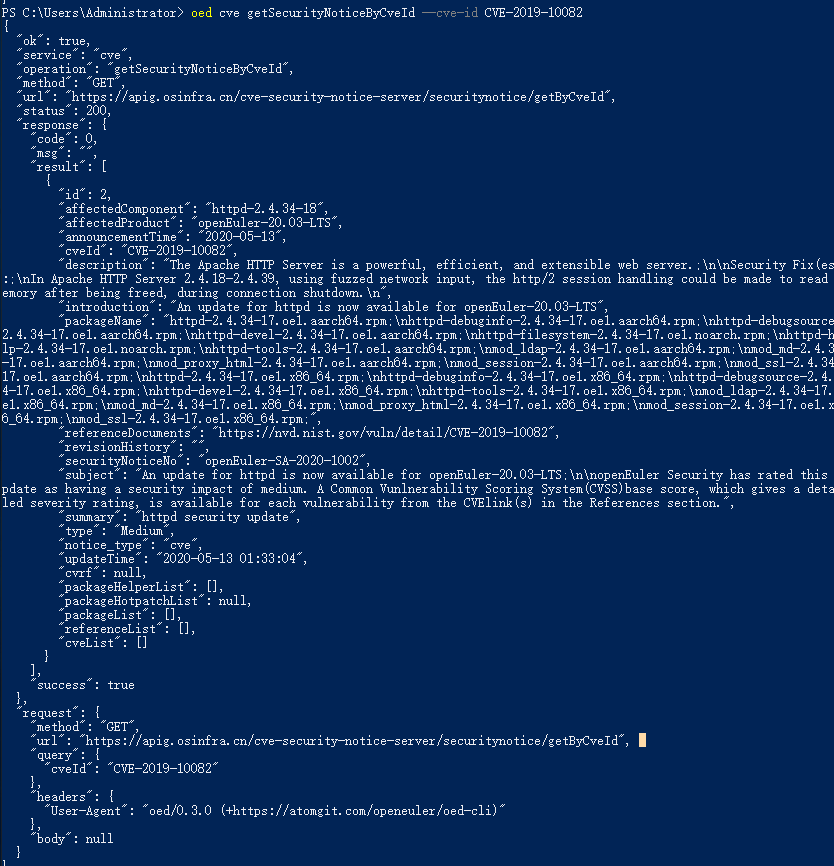
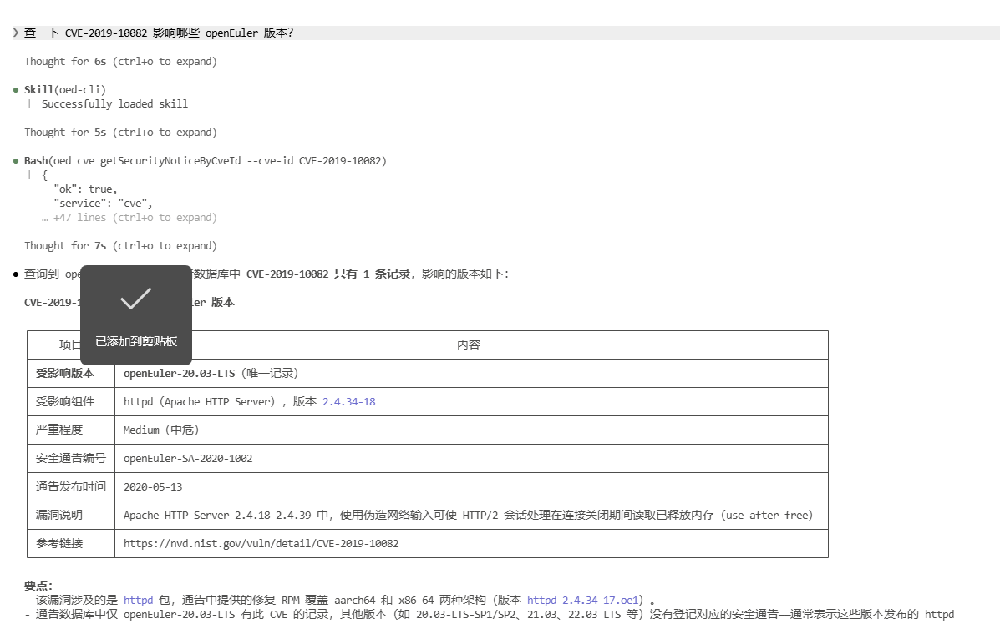
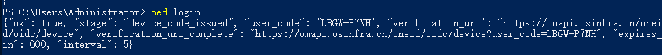

openEuler 社区的在线服务并不少：CVE 安全通告、软件包与构建（euler-maker）、论坛与邮件列表、会议系统、SIG 组仓库与文档搜索、代码托管（AtomGit）……每个服务都开放了 HTTP API，但想把它们用起来，各有各的麻烦：网关前置了 WAF，手工 `curl` 要带上浏览器风格的请求头；参数命名 camelCase 与 snake_case 混着来；有的服务要认证，有的请求体格式不填对就直接 400。想写脚本自动化，或者让 AI Agent 来调用，每接一个新服务都要重新踩一遍坑。

**OpenAtom openEuler（简称 "openEuler" 或"开源欧拉"）** 的 oed-cli（命令名 `oed` = openEuler Developer CLI）把这件事收敛成一条命令：所有社区在线服务，统一入口、统一输出、统一错误码。

## 01 oed 是什么，能做什么

`oed` 并不内置一份静态命令列表。它在运行时读取 openEuler 基础设施网关的发现服务（`https://api-gateway.osinfra.cn/discovery/apis`），拉取每个服务发布的 OpenAPI 规范，动态构建出完整的命令接口。新服务上线、老接口加参数，`oed` 下一次调用就能识别——无需升级 CLI 本身。10 分钟的缓存让 CI 里的密集调用保持低成本；确定网关刚发布了更新时，`oed cache refresh` 可以强制立即重新拉取。

三个设计决定，让它对脚本和 Agent 都友好：

- **stdout 永远是一个 JSON 对象**，日志和进度走 stderr。所以 `oed ... | jq` 永远是安全的，不会被调试输出污染。
- **退出码固定为五个**：`0` 成功 · `1` 用户错误 · `2` 网络错误 · `3` 上游错误 · `4` 未找到。CI 和 Agent 脚本按退出码分流即可，不用去解析报错文案。
- **`--help` 本身也是 JSON**。每个操作需要哪些参数、哪个必填、请求体长什么样，都从 OpenAPI 规范自动推导出来，Agent 可以完全靠自己探索学会用法，不需要提前"背"命令。

当前已覆盖的服务用 `oed services` 查看实时列表（CVE 安全通告、论坛、mailman、会议、SIG 文档搜索、euler-maker、AtomGit 等）。



## 02 一条命令查 CVE 安全通告

以查一个 CVE 的影响范围为例：

```bash
oed cve getSecurityNoticeByCveId --cve-id CVE-2019-10082
```

这一行命令里，`oed` 替你做了好几件事：从网关发现 `cve` 服务并拉取其规范；从规范声明的 `query.cveId` 参数自动推导出 `--cve-id` 标志（camelCase 转 kebab-case，原始名 `--cveId` 也接受）；自动填充 WAF 要求的浏览器请求头；通过生产网关发请求，在 stdout 上输出纯 JSON：

```json
{
  "ok": true,
  "service": "cve",
  "operation": "getSecurityNoticeByCveId",
  "method": "GET",
  "url": "https://apig.osinfra.cn/cve-security-notice-server/securitynotice/getByCveId",
  "status": 200,
  "response": {
    "code": 0,
    "msg": "",
    "success": true,
    "result": [
      {
        "cveId": "CVE-2019-10082",
        "securityNoticeNo": "openEuler-SA-2020-1002",
        "affectedProduct": "openEuler-20.03-LTS",
        "affectedComponent": "httpd-2.4.34-18",
        "type": "Medium",
        "summary": "httpd security update",
        "announcementTime": "2020-05-13"
      }
    ]
  },
  "request": {
    "method": "GET",
    "url": "https://apig.osinfra.cn/cve-security-notice-server/securitynotice/getByCveId",
    "query": { "cveId": "CVE-2019-10082" },
    "headers": { "User-Agent": "oed/0.3.0 (+https://atomgit.com/openeuler/oed-cli)" }
  }
}
```

上面是节选：完整通告还包含漏洞描述、参考文档、受影响软件包清单等字段；末尾的 `request` 块回显实际发出的请求（包括自动填充的 WAF 请求头），方便核对。如果查询的 CVE 没有 openEuler 通告，`result` 会是空数组、退出码仍为 `0`——这是真实的「查无记录」而不是错误。

接 `jq` 提取关心的字段：

```bash
oed cve getSecurityNoticeByCveId --cve-id CVE-2019-10082 \
  | jq '.response.result[0] | {cveId, affectedProduct, affectedComponent}'
```

参数不用靠猜，每个操作都有自己的 JSON 版 `--help`：

```bash
oed cve getSecurityNoticeByCveId --help
```

输出里包含每个参数推导出的标志、是否必填，以及一行可直接复制的 usage。对 POST/PUT/PATCH 操作，同一个输出还会给出 `body_schema` 和 `body_required_fields`——请求体用 `--json '{...}'` 传（`--params` 只承载查询/路径参数，传 body 会被 `oed` 提前拒绝，而不是变成网关上一个晦涩的 400）。正式调用前还可以加 `--dry-run` 预览完整请求，不发任何网络流量。



## 03 安装与 Agent Skill

日常使用 pip，CI 用 pipx 隔离环境：

```bash
pip install oed-cli        # 或：pipx install oed-cli
oed --version              # → oed, version 0.3.0
```

如果要让 AI 框架（Claude Code / Cursor / OpenCode 等）正确调用 `oed`，还需要安装项目自带的 [Agent Skill](https://gitcode.com/openeuler/oed-cli/blob/master/.claude/skills/oed-cli/SKILL.md)——skill 不随 pip 包分发，拷到框架的 skills 目录即可，以 Claude Code 为例：

```bash
git clone --depth 1 https://gitcode.com/openeuler/oed-cli /tmp/oed-cli \
  && mkdir -p ~/.claude/skills \
  && cp -r /tmp/oed-cli/.claude/skills/oed-cli ~/.claude/skills/
```

这份 skill 里沉淀了网关侧的几个"坑"：论坛（Discourse）的 `Api-Key` / `Api-Username` 请求头由网关在边缘自动换取，自己传反而会报错；请求体只能走 `--json`；`ag` 操作需要先登录存 token。Agent 加载 skill 后会自动避开这些陷阱，这也是"装 skill"这一步不能省的原因。

## 04 交给 Agent：用自然语言查社区

`oed` 的推荐 Agent 工作流是一条探索链：`oed info` 确认网关连通 → `oed --help` 学服务清单 → `oed <service> --help` 看操作列表 → `oed <service> <operation> --help` 看参数 → `--dry-run` 预演 → 正式调用。每一步的输出都是 JSON，Agent 自己就能走完。

装好 skill 之后，打开你的 Agent，先让它学一次：

> 请学习 oed --help 有哪些命令？

之后直接说需求即可：

> 查一下 CVE-2019-10082 影响哪些 openEuler 版本？

Agent 会自己选服务、从 `--help` 推导出参数、拼出调用并解析结果。整个过程不需要你背命令，也不需要先读 API 文档——命令表是运行时从网关发现的，Agent 学到的和线上最新状态是一致的。



## 05 需要登录的场景

查询类服务开箱即用；涉及用户身份的服务（`eulermaker`、`pkgcontrib`、`meeting` 等）和 AtomGit 需要先登录。

**oneid 设备码登录**。执行 `oed login`，终端会给出一个 `user_code` 和 `verification_uri`，在任意浏览器（同机、手机或远程会话都行）打开链接、确认授权，CLI 自动完成令牌交换并继续。这是标准的 RFC 8628 设备授权流程：没有本地 HTTP server，不需要注册 `redirect_uri`，没有 `client_secret`，所以 SSH 远程机和无界面环境同样适用。令牌优先存入操作系统凭证库（macOS Keychain / Windows DPAPI / Linux SecretService），没有可用凭证库时回落到 `0600` 权限的本地文件。



**AtomGit（`ag`）令牌**。执行一次 `oed ag login` 存入个人访问令牌，之后每个 `oed ag ...` 调用都会自动注入 `access_token`——不需要（也不应该）把令牌手工塞进参数，`--dry-run` 的请求预览里它只显示为 `<stored>`。`oed auth status` 随时查看登录状态，令牌只以指纹形式展示。

## 06 总结

oed-cli 的核心思路是：把"版本管理"收敛到唯一会演进的地方——网关自身的 OpenAPI 规范。CLI 不为每个服务维护客户端代码，stdout 只输出 JSON，退出码只有五个，参数标志由规范自动推导。对人，它是一条命令的查询入口；对 Agent，它是一个可以完全自主探索、装上 skill 即可正确使用的工具集。

- 仓库：<https://gitcode.com/openeuler/oed-cli>
- PyPI：<https://pypi.org/project/oed-cli/>
- 设计文档：仓库内 [docs/cli-design.md](https://gitcode.com/openeuler/oed-cli/blob/master/docs/cli-design.md)

欢迎使用，也欢迎在仓库提 issue 和补丁——无论是报一个新服务的接入需求，还是让 Agent Skill 里的避坑清单更长一条。
