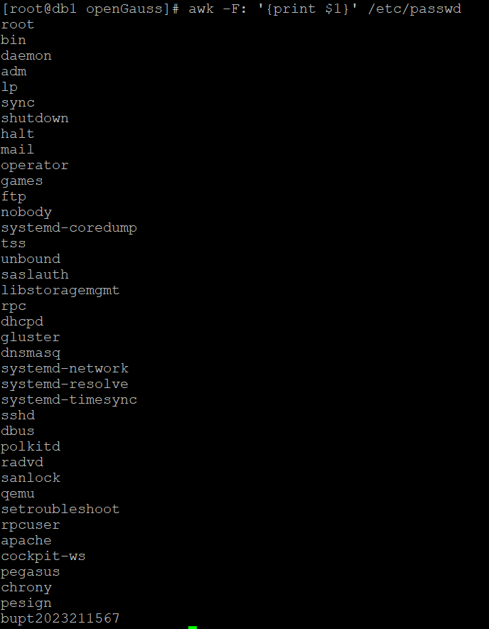
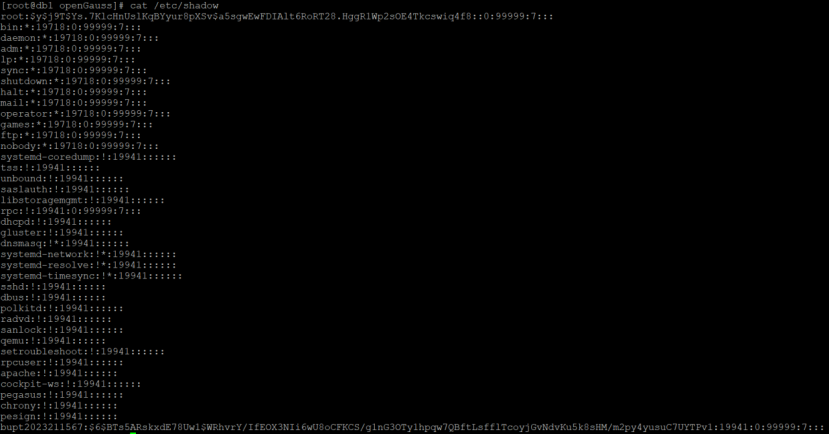
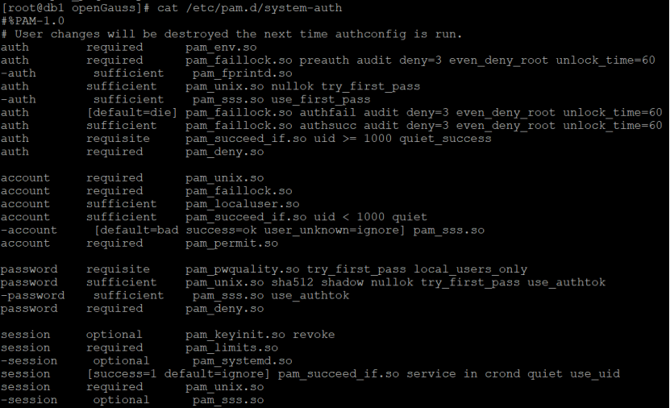
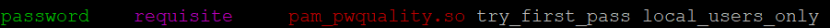
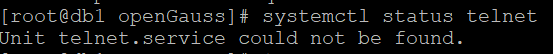
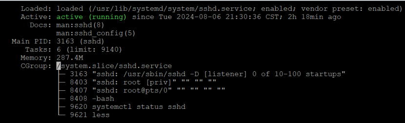

# 基于 openEuler 操作系统的基线检查工具综合实验

## 一、实验目的

1. 理解 openEuler 操作系统和信创的重要性。
2. 掌握国产操作系统基线检查工具的设计。
3. 掌握在 openEuler 操作系统中完成基线检查工具的实现。

## 二、实验环境

openEuler操作系统。

## 三、实验步骤和结果

### 1、构造实例

1. 新建用户

   打开终端，输入以下命令新建用户：

   ```bash
   sudo useradd -m bupt2023211567
   sudo passwd bupt2023211567
   ```

更改密码为 2023211567@bupt。

查看系统是否存在重名用户

```bash
awk -F: '{print $1}' /etc/passwd
```

系统用户名都不相同，因此不存在重名用户。使用 grep 命令可以验证某个特定用户名是否存在：

```bash
grep 'bupt2023211567' /etc/passwd
```


查看是否有无需身份鉴别即可登录的空口令用户：

```bash
cat /etc/shadow
```


除了 root 用户和自设用户以外，其他用户的口令字段均为 * 或 !!，表明该账号已被锁定或者该口令已经过期，因此系统不存在空口令用户。

查看口令修改策略是否符合要求：

```bash
cat /etc/login.defs
```

口令最大使用期限为 99999 天、两次口令的最小修改时间为 0、口令过期前警告时间为 7 天。

查看当前的 system-auth 配置：

```bash
cat /etc/pam.d/system-auth
```


安装 vim 编辑器：

```bash
sudo yum install vim
```

使用编辑器添加或修改复杂度参数：

```bash
sudo vim /etc/pam.d/system-auth
```

在 vim 编辑器中，按 i 进入插入模式，并找到以下行：



将该行修改为包括复杂度规则，例如：

```bash
password requisite pam_pwquality.so try_first_pass minlen=5 dcredit=-1 ucredit=-1 lcredit=-1
```

解释：

minlen=5：口令最少需要 5 个字符。
dcredit=-1：口令必须至少包含一个数字字符。
ucredit=-1：口令必须至少包含一个大写字母。
lcredit=-1：口令必须至少包含一个小写字母。
在 vim 中，按 Esc 退出插入模式，然后输入 :wq 保存文件并退出编辑器。

查看 Telnet 和 SSH 服务状态 查看 Telnet 服务状态：

```bash
systemctl status telnet
```



Telnet 服务未开启，符合要求。

查看 SSH 服务状态：

```bash
systemctl status sshd
```


SSH 服务已开启。按 Ctrl+C 退出。

### 2、脚本编程实现

编写 Shell 脚本实现基线检测身份验证的批处理

1、使用文本编辑器（如 vim、nano 等）创建一个新的脚本文件。例如，使用 vim 创建文件 baseline_check.sh:

```bash
sudo vim /home/username/test.sh
```

2、将脚本内容粘贴到文件中：

```bash

#!/bin/bash

# 获取当前用户
name=$(whoami)
echo "$name 查找是否存在重名用户" >> result.txt

# 查找重复用户
repeat_user=$(awk -F: '{print $1}' /etc/passwd)
OLD_IFS="$IFS"
IFS=$'\n'
array=($repeat_user)
IFS="$OLD_IFS"
flag_1=0

for ((i=0; i<${#array[@]}; i++)); do
    for ((j=i+1; j<${#array[@]}; j++)); do
        if [ "${array[i]}" = "${array[j]}" ]; then
            flag_1=1
            break
        fi
    done
done

if [ $flag_1 -eq 0 ]; then
    echo "没有重名用户" >> result.txt
else
    echo "存在重名用户" >> result.txt
fi

echo "$name 开始查找是否有空口令用户" >> result.txt

# 查找空密码用户
empty_passwd=$(awk -F: 'length($2)==0 {print $1}' /etc/shadow)
flag_2=0
if [ -n "$empty_passwd" ]; then
    flag_2=1
fi

if [ $flag_2 -eq 0 ]; then
    echo "不存在空口令用户" >> result.txt
else
    echo "存在空口令用户" >> result.txt
fi

# 获取密码策略
passmaxdays=$(grep '^PASS_MAX_DAYS' /etc/login.defs | awk '{print $2}')
passmindays=$(grep '^PASS_MIN_DAYS' /etc/login.defs | awk '{print $2}')
passwarnage=$(grep '^PASS_WARN_AGE' /etc/login.defs | awk '{print $2}')

echo "口令最大使用期限为 $passmaxdays 天" >> result.txt
echo "两次口令最小修改时间为 $passmindays 天" >> result.txt
echo "口令过期前警告时间为 $passwarnage 天" >> result.txt

echo "$name 检查Telnet服务状态" >> result.txt
telnet_status=$(systemctl is-active telnet)
if [ "$telnet_status" = "active" ]; then
    echo "Telnet服务已启动" >> result.txt
else
    echo "Telnet服务未启动" >> result.txt
fi

# 检查 SSH 服务是否活跃
echo "$name 检查SSH服务状态" >> result.txt
ssh_status=$(systemctl is-active sshd)
if [ "$ssh_status" = "active" ]; then
    echo "SSH服务已启动" >> result.txt
else
    echo "SSH服务未启动" >> result.txt
fi
```

按 Esc，输入 :wq 保存更改并退出。

使脚本文件具有执行权限：

```bash
sudo chmod +x /home/username/test.sh
```

以 root 用户或使用 sudo 运行脚本：

```bash
sudo /home/username/test.sh
```

检查脚本生成的结果文件 result.txt：

```bash
cat /home/username/result.txt
```

至此，基线检查工具综合实验结束。
