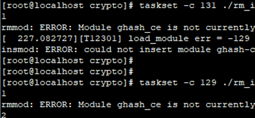

# 920X 出现mount/sysroot失败的问题

## 问题背景

### 硬软件信息

硬件环境：TaiShan200 (Model1280V2)

内核版本：5.10.0-153.1.0.81.oe2203sp2.aarch64

### 版本信息

openEuler 22.03-LTS-SP2

## 现象描述

重复多次上下电测试，mount时偶现`ext4/vfa`t驱动没加载到内核，导致mount文件系统失败。


## 原因分析

这个问题出现的概率低，现象表现又在启动过程，这个给定位分析带来了一些额外的工作量，分析的过程也是按抽丝剥茧的方式层层递进。

### 1. mount失败问题


Mount失败，打开调试后`udev.log_priority=debug rd.debug=1`，获取详细信息：


可以看到问题点是执行mount系统调用时失败，进一步增加内核打印。


从上面截图里的信息可以看出，当前内核在挂载vfat文件系统时：

1. `get_fs_type1`，由于对应ko还未加载，所以调用`request_module1`去加载模块。
2. 根据图片中`request_module1`返回值 "大于" 0，可以看到，应该已经走到`call_modprobe->call_usermodehelper_exec`，用户态执行了请求，但是返回了256。

**分析结论**：用户态在执行modprobe时，返回错误码256，下面分析为什么会load module失败。

### 2. load module失败问题

用户态的日志由于输出到命令行，在紧急模式阶段无法输出，选择在内核态增加打印：


根据日志能确认，是modprobe加载驱动时，在内核里失败了。

**分析结论**：`module_sig_check/setup_load_info`这两个函数其中一个失败了，返回-129。

### 3. 验签失败问题

返回-129，调用链为：

```
load_module->module_sig_check->mod_verify_sig->verify_pkcs7_signature->verify_pkcs7_message_sig->pkcs7_validate_trust->pkcs7_validate_trust_one->verify_signature->public_key_verify_signature ->crypto_akcipher_verify->pkcs1pad_verify->pkcs1pad_verify_complete
```


从log中可以看出验签通过和验签失败时`out_buf`的数值都一致。而`req_ctx->out_buf + ctx->key_size`前后数值不一样。因此优先分析异常数值的来源。

从代码可以看出异常的数据由`sg_pcopy_to_buffer`进行获取发现异常数据为 签名数据中的digest部分，这数值是由签名数据的原始数据经过哈希算法生成digest，然后使用私钥对digest进行加密。

在验签的时候使用公钥对数据进行解密得到digest，并且对收到的原始数据重新计算digest，然后将计算得到的digest与解析得到的digest进行比较，以验证签名的有效性。异常的位置便发生在这个比较中，说明签名数据可能不完整或者被篡改。

通过添加log发现digest由`crypto_shash_digest(desc, pkcs7->data, pkcs7->data_len, sig->digest)`；验签通过和验签失败时的pkcs7->data进行打印，发现数据一致


将怀疑点放到了使用的算法驱动，于是将算法驱动的名字进行打印：


结果发现所有返回-129时候使用的都是sha256-ce这个加密驱动。

该加密驱动有使用到armv8的加密扩展，使用了cpu的特殊指令进行加解密。使用同样的内核进行复现，未能复现出问题。怀疑是硬件问题。

在异常环境上，使用以下脚本反复加载卸载ko可以复现出-129的问题。


**分析结论**：怀疑是CPU问题。

### 4. CPU 问题

在正常环境中则无法复现。

经过硬件排查，得到以下结论：

1. 是早期工程的芯片。
2. 这些指令里有测试异常的：
   
   ```
   AdvsimdLoadStore
   LCRTSveVectorMove
   ```
3. 使用测试套测试cpu130和131有问题。

根据硬件的结论，将反复加载ko的脚本绑定在130和131核心上运行，问题必现，绑定在129问题则不出现。



**至此，可以锁定为CPU故障。**

## 解决方案

**方案一：更换CPU**
由于cpu核130，131上的指令处理异常，硬件上替换正常CPU后可以解决该问题。

**方案二：隔离CPU核130，131**
软件上通过CPU核隔离设置，可以隔离出异常的CPU核，作为规避方案。


