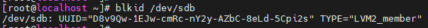
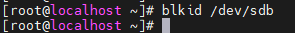
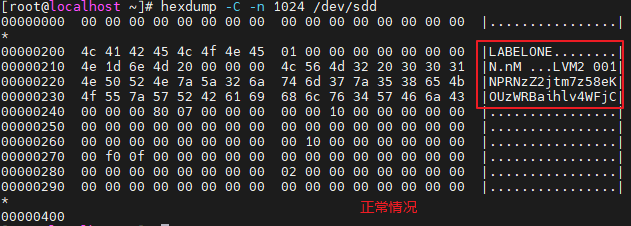
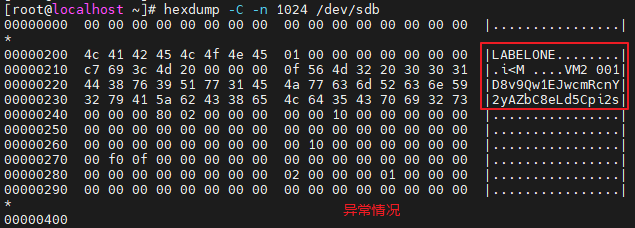
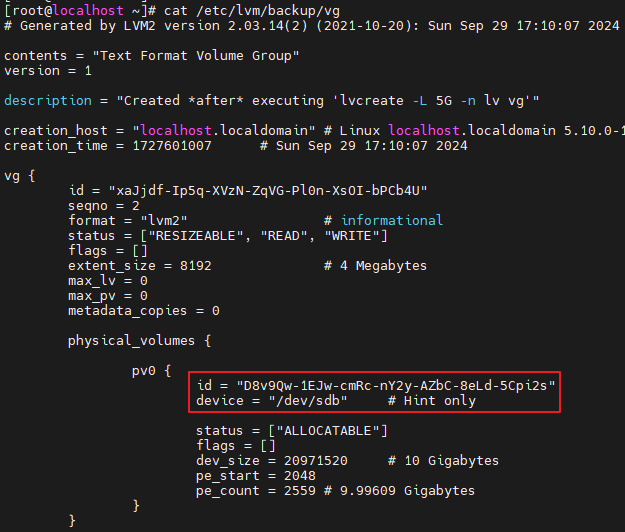

# LVM标签损坏

## 现象描述

pvs查询不到pv，blkid查询不到LVM2_member标签。
正常情况：



异常情况：



## 原因分析

hexdump查看元数据区域，发现标签损坏。





## 解决方法

1. 在/etc/lvm/backup目录查询卷组备份信息，获取pv的uuid，使用pvcreate命令恢复。

    

    命令如下:

    ```
    pvcreate --uuid D8v9Qw-1EJw-cmRc-nY2y-AZbC-8eLd-5Cpi2s --restorefile /etc/lvm/backup/vg /dev/sdb
    ```

2. pv复之后，再恢复卷组。

    ```
    vgcfgrestore --file /etc/lvm/backup/vg vg
    ```

3. 最后激活卷组

    ```
    vgchange -ay vg
    ```
