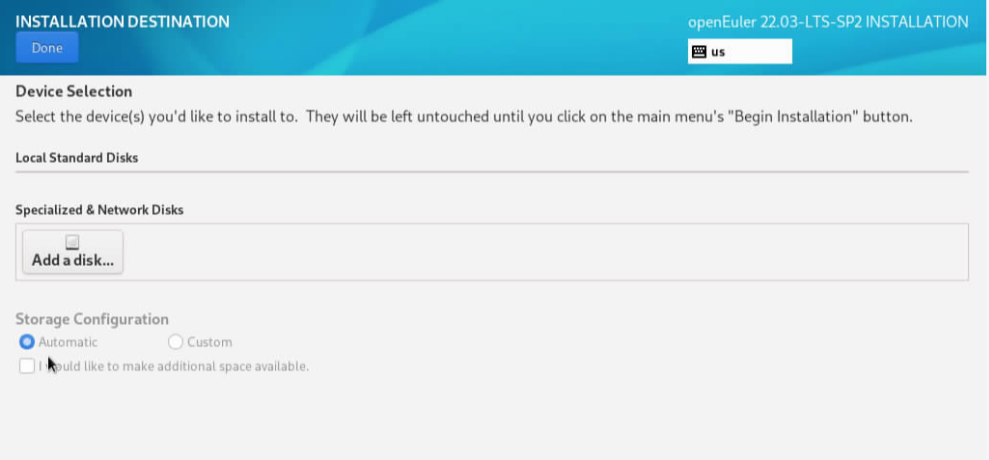
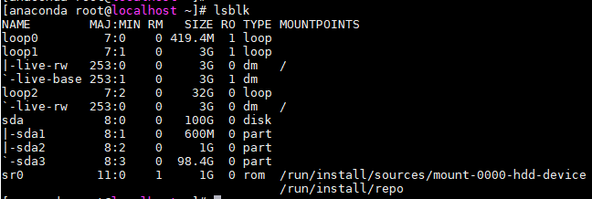
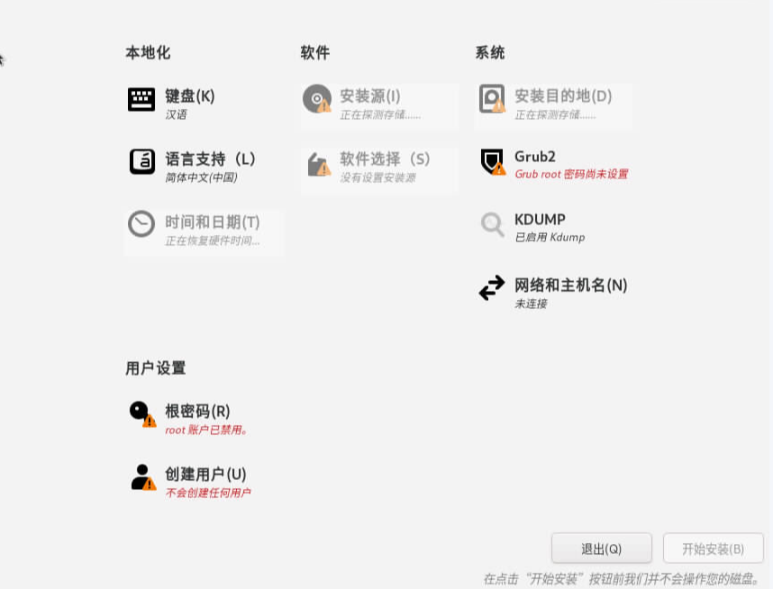

# anaconda安装常见磁盘问题

## 场景1：安装系统找不到系统盘

### 问题背景

920F 机器出现安装界面中找不到磁盘进行安装。

### 现象描述

1.安装界面上无法查看到磁盘；
2.CTRL+ALT+F2切换后台查看使用lsblk可以看到磁盘，并且有相关的分区信息。
 
 
### 原因分析

CTRL+ALT+F2切换后台查看/tmp/storage.log日志，看到扫描磁盘时出现报错，可能是存在分区残留信息导致。

### 解决方案

使用fdisk命令删除分区删除，格式化磁盘。

## 场景2：安装界面卡在磁盘扫描

### 问题背景

在安装系统的时候发现系统一直卡在扫盘导致无法点击选择硬盘的按钮。

### 现象描述

安装界面卡在磁盘扫描，等待一直无法成功。

### 原因分析

1. CTRL+ALT+F2切换后台查看/tmp/storage.log日志，看到扫描磁盘一直卡住。
2. 在后台输出相同命令，也同样无法执行完成，磁盘上有脏数据导致扫盘的时候获取不到数据导致的，需要进行格式化硬盘。

### 解决方案

格式化磁盘后重新进行安装。
