# 换标常见问题

## 场景1：安装失败，提示无法写入boot loader配置

### 问题背景

使用openEuler系统软件包，进行对应的换标替换，但在进行安装中出现安装失败。

### 现象描述

在进行镜像安装时，安装失败，提示无法写入boot loader配置信息。

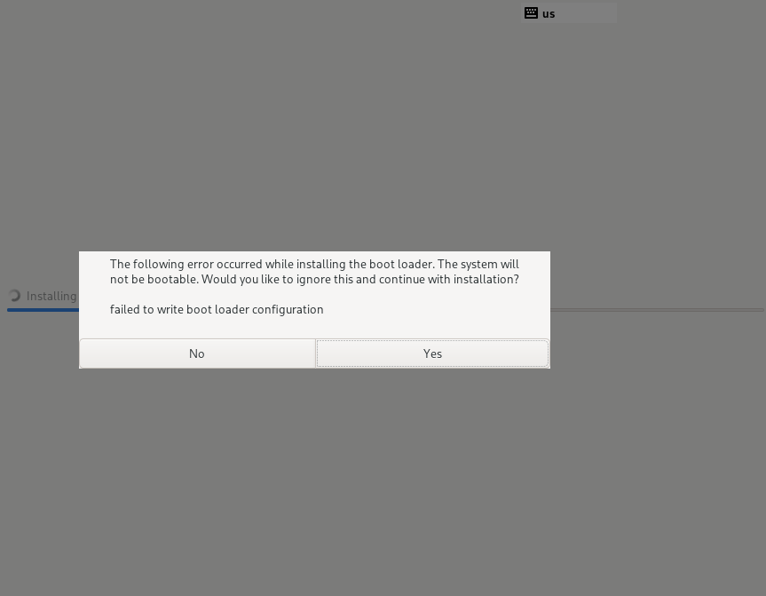

### 原因分析

CTRL+ALT+F2切换后台查看/tmp/anaconda.log日志。

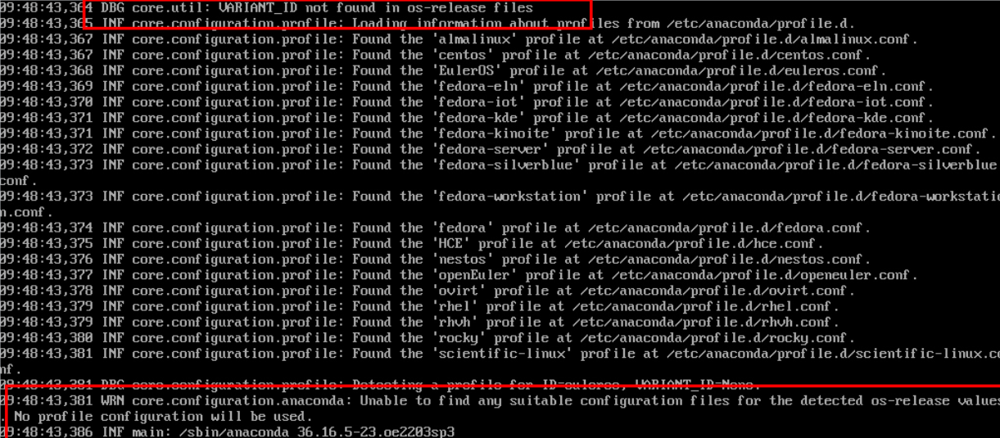

从日志中看到并未找到对应的bootloader配置文件。
主要原因是安装中会去检查/etc/os-release文件对应的"ID"和"VARIANT_ID"。

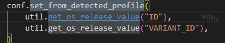

### 解决方案

修改anaconda中的openEuler.conf的"Profile Detection"下的"os_id"和"variant_id"与换标系统中的os-release文件保持一致。

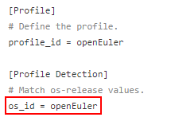

## 场景2：安装成功，无法正常进入系统

### 问题背景

换标后能进行正常的镜像安装，但安装后无法正常启动。

### 现象描述

启动时提示无法正常找到efi启动文件。

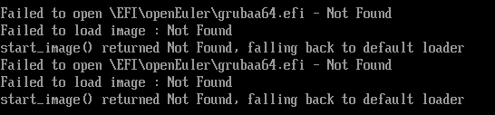

### 原因分析

存在部分软件包未完全换标，grub软件包换标存在遗漏情况。

### 解决方案

1. 查看启动项是否存在不正确的情况。

   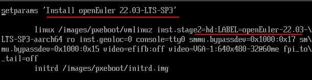

2. 参考[系统文件恢复问题](./sysfile.md)文档，可以进入系统后调整对应的启动配置文件。
3. 完全解决换标问题，需要修改构建工程中的grub.cfg。

## 场景3：换标后构建kernel，安装依赖tk组件失败

### 问题背景

换标使用obs构建openEuler的同源包，出现tk安装出现错误。

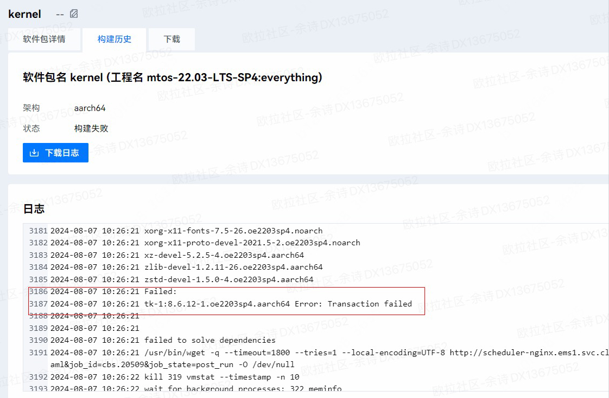

### 现象描述

对tk软件包进行安装检查，单独安装同样存在报错现象。错误为组件的%post阶段。
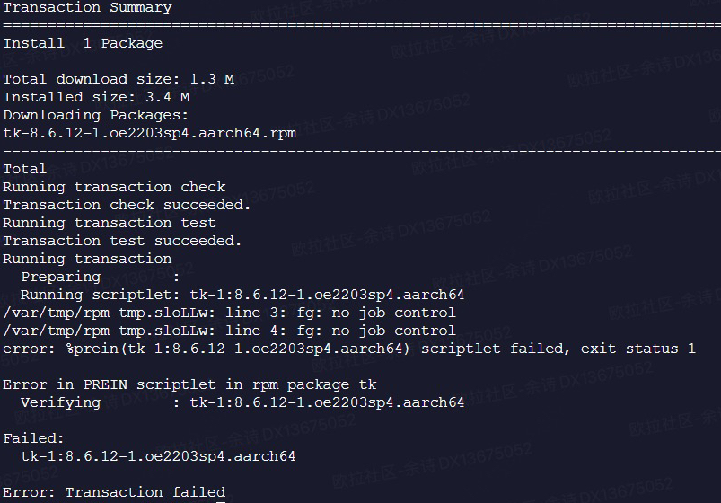

### 原因分析

spec中的%ldconfig_post、%ldconfig_postun未识别，导致安装软件中带入误认为脚本，并报错。
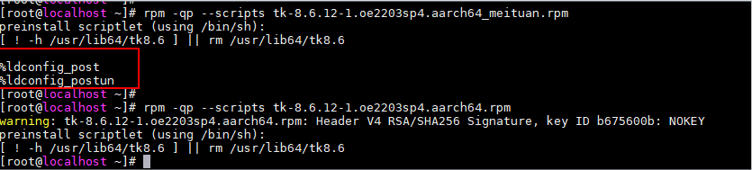

### 解决方案

需要修改换标工程中的rpm-config宏定义。

## 场景4：安装中报POSTTRANS scriptlet错误

### 问题背景

换标或者自构建软件镜像，在安装时出现 POSTTRANS scriptlet错误。
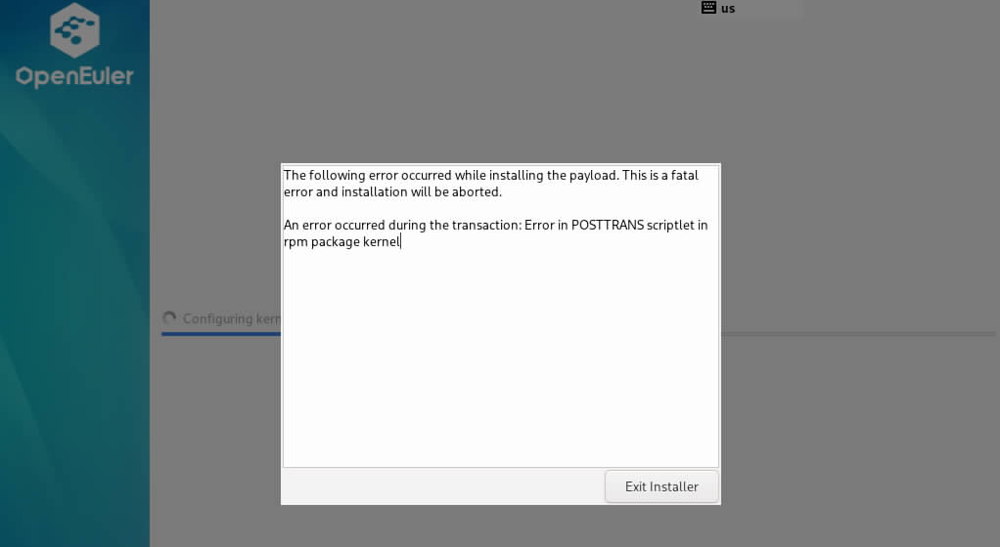

### 现象描述

1. CTRL+ALT+F2切换后台，进入/mnt/sysroot目录，切根。
2. 执行dnf history info 1，可以看到post哪边执行出错。
   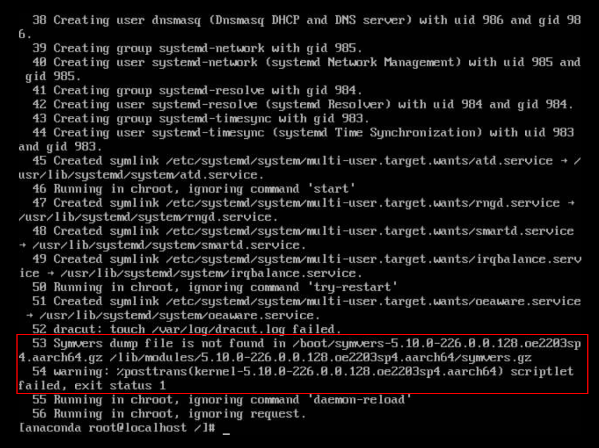

### 原因分析

软件安装后执行%POSTTRANS出错,未能找到相关的gz文件。

### 解决方案

分析软件包spec文件的%post脚本，修改后本地安装无问题后可以再次进行安装。