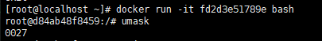
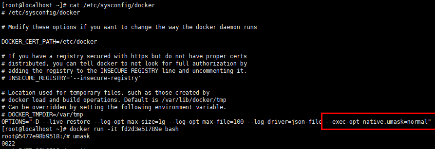
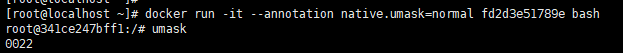

# docker配置容器umask值

## 问题背景

容器的umask配置成不同的值会影响到容器中新创建的文件和目录的权限，影响容器使用的安全性。

## 现象描述

正常openeuler容器启动，容器默认的umask值为0027，修改后others群组将无法访问新建文件或目录。



## 原因分析

为了容器使用安全性，避免容器受到攻击，修改runc的实现，将默认umask修改为0027，修改后others群组将无法访问新建文件或目录。

## 解决方案

方案一：
可以修改docker服务启动配置文件/etc/sysconfig/docker, 在OPTIONS行添加--exec-opt native.umask=normal参数，并重启dockerd服务。

```
systemctl restart docker
```


方案二：

使用docker run/exec命令行时增加--annotation native.umask=normal参数。

```
docker run --annotation native.umask=normal XXX
docker exec --annotation native.umask=normal XXX
```

