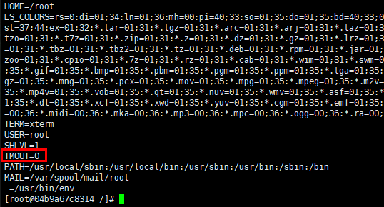

# docker容器运行一定时间后退出

## 问题背景

docker正常启动容器，容器运行一段时间后，在无其他异常的情况下，容器会退出。

## 现象描述

运行docker容器镜像，字符界面长时间处于空闲状态，一段时间后字符界面会自动退出，包括docker run -d后台启动运行容器，也会有一段时间后自动退出现象。

   

## 原因分析

运行容器镜像，当开发者通过ssh登陆且字符界面长时间处于空闲状态，字符界面会自动退出。这是由于容器镜像在制作时在/etc/profile文件中设置了TMOUT字段，当前此值默认为300S。

   

## 解决方案

1. 首先运行一个设置了TMOUT环境变量的容器

    ```shell
    docker run -itd XXX bash
    ```

2. 执行exec命令修改容器内配置

    ```` shell
    docker exec -it $container_id bash
    ````

    1. 先修改/etc/profile中的TMOUT环境变量值为0

   

    2. 再在/root/.bashrc中增加一行source /etc/profile

   

3. 最终重启容器，TMOUT已经被设置为0，此时容器就不会再因为超时退出

    ```shell
    docker restart $container_id
    ```

   
