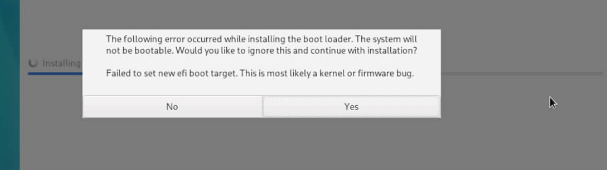
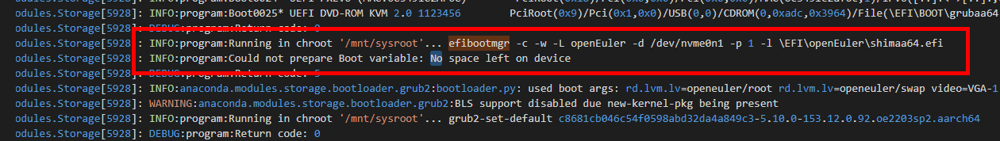
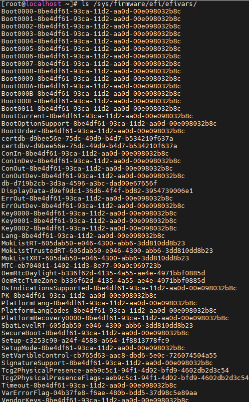
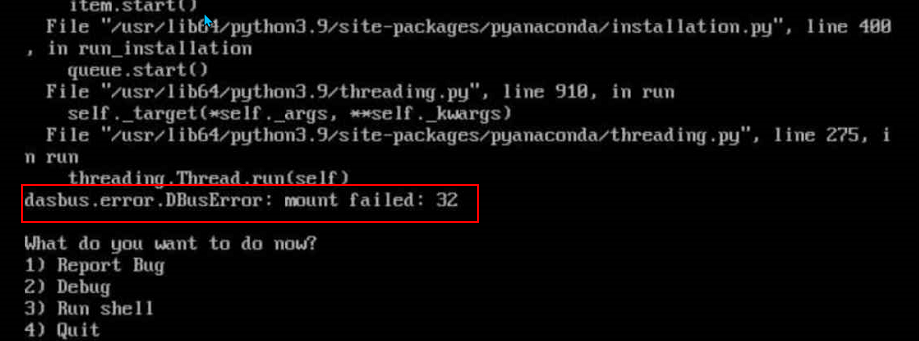
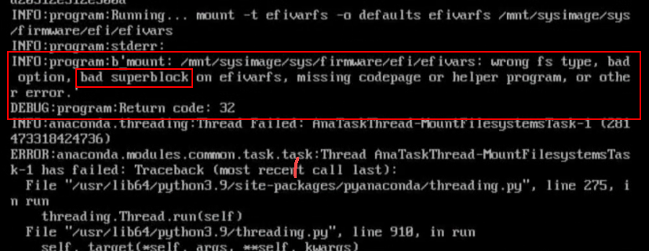

# 安装出现efivars报错

## 场景1：无法增加efi boot标签

### 问题背景

安装界面出现告警，提示无法增加efi boot标签告警，进行忽略正常安装。

### 现象描述

1. CTRL+ALT+F2切换后台，查看/tmp下的日志信息。
2. 在storage.log日志中，错误提示无可用空间。

   

3. 执行ls /sys/firmware/efi/efivars/命令，看到当前存在过多的efi boot。

  

### 原因分析

bios缓存空间被占满，无可用空间导致无法增加新的efi boot标签。

### 解决方案

需要清理bios缓存数据。

## 场景2：mount 错误 32

### 问题背景

安装界面出现错误，界面报mount failed：32。

### 现象描述

在安装时出现，挂载目录/sys/firmware/efi/efivars时报错。

1. CTRL+ALT+F2切换后台，查看/tmp下的日志信息。
2. 在storage.log日志中，错误提示无可用空间。

  

报错里提示efivarfs里可能有bad superblock，需要BIOS进一步排查。

### 原因分析

bios相关的硬件异常，flash上bios的变量区数据异常，导致bios变量相关服务异常，os下mount映射uefi变量服务时报错，导致安装os失败，需要重新刷新bios固件。

### 解决方案

重新刷新bios固件。
