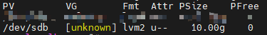
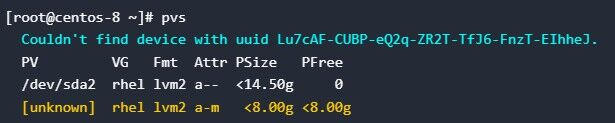

# pvs或vgs出现Unknown问题

## 现象描述

pvs或vgs的回显中，pv或vg报unknown错误。





## 原因分析

通常为元数据损坏，导致命令读取到不完整的信息，需要进行修复，否则无法正常使用pv或vg。可使用hexdump读取裸盘数据验证，见[LVM标签损坏](./LVM标签损坏.md)。

## 解决方法

问题一：vg无法识别，报错unknown

```
pvck --repair --file /etc/lvm/backup/vg /dev/sdb
```

vg为卷组备份信息，保存在/etc/lvm/backup目录。

问题二：pv无法识别，报错unknown

```
pvcreate --uuid xxx --restorefile /etc/lvm/backup/vg /dev/sdc
vgcfgrestore --file /etc/lvm/backup/vg vg
vgchange -ay vg
```

uuid在备份文件/etc/lvm/backup中获取。

执行完修复步骤后，输入pvs或vgs命令，可看到正常回显则说明修复成功。
