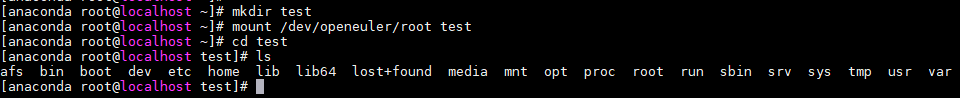

# 系统文件恢复问题

## 问题背景

在正常使用中常会出现误删系统文件或其他系统修改无法正常进入系统的问题，需要进行磁盘系统的恢复或修改，或者之前有重要数据需要备份保存。

## 现象描述

系统文件丢失或修改，导致无法正常进入系统，需要恢复系统文件。

## 解决方案

1. 挂载镜像，CTRL+ALT+F2切换后台。
  进入后台可以查看当前磁盘的状态，处于未激活状态，不能直接操作磁盘。
 
2. 配置网络，开启ssh服务。

    ```
    ifconfig eth0 xx.xx.xx.xx  netmask  255.255.255.0 up
    route add default gw xx.xx.xx.xx
    cp /etc/ssh/sshd_config.anaconda /etc/ssh/sshd_config
    systemctl restart sshd
    ```

3. 激活系统卷组。
  使用命令vgchange -ay对磁盘存在的系统进行激活操作。
 
4. 通过挂载的方式挂载上各个分区，挂载后可进行系统操作。

    1) 创建临时目录test，将激活后的系统的进行挂载，挂载根/dev/oprnruler/root到临时目录test。
    

    2) 挂载激活后的boot（/dev/sda2）到临时系统的boot上。
    

    3) 在此基础上就可以操作磁盘系统以及系统数据了。
