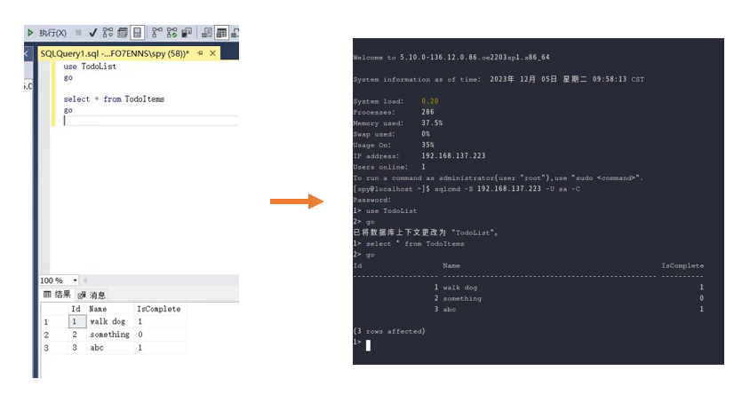

---

title: 【Windows迁移】之SQL Server迁移至openEuler

date: '2023-12-21'

category: blog

tags:

  - openEuler

  - Windows迁移

archives: '2023-12'

author:

  - futao

summary: SQL Server是Microsoft公司推出的关系型数据库管理系统，被广泛用于企业级应用程序开发，本文将介绍如何将SQL Server迁移至openEuler。

---


## 概述
近些年，数量庞大的企业和个人放弃Windows平台选择Linux平台，并且这个数字呈现扩大的趋势。很长的一段时间，Linux是网络服务器的领导者，具有更强的稳定性、可靠性、成本和安全性等，能够在苛刻的工作负载中实现高可用性和高性能，已经更好的用户体验和丰富的工具集，这也是人们选择Linux的重要原因。

2016年，微软重新构建了SQL Server，致力于将大部分依赖特定操作系统的功能划分，以支持更多的平台。该项目帮助更多想要将Windows平台应用服务迁移至Linux平台的用户。本文介绍如何将SQL Server 2019迁到至openEuler，以帮助用户完成Windows平台数据迁移。

## 在openEuler上安装SQL Server并创建数据库

### 准备工作

本部分参考https://www.cnblogs.com/linuxjava/p/17456089.html

#### 安装Python2

安装SQL Server 2019需要Python2依赖，而默认yum源中并没有提供Python2，因此需要手动下载和安装。

1. 使用wget获取Python包：
```shell
wget https://www.python.org/ftp/python/2.7.9/Python-2.7.9.tgz
```
2. 安装Python2需要的一些基本库：
```shell
sudo yum install zlib-devel bzip2-devel openssl-devel ncurses-devel sqlite-devel readline-devel tk-devel gcc make libffi-devel
```
3. 如果没有安装tar，请先安装tar：
```shell
sudo yum install tar -y
```
4. 解压和安装Python2：
```shell
# 使用tar命令解压
tar xzf Python-2.7.9.tgz
# 进入解压后的目录中
cd Python-2.7.9
# 生成MakeFile文件
sudo ./configure --prefix=/usr/local
# 安装
sudo make altinstall
```
5. 将安装在`/usr/local/bin/`目录下的Python软链接到`/usr/bin/`目录下：
```shell
sudo ln -s /usr/local/bin/python2.7 /usr/bin/python
sudo ln -s /usr/local/bin/python2.7 /usr/bin/python2
```

#### 建立so文件软链接

系统中没有`liblber-2.4.so.2`和`libldap-2.4.so.2`这两个文件，但有`liblber.so.2`和`libldap.so.2`（即文件名中不含有版本号），可以建立软链接完成替代：
```shell
sudo ln -s /usr/lib64/liblber.so.2 /usr/lib64/liblber-2.4.so.2
sudo ln -s /usr/lib64/liblber.so.2 /usr/lib/liblber-2.4.so.2
sudo ln -s /usr/lib64/libldap.so.2 /usr/lib/libldap-2.4.so.2
sudo ln -s /usr/lib64/libldap.so.2 /usr/lib64/libldap-2.4.so.2
```

### 安装SQL Server

本部分参考https://learn.microsoft.com/zh-cn/sql/linux/quickstart-install-connect-red-hat?view=sql-server-ver15&tabs=rhel8


#### 安装SQL Server服务

1. 由于openEuler本身并没有SQL Server源，并且与Red Hat有一定相似性，故而采用Red Hat的存储库作为下载源。下载SQL Server 2019 (15.x) Red Hat存储库配置文件：
```shell
sudo curl -o /etc/yum.repos.d/mssql-server.repo https://packages.microsoft.com/config/rhel/8/mssql-server-2019.repo
```
2. 安装SQL Server：
```shell
sudo yum install -y mssql-server
```
3. 运行mssql-conf setup，按照提示设置 SA 密码并选择版本。选择版本时，Evaluation、Developer和Express版是免费的
```shell
sudo /opt/mssql/bin/mssql-conf setup
```
根据提示完成设置即可。
4. 完成配置后，验证服务是否正在运行：
```shell
systemctl status mssql-server
```
5. 在防火墙上打开SQL Server端口。默认的SQL Server端口为TCP 1433：
```shell
sudo firewall-cmd --zone=public --add-port=1433/tcp --permanent
sudo firewall-cmd --reload
```
如果使用的防火墙不是FirewallD，则需要使用其对应的命令。

#### 禁用sa账户

根据官方文档中的建议，在安装后应当禁用sa账户以确保安全性，但本教程中后续将使用sa账户，故而跳过本步骤，在实际使用时可根据安全性需要选择是否禁用sa账户。

步骤参考：https://learn.microsoft.com/zh-cn/sql/linux/quickstart-install-connect-red-hat?view=sql-server-ver15&tabs=rhel8#disable-the-sa-account-as-a-best-practice

#### 安装SQL Server命令行工具

1. 本步骤需要再次使用Red Hat存储库作为下载源。下载Microsoft Red Hat存储库配置文件：
```shell
curl https://packages.microsoft.com/config/rhel/8/prod.repo | sudo tee /etc/yum.repos.d/mssql-release.repo
```
2. 如果安装了早期版本的mssql-tools，请删除所有旧的unixODBC包。
```shell
sudo yum remove mssql-tools unixODBC-utf16 unixODBC-utf16-devel
```
3. 使用unixODBC开发人员包安装mssql-tools18：
```shell
sudo yum install -y mssql-tools18 unixODBC-devel
```
4. 将 mssql-tools 更新至最新版本：
```shell
sudo yum check-update
sudo yum update mssql-tools18
```
5. 向bash shell中的`PATH`环境变量添加`/opt/mssql-tools18/bin/`：
若要使sqlcmd和bcp能从登录会话的bash shell进行访问，请使用下列命令修改`~/.bash_profile`文件中的`PATH`：
```shell
echo 'export PATH="$PATH:/opt/mssql-tools18/bin"' >> ~/.bash_profile
```
若要使sqlcmd和bcp能从交互式/非登录会话的bash shell进行访问，请使用下列命令修改`~/.bashrc`文件中的`PATH`：
```shell
echo 'export PATH="$PATH:/opt/mssql-tools18/bin"' >> ~/.bashrc
source ~/.bashrc
```

### 连接数据库

使用SQL Server名称(`-S`)、用户名(`-U`)和密码(`-P`)的相应参数运行sqlcmd：
```shell
sqlcmd -S localhost -U sa -P '<YourPassword>'
```
上述命令中，连接方式是本地连接，服务器名称是localhost，用户名是sa，密码是安装时指定的sa密码。

如果不想显式输入密码，可以省略`-P`选项以及对应参数，执行命令后将被要求输入密码。

如果在登录时出现SSL证书认证失败错误，可以通过添加`-C`选项解决。

当出现了sqlcmd的命令提示符`1>`时，说明连接成功。

例如，下面是一个成功的交互案例：
```shell
[spy@localhost ~]$ sqlcmd -S 192.168.137.223 -U sa -C
Password: #此时输入密码，密码不显示
1> #此时已经登录成功，可以输入SQL语句了
```
上面的案例中，192.168.137.223是本机IP，也可以替换成远程IP，根据实际情况更改。

若要退出sqlcmd，输入exit或quit即可。

## 将SQL Server数据迁移至openEuler

本部分参考https://learn.microsoft.com/zh-cn/sql/linux/sql-server-linux-migrate-restore-database?view=sql-server-ver15

请将下面出现的所有`YourDB`替换为实际数据库名称。

### 备份数据

在参考的微软官方文档中，主要使用了SQL Server Management Studio (SSMS)并通过图形化交互的方式完成备份文件的创建。由于数据库管理系统的多样性，该方法在使用了其他数据库管理系统或不使用图形化管理系统时难以使用，因此此处不做介绍，如果希望使用该方法，请参阅https://learn.microsoft.com/zh-cn/sql/linux/sql-server-linux-migrate-restore-database?view=sql-server-ver15#create-a-backup-on-windows

此处推荐使用操作较为简单、适用性较广的使用SQL语句的方法：
```sql
BACKUP DATABASE [YourDB] TO DISK = N'C:\Program Files\Microsoft SQL Server\MSSQL13.MSSQLSERVER\MSSQL\Backup\YourDB.bak'
WITH NOFORMAT, NOINIT, NAME = N'YourDB-Full Database Backup',
SKIP, NOREWIND, NOUNLOAD, STATS = 10
GO
```
如果遇到用户权限问题，可以用以下方法解决：

打开Windows服务（按Win+R后输入services.msc或使用其他方法打开），找到对应的数据库实例服务（例如`SQL Server (MSSQLSERVER)`），右键打开属性，选中登录选项卡，将登录身份改为本地系统账户或为指定账户赋予需要的权限。

生成备份文件后，使用scp等方法将该文件传输到openEuler上。

### 迁移数据

1. 进入超级用户模式：
```shell
sudo su
```
2. 创建新的备份目录：
```shell
mkdir -p /var/opt/mssql/backup
```
3. 将备份文件移动到该目录：（假设备份文件就在当前目录下，实际使用时更改文件路径或先cd到正确的目录下）
```shell
mv YourDB.bak /var/opt/mssql/backup/
```
移动备份文件的目的是：`/var/opt/mssql`的子目录属于用户mssql和组mssql。 
4. 退出超级用户模式：
```shell
exit
```
5. 启动sqlcmd：
```shell
sqlcmd -S 192.168.137.223 -U sa -C
```
6. 登录sqlcmd后，输入下面的SQL语句：
```sql
RESTORE DATABASE YourDB
FROM DISK = '/var/opt/mssql/backup/YourDB.bak'
WITH MOVE 'YourDB' TO '/var/opt/mssql/data/YourDB.mdf',
MOVE 'YourDB_Log' TO '/var/opt/mssql/data/YourDB_Log.ldf'
GO
```
sqlcmd中不可以同时复制和粘贴多行命令。

如果执行成功，应当收到已成功还原数据库的消息。

如果遇到类似下述错误：
```text
File 'YourDB_Product' cannot be restored to 'Z:\Microsoft SQL Server\MSSQL11.GLOBAL\MSSQL\Data\YourDB\YourDB_Product.ndf'. Use WITH MOVE to identify a valid location for the file.
Msg 5133, Level 16, State 1, Server servername, Line 1
Directory lookup for the file "Z:\Microsoft SQL Server\MSSQL11.GLOBAL\MSSQL\Data\YourDB\YourDB_Product.ndf" failed with the operating system error 2(The system cannot find the file specified.).
```
在这种情况下，数据库包含辅助文件。 如果未在`RESTORE DATABASE`的`MOVE`子句中指定这些文件，则还原过程将尝试在与原始服务器相同的路径中创建这些文件。

可以列出备份中包含的所有文件：
```sql
RESTORE FILELISTONLY FROM DISK = '/var/opt/mssql/backup/YourDB.bak'
GO
```
应会看到如下所示的列表（仅列出前两列）：
```sql
LogicalName         PhysicalName                                                                 ..............
----------------------------------------------------------------------------------------------------------------------
YourDB              Z:\Microsoft SQL Server\MSSQL11.GLOBAL\MSSQL\Data\YourDB\YourDB.mdf          ..............
YourDB_Product      Z:\Microsoft SQL Server\MSSQL11.GLOBAL\MSSQL\Data\YourDB\YourDB_Product.ndf  ..............
YourDB_Customer     Z:\Microsoft SQL Server\MSSQL11.GLOBAL\MSSQL\Data\YourDB\YourDB_Customer.ndf ..............
YourDB_log          Z:\Microsoft SQL Server\MSSQL11.GLOBAL\MSSQL\Data\YourDB\YourDB_Log.ldf      ..............
```
可使用此列表为其他文件创建`MOVE`子句。在本示例中，`RESTORE DATABASE`为：
```sql
RESTORE DATABASE YourDB
FROM DISK = '/var/opt/mssql/backup/YourDB.bak'
WITH MOVE 'YourDB' TO '/var/opt/mssql/data/YourDB.mdf',
MOVE 'YourDB_Product' TO '/var/opt/mssql/data/YourDB_Product.ndf',
MOVE 'YourDB_Customer' TO '/var/opt/mssql/data/YourDB_Customer.ndf',
MOVE 'YourDB_Log' TO '/var/opt/mssql/data/YourDB_Log.ldf'
GO
```
7. 列举所有数据库来验证是否还原成功：
```sql
SELECT Name FROM sys.Databases
GO
```

8. 数据迁移成功


文中所述SQL Server迁移方案，由 Porting Platform WinApp SIG 参与。如果您对Windows迁移的相关技术感兴趣，欢迎您的围观和加入。您可以添加小助手微信，加入对应 SIG 微信群。

