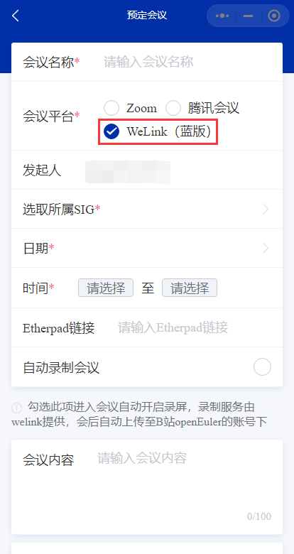
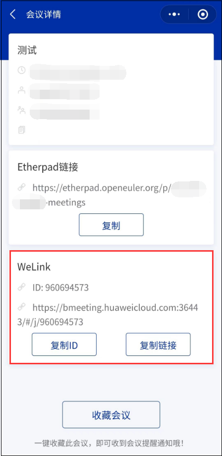
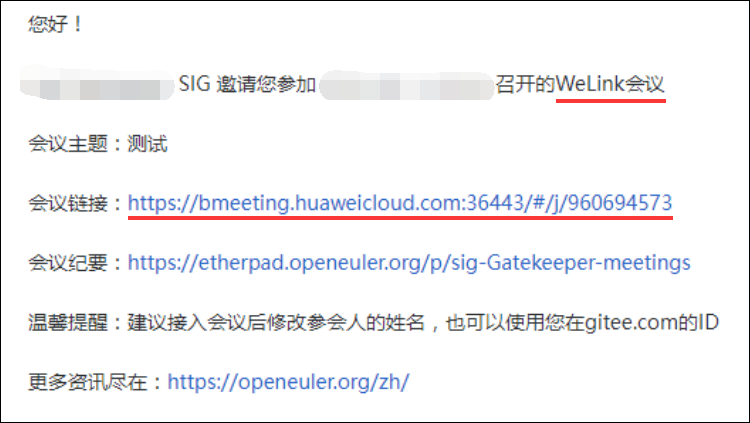
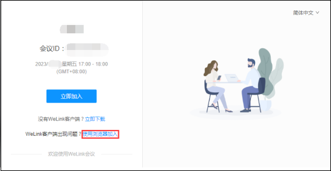
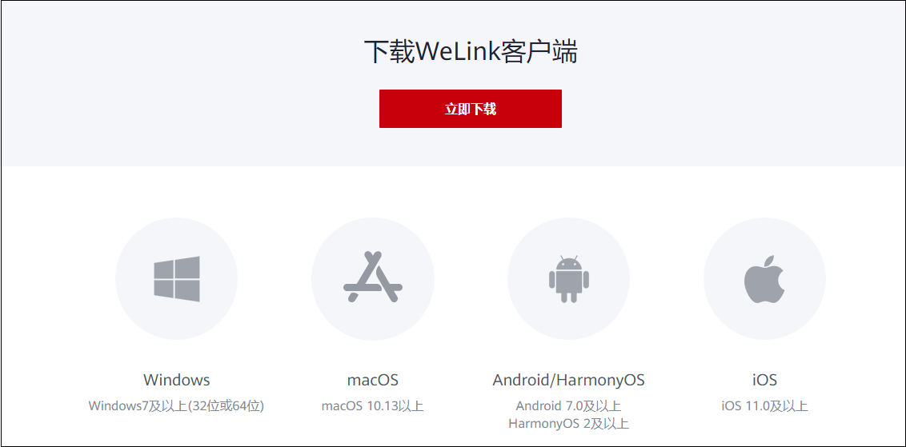
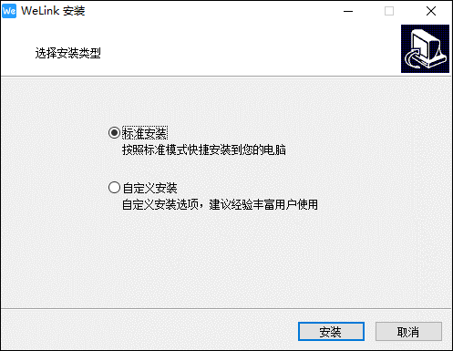
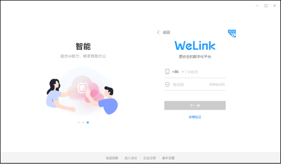
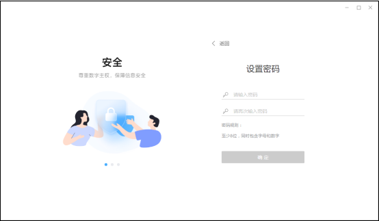
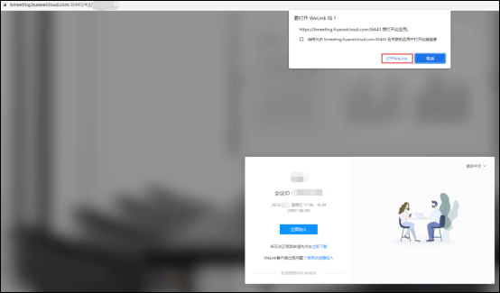

### 背景

为社区 SIG 会议提供多样选择，我们增加了对 WeLink 会议的支持。本文将从会议预订者和参会者两个角度为您介绍如何预定 WeLink 会议以及如何使用 WeLink 接入 openEuler 小程序预定的WeLink会议。

---

### 预定会议

SIG maintainer 在预定会议时选择会议平台为 WeLink（蓝版），即可预定 WeLink 会议。

成功预定会议之后，可从会议详情中获取 WeLink 会议的会议号以及入会链接。

如果 maintainer 在预定会议时发送了邀请邮件，收件人也可通过邮件内容获取预定会议的所属平台和入会链接。

---

### 参加会议

以上介绍了社区 SIG maintainer 如何预定 WeLink 会议，以及预定 WeLink 会议后可获取的入会信息。

接下来介绍如何接入 openEuler 小程序预定的 WeLink 会议。

WeLink 会议可通过浏览器和客户端两种方式接入。

- **浏览器接入**

	在浏览器访问会议链接，关掉弹窗，点击**使用浏览器加入**即可接入会议。

	

- **客户端接入**

	如果您想通过客户端接入 WeLink 会议，可按如下操作

	- 下载

	访问 [WeLink官方下载页面](https://www.huaweicloud.com/product/welink-download.html)，根据设备系统选择下载对应的 WeLink 客户端。

	

	- 安装

	Windows 客户端可选择标准安装或自定义安装。

	

	- 加入企业

	接入 WeLink 需要您先加入一个企业，您可通过以下任意方式申请加入我们的 WeLink 企业，企业名为 openEuler

	1. 企业二维码

		

	2. 邀请链接

		[点击邀请链接申请加入](https://open.welink.huaweicloud.com/userinvited/?shortCode=Bs9feQ-4MzAppRYMr)

	3. 联系小助手

		可联系小助手，提供昵称、手机号/邮箱申请加入企业。

	- 登录

	WeLink 客户端可通过手机验证或邮箱验证登录（根据您的申请方式），在登录界面可切换验证方式。

	

	首次登录后，需要设置您的登录密码。

	

	当您加入企业的申请被接受，设置密码后，如果您无其他的企业，会默认跳转到 openEuler 企业页面；如果有其他企业，请切换至 openEuler 企业。

	- 接入会议

	从 openEuler 官网会议日历或 openEuler 小程序的会议详情获取已预定的 WeLink 会议链接，在浏览器中打开。点击弹框中的**打开WeLink**，即可接入会议。

	

### 更多

我们将在近期为会议添加更显著的平台标识，便于参会者识别会议的接入平台。

如果您需要更多关于 openEuler 小程序的使用帮助，可联系小助手（微信号：openeuler123）。
