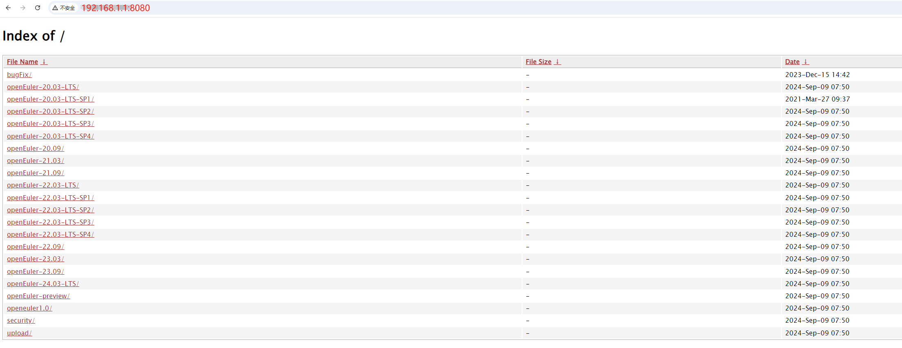

### 背景

社区 开发者希望搭建一套私有镜像站。本文介绍如何使用 docker 快速部署 openEuler 镜像站。

---

### 环境准备

虚拟机: 1台 4U8G(根据实际资源消耗调整)  

操作系统: openEuler 22.03  

安装docker环境:  

yum install -y docker  

创建镜像存放目录:  

mkdir -p /opt/openeuler  

### docker镜像制作  

- **创建nginx.conf**

    ```
    user root;

    error_log /dev/stdout info;

    pid /var/run/nginx.pid;

    worker_processes 2;
    worker_rlimit_nofile 1024;
    events {
    use epoll;
    worker_connections 1024;
    }

    http {
    include /etc/nginx/mime.types;

    log_format main '[$time_local] remote_addr: $remote_addr, request: "$request", '
    'status: $status, body_bytes_sent: $body_bytes_sent, http_referer: "$http_referer", '
    'http_user_agent: "$http_user_agent"';

    access_log /dev/stdout main;

    server_tokens off;

    autoindex off;

    port_in_redirect off;
    absolute_redirect off;

    client_header_buffer_size 1k;
    large_client_header_buffers 4 8k;
    client_body_buffer_size 1K;
    client_max_body_size 1k;

    client_header_timeout 8;
    client_body_timeout 8;
    client_body_in_file_only off;

    keepalive_timeout 5 5;
    send_timeout 8;

    proxy_hide_header X-Powered-By;
    proxy_request_buffering off;

    limit_conn_zone $binary_remote_addr zone=limitperip:10m;
    limit_req_zone $binary_remote_addr zone=ratelimit:10m rate=1000r/s;

    gzip on;
    gzip_min_length 1k;
    gzip_buffers 4 16k;
    gzip_comp_level 5;
    gzip_types text/plain application/x-javascript text/css application/xml text/javascript application/javascript application/x-httpd-php application/json;
    gzip_vary on;

    server {
        listen 8080;
        server_name  example.com;
        charset utf-8;

        limit_conn limitperip 10;

        if ($request_method !~ ^(GET|HEAD)$) {
        return 444;
        }

        location ~ /\. {
        deny all;
        return 404;
        }

        location / {
            root   /repo/openeuler;
            fancyindex on;
            fancyindex_exact_size off;
            autoindex   on;
        }

        location = /favicon.ico {
            log_not_found off;
            access_log off;
        }
    }
    }
    ```

- **创建nginx Dockerfile**

    ```
    FROM openeuler/openeuler:22.03-lts-sp1  

    WORKDIR /opt/nginx

    RUN yum update -y \ 
        && yum install -y pcre-devel openssl-devel gcc telnet wget curl make libxslt libxslt-devel gd gd-devel git \ 
        && mkdir -p /etc/nginx/modules \
        && git clone https://github.com/aperezdc/ngx-fancyindex.git /etc/nginx/modules/ngx-fancyindex \
        && cd /opt/nginx \
        && wget http://nginx.org/download/nginx-1.24.0.tar.gz \
        && tar zxf nginx-1.24.0.tar.gz  \
        && sed -i "s|Server: nginx|Server: |" nginx-1.24.0/src/http/ngx_http_header_filter_module.c \
        && sed -i "s|\#define[ ]NGINX_VER[ ].*|\#define NGINX_VER \"\"|" nginx-1.24.0/src/core/nginx.h \
        && cd nginx-1.24.0 \
        && ./configure --prefix=/usr/share/nginx \
        --sbin-path=/usr/share/nginx/sbin/nginx \
        --modules-path=/etc/nginx/modules \
        --conf-path=/etc/nginx/nginx.conf \
        --error-log-path=/var/log/nginx/error.log \
        --http-log-path=/var/log/nginx/access.log \
        --http-client-body-temp-path=/var/lib/nginx/tmp/client_body \
        --http-fastcgi-temp-path=/var/lib/nginx/tmp/fastcgi \
        --http-proxy-temp-path=/var/lib/nginx/tmp/proxy \
        --http-scgi-temp-path=/var/lib/nginx/tmp/scgi \
        --http-uwsgi-temp-path=/var/lib/nginx/tmp/uwsgi \
        --pid-path=/usr/share/nginx/logs/nginx.pid \
        --lock-path=/run/lock/subsys/nginx \
        --user=nginx \
        --group=nginx \
        --with-file-aio \
        --with-ipv6 \
        --with-http_ssl_module \
        --with-http_v2_module \
        --with-http_realip_module \
        --with-http_sub_module \
        --with-http_slice_module \
        --with-http_perl_module=dynamic \
        --with-http_auth_request_module \
        --with-pcre \
        --with-pcre-jit \
        --with-stream=dynamic \
        --with-stream_ssl_module \
        --with-debug \
        --add-module=/etc/nginx/modules/ngx-fancyindex \
        && make \
        && make install \
        && cd /opt/nginx \
        && rm -rf nginx-1.24.0 \
        && rm -rf nginx-1.24.0.tar.gz \
        && rm -rf ngx_http_geoip2_module \
        && yum clean all \
        && useradd nginx \
        && chown -R nginx:nginx /var/log/nginx \
        && mkdir -p /var/lib/nginx/tmp/client_body \
        && chown -R nginx:nginx /var/lib/nginx \
        && touch /usr/share/nginx/logs/nginx.pid \
        && chown -R nginx:nginx /usr/share/nginx \
        && chown -R nginx:nginx /etc/nginx/modules

    COPY ./nginx.conf /etc/nginx/nginx.conf

    ENV PATH /usr/share/nginx/sbin:$PATH

    EXPOSE 8080

    USER root

    CMD ["nginx", "-g", "daemon off;"]

    ```

- **构建nginx镜像**

    docker build -t myrepo-nginx:v0.0.1 .  

- **创建脚本entrypoint.sh**

    ```
    #!/bin/sh
    if [[ -z "\${SYNC_HOST}" ]]; then
            echo "SYNC_HOST is not defined. exit none zero."
            exit 1
    fi

    if [[ -z "\${TARGET_DIR}" ]]; then
            echo "TARGET_DIR is not defined. exit none zero."
            exit 1
    fi
    mkdir -p "${TARGET_DIR}"

    if [[ -z "\${RSYNC_INTERNAL}" ]]; then
            echo "RSYNC_INTERNAL is not defined. exit none zero."
            exit 1
    fi

    while true; do
    echo "Starting to sync repos @ \$(date)"
    if [[ -z "\${ADDITIONAL_PARAMETERS}" ]]; then
        timeout \${RSYNC_INTERNAL} rsync -av --partial --progress --block-size=131072 "\${SYNC_HOST}"  "\${TARGET_DIR}"
    else
        timeout \${RSYNC_INTERNAL} rsync -av --partial --progress --block-size=131072 \${ADDITIONAL_PARAMETERS}  "\${SYNC_HOST}"  "\${TARGET_DIR}"
    fi
    sleep 120
    done
    ```

- **创建rsync Dockerfile**

    ```
    FROM openeuler/openeuler:22.03-lts-sp1

    RUN yum -y update && \
        yum install -y rsync tzdata && \
        useradd -s /sbin/nologin -u 1000 rsync

    ENV TZ="Asia/Shanghai"

    COPY entrypoint.sh /usr/local/bin/

    RUN chown 1000:1000 /usr/local/bin/entrypoint.sh && \
        chmod +x /usr/local/bin/entrypoint.sh

    WORKDIR /usr/local/bin/

    ENV PATH=$PATH:/usr/local/bin/

    CMD ["entrypoint.sh"]
    ```

- **构建rsync镜像**

    docker build -t myrepo-rsync:v0.0.1 .  

### 启动nginx和rsync容器

docker run -d -v /opt/openeuler:/repo/openeuler -p 8080:8080 myrepo-nginx:v0.0.1  

docker run -d -e SYNC_HOST="rsync://root@repo.openeuler.openatom.cn/openeuler" -e TARGET_DIR="/repo/openeuler" -e RSYNC_INTERNAL="600" -e ADDITIONAL_PARAMETERS="--delete" -v /opt/openeuler:/repo/openeuler myrepo-rsync:v0.0.1  

### 访问自建镜像站

浏览器上输入 docker 宿主机地址 http://192.168.1.1:8080  

<div style="text-align:center"></div>

<div style="text-align:center">

</div>

