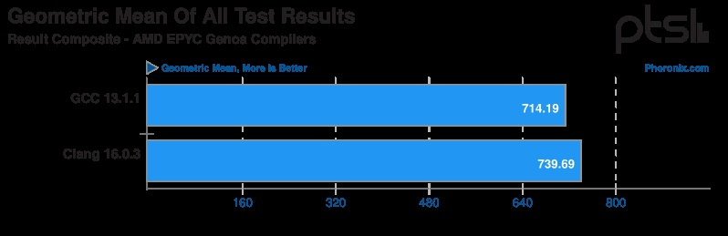
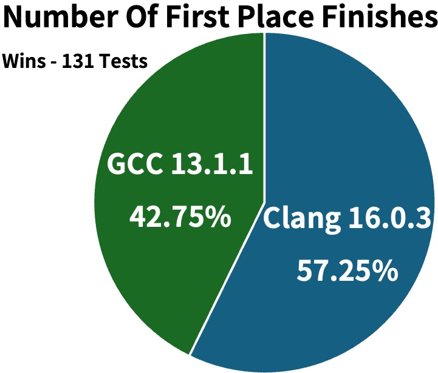
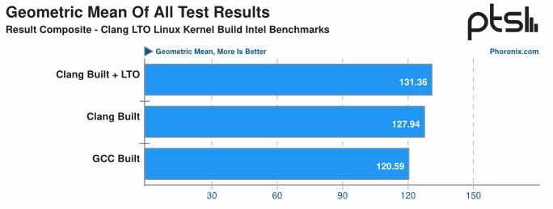
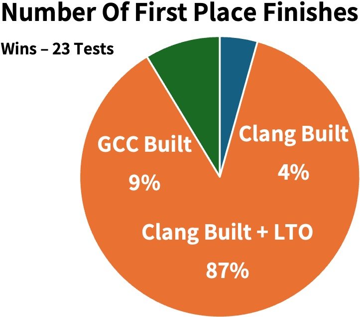
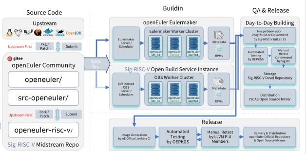
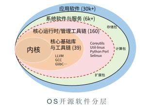
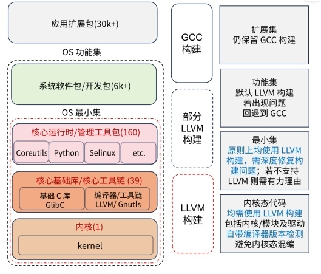

**简介**

项目「LLVM 平行宇宙计划」于 2023 年在 OpenAtom openEuler（简称
openEuler） 社区发起，探索以 LLVM 编译器套件替换 GCC 套件构建 Linux
发行版及其组成软件包。项目独立推进、与社区版本平行，故得名「平行宇宙」

RISC-V 架构一侧着眼服务器场景，已面向基于 SG2042 的 64 核工作站推出使能
UEFI 预览版本 ，经过 kernel 10000+ 测试用例与外围 4000+
软件包验证，目前未发现 LLVM 本身有效问题，性能略微提升

后续将跟进社区稳定及创新版本双轨推出对应平行版本，逐步对齐社区正式版本质量标准，增添各种新特性

**Why LLVM?**

**LLVM 在头部商业公司的推动下成熟**

Apple:2009年LLVM 首次商用即落地 macOS，全栈 OS均由 LLVM 构建

Google:贡献多个Sanitizer特性;Android 转用LLVM全栈构建

Meta 等:数据中心使用 LLVM 构建的 Linux 内核

\
**LLVM 性能不逊色于GCC**

-   Phoronix (2023-06) : Clang16 vs GCC13 @ Epyc Gen4 \[1\]

-   Clang 16 在 131 个用例中 75 个性能领先 GCC 13.1，原始数据均值领先 4%

-   Phoronix (2021-07}:Linux Kernel, Clang12 (+LTO) vs GCC11 \[2\]

-   Clang12 (+LTO)在 23 个用例中 20 个领先，原始数据均值领先 9

**LLVM 的更多收益**

更好的代码质量检测:clang-tidy 静志检查、原生运行时检查
sanitizer(地址消毒、未定义行为检查、线程检查、控制流检查等)

学生群体参与度较高:论文、学术分享数量大幅领先

头部企业自研编译器转型 LLVM
反哺上游:MLIR、CIRCTBOLT等新的编译能力/特性近几年不断涌现

**开源 OS 推动 LLVM 默认构建**

OpenMandriva:2014年切换 LLVM 构建，2019 年宣称首个Clang/LLVM
构建Linux发行版，2023年推出5.0大版本

Chimera Linux:2021年启动，完全基于 LLM 技术栈构建，用户态利用 FreeBSD
生态，2023年推出Alpha版本并不断滚动更新

Fedora、Debian等:当前结合
GCC+Clang进行构建，有类似实验性项目\[3\]正在推进中

**方法与进展**

**代码同源:**

源码均来自 src-openEuler社区仓

修改向 src-openEuler 社区仓及上游社区提交

极少部分修改暂存于 openeuler-risc-v 中间仓

**工作流程与基础设施:**

使用社区 Eulermaker 平台和 SIG 自建 OBS
构建平台开发调试，构建时按配置注入宏指定编译器

平日:按需构建-\>SIG-RV GitLab Cl制作镜像 -\>OEPKGS 平台自动测试

发版时:Eulermaker构建-\>社区 JenkinsCI服务制作镜像
-\>OEPKGS平台多次自动化测试及手动补测-\>多重审批 -\>对外发布

**切换 LLVM/Clang编译器方式:**软件包范围预先确定，逐步演进扩大

构建工程仅对涉及软件包统一配置注入变量，变更少、侵入程度较小

回合的修改均仅在 LLVM 构建时生效，不影响社区 GCC 版本构建

**换涉及软件包范围**社区
Everything+Epol 全量软件包

  

当前 Everything 范围 Clang 构建切换率\~95%

后续逐步演进:压减 Everything及 Epol构建问题，提升切换率

**重难点问题**

GlibC 等 GNU 生态软件包强依赖GCC

较早版本 OpenJDK 仅支持 GCC 构建
  

验证 mold、lld 等备选链接器与 ld 的兼容性

Fortran:新版功能未完善暂用 Classic Flang 
  

**后续计划**

版本发布:跟进社区创新版与稳定版进行双版本发版

质量控制标准逐步对齐正式版本

切换 LLVM 构建软件包逐次增加

**引用**

https://www.phoronix.com/review/amd-znver4-gcc13-clang16/6

https://www.phoronix.com/review/clang-lto-kernel/4

https://clang.debian.net

**openEuler on RISC-V SIG**

Gitee 码云: https://gitee.com/openeuler/RISC-V
  

GitHub: https://github.com/openEuler-RISCV 

自有构建平台: https://build.tarsier-infra.isrc.ac.cn/

**欢迎扫描二维码加入 openEuler on RISC-V SIG**

**openEuler TC & RISC-V SIG Maintainer 王经纬**

**加群请备注 OERV **
