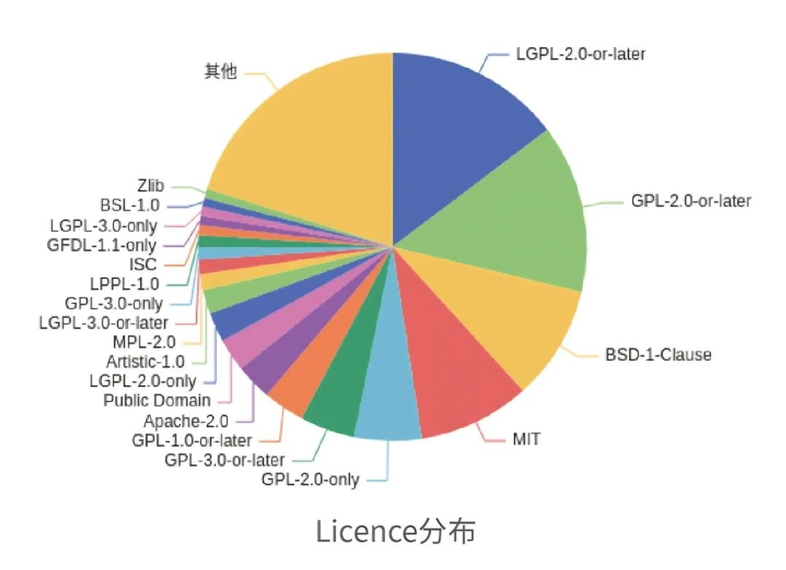

**摘要**

析灵SBOM工具作为一款开源软件供应链安全工具,正式入驻OpenAtom
openEuler（简称"openEuler"）社区,致力于提升软件组件的透明性与合规性。通过深度解析ISO镜像及RPM包,该工具可自动化生成标准化SPDX格式的SBOM清单,精准提取元数据(版本、许可证、依赖关系等),并支持依赖追踪、许可证合规初判及国标GB/T43698-2024适配。其开源特性为开发者与企业提供免费、灵活的安全管理方案,助力规避开源法律风险,强化漏洞识别与修复效率,推动开源生态的
可持续发展。

**主要功能与特点**

**1、支持多种格式的SBOM生成:**析灵SBOM工具能够对ISO镜像和单个RPM包进行深度扫描,生成符合SPDX标准的SBOM清单。SBOM清单是软件供应链透明化的关键工具,能够帮助用户了解软件中包含的所有绍件及其依赖关系。**2、自动化提取软件包元数据:**工具能够自动提取软件包的元数据,包括名称、版本、架构、供应商、许可证信息以及完整性校验值。这些信息对于软件供应链的安全管理至关重要,尤其是在追踪依赖关系和确保软件完整性方面。**3、依赖关系追踪与管理:**析灵SBOM工具不仅能够识别软件包的元数据,还能够追踪和管理软件包之间的依赖关系。这使得开发者能够更好地理解软件的组成结构,及时发现潜在的依赖冲突或安全问题。**4、
兼容主流Linux发行版:**该工具兼容多种主流Linux发行版,支持多种部署方式,用户可以根据需求灵活选择运行环境。这使得析灵SBOM工具能够广泛应用于不同的开发和生产环境中。**5、
许可证合规管理:**工具实现了SPDX许可证名称的规范化与合规初判,能够自动将常见的许可证变体名称转换为标准的SPDX标识符。同时,它还能够解析许可证的义务和限制,帮助用户更好地遵循开源许可证的要求,避免法律风险。**6、遵循国家标准GB/T
43698-2024:**析灵SBOM工具的设计和输出符合国家标准GB/T43698-2024的管理要求,确保其在企业级应用中的合规性。该标准对软件供应链的安全管理提出了明确的要求,析灵SBOM工具通过支持这些要求,帮助用户满足多场景下的合规需求。

**开源意义**

析灵SBOM工具的开源不仅为openEuler社区带来了一个强大的供应链安全工具,也为整个开源生态提供了更多的透明性和安全性保障。通过开源,开发者可以更深入地了解工具的实现细节,参与工具的改进和优化,进一步推动软件供应链安全的发展。

**应用场景**

**①企业软件供应链管理:**企业可以使用析灵SBOM工具来管理其软件供应链中的组件信息,确保所有使用的开源软件都符合许可证要求,避免潜在的法律风险。

**②
开源项目合规性检查:**开源项目维护者可以使用该工具来检查项目的依赖关系和许可证合规性,确保项目符合开源社区的标准和规范。**

③
安全审计与漏洞管理:**通过生成SBOM清单,安全团队可以更好地识别软件中的潜在漏洞,并及时采取措施进行修复。

**未来展望**

**析灵SBOM工具将持续深耕软件供应链安全领域,推动开源生态的透明化与可信化建设:**

**技术增强:**支持更多格式(如Docker镜像、Debian包)的深度解析,覆盖全类型软件制品。集成AI能力,提升依赖冲突预测与许可证合规自动化判断精度。

**生态扩展:**兼容Windows/macOS系统,实现跨平台供应链安全管理。与漏洞数据库(如CVE)联动,强化SBOM与漏洞关联分析能力。

**应用深化:**面向DevSecOps场景,提供CI/CD流水线无缝集成方案,实现"左移安全"。探索SBOM在云原生、边缘计算等新兴领域的标准化应用。

**社区共建:**联合openEuler社区,推动SBOM工具链的统一规范与数据互通。构建供应链安全知识库,降低开发者合规门槛,加速安全实践普及。

项目地址:https://gitee.com/openeuler/xlin-sbom
