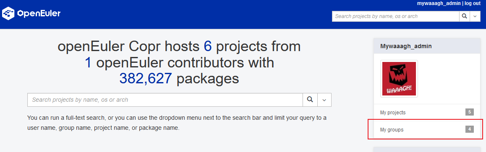

## 背景
在EUR中，用户以openEuler id登录后，创建的项目都会放在个人名下，部分SIG组的用户可能期望SIG组内能共同维护一些软件包或以SIG组的名义来维护一些项目

因此，基础设施团队最近对EUR更新了用户组的功能，下面就为大家介绍一下用户组相关功能：

## 如何使用 EUR groups
本次更新的EUR group功能，支持开发者们不仅能够在自己的namespace下创建项目

还可以以自己所在的SIG组来创建项目，具体的使用场景如下：

1. 用户`foo`在openEuler社区是`sig-infrastructure`的一员，当用户首次登录时，可以在首页侧栏看到`My groups`的按钮
    

1. 在点击进入页面后，会显示出用户当前所属的组和这些组在EUR系统中的别名
    

1. 如果某个组还未被其他用户激活，则会显示`Activate this group.`，点击`+`号即可进入激活界面

1. 在激活页面，开发这可以给当前的组取一个别名，注：一个SIG组只能有一个别名，且不可修改
    

1. 如果某个组已被其他用户激活，则会在右侧显示其别名，点击别名即可进入用户组的管理页面，这时就可以创建用户组下的项目了
    

## FAQ
Q: EUR的group信息是从哪里获取的
A: 我们通过`https://gitee.com/openeuler/community`获取各个SIG组的成员信息，SIG组的成员包括`maintainer`和`committer`

Q: 如果我的SIG组信息有变更，什么时候会在EUR中生效
A: 用户下次登录时，可以通过主动登出/登录来触发

Q: group下项目的软件包和个人下的项目的软件包在使用上有什么区别吗
A: 使用上没有区别，为了和个人用户区分，在前端页面上，group名称前会有一个@符号

