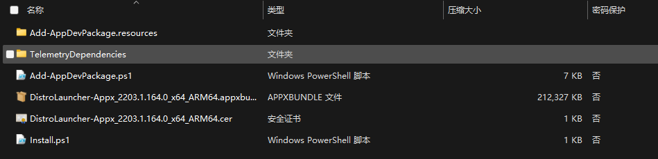
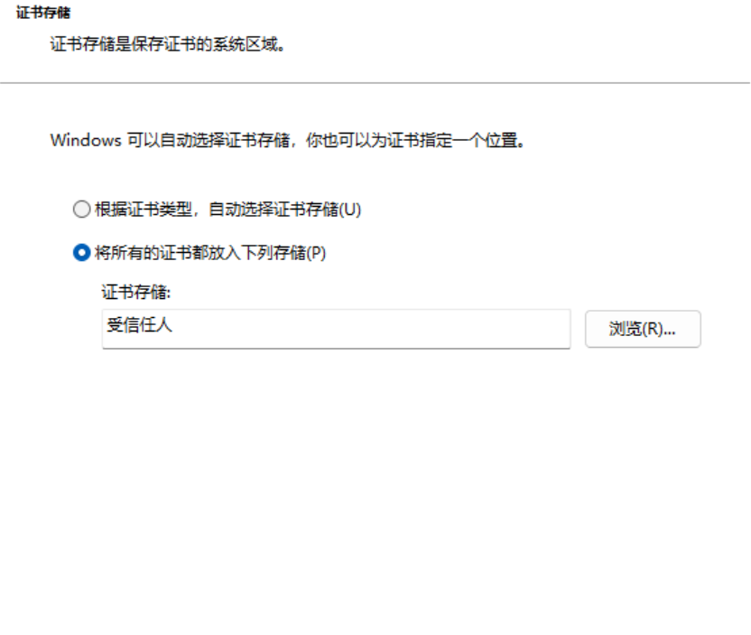
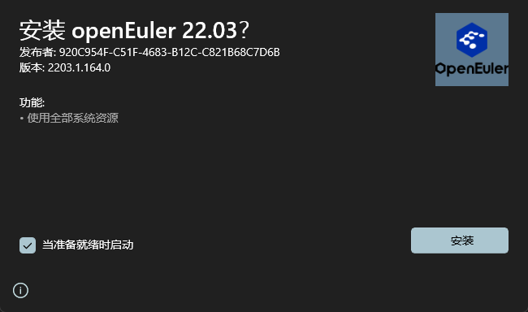
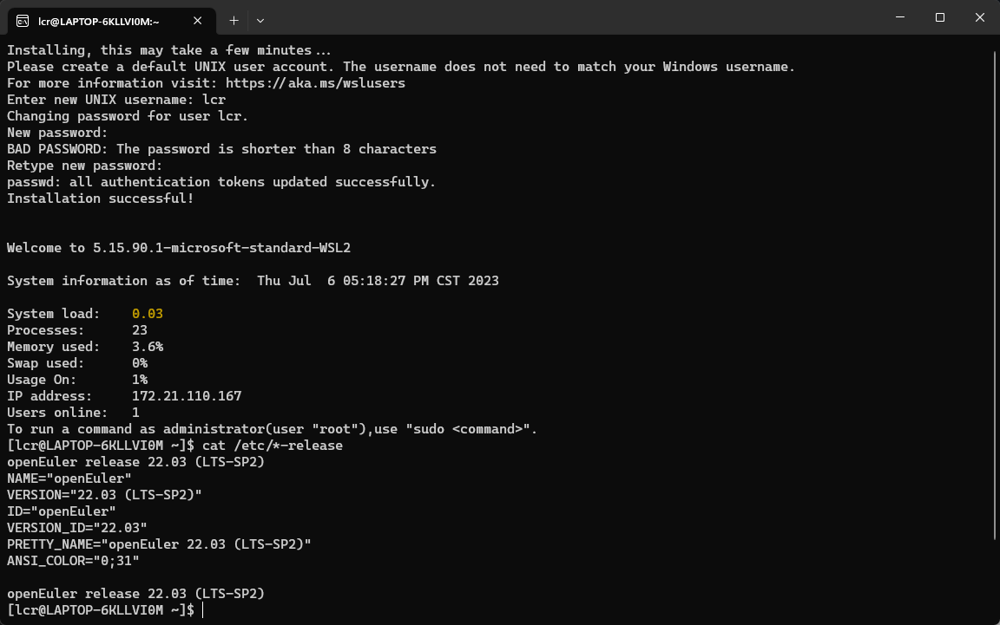

## 背景
自openEuler 22.03 LTS SP2版本开始，repo仓库里会默认发布WSL sideload压缩包，不方便访问Windows Store的用户可以使用这种方法安装体验openEuler WSL

## 如何使用
1. 在仓库中下载对应版本的WSL sideload发布件，例如 [22.03 LTS SP2的sideload.zip包](https://repo.openeuler.org/openEuler-22.03-LTS-SP2/WSL/openEuler-WSL-22.03.zip)
1. 下载后，解压该zip，可以看到其中有一个`cer`证书文件和一个`appxbundle`文件

1. 首先双击`cer`，将证书安装到受信任的
    1. 双击`xxx.cer`
    1. 选择`本地计算机（local machine）`，点击下一页
    1. 选择`受信任人（trusted people）`，点击下一页

    

    4. 点击完成

1. 双击`appbundle`安装sideload，如果已经按照过曾经发布过的22.03的WSL，则会提示更新，点击安装
   
    

1. 安装成功后，会自动弹出WSL初始化界面，创建账号

    