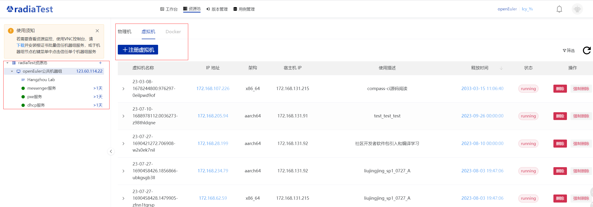
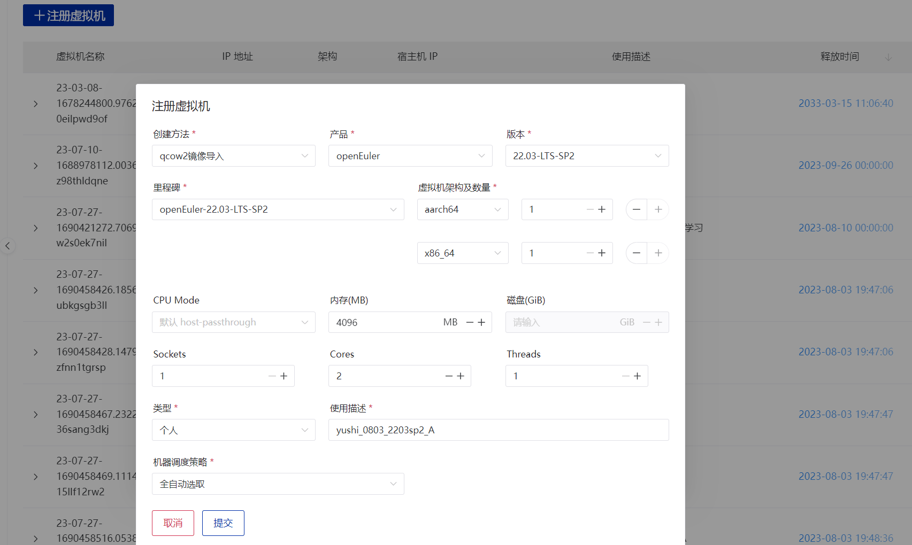

>本文不涉及软件包安装部分，所有操作都基于待测试的软件包已经正常安装在测试机上。
<!-- TOC -->
## RadiaTest平台创建测试虚拟机
RadiaTest平台：https://radiatest.openeuler.org/login/
- 用户登录,选择openEuler鉴权登录,首次登录需要用gitee注册，如果之前gitee账号没有签署CLA，需要签署CLA才可进入平台
  - 使用个人邮箱注册签署individual CLA(推荐，签署employee CLA需耐心等待签署通过)
  - 使用华为邮箱注册必须签署employee CLA，签署后找曹志 00567459通过，通过后会收到邮件（此处我等待了一天多）
- 登录后进入Workspace的资源池，进入openEuler公共机器组，创建虚拟机
  - 若radiaTest资源池中没有openEuler公共机器组，则需点击右上角的小铃铛标志，然后点击左侧的两个小人标志，申请加入kunpeng用户组，等待管理员审批通过
    
- 注册虚拟机
  - 创建方法：qcow2镜像导入
  - 虚拟机版本、架构及数量：按需填写，此处我选择了最新的LTS版本并创建了一台arm和一台x86虚拟机
  - 使用描述：表明用途，以便与他人混用即可
    

## 手工写单包测试用例
- svn获取团队测试用例模板:`svn checkout svn://172.168.131.94:9402/团队管理`（**一定要加上团队管理**，本人一开始并不知道下面还有目录，一直提示拉取失败）
  - 如果没有svn的登录账号，需要找人添加账号并开权限
- 拉取文件后，单包测试用例的前人文档在`用例集/04-单包测试/命令覆盖`，模板在`用例集/99-单包测试`
- 手工写单包测试用例需注意：
  - 主要做功能测试，可以通过`xx --help`获取测试项，例如我对axel进行测试，则借助`axel --help`进行逐一检验
  - 用例名统一格式为`oe_test_xx_01`等，节点数为使用的虚拟机个数，其他可参考模板
  - 十条用例为一个测试套，多于十条，需分成多个测试套
  - 测试需全面，如遇到一些不常用的指令，也最好都测一下
- 手工编写完的用例excel可放到`用例集/04-单包测试/命令覆盖`并上传至svn服务器
  
## 测试自动化mugen
mugen测试框架介绍：https://gitee.com/openeuler/mugen?_from=gitee_search
- 在虚拟机中拉取mugen后（本人通过fork openEuler/mugen后clone到本地虚拟机），配置测试套环境变量
  ```
  bash dep_install.sh   # 安装依赖软件
  bash mugen.sh -c --ip $ip --password $passwd --user $user --port $port    # 配置测试套环境变量（ip：测试虚拟机的ip地址，user：测试机的登录用户，默认为root，password: 测试机的登录密码，port：测试机ssh登录端口，默认为22）
  ```
- 根据前面写的手工用例，编写用例自动化脚本
  >总的来说，mugen框架下要编写的单包测试自动化脚本主要有两个：1、`testcases/cli-test`路径下的`oe_test_xx.sh`用例执行脚本。2、`suite2cases`下的`xx.json`配置文件，指定测试套路径和执行用例
  <!-- TOC -->
  - `oe_test_xx.sh`用例执行脚本的编写比较简单，可参考模板，其中注意：
    - 用例名称仍然统一为``
    - `function run_test()`的书写逻辑就是执行需要测试的指令，`CHECK_RESULT`检验执行结果
    - 测试完之后，要保证本次测试产生的所有相关文件都被清除，即编写`function post_test() `
  - `xx.json`文件的精简模板如下：
  ```
  {
    {
      "path": "$OET_PATH/testcases/cli-test/axel",   #  测试套路径
      "cases": [   # 执行的测试套
        {
          "name": "oe_test_axel_01"
        },
        {
          "name": "oe_test_axel_02"
        }
      ]
    }
  }
  ```
 - 执行用例，调试脚本
   - 在mugen.sh所在目录执行命令
    ```
    bash mugen.sh -f testsuite -x   # 执行指定测试套
    bash mugen.sh -f testsuite -r testcase -x  # 执行单条用例
    ```
    - 出现报错可查看mugen路径下生成的日志
    ```
    cd logs/testsuite
    ```

## shellcheck语法检查
回到蓝云在用例脚本目录下执行`shellcheck xxx.sh`可以查看具体的shell语法问题，并可通过提示修改代码。

其中，`SC1090`报错不用管，`SC2086`的报错在did you mean中给出了修改建议加上`""`,`SC2046`报错没有直接给出修改提示，但可以访问给出的`https://www.shellcheck.net/wiki/sc2046`查看修改示例进行修改。

修改到只剩`SC1090`报错后即可。

最后就可以欢快的提交代码了~总的来说，整个单包加固测试流程其实不难，编写自动化脚本时也不需要专门学习，基本一看就能懂，但是萌新上手经过了一些权限不足、文档信息不全等前期问题，整个摸索、理解到实践耗时还是挺久的。

本文相关代码存放：https://gitee.com/yushi-Icy/testcases