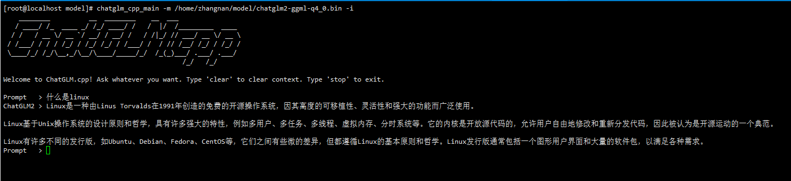
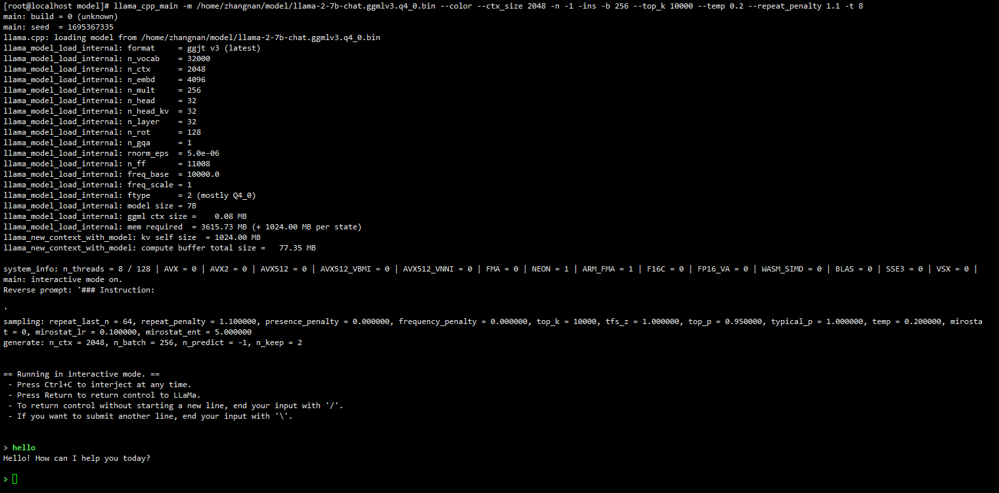

# LLM简介

本文档介绍openEuler大语言模型（Large Language Model, LLM）的安装、开发等，帮助用户快速了解并使用LLM。LLM是一种人工智能模型，旨在理解和生成人类语言。它们在大量的文本数据上进行训练，可以执行广泛的任务，包括文本总结、翻译、情感分析等等。

本文档适用于使用openEuler系统并希望了解和使用LLM的社区开发者、开源爱好者以及相关合作伙伴。使用人员需要具备基本的Linux操作系统知识。

# chatglm-cpp使用指南

## 介绍
chatglm-cpp是基于C/C++实现的ChatGLM大模型接口，可以支持用户在CPU机器上完成开源大模型的部署和使用。

chatglm-cpp支持多个中文开源大模型的部署，如ChatGLM-6B，ChatGLM2-6B，Baichuan-13B等。

## 软件架构
chatglm-cpp核心架构分为两层 
- 模型量化层：可以量化开源模型，减少模型大小；
- 模型启动层：可以启动量化后的模型。

特性：
- 基于ggml的C/C++实现；
- 通过int4/int8量化、优化的KV缓存和并行计算等多种方式加速CPU推理；
- 互动界面是流媒体生成，具有打字机效果；
- 无需 GPU，可只用 CPU 运行。

## 安装教程
### 软硬件要求  
处理器架构：支持AArch64和X86_64处理器架构；

操作系统：openEuler 23.09；

内存：根据不同开源模型的大小，不低于4G。

### 安装组件 
使用chatglm-cpp部署大模型，需要安装chatglm-cpp软件包。安装前，请确保已经配置了openEuler yum源。

1.  安装：
```
yum install chatglm-cpp
```
2.  查看是否安装成功：
```
chatglm_cpp_main -h
```
若成功显示help信息则安装成功。

## 使用说明
### 不使用容器
1.  需要安装chatglm-cpp软件包：
```
yum install chatglm-cpp
```
2.  需要下载开源大模型，如ChatGLM-6B、ChatGLM2-6B等。并将下载的开源大模型通过chatglm_convert.py进行模型量化：
```
python3 /usr/bin/chatglm_convert.py -i model_path/ -t q4_0 -o chatglm-ggml_1.bin
```
其中model_path为开源大模型的存放路径，q4_0为开源大模型量化的精度，chatglm-ggml_1.bin是输出的量化模型的名称。

3.  启动模型，进行对话：
```
chatglm_cpp_main -m model_path  -i
```
其中model_path为量化模型的存放路径。

可通过以下命令查看命令行选项用法：
```
chatglm_cpp_main -h
```
### 使用容器
1. 拉取容器镜像：
```
docker pull hub.oepkgs.net/openeuler/chatglm_image
```
2. 运行容器镜像，进行对话：
```
docker run -it --security-opt seccomp=unconfined hub.oepkgs.net/openeuler/chatglm_image
```
### 正常启动界面
ChatGLM2-6B模型启动后的界面如图1所示：

**图1** ChatGLM2-6B模型启动界面

## 规格说明
本项目可支持在CPU级别的机器上进行大模型的部署和推理，但是模型推理速度对硬件仍有一定的要求，硬件配置过低可能会导致推理速度过慢，降低使用效率。

表1可作为不同机器配置下推理速度的参考：

表格中Q4_0，Q4_1，Q5_0，Q5_1代表模型的量化精度；ms/token代表模型的推理速度，含义为每个token推理耗费的毫秒数，该值越小推理速度越快；

**表1** ChatGLM-6B模型推理速度的测试数据

| ChatGLM-6B            | Q4_0 | Q4_1 | Q5_0 | Q5_1 |
|--------------------------------|------|------|------|------|
| ms/token (CPU @ Platinum 8260) | 74   | 77   | 86   | 89   | 
| 模型大小                      | 3.3G | 3.7G | 4.0G | 4.4G | 
| 内存占用                      | 4.0G | 4.4G | 4.7G | 5.1G |

# llama.cpp使用指南

## 介绍
llama.cpp是基于C/C++实现的LLaMa英文大模型接口，可以支持用户在CPU机器上完成开源大模型的部署和使用。

llama.cpp支持多个英文开源大模型的部署，如LLaMa，LLaMa2，Vicuna等。

## 软件架构
llama.cpp核心架构分为两层
- 模型量化层：可以量化开源模型，减少模型大小；
- 模型启动层：可以启动量化后的模型。

特性：
- 基于ggml的C/C++实现；
- 通过int4/int8量化、优化的KV缓存和并行计算等多种方式加速CPU推理；
- 互动界面是流媒体生成，具有打字机效果；
- 无需 GPU，可只用 CPU 运行。

## 安装教程
### 软硬件要求 
处理器架构：支持AArch64和X86_64处理器架构；

操作系统：openEuler 23.09；

内存：根据不同开源模型的大小，不低于4G。

### 安装组件 
使用llama.cpp部署大模型，需要安装llama.cpp软件包。安装前，请确保已经配置了openEuler yum源。
1.  安装：
```
yum install llama.cpp
```
2.  查看是否安装成功：
```
llama_cpp_main -h
```
若成功显示help信息则安装成功。


## 使用说明
### 不使用容器
1.  需要安装llama.cpp软件包：
```
yum install llama.cpp
```
2.  需要下载开源大模型，如LLaMa、LLaMa2等。并将下载的开源大模型通过llama_convert.py进行模型量化：
```
python3 /usr/bin/llama_convert.py  model_path/
```
其中model_path为开源大模型的存放路径。

3.  启动模型，进行对话：
```
llama_cpp_main -m model_path --color --ctx_size 2048 -n -1 -ins -b 256 --top_k 10000 --temp 0.2 --repeat_penalty 1.1 -t 8
```
其中model_path为量化模型的存放路径。

可通过以下命令查看命令行选项用法：
```
llama_cpp_main -h
```
### 使用容器
1.  拉取容器镜像：
```
docker pull hub.oepkgs.net/openeuler/llama_image
```
2. 运行容器镜像，进行对话：
```
docker run -it --security-opt seccomp=unconfined hub.oepkgs.net/openeuler/llama_image
```
### 正常启动界面
LLaMa2-7B模型启动后的界面如图2所示：

**图2** LLaMa2-7B模型启动界面

## 规格说明
本项目可支持在CPU级别的机器上进行大模型的部署和推理，但是模型推理速度对硬件仍有一定的要求，硬件配置过低可能会导致推理速度过慢，降低使用效率。

表2可作为不同机器配置下推理速度的参考：

表格中Q4_0，Q4_1，Q5_0，Q5_1代表模型的量化精度；ms/token代表模型的推理速度，含义为每个token推理耗费的毫秒数，该值越小推理速度越快；

**表2** LLaMa-7B模型推理速度的测试数据

| LLaMa-7B            | Q4_0 | Q4_1 | Q5_0 | Q5_1 |
|--------------------------------|------|------|------|------|
| ms/token (CPU @ Platinum 8260) | 55   | 54   | 76   | 83   | 
| 模型大小                      | 3.5G | 3.9G | 4.3G | 6.7G | 
| 内存占用                      | 3.9G | 4.2G | 4.5G | 5.0G |
