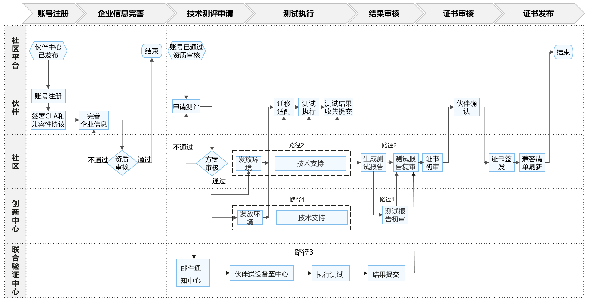

# 英特尔®平台先进技术评测规范(openEuler版)

### 1、评测流程

英特尔先进技术评测（暂定名）沿用了现有的openEuler兼容性测试框架，并引入了英特尔平台的特性测试集。

对于合格的申请者，英特尔将发放英特尔®平台先进技术验证函("验证函")。

### 2、检查清单

##### 2.1 硬件平台

目前英特尔先进技术评测（暂定名）的测试集支持英特尔第四代及后续的至强处理器平台。需检查被测平台的CPU型号是否在下列平台列表中：

- SPR (Sapphire Rapids): 第四代 Intel® Xeon® Scalable 处理器
- EMR (Emerald Rapids): 第五代 Intel® Xeon® Scalable 处理器
- SRF (Sierra Forest): 第六代 Intel® Xeon® Scalable 处理器
- GNR (Granite Rapids): 第六代 Intel® Xeon® Scalable 处理器

##### 2.2 固件版本

确保固件已更新到最新版本。

##### 2.3 操作系统

当前支持的openEuler版本：openEuler 24.03 LTS

说明：目前openEuler 22.03 LTS SP4包含了Sapphire Rapids和Emerald Rapids的全特性的支持，Sierra Forest和Granite Rapids仅包含选择性特性的支持。

### 3、测试用例

##### 3.1 测试用例列表

| 平台特性                                    | 测试用例                     |
| ------------------------------------------- | ---------------------------- |
| Intel Advanced Matrix Extensions (AMX)      | amx/tmul: tests-amx          |
| Intel Advanced Vector Extensions (AVX512)   | avx512vbmi: tests-avx512vbmi |
| C-State                                     | cstate: tests-cstate         |
| Intel Data Stream Accelerator (DSA)         | dsa: tests-dsa1              |
| Intel In-Memory Analytics Accelerator (IAA) | dsa: tests-iax               |
| Intel In-Field Scan (IFS)                   | ifs: tests-ifs               |
| Intel Performance Counter Monitor (PMU)     | pmu: tests-pmu               |
| P-State                                     | pstate: tests-pstate         |
| Intel Running Average Power Limit (RAPL)    | rapl: tests-rapl             |
| Telemetry                                   | telemetry: tests-telemetry   |
| Topology                                    | topology: tests-topology     |
| User-Mode Instruction Prevention (UMIP)     | umip: tests-umip             |
| XSAVE                                       | xsave: tests-xsave           |

说明：测试用例根据平台特性的差异会有所不同，并且测试用例会也会根据特性在openEuler系统的集成而更新或增加。英特尔技术可能需要启用的硬件、软件或服务激活，详见[法律声明与免责声明© Intel Corporation](https://edc.intel.com/content/www/us/en/products/performance/benchmarks/overview/) 
### 4、联系方式

评测申请邮箱：[intel-openeuler-certification@intel.com](mailto:intel-openeuler-certification@intel.com)

