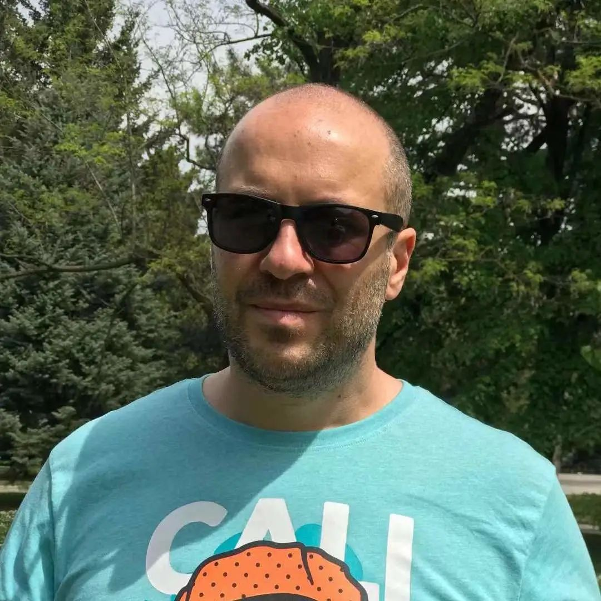
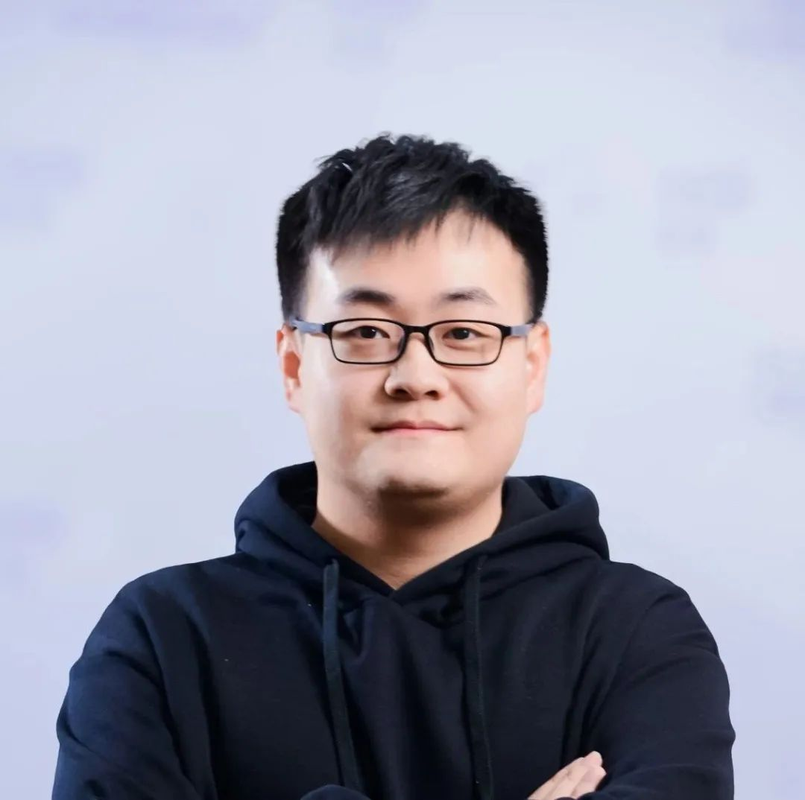
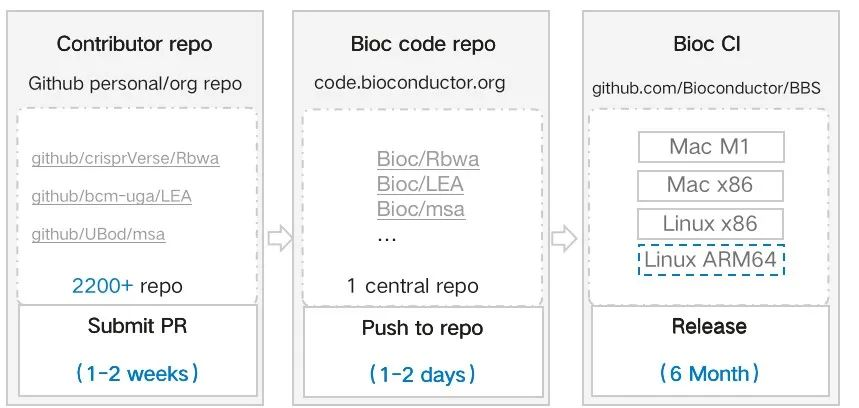
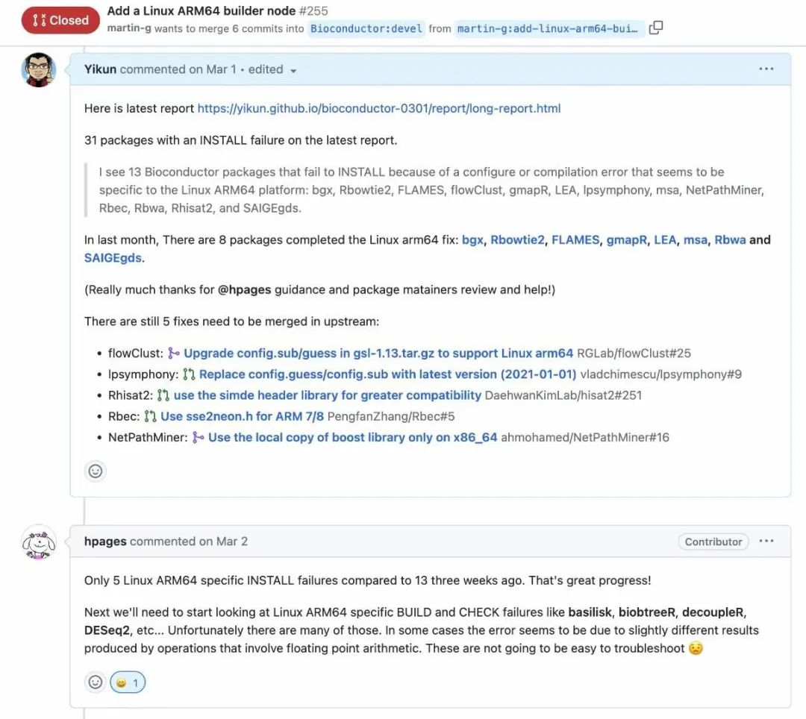
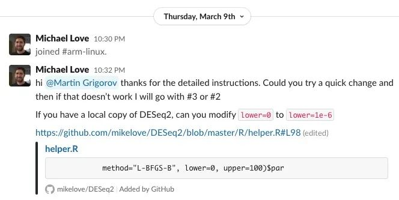
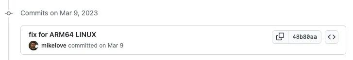
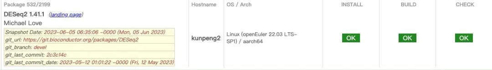
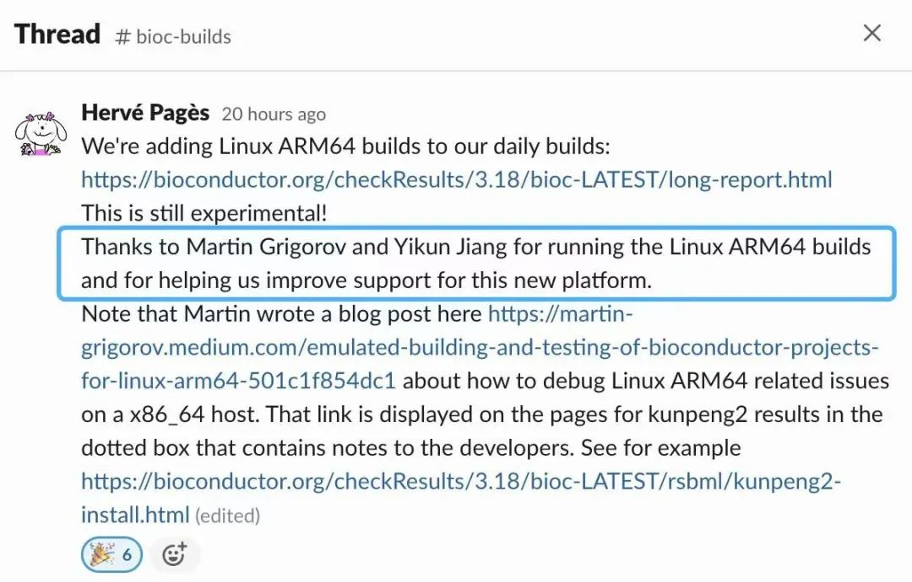
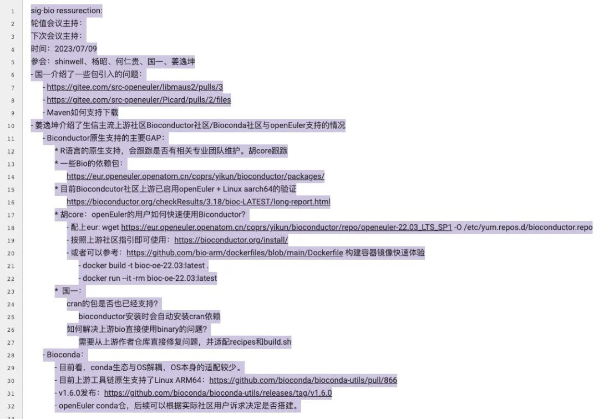

作为覆盖全场景应用、支持多样性算力的面向数字基础设施的开源操作系统，openEuler始终遵循"上游优先"的策略，帮助上游开源软件原生支持openEuler，让openEuler系操作系统的用户可以在开发、集成、使用这些开源软件或基于这些开源软件的产品和解决方案时获得最大便利。

近日，[生物信息学领域最大社区之一Bioconductor社区宣布选择鲲鹏硬件+openEuler
OS作为官方验证平台之一](http://mp.weixin.qq.com/s?__biz=MzI2NDE4OTE2Mg==&mid=2247504799&idx=1&sn=1a978f72b5eed3bf73d42013399363e5&chksm=eab2f61addc57f0c0689c1359c294044e157f9f30d371268133ba9cbb01a0ecfa1b197f17e3c&scene=21#wechat_redirect)，意味着超过
2000
款开源软件增加对鲲鹏硬件和openEuler的支持。本次贡献由openEuler社区开发者姜逸坤（GitHub
ID：@Yikun）、Martin Grigorov（GitHub
ID：@martin-g）以及其他开发者共同完成。

通过本文您可以了解，在上游社区与openEuler适配过程中：1.面对众多零散的软件包，openEuler是怎么解决的；2.openEuler社区提供哪些高效易用的工具，帮助开发者的工作；3.如何与其他社区开发者产生联系，共同协作；4.项目完成后，openEuler在HPC及生信领域的整体布局和发展方向是什么？

Martin Grigorov

GitHub ID：@martin-g

Martin Grigorov is a member of the OpenHPC team as a maintainer of
openEuler OS and a member of several Apache Software Foundation
projects. Martin has been working in the IT industry since 2003
developing software for different industries. As an Open Source believer
he has contributed to many projects and communities. He likes to spend
his free time with his family, to travel and to care about his garden. 

姜逸坤

GitHub ID：@Yikun

来自华为计算开源团队，高级软件工程师，Apache Spark Committer，openEuler
Infra SIG Maintainer，Volcano Reviewer，OpenStack 存储项目
Committer，目前致力于HPC、大数据、云计算领域开源项目的开发与设计。 

**Q1：**

BioConductor可能对某些读者比较陌生，能否先帮我们介绍一下这个项目？

**Martin Grigorov：**

Bioconductor is a free Open Source software umbrella project that hosts
a wide range of statistical tools used for analysis and comprehension of

genomic data generated by wet lab experiments in molecular biology.

The tools are developed in the R programming language and are used by
biologists who benefit significantly from their ability to analyze
datasets. All these results provide biologists with easy access to the
analysis and visualization of genomic data without requiring programming
expertise.

The project consists of a core team (around 5-10 people) that provides
the infrastructure for hosting and testing the tools and the respective
maintainers of each tool (a few thousand people!). 

**姜逸坤：**

Biconductor社区包含了超过2000款来自于世界各地数以千计的开发者提交的R语言包。原始代码在个人仓（图左），代码由作者提交到Bioc中心仓（图中），Bioc获取源码并在其CI平台中各架构进行验证（图右）；另一个信息是这些R语言包也存在互相依赖的情况，也意味着如果底层依赖包有问题，那么上层的软件包都无法构建。

**Q2：**

在实际的开发过程中面临最大的挑战是什么？怎么解决的呢？

**Martin Grigorov：**

Initially there was some doubt/resistance from the core team about the
need to support ARM64 on Linux. Thankfully they already had experience

with ARM64 on MacOS because many of the tool maintainers were working on
MacOS. So, we and some users from the community convinced them

that there is a demand for running the Bioconductor tools on ARM64 in
the cloud, i.e. on Linux.

The core team accepted this reason and added an experimental build and
test runner on openEuler 22.03 LTS ARM64!

The next challenge was to make it easy for the tool maintainers to debug
any ARM64 related issues because most of them do not have access to
Linux ARM64 machines. I wrote an
article (https://blog.bioconductor.org/posts/2023-06-09-debug-linux-arm64-on-docker/) that
explains how to

do this by running Docker ARM64 container. Another member of the Bioc
community prepared a follow-up article

(https://blog.bioconductor.org/posts/2023-07-14-linux-arm64-github-actions/) about
how to add automated testing via Github Actions.

**姜逸坤：**

还有一个挑战，我觉得是Bioconductor软件包数以千计的开发者是零散的分布在世界各地的，每个软件包维护主体也是开发者自己，是一个比较松散的治理结构。这就意味着，我们首先需要完成适配的方案和开发，再通过Github、Gitlab、邮件等多个渠道联系到开发者进行修改。

当然，光靠我和Martin
2个人，没有社区的帮助是不足以完成的，所以当我们完成最开始20+问题的基础包修复后，我们发现Bioconductor社区的核心维护者们，也会主动地帮助我们一起分析Linux
ARM64的问题。

**Q3：**

确实有很多背后的故事，还有什么让你觉得印象深刻的地方？

**姜逸坤：**

还有一个印象深刻的地方，就是一些核心包的社区维护者开始自主加入我们，一起完成在Linux
ARM64支持与适配工作。

例如，DESeq2（用于高维计数数据统计可视化和差异）这个使用量非常大的生信软件包，他的作者加入Bioconductor
Slack #arm-linux频道我们一起分析和解决问题：

并且在我们的指引下，一起完成了修复并合入了问题：

可能大家看到的就是CI结果的"一抹绿"，但是这背后真的是蕴含了很多背后开发者的共同协作的努力和贡献。

我想这就是开源社区的魅力吧，当我们点燃了"火"后，有更多的开发者一起添柴，"众人拾柴火焰高"，终而完成这个成果。

**Q4：**

能展开聊聊做这个项目的初衷么？                          

**姜逸坤：**

以社区的用户为中心。一方面，无论是在openEuler社区还是鲲鹏社区的用户里面，有挺多生物信息领域的用户，这也是驱使我们主导去做Bioconductor社区Linux
ARM64支持的根本原因。另一方面，从Bioconductor社区看，他们本身就非常欢迎多元化的支持发生，同时，Bioconductor社区的用户陆续反馈希望能够支持Linux
ARM64。完成两个社区的合作和双向支持，对两方面的社区均有帮助。

当我们和社区一起完成了这个成果后，社区的核心维护者也在官方频道宣布了这一消息，包括社区、周边团队都反馈这个合作非常很有益。这让我们很受鼓舞。

**Q5：**

你们具体做了哪些事情？彼此之间是怎么配合的？ 

**Martin Grigorov：**

When we started working on this integration we took a few dozen random
Bioconductor projects and started building and testing them on openEuler
22.03 ARM64.

We wanted to see how many of them will fail and most importantly what
kind of problems they will have. Thankfully most of them passed
successfully and the ones that failed were due to usage of x86_64
specific optimizations (e.g. using AVX Assembly instructions). So, we
started contacting the maintainers of

the failed ones and offered them help to solve the issues by sending
Pull Requests.

There is still some work to be done but currently the Bioc build results
for openEuler are similar to the Linux x86_64 ones!

**姜逸坤：**

另外，我们发现openEuler有些软件包不支持，openEuler的软件仓很多，有官方仓、OEPKGS、EUR等等，最开始我们其实更多的是考虑开发效率，快速迭代验证。所以我使用了基础设施团队提供的EUR (https://eur.openeuler.openatom.cn/coprs/yikun/bioconductor/)。

事实也证明我们选型是正确的，EUR允许我们快速生成软件包，尤其在初期变更频繁的时候，极大地提高了我们的开发效率。

在这个过程中，除了我和Martin外，也有很多幕后贡献者，比如来自华为计算团队的杨兴宇也共同参与了这个工作，我和Martin更多的是在上游的修复以及和社区的沟通，而兴宇则投入了很多错误分析、软件包支持和开发的工作。非常感谢大家的支持。

**Q6：**

那你们觉得，openEuler社区对HPC及生信领域的整体布局和发展方向是什么？

**姜逸坤：**

openEuler社区是有一个Bio SIG。最近，我们还和openEuler Bio
SIG (https://etherpad.openeuler.org/p/sig-bio-meetings) 展开了交流：

因为在这个过程中我们也发现了一些Gap，比如openEuler社区中R语言包的持续维护、关键包rpm包依赖的缺失等等，但好消息是，这些工作也得到了麒麟软件、麒麟信安等开发者以及openEuler
TC胡欣蔚的支持。

独行快，众行远，也希望我们能够和openEuler Bio SIG的同学一起努力，让Bio
on openEuler的支持越来越完善，越走越远。
