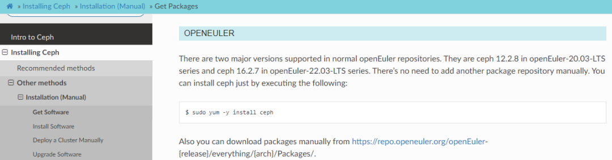

作为覆盖全场景应用、支持多样性算力的面向数字基础设施的开源操作系统，openEuler始终遵循"上游优先"的策略，帮助上游开源软件原生支持openEuler，让openEuler系操作系统的用户可以在开发、集成、使用这些开源软件或基于这些开源软件的产品和解决方案时获得最大便利。

北京时间2023年7月20日，在openEuler SDS
SIG与Linaro的联合推动下，**Ceph社区上游正式合入openEuler原生支持，并通过CI持续验证**。

<https://docs.ceph.com/en/latest/install/get-packages/#openeuler>

Ceph社区上游正式合入openEuler原生支持，意味着openEuler在对Ceph的生态适配得到了Ceph社区的认可，相关技术已与Ceph生态完成适配。

目前 openEuler
已经实现了Ceph在openEuler多个版本上的移植和适配，满足各项基础功能的运行。未来，openEuler社区将继续保持对Ceph新版本的适配，完善openEuler在分布式存储场景的支持，并持续在Ceph社区中完善openEuler的集成，保证Ceph在openEuler上的持续可用。

SDS
SIG是openEuler中主导存储领域相关技术的SIG，提供Ceph、Lustre、DAOS等项目在openEuler的支持，旨在汇聚存储英才，共同打造高质量、高性能、高可靠性的分布式存储组件版本，构建丰富的南北向生态。先后有来自Linaro、XSKY，超聚变、H3C、网易等十多家国内外企业的开发者积极参与贡献。

相关链接：

Ceph on openEuler每日构建CI：

<https://github.com/openeuler-mirror/ceph-daily-build>
