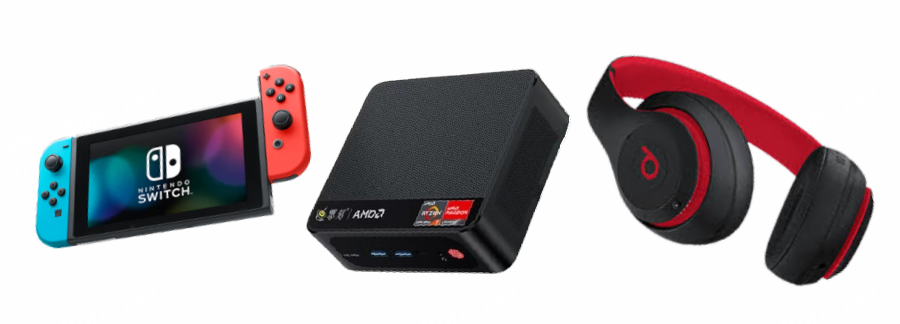
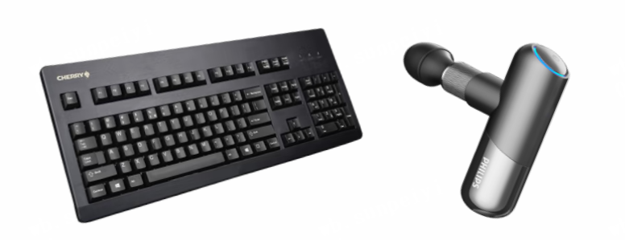
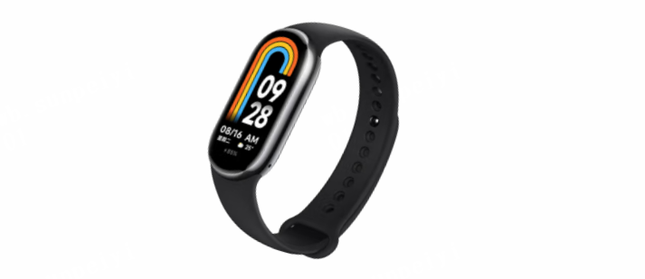
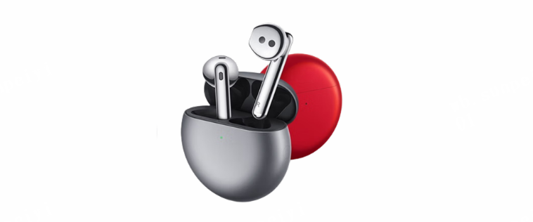

Curve 是云原生计算基金会 (CNCF) Sandbox
项目，是网易主导自研和开源的高性能、易运维、云原生的分布式存储系统。openEuler 是一个面向数字基础设施操作系统的开源社区，由开放原子开源基金会孵化及运营。

2023的夏天，为了帮助开发者找到参与社区贡献的方向，Curve 携手 openEuler
联合举办 **Summer Code Camp**。Curve 从原理到实践，与大家分享关于 Curve
的一切。

**预期收获**

**技术提升**：社区 mentor 专业指导项目实践，大型分布式存储系统开发经验

**社区认可**：熟悉开源项目开发流程，与热爱开源的小伙伴和技术大牛协作交流

**奖品激励**：社区活动大使荣誉，Curve Contributor 证书和 Curve &
openEuler 双份礼包

**实习机会**：表现优异者可获得 Curve 团队实习机会

**题目方向**

本次Summer Code Camp在两大专题的基础上精心准备了3个难度等级，60+题目。

**[Curve 社区]**

Curve
目前支持文件存储（CurveFS）和块存储（CurveBS）。保证趣味性和挑战性的前提下，题目方向丰富，范围广泛。包括
Curve web 控制台方向，云原生方向，核心代码逻辑方向，CurveAdm 方向以及
Curve 的 CI 方向等。涉及的语言包括 C/C++、go、python/shell 等。

**[openEuler 社区联动]**

开发者可以完成社区用户的真实诉求，带来真正的使用价值。openEuler
支持服务器、
云计算、边缘计算、嵌入式等应用场景，本身拥有优秀的开源生态系统。Curve
期望在 openEuler 上运行，所以需要做相应的适配和验证工作。

**openEuler相关题目：Curve 适配开源操作系统openEuler**

openEuler是面向数字基础设施的开源操作系统，支持服务器、
云计算、边缘计算、嵌入式等应用场景，支持多样性计算，致力于提供安全、稳定、易用的操作系统。Curve期望在该操作系统上运行，所以我们需要做一些适配和验证工作，最终签署CLA协议加入这个优秀的社区。

参考资料如下：

openEuler社区软件包引入提交流程
：<https://bbs.huaweicloud.com/forum/thread-126370-1-1.htmlopenEuler>

packaging guidelines
：<https://gitee.com/openeuler/community/blob/master/zh/contributors/packaging.md>

将pandoc引入到openEuler
：<https://summer-ospp.ac.cn/org/prodetail/23b970472?list=org&navpage=org>

**具体方向解读：**<https://ask.opencurve.io/t/topic/161>

**活动流程**

**[启动报名：7.20]**

**[报名方式：]**

-   报名官网申请题目后，添加 Curve 小助手，加入活动群。

-   社区活动大使：邀请其他人成功报名，邀请人获得社区活动大使荣誉。

-   **报名官网**：https://summercoding-curve.app.codewave.163.com/apply

**[详细流程：]**

 **报名申请阶段**：除填写基础信息外，Esay 等级可简单描述思路，Medium及 Hard 建议在 Curve 论坛详细描述解决方案。每个开发者最多提交 3个题目的申请，各方向 mentor 将根据申请材料和题目申请情况进行匹配。

 **审核匹配**：提交申请后 3个工作日内会在活动群内收到通知。最终题目匹配情况请查看 Github活动页面。Easy 等级每人最多匹配 3 题，Medium 和 Hard 等级最多匹配1 题。

**[需求设计阶段：7.26-8.9]**

**直播答疑**：活动群内进行活动流程，题目方向的解读。

**需求设计**：联系 mentor 明确需求、开发方案与时间规划。

**Coding 阶段：8.10-9.22**联系题目对应 mentor
后，即可以进行需求实现。

**注意事项**：截止**8月31日**至少请提交 Draft
状态的 pr，否则将视为放弃开发，题目将释放给其他开发者。

**[Review阶段]** 提交 pr 后，根据题目难度，将在2-5个工作日内得到
Review。

完成题目以成功合入 pr 为准。若有 CI
测试冲突或者收到修改意见，需进行相应修改。

**[截止开发日期：9.22]**

截止**9月22日**，未合入的 pr 将视为未完成题目，请开发者及时和 mentor沟通，合理安排时间。

**社区活动大使**

通过分享和邀请更多的开发者，共同打造更加繁荣的 Curve 社区

**[面向人群：]**

-   已报名的开发者

-   已在社区贡献过的开发者

[**职责**：]

邀请其他人成功报名活动

**[邀请条件：]**

-   请确保你和被邀请人在同一组织内

-   被邀请人官网填写你的真实联系方式

**[激励：]**

-   社区活动大使特别荣誉称号

-   地区组织者勋章一枚

-   Curve 限量周边大礼包

**Curve Contributor 专属礼包**

正式合入 pr 后，首先恭喜你成为 **Curve
Contributor**！你将获得专属徽章及证书各一份，更有** Curve Contributor
专属大礼包**等着你\~

奖品根据题目难度及合入 pr 数量发放，遵循先提交先 review
的原则，以最终合入 pr 为准：

-   Hard & Medium 等级：先提交、先合入、先挑选

-   Easy 等级：数量有限，先合先得

**Hard 奖品：**

-   Beats Studio3 Wireless 蓝牙无线降噪耳机\*2

-   零刻SER5 Pro 迷你主机 16G/500G \*2

-   任天堂Nintendo Switch 国行续航版主机\*1

**Medium 奖品：**

-   樱桃（Cherry）G80-3000机械键盘茶轴黑色\*8

-   飞利浦小金刚迷你筋膜枪5101G\*6

**Esay 奖品：**

-   小米手环8 NFC版 亮黑色

**openEuler专属：**

完成 openEuler 适配任务的开发者，加码一份专属奖品

-   华为HUAWEI FreeBuds4 无线蓝牙耳机

**活动链接**

**报名官网**：https://summercoding-curve.app.codewave.163.com/apply

**题目方向解读**：https://ask.opencurve.io/t/topic/161

了解更多请扫码添加 Curve 小助手

关于 Curve 

Curve
是一款高性能、易运维、云原生的开源分布式存储系统。可应用于主流的云原生基础设施平台：对接
OpenStack 平台为云主机提供高性能块存储服务；

**对接** Kubernetes 为其提供
RWO、RWX 等类型的持久化存储卷；

**对接** PolarFS
作为云原生数据库的高性能存储底座，完美支持云原生数据库的存算分离架构。

**Curve** 亦可作为云存储中间件使用 S3
兼容的对象存储作为数据存储引擎，为公有云用户提供高性价比的共享文件存储。

-   **GitHub**：https://github.com/opencurve/curve

-   **官网**：https://opencurve.io/

-   **用户论坛**：https://ask.opencurve.io/

-   **微信群**：搜索群助手微信号 OpenCurve_bot
