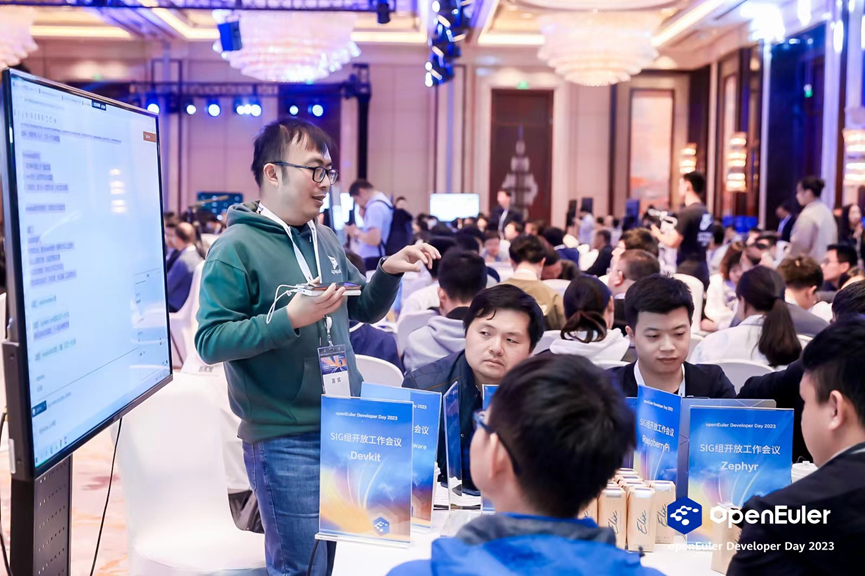
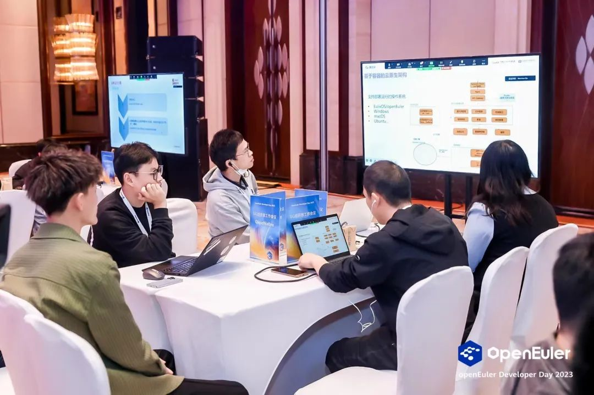

【中国，上海，2023年4月20日-21日】openEuler Developer Day
2023在线上和线下同步举办。本次大会由开放原子开源基金会指导，中国软件行业协会、openEuler社区、边缘计算产业联盟共同主办，以"万涓汇流，奔涌向前"为主题，旨在推动操作系统以及基础软件的创新和突破。

作为本次大会重要的一环，SIG组开放工作会议吸引了众多开发者的关注，当天，**41个SIG组聚焦不同技术方向，近400位开发者齐聚大会现场**，同时展开SIG组开放工作会议。现场的开发者们根据不同的技术方向展开热烈的讨论，气氛十分热闹。

# 开放、透明，是openEuler社区的原则

SIG组开放工作会议遵循开源、开放原则。议题收集、技术讨论、会议纪要等各讨论过程均对外开放。**本次SIG组开放工作会议，不少用户是带着用户需求和技术需求参会**，共同讨论需求优先级和下个版本的规划。体现了openEuler社区的透明、开放原则。

SIG组工作会议当天，各SIG齐聚一堂，不管开发者对哪个技术方向感兴趣，都可以在现场找到对应的SIG组。对于某些技术领域，SIG专家们采取了跨SIG工作会议的模式。SIG组的开放和包容，促进了openEuler社区发展和多样性。

嵌入式场景相关SIG正在进行跨SIG工作会议

云原生领域相关SIG正在进行跨SIG工作会议

可以看出，openEuler社区正是通过坚持开放、鼓励多样性，才让社区汇聚了如此多的开发者和由他们组成的SIG组，同时让各SIG组的运作越来越成熟、规范。

# 你有idea，我有蓝图，万涓汇流成openEuler的星辰大海

在本次SIG组开放工作会议上，43个SIG组分享了各自的规划，其中：

Kernel
SIG的分享干货满满，来自华中科技大学的慕冬亮老师介绍了网络安全学院贡献Linux内核社区的经验，并表示后续会在安全领域继续加强在openEuler社区的贡献；来自京东的桑力鹏详细介绍了互联网云原生领域的关键痛点问题，为后续关键技术研究方向提供了重要输入；来自华为的程志浩介绍了ext4文件系统一致性问题的挖掘和定位的经验，为保障这一广泛使用的文件系统的稳定可靠提供了重要参考。

Release SIG在会上分享了Release SIG运作机制讨论以及openEuler
版本演进计划，并与OSV伙伴、用户及开发者一起探讨版本质量规范及维护策略，探讨社区如何提供更安全可靠的高质量开源OS；

嵌入式场景相关SIG与参会者一起回顾openEuler Embedded
23.03版本，和社区成员一起讨论23.06、23.09版本计划。探讨社区成员对嵌入式场景的诉求。帮助社区成员更好地了解嵌入式场景的现状和未来发展计划。

\...

扫描下方二维码即可查看本次SIG组开放工作会议**所有SIG的Etherpad链接**，欢迎大家找到感兴趣的SIG组，查看本次SIG开放工作会议的会议纪要。

这些规划的形成，采纳了会上开发者们的不少意见。openEuler
社区SIG组的繁荣发展离不开每一位SIG组成员的贡献，在这里，每一位参与者和组织都能从中找到有价值的地方，最终"百花齐放"。

2023年的ODD大会让我们看到openEuler社区SIG组发展已经趋向于繁荣，明年ODD大会SIG组将给开发者们带来什么惊喜？又将有怎样历史性的突破？让我们一起期待吧\~\~\~

