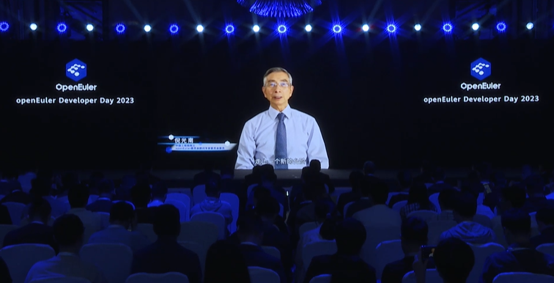
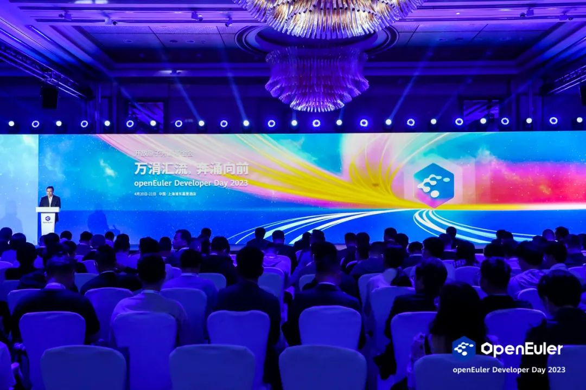
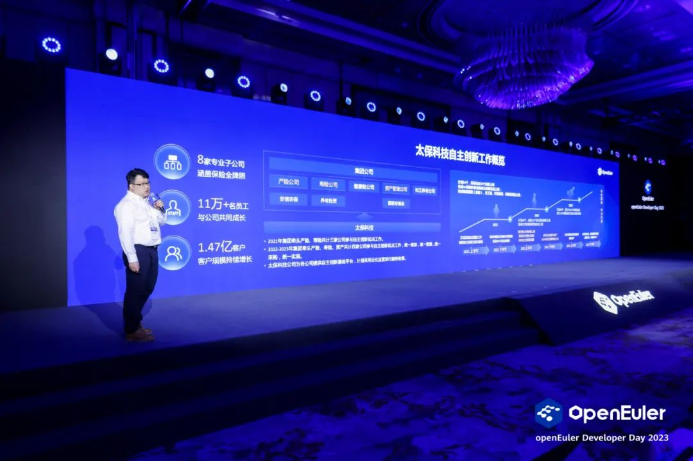
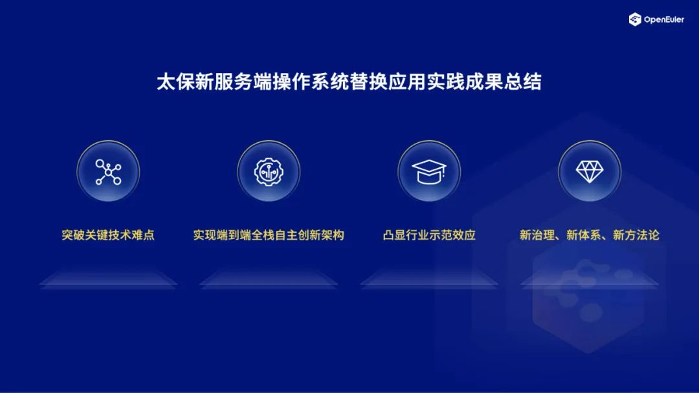
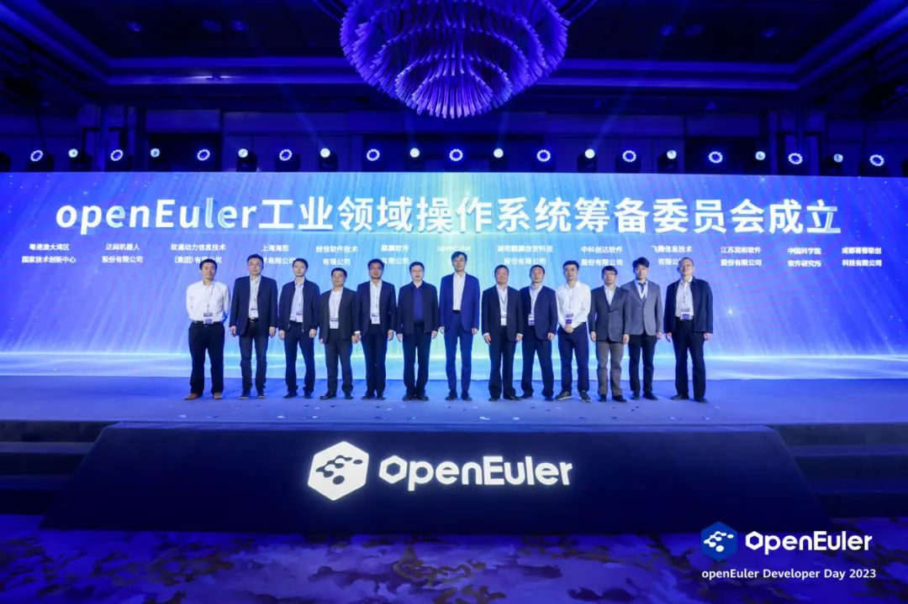
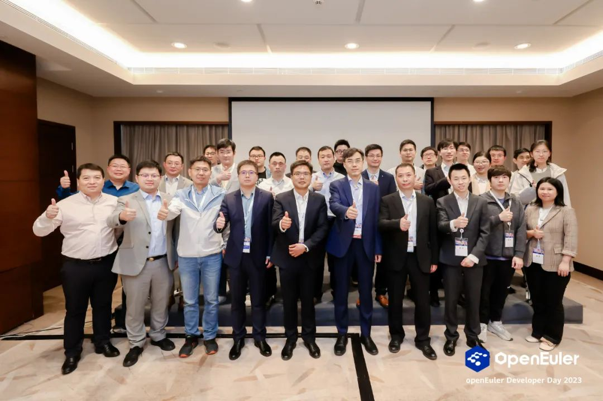

今天，openEuler Developer Day
2023在上海盛大启幕，统信软件作为联合主办单位，携手openEuler全面展示双方合作的最新进展及在各行业的商业化成功案例，共同推动操作系统乃至基础软件的突破创新。

中国工程院院士倪光南在大会致辞中表示："开源已经成为推动当代世界软件技术、信息技术发展的强大动力。"开源持续参与产业共建，两者相互促进，使得中国基础软件取得了长足进步。

统信软件根植中国、源汇四海，深耕基础软件近20年沉淀出来的数字技术能力，正在通过统信UOS输出到各行各业，助力科技自立自强力量生长。

在主论坛环节，统信UOS全力支撑的太平洋保险服务端操作系统应用实践案例获得现场专家的高度认可。

会上，统信软件参与的openEuler工业领域操作系统筹备委员会正式宣布成立，致力于推动"中国智造"向全球制造业领域数字化最高水平加速演进。

峰会期间，统信软件联合openEuler、泛微网络、南天信息共同举办"统信UOS行业应用创新和生态发展闭门会"，与行业伙伴深入探讨数字经济、新基建、操作系统国产化攻坚等话题。

# 01

# 面向多样性计算时代

# 太平洋保险实现全栈国产化替代

数字经济是经济发展的新动能，经济发展的增长率取决于数字经济发展速度，算力则是数字经济发展的主要支撑。因此在多样性计算时代，基础软件能否提供坚实可靠的底座支撑作用尤为重要。

此前，太平洋保险承载应用的操作系统版本即将进入生命周期尾声，需要选择满足业务需求和安全稳定性的特点产品，而国产操作系统技术路线可供选择的社区路线和相应产品偏少。

近年来，统信软件坚持深耕自研技术，以统信UOS操作系统为核心，推动全体系的技术创新。

作为首个全架构通过OSV技术评测的厂商，统信软件与openEuler社区长期保持着紧密合作关系，双方探索出了一条既符合国际开源规则，又具备"中国特色"的基础软件发展道路。

"我们坚定选择了openEuler作为技术路线，基于统信UOS服务器操作系统V20不断完善技术体系，实现全栈国产化替代。"太平洋保险系统运维专家柯佳说，以统信UOS为核心的自主创新架构，正在为内部12万用户提供稳定高效服务。

**国际领先：**

突破了自主创新基础软硬件与国际主流产品共生协同、业务应用无感知迁移等关键技术难点，有效填补国内空白，达到国际先进水平。

**方向正确：**

形成了从云平台，云应用到终端设备的端到端全栈自主创新，意义重大，成果卓有成效。

**示范标杆：**

提出了大规模集约化应用场景下的大型企业信息化系统整体自主创新转代方案，有效解决了生产系统中的规模化部署问题和核心系统供应链安全问题，对金融保险行业具有很强的示范效应。

**革新体系：**

开展开源软件治理，形成太保集团内部IT基础平台的自主创新化治理，形成太保内部的自主创新技术体系和自主创新替代实施方法论。

# 02

# 大国重器布局产业新变革

# 统信UOS使能全域全场景

在主论坛，openEuler社区正式成立工业领域操作系统委员会筹备工作组，统信软件副总经理朱建忠作为OSV伙伴代表，与众多生态伙伴出席成立仪式。

当前，基础软件已经成为数字产业的核心组成部分。统信UOS通过软件定义引领创新，不断加速数字化转型和智能化升级的进程。

"无论是以ChatGPT为代表的最新AI应用，还是以5G为代表的通信基础设施，操作系统的作用不可替代。"朱建忠表示，统信UOS在全域全场景能力有着非常深厚的积累，并且通过与近6000家生态伙伴的协同作战，统信UOS正向更多的应用场景走深走实。

接下来，统信软件将以加入工业领域操作系统委员会筹备工作组为契机，携手欧拉等伙伴面向工业领域、机器人领域攻坚核心技术，加速嵌入式领域成果的孵化。

# 03

# 海纳百川方能枝繁叶茂

# 为千行百业立根铸魂

在统信UOS行业创新和生态发展闭门会上，统信软件副总经理朱建忠、华东大区总经理于海、解决方案中心运营总监任紫东，与openEuler委员会主席江大勇、openEuler委员会执行总监邱成锋，以及泛微、南天信息等生态伙伴齐聚一堂。

任紫东分享了《统信UOS操作系统创新发展及实践应用》，他表示，中国操作系统已经进入根社区时代，统信软件拥有中国首个桌面操作系统根社区------深度（deepin）社区，这是中国规模最大、历史最悠久、活跃度最高、全球化最好的开源操作系统社区之一。

根据赛迪顾问《2021-2022年中国平台软件市场研究年度报告》，统信软件稳居领导者象限。第三方权威数据显示，统信UOS桌面端持续保持市占率第一，在服务器端增速为行业第一。

目前统信UOS不仅是国内最大的自主生态，在开放市场上也是占有率最高的中国操作系统品牌。

我们深知基础软件，生态是生命线，也是护城河。统信软件将和产业伙伴一起，持续投入基础软件产业生态建设，为千行百业数字化转型立根铸魂：

★ 首先，加强操作系统根社区的建设，进一步把握先发优势，从"根"上掌握操作系统发展权、上游社区主导权，从拥抱开源到贡献开源，从开源大国走向开源强国，建强中国开源体系。

★ 其次，我们通过同心生态联盟的形式为产业伙伴赋能，吸纳超过1000家联盟成员单位，持续提升产业链竞争力，加速行业和区域的生态落地。

★ 再次，我们与教育部、各级教育部门、各地教育机构合作，坚持信创教育战略"软件为本、硬件为纲、赋能伙伴、人才发展"十六字方针不动摇，探索产教融合、产研结合新模式，做厚产业人才沃土。

万涓成水，汇流成河。千流归海，海纳百川。统信软件将在"B端赋能千行百业，C端走进千家万户"战略指引下，更坚定地联合生态伙伴，向桌面、服务器、云原生、智能终端等领域发起全面冲锋，领跑中国操作系统应用推广和创新迭代进程。
