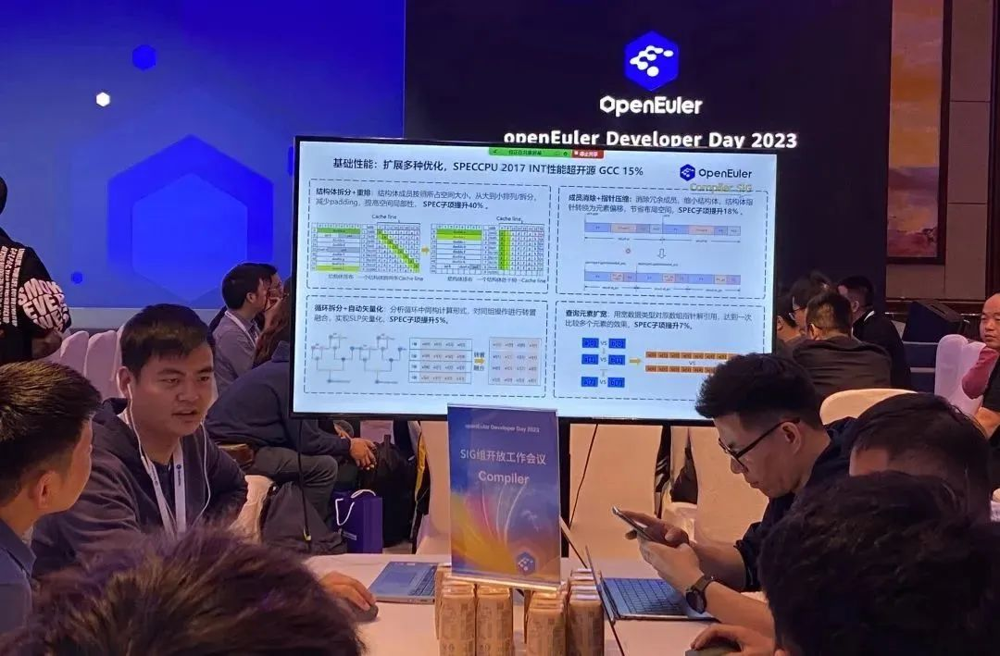
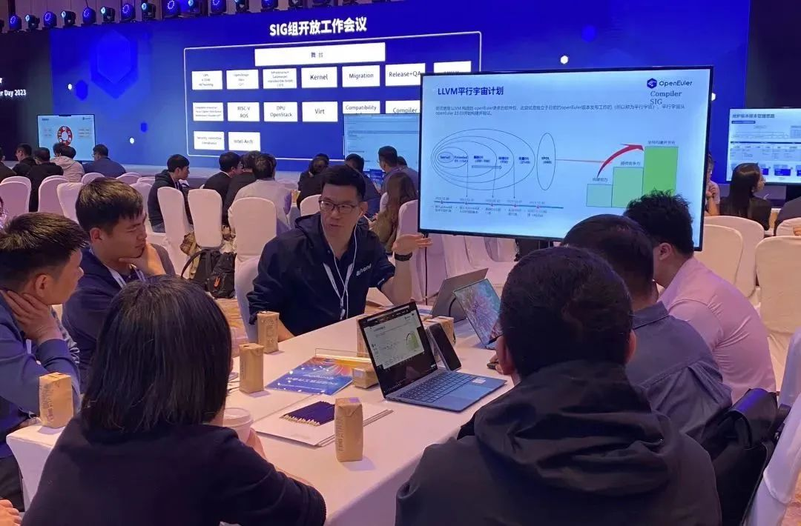
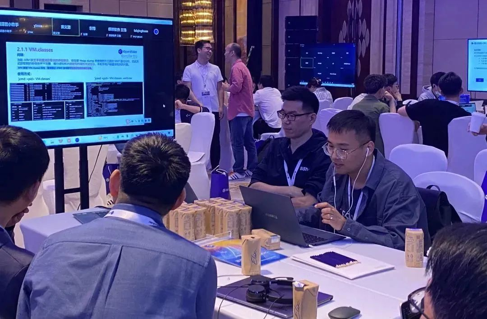

4月21日，作为openEuler Developer Day 2023重要的一环，Compiler
SIG组开放工作会议圆满举行。本次Compiler
SIG组开放工作会议主要围绕GCC、LLVM、BiSheng
JDK的版本规划进行介绍，吸引了现场及线上开发者们的热烈讨论。

下面就让我们一起来回顾本次会议的精彩内容！

# 2023 GCC版本规划及特性前瞻

openEuler Compiler SIG
Maintainer李彦成给大家带来GCC编译器工作进展和未来规划议题。首先介绍当前GCC在基础性能、反馈优化、芯片使能、插件框架四个领域的工作进展；接着详细介绍GCC的升级策略和版本选型规划，明确当前GCC基线版本将在今年的23.09升级至GCC
12.3；最后介绍今年GCC领域的主要工作方向，包括基础性能、内核反馈优化以及动态反馈优化的工作细节。

# LLVM选型介绍及后续工作规划

openEuler Compiler SIG
Maintainer、TC委员赵川峰老师介绍了LLVM编译器相关的工作规划，包括LLVM基线版本选型、多版本支持方案、性能/codesize优化、sanitizer支持及LLVM平行宇宙计划，其中LLVM平行宇宙计划引起了现场和线上开发者的极大兴趣，讨论非常热烈，该计划先独立于openEuler版本发布尝试使用
Clang/LLVM 构建的
openEuler更多的软件包，然后提供竞争力并发布基于LLVM技术栈的openEuler版本，当然困难和挑战也很大，希望通过社区协作式运作推进平行宇宙计划，同时也培养出更多的LLVM开发者。

# BiSheng JDK DFX能力增强介绍及后续工作规划

openEuler Compiler SIG Developer窦义望为大家带来了BishengJDK
DFX能力增强及后续规划的议题。

议题首先介绍了DFX增强的主要特性包括：JCMD工具增强、JMAP
工具增强、TraceClassLoading增强、hs_error_pid文件增强、异步GC日志、Native(Glibc)
Heap修剪等功能。

然后结合各功能点为大家详细介绍了当前JDK存在的问题，增强解决问题的方式，使用的场景与注意事项等等，并为大家展示了一些真实的案例和优化的效果。

最后向大家介绍了后续DFX增强的规划方向如：NMT baseline
time、更加地丰富hs_err信息等等。BiSheng
JDK会保持持续改进，为业界提供一个易用性强、可维护性高、问题定位效率更快的JDK。

Compiler SIG 专注于编译器领域技术交流探讨和分享，包括 GCC/LLVM/OpenJDK
以及其他的程序优化技术，聚集编译技术领域的学者、专家、学术等同行，共同推进编译相关技术的发展。

扫码添加 SIG 小助手微信，邀请你进 Compiler SIG 微信交流群。

