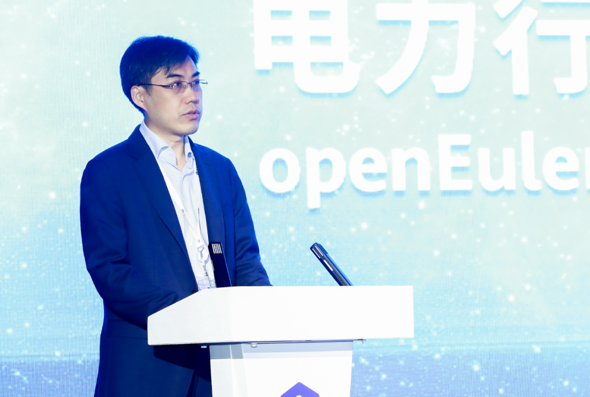
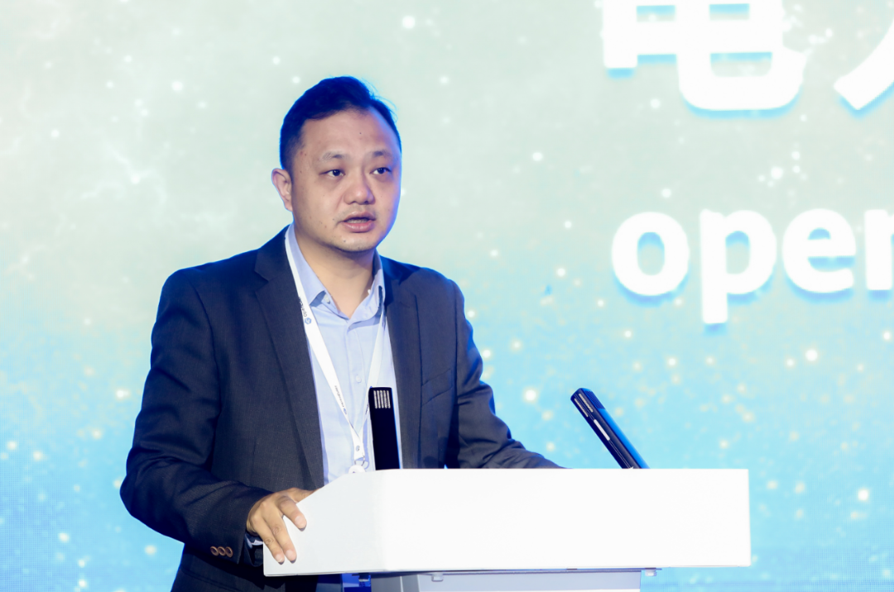
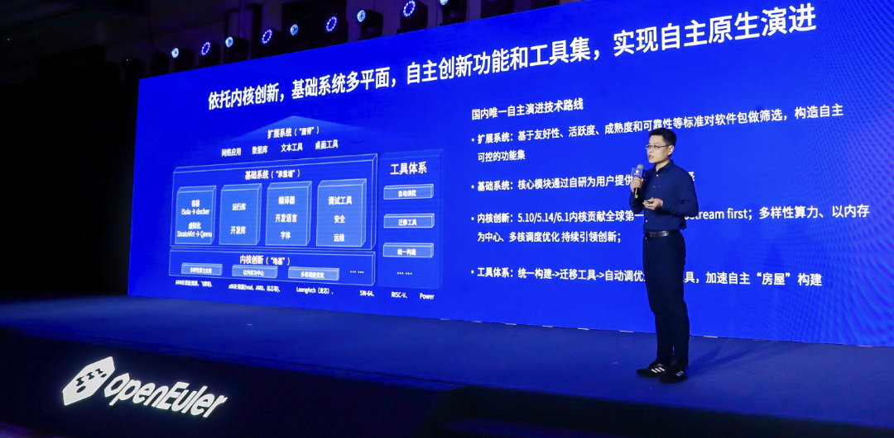
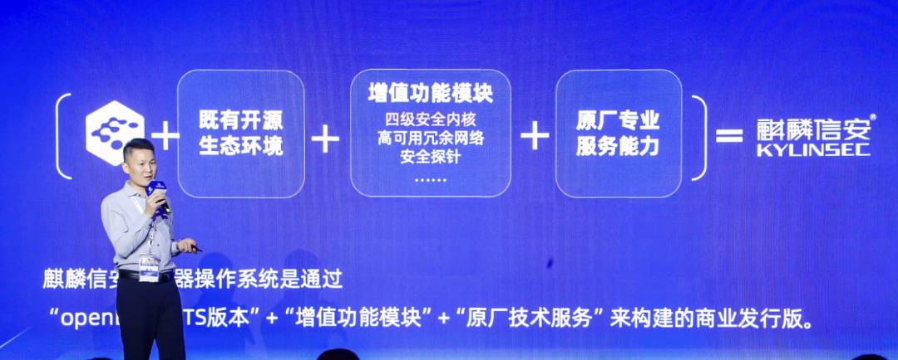
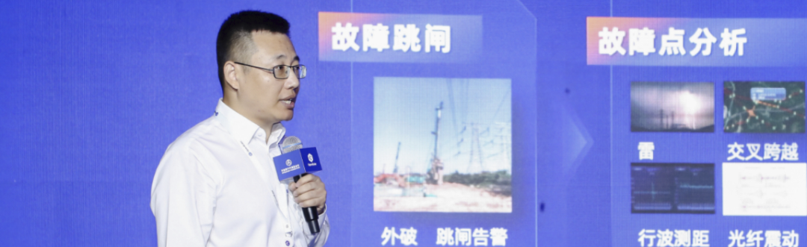
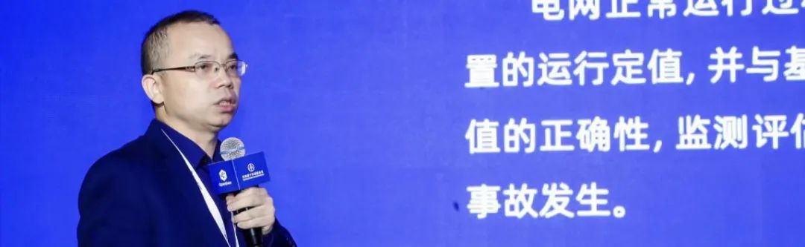
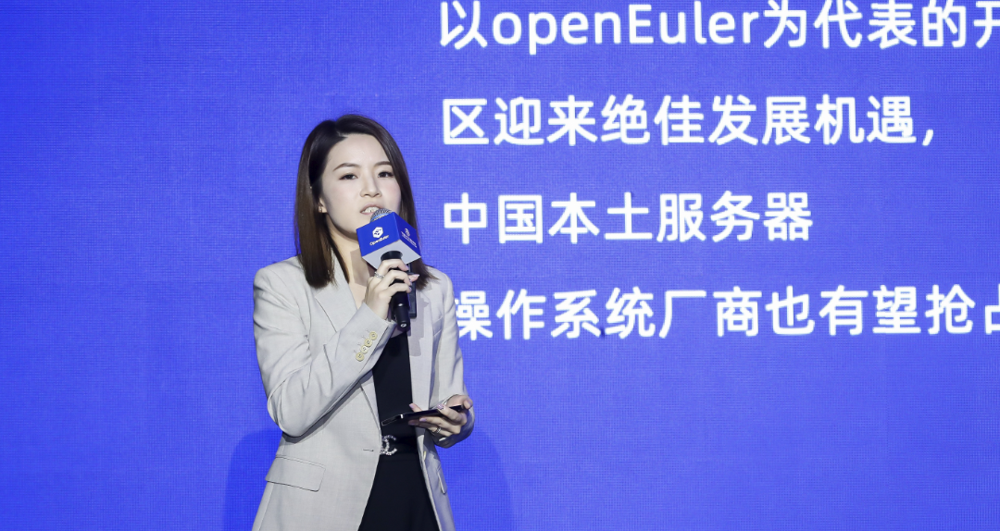
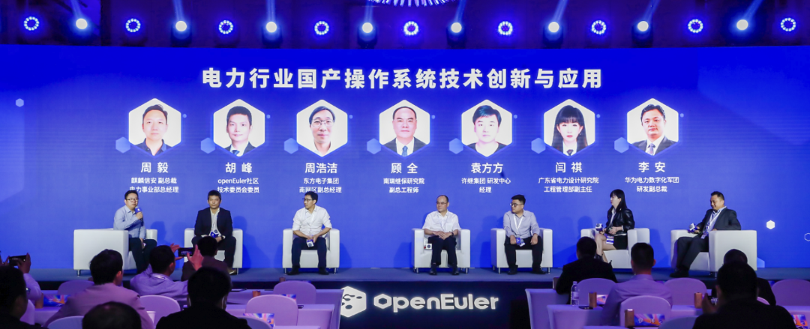

开放原子开源基金会旗下 openEuler 社区发起的顶级开发者峰会------openEuler
Developer Day 2023 于4月20日-21日在上海召开。

麒麟信安作为openEuler项目群白金捐赠人，联合主办本次盛会，并与华为共同承办2023电力行业技术创新及应用论坛。120余位电力行业用户代表、专家、openEuler社区、OSV、ISV齐聚一堂，共议电力数字化转型挑战与机遇，分享发电、输电、变电、配电、用电等多场景行业解决方案，助推信息技术应用创新落地。

# openEuler社区、麒麟信安、华为共建自主创新生态，夯实电力行业科技自强根基

会上，openEuler委员会主席江大勇、麒麟信安总裁刘文清、华为电力数字化军团研发副总裁李安先后为大会致辞，从根社区、OSV、社区核心伙伴出发，共同传递出对构建繁荣统一的自主创新生态圈，以及为电力等关键行业数智化转型提供坚实底座的使命担当。

openEuler委员会主席 江大勇

**openEuler委员会主席江大勇在致辞**中表示:操作系统作为技术软件最重要的底座，已经成为国家间战略竞争的制高点。openEuler操作系统作为国内自主创新操作系统代表，正在成为数字基础设施操作系统首选，openEuler正在成为电力行业数智化转型的坚实底座，助力关键领域实现技术突破。基于openEuler基础能力打造的麒麟信安操作系统，已经广泛应用于电力行业的调度、配网、变电、集控、新能源等领域，成为了电力行业自主创新操作系统出货量领先的厂商，并在国网、南网核心系统上规模商用，稳定支撑业务运营。openEuler始终致力于联合产业上下游伙伴和用户共同加速电力行业数字化转型，夯实科技自立自强的根基。

麒麟信安总裁 刘文清

**麒麟信安总裁刘文清谈到**：麒麟信安是openEuler技术路线的坚定支持者和践行者，也是持续深耕电力行业的操作系统领先企业。当前，以数字电网为关键载体加快构建新型电力系统是落实国家低碳转型战略的关键举措。在此背景之下，麒麟信安将依托openEuler社区，积极共建自主创新生态，为电力用户打造深度契合应用场景需求的操作系统及操作系统+整体数字化基础平台解决方案。

华为电力数字化军团研发副总裁 李安

**华为电力数字化军团研发副总裁李安**在发言中说到：华为深耕电力行业20多年，构建了云管边端的云边协同架构，把ICT技术的优势与电力生产业务进行了高度融合，并坚持"平台+生态"的战略，携手伙伴为新型电力系统建设提供强有力支撑。华为电力数字化军团与麒麟信安在数字换流站有了非常成功的应用，后续华为电力数字化军团将与麒麟信安进行更加深度的合作，针对电力行业新型电力系统下的演进共同打造出具有竞争力的行业解决方案。

openEuler社区架构师 王博

麒麟信安副总裁 王攀

华为电力数字化军团首席架构师 罗晨

随后，openEuler社区架构师王博、麒麟信安副总裁王攀、华为电力数字化军团首席架构师罗晨先后进行了《openEuler---面向数字基础设施的开源操作系统》《麒麟信安操作系统为新型电力系统建设提供自主创新安全底座》，详细的阐述了openEuler面向云边端全场景的技术能力、麒麟信安操作系统基于openEuler面向电力客户实际需求打造的行业增值属性及专业技术服务、华为基于openEuler构建的电力行业整体数字化方案，以及应用麒麟信安操作系统的数字换流站以及配电物联网全栈解决方案等应用实践。

# 基于openEuler的麒麟信安操作系统，为电力行业解决方案伙伴提供安全稳定可靠的信息化基础平台

来自南瑞继保研究院产品架构师、产品经理李华、长园深瑞继保自动化有限公司副总工程师黎强、泰豪软件迈能互联事业部副总经理余正义先后分享了《电网数字运维技术》、《基于大电网综合信息的继电保护隐性故障智能研判应用与实践》及《低碳目标下新型虚拟电厂建设与实践》等电力行业优秀解决方案，均提到：基于openEuler的麒麟信安操作系统可为其提供安全稳定可靠的基础平台，为电力数字化转型提供坚实底座。

南瑞继保研究院产品架构师/产品经理 李华

**南瑞继保研究院产品架构师/产品经理李华**：当前国内主流技术趋势下，南瑞继保积极跟进自主创新核心基础软硬件技术与产品解决方案。公司调度控制系统、变电站监控系统、集控站监控系统，以及电力安全防护装置等产品均完成了自主创新操作系统的适配，涵盖openEuler开源社区操作系统、以及基于openEuler技术路线的麒麟信安操作系统等openEuler商业发行版。

长园深瑞继保自动化有限公司副总工程师 黎强

**长园深瑞继保自动化有限公司副总工程师黎强**：继电保护隐性故障智能研判系统的架构分成4个板块和1个安全体系。我们在该系统设计、研发、测试、发布、应用中，都选择了openEuler技术线路操作系统。

openEuler保证了良好的软件兼容性，能够提供与开源Linux完全兼容的系统接口，给我们应用研发、移植提供了技术保障，开发过程中，无需针对openEuler系统做特殊化的修改和适应，适配过程非常高效，投运之后其性能与可靠性优越。

泰豪软件迈能互联事业部副总经理 余正义

**泰豪软件迈能互联事业部副总经理余正义**：虚拟电厂已逐渐成为电网平衡调控的主要调节手段之一，对于安全性有了全新要求。因此，我们在虚拟电厂建设方案中选择openEuler技术线路的麒麟信安操作系统作为底层架构。通过麒麟信安操作系统提供的三权分立、黑白名单安全机制、细粒度的安全审计等四级安全防护功能，有效提高虚拟电厂整体解决方案的安全防护水平。同时，麒麟信安提供的原厂专家级服务也让我们获得了良好的使用体验。

# 自主创新基础软件蓬勃发展，以不断精进的技术及服务能力开创广阔蓝图

本次大会还邀请到沙利文咨询机构研究院院长丁卓文女士带来第三方机构视角的《电力行业基础软件生态及市场洞察》。《报告》显示，openEuler服务器市场份额已由2021年的15.1%提升至25.7%，同比增长约70%，增长速度高达行业平均增速的5倍，成为了中国服务器操作系统产业发展的主要推动力。2022年openEuler系产品在能源领域的装机量实现了143.8%的同比增长，总装机量约为3.9
万套，市场份额23.5%。基于openEuler麒麟信安操作系统，逐步在国家电网、南方电网的电网调度以及配网自动化、专用装置改造、变电自动化、集控站监控、办公信息化等方向上，全面采用自主创新操作系统。未来能源领域自主创新服务器操作系统市场装机量有望持续上行，应用的广度和深度都将呈现稳步上升。

沙利文咨询机构研究院院长 丁卓文

而在随后由麒麟信安副总裁周毅主持圆桌论坛，邀请openEuler社区技术委员会委员胡峰、东方电子集团南网区副总经理周浩洁、南瑞继保研究院副总工顾全、许继集团研究中心经理袁方方、广东省电力设计研究院工程管理部副主任闫祺、华为电力数字化军团研发副总裁李安共同参与，openEuler社区、专家、OSV、ISV齐聚一堂，探索新型电力系统创新与发展路径，展望合作未来。

随着电力行业数字化建设步伐不断加快、对自主创新需求的不断加强，基于openEuler的自主创新操作系统正成为数字基础平台建设的首选。麒麟信安将携手openEuler，与上下游合作伙伴一起，为电力用户持续打造值得信赖的安全基石与多场景解决方案，助力电力行业数智化升级！
