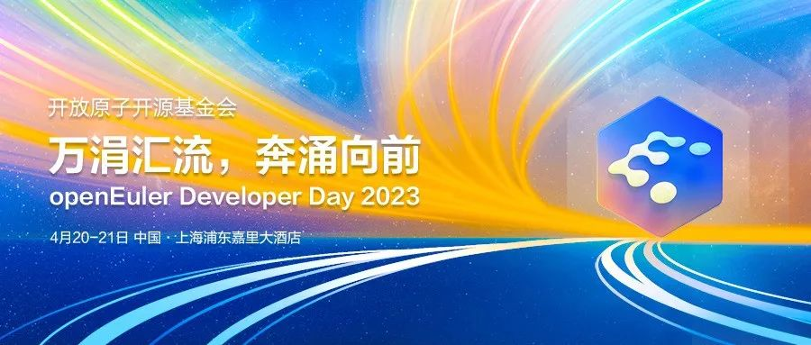
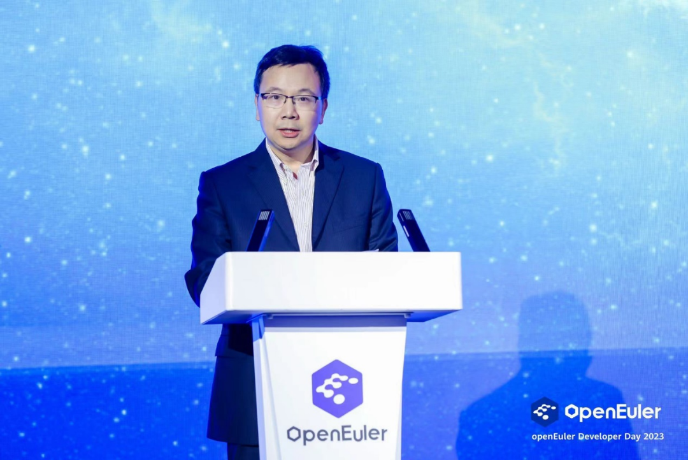
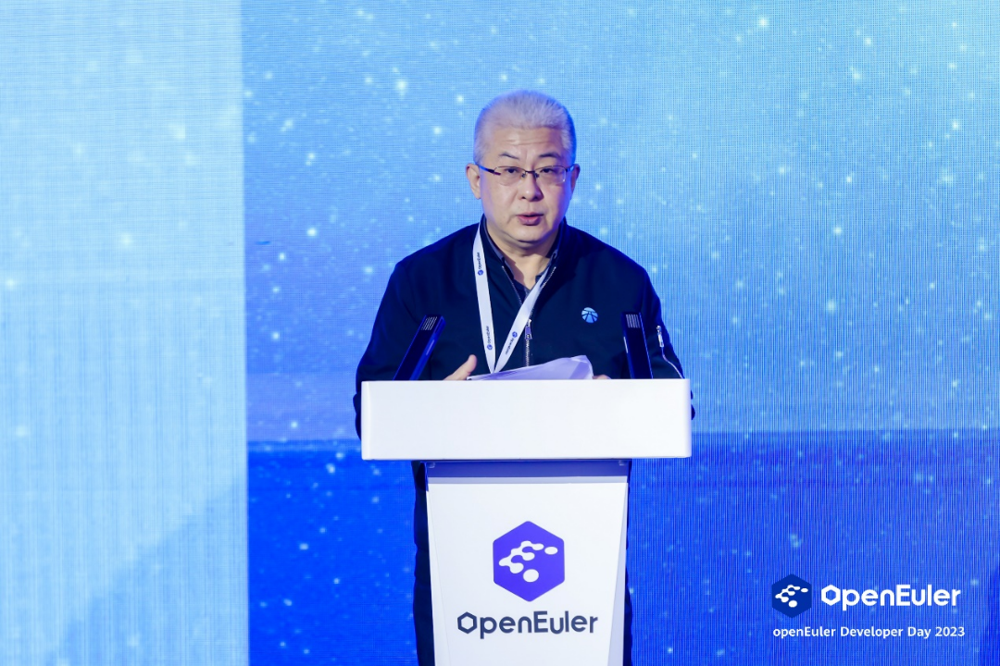
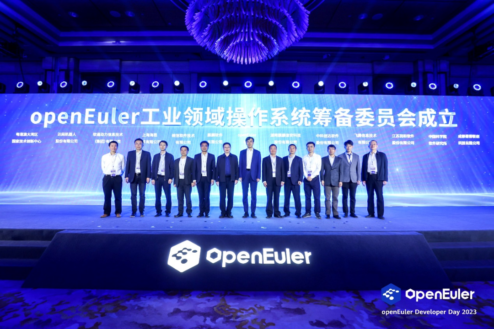
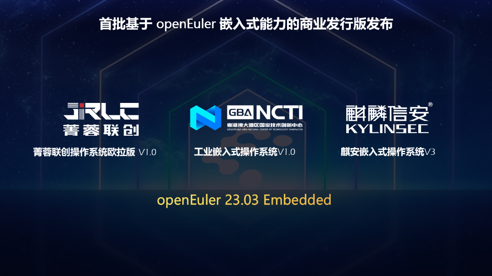
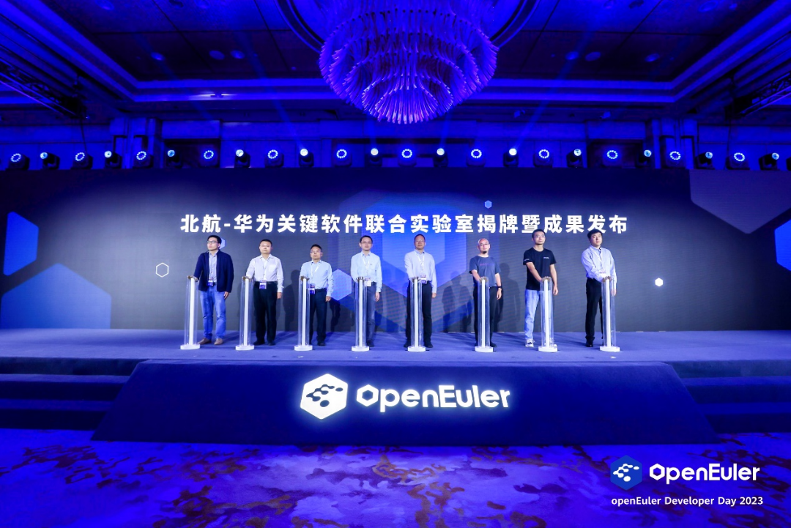
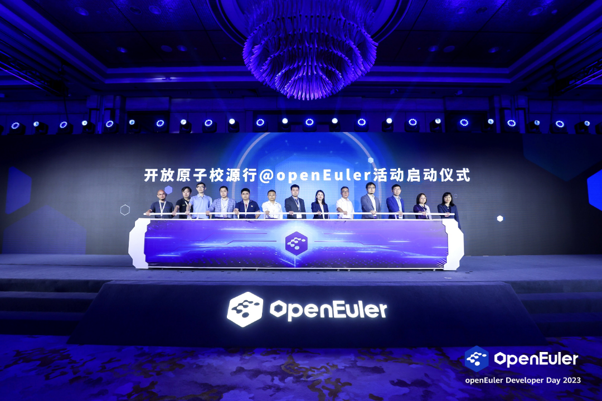

【中国，上海，2023年4月21日】openEuler Developer Day
2023于4月20-21日在线上和线下同步举办。本次大会由开放原子开源基金会指导，中国软件行业协会、openEuler社区、边缘计算产业联盟共同主办，以"万涓汇流，奔涌向前"为主题，旨在推动操作系统以及基础软件的创新和突破。

> openEuler开源三年，发展超出预期，已进入正循环、自加速的生态发展体系。截至目前，openEuler社区生态伙伴已经超过800多家，贡献者超过13000名，全球下载量过百万，每日活跃开发者近4000人，每日新增讨论超过2000次、每月新增创新项目10个，已经与国际主流开源社区相当。openEuler在商业装机量上实现指数级增长，累计部署量超300万套，2022年新增市场份额占比超过25%。openEuler正在成为数字转型的首选技术路线，成为千行百业坚实的软件根基。

**中国工程院院士、openEuler社区顾问专家委员会委员倪光南院士在**本次大会致辞中表示，"在世界开源工作者的共同努力下，openEuler已经发展成为一个具有国际影响力的开源社区。社区汇聚了一大批有活力、有热情、有智慧的开发者，
openEuler成为中国开源的一个典范。"

**华为公司董事、ICT产品与解决方案总裁杨超斌**在致辞中表示，数字经济的高质量发展需要强大的数字基础设施，操作系统是数字基础设施之魂，openEuler开源操作系统的发展，为数字基础设施筑起坚实的软件根基。

"继2022年12月openEuler成立项目群后，openEuler进入开源治理新的阶段。"**开放原子开源基金会理事长孙文龙**表示："下一步，开放原子开源基金会将加快国际化发展，助力openEuler开源项目走向全球。"

# 五大项目完成捐赠openEuler意向签署

# openEuler生态持续扩大 

开源三年来，openEuler开源社区累积已接受393个原创项目的贡献。2022年12月，开放原子开源基金会正式批准openEuler成为项目群，可以接受捐赠项目。

本次大会上，五大项目完成捐赠openEuler意向签署，包括：

● 来自电信天翼云的Gostone，用于云操作系统的安全高性能鉴权；

●
来自电信天翼云的CTinspector，来自电信天翼云的CTinspector，通过ebpf技术实现多节点运维及巡检；

●
来自湖南大学的ZVM，基于Zypher的嵌入式实时虚拟机；

●
来自北京航空航天大学的Rust-Shyper，基于Rust面向嵌入式场景的Type-1型虚拟机监视器；

●
来自华恒盛世的QuickPool，为大规模计算提供算力调度。

这些开源项目的加入，推动openEuler生态的持续扩大，加速了新一代基础软件生态的繁荣。

# openEuler工业领域操作系统筹备委员会

# 正式成立，加速openEuler全场景应用

经过openEuler委员会全体会议的批准，openEuler工业领域操作系统筹备委员会正式成立。

openEuler工业领域操作系统筹备委员会首批成员单位共12家，他们来自产业链上下游的核心厂商，包括：硬件、OSV和学术机构等。北京航空航天大学副校长吕卫锋担任筹备委员会顾问专家。筹备委员会将协同产业链的力量梳理和定义出工业领域操作系统的应用场景，基于统一的架构蓝图，以开源社区为协作平台，快速迭代演进版本。

工业领域操作系统筹备委员会将加速推进openEuler系在工业领域和机器人领域的推广，加速嵌入式能力和ROS能力的孵化。

**邬贺铨院士**表示："未来工业互联网的发展需要端边云协同的数字基础设施的全场景能力创新，在操作系统层面实现端边云互联互通与协作是重要的支撑之一。相信openEuler将有效助力中国工业互联网迎来跨越式发展。"

# 三家伙伴发布基于openEuler嵌入式

# 商业版本，夯实openEuler全场景生态

2023年3月，openEuler
23.03版本发布，由社区的908名贡献者共同完成。该版本全场景能力持续增强，嵌入式商业版本正式发布，夯实了openEuler全场景生态。嵌入式基于目标架构有序创新核心能力，使能工业控制、机器人、端边云协同等用户创新场景，加速数智化时代工业领域数字化转型的进程。

openEuler嵌入式版本逐渐成熟并商用，补齐了openEuler全场景能力的最后一环。本次大会粤港澳大湾区国家技术创新中心、成都菁蓉联创科技有限公司重磅发布了基于openEuler嵌入式能力的商业发行版，麒麟信安也在紧锣密鼓筹备发布中。这标志着openEuler社区的嵌入式创新成果已落地商业场景。 

# 北航-华为关键软件联合实验室揭牌

# 并发布基于openEuler的智能机器人系统 

北航-华为关键软件联合实验室揭牌并发布智能机器人系统。该系统基于openEuler嵌入式操作系统构建，为openEuler社区补齐了多种机器人应用的开源软件生态。

北航-华为关键软件联合实验室将聚焦多样性算力操作系统、全智能化编译器&软件IDE的根技术研究和创新工作。该联合实验室的成立，将促进开源基础软件领域的产、学、研结合，持续培养基础软件人才，充分发挥北航在多学科交叉和学术创新的优势，与华为的产业经验结合互补，为基础软件发展添砖加瓦，丰富产业新生态。

# 深入场景创新，加速行业应用

携手行业用户，openEuler还针对行业实际场景进行联合创新，通过上得快、用得好、易运维的使用全流程，帮助用户实现性能提升，高效智能运维，加速在行业的规模部署。会上，中国电信天翼云、中国移动苏研、中国移动IT、润和软件、达闼机器人带来了五大全场景联合创新方案，展示基于openEuler的创新成果。国电南瑞携手麒麟信安、中国太平洋保险携手统信软件、申万宏源携手超聚变、国金证券携手麒麟软件带来基于openEuler的商业实践分享，openEuler正在深入推动各行各业的数字化。

# 融入全球开源体系

# 为全球开源贡献openEuler智慧

openEuler积极对接全球四大开源基金会，目前已完成95%的项目兼容性支持，对于平台型开源软件，比如：OpenStack、KubeEdge、OpenHPC、Hadoop、Spark等，已经做到了上游社区的原生支持。覆盖了包括：云原生、大数据、分布式存储、数据库、HPC等主流应用场景，让全球用户可以便捷的部署使用openEuler。

未来，openEuler将进一步与国际开源基金会展开生态合作，持续融入全球开源体系，为全球开源贡献openEuler智慧。

# 开放原子校源行@openEuler启动

# 加速基础软件人才培养

会上，开放原子校源行 \@openEuler
活动正式启动。"开放原子校源行"是开放原子开源基金会发起的长期性公益项目，拟通过资助开源社团、推广开源课程、设置开源助学金等方式，面向全国高校培育开源人才，加快推动开源生态繁荣发展。

openEuler作为基金会的重要项目群，积极参与其中。未来将提供openEuler课程、创新项目、积极邀请高校的老师和学生加入到开放原子校源行公益项目活动，实现产教融合、产学融合，为中国基础软件培育更多的人才。

每一位开发者的创新都是社区创新及发展的源动力，每一位开发者的贡献是社区倍速增长的发动机。万涓汇流，奔涌向前，在全体开发者的共同努力下，openEuler
开源社区将继续与用户、上下游伙伴等携手并进，构筑坚实的软件根基，共创数智新未来。
