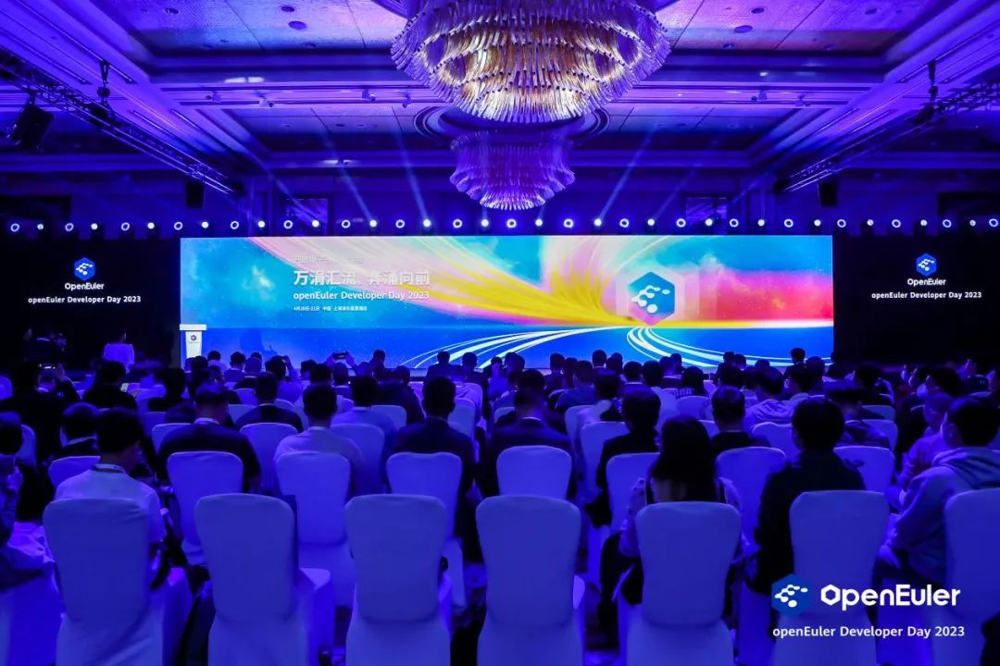
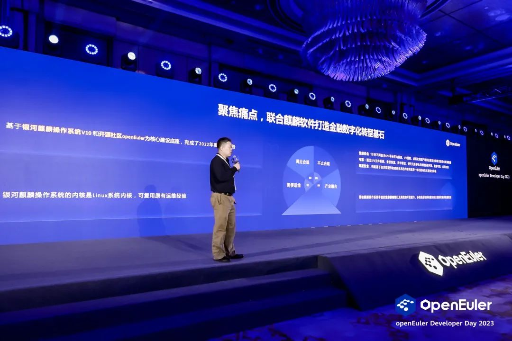
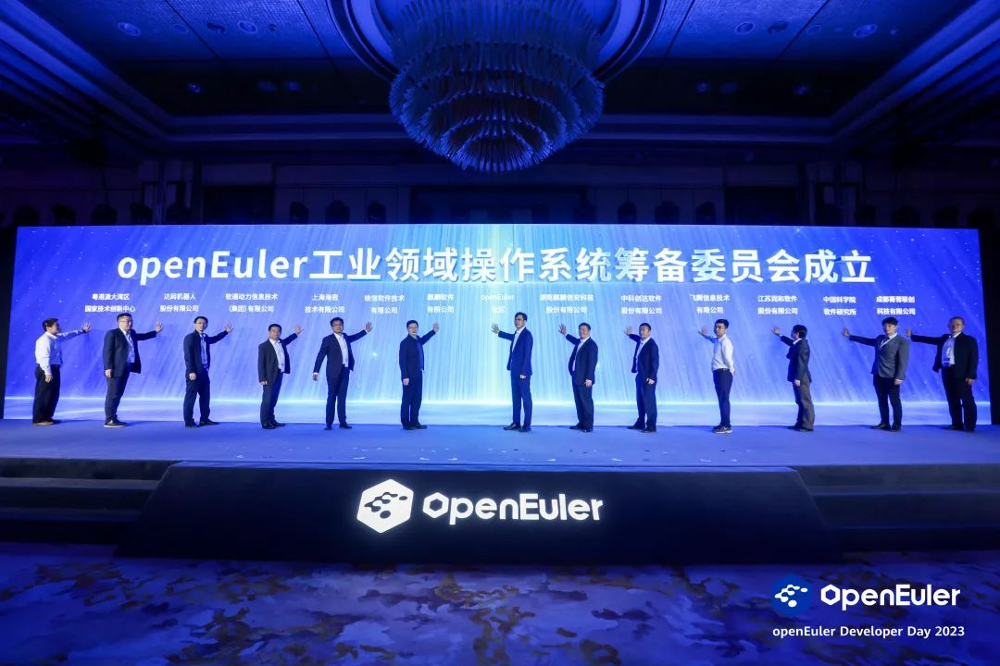
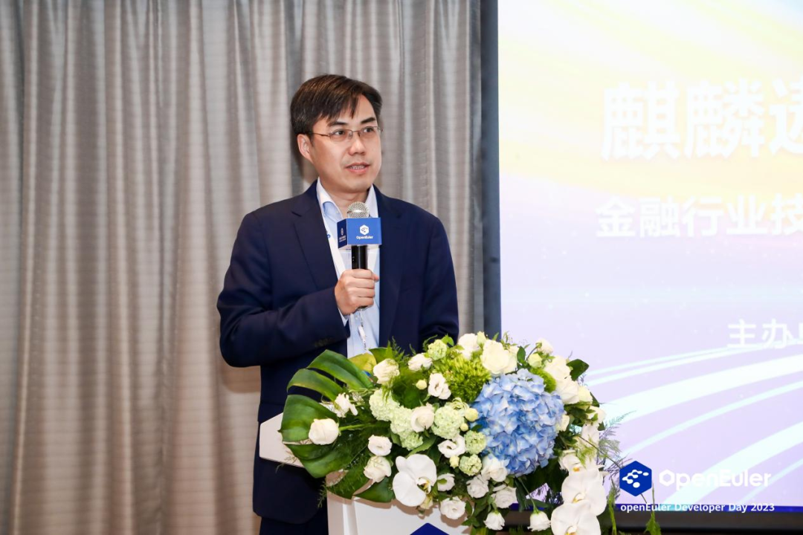
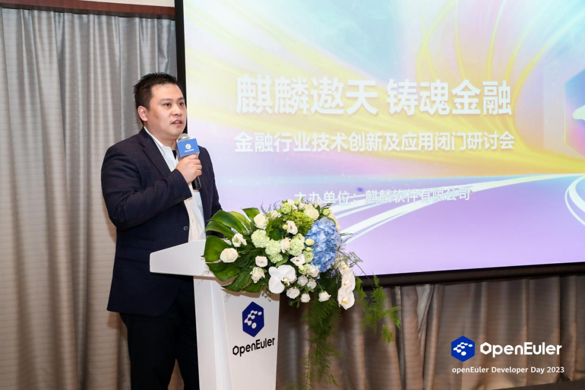
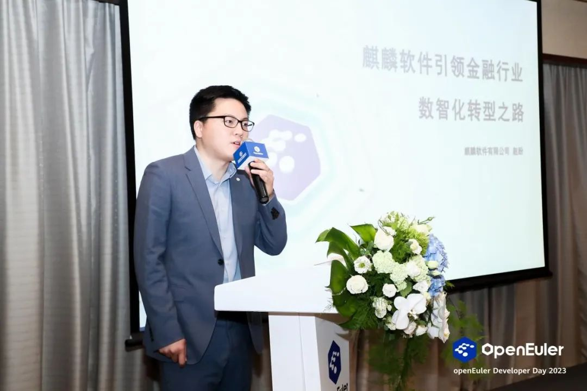

4月20-21日，openEuler Developer Day
2023在线上和线下同步举办。本次大会由开放原子开源基金会、中国软件行业协会、openEuler社区、边缘计算产业联盟共同主办，以"万涓汇流，奔涌向前"为主题，旨在推动操作系统以及基础软件的创新和突破。

作为联合主办单位之一，麒麟软件携手众多产业代表出席大会。期间，携手国金证券带来基于openEuler的商业实践分享，深入推动行业数字化建设；参与并见证openEuler工业领域操作系统筹备委员会正式成立，加速欧拉全场景应用；主办金融行业技术创新及应用闭门研讨会，与产学研用各界代表共同探索金融数字化转型发展之路。

# 实践：携手用户针对行业实际场景进行联合创新

中国工程院院士、openEuler社区顾问专家委员会委员倪光南院士在本次大会致辞中表示，"在世界开源工作者的共同努力下，openEuler已经发展成为一个具有国际影响力的开源社区。社区汇聚了一大批有活力、有热情、有智慧的开发者，
openEuler成为中国开源的一个典范。"

作为"openEuler最佳实践伙伴"和社区第二大贡献者，麒麟软件积极针对行业实际场景进行联合创新。在21日大会主论坛用户分享环节，国金证券信息技术部基础架构经理李卓以《国金证券携手麒麟软件打造金融数字化转型应用实践》为主题，介绍了国金证券以银河麒麟高级服务器操作系统V10为核心底座，建设全栈自主创新极速交易系统的情况。

他提到，银河麒麟高级服务器操作系统V10基于openEuler社区LTS内核版本4.19，融合openEuler最新技术的安全、自主、可控技术路线，实现对鲲鹏、飞腾、龙芯、兆芯、海光、申威等平台良好兼容及优化支持，并在内生本质安全、虚拟化及云原生支持、高可用性、性能、可靠性等方面进行了有针对性的增强。银河麒麟操作系统是在国金证券网信建设中承担基础架构"基石"作用，并在核心系统攻关、行业业务系统突破上取得一系列成果，成就了一批行业示范项目。未来，期待麒麟软件和openEuler帮助更多的客户实现数字化转型。

# 参与：openEuler工业领域操作系统筹备委员会正式成立

大会上，经过openEuler委员会全体会议的批准，openEuler工业领域操作系统筹备委员会正式成立。麒麟软件是首批筹备工作组成员单位之一，麒麟软件高级副总经理、openEuler委员会副主席韩乃平参与并见证成立仪式。

openEuler工业领域操作系统筹备委员会首批成员单位共12家，他们来自产业链上下游的核心厂商。北京航空航天大学副校长吕卫锋担任筹备委员会顾问专家。筹备委员会将协同产业链的力量梳理和定义出工业领域操作系统的应用场景，基于统一的架构蓝图，以开源社区为协作平台，快速迭代演进版本。

# 探索：未来金融行业技术创新之路

作为本次大会的重量级环节，4月20日，麒麟软件主办的《麒麟遨天
铸魂金融------金融行业技术创新及应用闭门研讨会》同期举行，与产学研用各界代表共同探索金融数字化转型发展之路。

openEuler委员会主席江大勇在致辞中表示，以麒麟软件作为代表的国产操作系统企业助力金融行业数字化转型，积极提供技术和服务支撑。openEuler社区愿携手伙伴、用户，支撑好金融行业，夯实金融行业创新发展的数字底座，加速金融数字化转型。

麒麟软件高级副总裁朱晨在致辞中提到，麒麟操作系统已经在银行、保险、证券等各类金融机构中、办公和业务系统中全面应用，与金融行业的用户在自主创新的道路上实现了"双向奔赴"，完成了多个突破性的创新成果。

麒麟软件区域营销中心副总经理赵盼以《麒麟软件引领金融行业数智化转型之路》为主题，详细介绍了麒麟软件围绕金融网信行业的关键应用场景和用户痛点，与行业应用伙伴协同创新打造的产品和解决方案。

会上，上海软件产业促进中心主任徐雨清带来"操作系统生态服务创新"主题演讲，提到国产操作系统应从生态、技术与服务上进行创新，针对不同行业提供定制化服务。国泰君安证券数据中心云平台架构师高坤、中国银联云计算中心高级总监苗浩，分享了与麒麟软件在金融行业自主创新方面的成果和案例。中科院上海高等研究院智慧城市研究中心主任宁德军带来"开启智能时代──智能系统"的主题演讲。

大会同期，麒麟软件参与迁移运维分论坛、Linux内核分论坛、嵌入式分论坛、安全分论坛四大技术分论坛主题发言和两场SIG组开放会议。来自麒麟软件的多位工程师参与其中，与社区贡献者、行业用户、生态伙伴等齐聚一堂，共同探讨计算前沿技术与操作系统发展趋势、分享商用案例实践、社区创新成果等。

逐浪击长空，砥砺新时代。麒麟软件高度重视开源、拥抱开源、贡献开源，积极携手伙伴共建开源生态，筑牢中国数字基础设施之魂，为数字经济高质量发展贡献力量。
