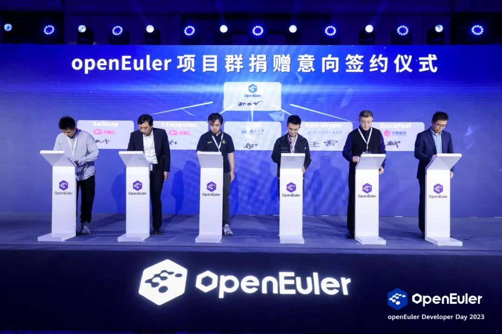

人生有三重境界------见自己、见天地、见众生。见过自己才知道自己的分量，见过天地才知道自己的卑微，这时再面对众生，才能以众生所需为自己所求，顶天立地，服务众生。就在
4 月 21 日的 openEuler Developer Day 2023
上，包括电信天翼云、湖南大学、华恒盛世等重量级伙伴的五大项目完成捐赠
openEuler 意向签署，意味着 openEuler
生态持续扩大。而回望作为肩负着国产操作系统希望的 openEuler
走过的开源三年，正是走过了一条见自己、见天地、见众生的路。

## 第一次蜕变，openEuler 由"独"到"众"

2021 年 11 月 9
日，欧拉开源操作系统正式捐赠给开放原子开源基金会，由企业主导的开源社区发展模式，转变成为产业共建、社区自治的新模式，完成了从见自己到见天地的第一次蜕变。

这次蜕变对于欧拉意义非同寻常。俗话说，独行快，众行远。这次捐赠，不仅不是投入的结束，反而是加大欧拉生态建设的开始。openEuler
自开源之日起，就定位为面向数字基础设施的开源操作系统，是面向未来需求的创新平台。捐赠后，openEuler
从之前的企业所有到现在的产业共有，快速汇聚了一切可以汇聚的力量，带来中国数字产业史无前例的大联合，以更加开放的模式整合全球参与者的贡献，从开放治理到自治繁荣，加速欧拉的产业发展。

如今，openEuler
开源三年，发展超出预期，已进入正循环、自加速的生态发展体系。截至目前，openEuler
社区生态伙伴已经超过 800 多家，贡献者超过 13000
名，全球下载量过百万，每日活跃开发者近 4000 人，每日新增讨论超过 2000
次、每月新增创新项目 10 个，已经与国际主流开源社区相当。openEuler
在商业装机量上实现指数级增长，累计部署量超 300 万套，2022
年新增市场份额占比超过 25%。openEuler
正在成为数字化转型的首选技术路线，成为千行百业坚实的软件根基。中国工程院院士、openEuler
社区顾问专家委员会委员倪光南院士在本次大会致辞中表示："在世界开源工作者的共同努力下，openEuler
已经发展成为一个具有国际影响力的开源社区。社区汇聚了一大批有活力、有热情、有智慧的开发者，openEuler
成为中国开源的一个典范。"

## 第二次蜕变，从"捐赠 openEuler"到"向 openEuler 捐赠"

说到底，操作系统其实是一个生态体系，生态系统的繁荣程度决定着操作系统能走多远，只有越来越多的开发者汇聚起来，贡献出自己的智慧和创新成果，才能让生态繁荣起来，确保操作系统的生生不息。见过天地才知道自己的卑微，这时再面对众生，才能以众生所需为自己所求，顶天立地，服务众生。如今，从"捐赠
openEuler"到"向 openEuler
捐赠"，正在诠释欧拉由见天地到见众生的第二次蜕变。

开源三年来，openEuler 开源社区累计已接受 393 个原创项目的贡献。2022 年
12 月，开放原子开源基金会正式批准 openEuler
成为项目群，可以接受捐赠项目。

本次大会上，五大项目完成捐赠 openEuler 意向签署，包括：来自电信天翼云的
Gostone，用于云操作系统的安全高性能鉴权；来自电信天翼云的
CTinspector，通过 ebpf 技术实现多节点运维及巡检；来自湖南大学的
ZVM，基于 Zypher 的嵌入式实时虚拟机；来自北京航空航天大学的
Rust-Shyper，基于 Rust 面向嵌入式场景的 Type-1
型虚拟机监视器；来自华恒盛世的
QuickPool，为大规模计算提供算力调度。这些开源项目的加入，推动 openEuler
生态的持续扩大，加速了新一代基础软件生态的繁荣，openEuler
生态走入高速发展期。

不仅如此，今年 3 月 openEuler 嵌入式版本逐渐成熟并商用，补齐了 openEuler
全场景能力的最后一环。本次大会粤港澳大湾区国家技术创新中心、成都菁蓉联创科技有限公司重磅发布了基于
openEuler
嵌入式能力的商业发行版，麒麟信安也在紧锣密鼓筹备发布中。这标志着
openEuler 社区的嵌入式创新成果已落地商业场景。

## 立根铸魂，打好操作系统攻坚战

眼下，欧拉的见众生还有更加深刻的现实意义。当今世界正经历百年未有之大变局，新一轮科技革命和产业变革突飞猛进。这要求我们要从战略高度和长远角度认识到加强基础研究的重要性，切实增强迎接挑战、抢抓机遇的使命感和紧迫感，努力从源头和底层解决关键技术问题，推动基础研究实现高质量发展。

中央高层早在 2013
年就批示指出："计算机操作系统等信息化核心技术和信息基础设施的重要性显而易见，我们在一些关键技术和设备上受制于人的问题必须及早解决"。2023
年 2 月 21
日，中央高层再次强调："要打好科技仪器设备、操作系统和基础软件国产化攻坚战"。

基础软件包括操作系统、数据库、中间件和编程语言，和芯片并称 ICT
行业的核心。然而，长期以来，我国在应用软件领域实现了繁荣发展，但却在基础软件领域非常薄弱，尤其是和美国差距巨大。因此基础软件是被美国卡脖子的重点领域。

操作系统被誉为计算机的"魂"，它定义了计算机系统的技术体制和生态，是信息系统安全的基石。面对波谲云诡的外部形势，毫无疑问，操作系统的国产化进程已经刻不容缓。

从 openEuler
三年来的成功可以看出，抱团取暖，一起卯起劲，才有可能突破操作系统和基础软件的瓶颈，才有可能不再受制于人。

原文链接：https://www.cnii.com.cn/rmydb/202304/t20230425_466024.html
